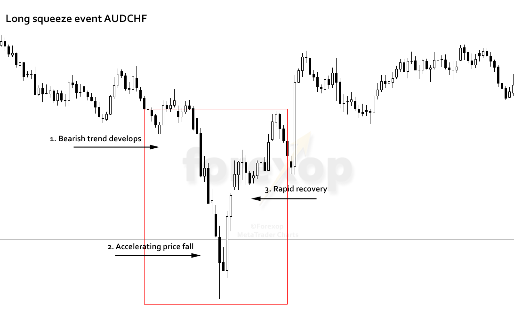

## Table of Contents

## What is a long squeeze?

A long squeeze happens when the price of something goes down a lot and people who own it start to panic. They bought it hoping the price would go up, but now it's going down. To avoid losing more money, they sell what they own, which makes the price drop even more. This can happen with stocks, cryptocurrencies, or other things people invest in.

When many people are selling at the same time, it creates a cycle. More selling leads to a lower price, which makes more people want to sell. This can be very stressful for investors who were hoping to make money. A long squeeze is the opposite of a short squeeze, where people who bet on the price going down have to buy back what they sold, pushing the price up.

## How does a long squeeze differ from a short squeeze?

A long squeeze and a short squeeze are opposite situations in the world of investing. In a long squeeze, people who own something, like a stock or cryptocurrency, see its price drop a lot. They panic because they thought the price would go up. To avoid losing more money, they start selling what they own. This selling makes the price drop even more, causing more people to sell. It's a cycle of falling prices and selling that can be very stressful for investors.

On the other hand, a short squeeze happens when people who bet that the price of something will go down (they are called short sellers) face a big problem. If the price starts to go up instead of down, these short sellers have to buy back what they sold to cut their losses. When many short sellers are buying back at the same time, it pushes the price up even more. This can lead to a rapid increase in price, making it a very different situation from a long squeeze where the price keeps falling.

## What are the typical triggers of a long squeeze?

A long squeeze often starts when something unexpected happens that makes the price of an investment drop a lot. This could be bad news about a company, like lower profits or a big problem with their products. It could also be something that affects the whole market, like a big economic change or a new law that makes investors worried. When the price starts to fall, people who own the investment get scared that it will keep going down.

When these owners start selling to avoid losing more money, it makes the price drop even faster. This can turn into a cycle where more selling leads to lower prices, which makes more people want to sell. It's like a chain reaction. The more people panic and sell, the worse the long squeeze gets.

## Can you explain the basic mechanism of a long squeeze?

A long squeeze happens when people who own something, like a stock, see its price start to go down a lot. They thought the price would go up, but now it's going the other way. This makes them worried, so they decide to sell what they own to stop losing more money. When a lot of people start selling at the same time, it pushes the price down even more.

As the price keeps falling, more and more people get scared and join in the selling. This creates a cycle where the price goes down, people sell, and then the price goes down even more. It can be a stressful time for people who were hoping to make money from their investment.

## What are the key indicators that a long squeeze might be occurring?

A long squeeze might be happening if you see the price of something dropping quickly. This could be a stock or [cryptocurrency](/wiki/cryptocurrency). When the price goes down fast, people who own it start to worry. They might decide to sell what they have to avoid losing more money. If lots of people are selling at the same time, it makes the price drop even faster.

Another sign is when there's bad news about the thing people own. This news could be about the company losing money or having problems with its products. It can also be big news that affects the whole market, like changes in the economy or new laws. When people hear this bad news, they get scared and start selling. This selling can start the cycle of a long squeeze where more selling leads to lower prices, and then even more selling.

## How do market participants typically respond to a long squeeze?

When a long squeeze happens, many people who own the thing that's losing value start to panic. They thought the price would go up, but now it's going down a lot. To avoid losing even more money, they decide to sell what they have. This selling makes the price drop even faster, which makes more people want to sell. It's like a chain reaction where everyone is trying to get out before the price falls too low.

Some investors might try to hold on, hoping the price will go back up. But if the price keeps falling, even these people might give up and sell. Others might see the falling price as a chance to buy at a lower cost, hoping to make money when the price goes up again. But this is risky because the price could keep going down. In the end, a long squeeze can make the market very stressful and unpredictable for everyone involved.

## What are the potential impacts of a long squeeze on the market?

A long squeeze can make the market very unstable. When lots of people start selling something because its price is falling, it can make the price drop even faster. This can cause panic among other people who own the same thing, making them sell too. The more people sell, the lower the price goes, which can lead to even more selling. This cycle can shake up the whole market, making it hard for people to know what to do next.

The impact of a long squeeze can spread beyond just the thing that's losing value. If many people are selling one stock or cryptocurrency, it can affect other parts of the market too. For example, if a big company's stock is falling, it might make people worried about the whole industry or even the economy. This can lead to more selling in other areas, causing wider market problems. In the end, a long squeeze can create a lot of uncertainty and fear in the market, making it a tough time for investors.

## How can investors protect themselves during a long squeeze?

Investors can protect themselves during a long squeeze by staying calm and not making quick decisions based on fear. It's important to have a plan before things start to go wrong. This means knowing when you might want to sell something if the price starts to drop a lot. If you have a plan, you can stick to it instead of selling just because everyone else is. It's also a good idea to not put all your money into one thing. If you spread your money around different investments, a long squeeze in one area won't hurt you as much.

Another way to protect yourself is by doing your homework. This means understanding the things you invest in and keeping up with news that might affect them. If you know what's going on, you might see a long squeeze coming and be ready for it. Sometimes, it can be helpful to talk to a financial advisor who can give you advice on what to do. They can help you make smart choices and avoid big losses during tough times in the market.

## What historical examples illustrate the effects of a long squeeze?

One big example of a long squeeze happened in 2008 during the financial crisis. A lot of people had bought houses thinking the prices would keep going up. But when the housing market started to fall, people got scared. They wanted to sell their houses before the prices dropped even more. This led to a lot of selling, which made house prices fall even faster. This long squeeze in the housing market didn't just affect homeowners; it made the whole economy shake, causing problems for banks and other businesses too.

Another example is the dot-com bubble that burst around 2000. A lot of people had invested in internet companies, thinking their prices would keep going up. But when the market started to go down, investors panicked. They started selling their stocks in these companies, which made the prices fall even more. This led to a big long squeeze where many investors lost a lot of money. The effects of this long squeeze spread to other parts of the market, showing how powerful and scary these events can be.

## What role do regulatory bodies play in managing long squeezes?

Regulatory bodies, like the Securities and Exchange Commission (SEC) in the U.S., help keep the market fair and safe. During a long squeeze, they watch the market closely to make sure no one is cheating or making things worse on purpose. They can step in if they see something wrong, like if someone is spreading false information to make people panic and sell. By doing this, they try to stop the long squeeze from getting out of control and hurting a lot of people.

Sometimes, regulatory bodies can also change rules or make new ones to help prevent long squeezes from happening in the first place. They might make it harder for people to do things that could start a long squeeze, like selling too much at once. By setting up these rules, they aim to keep the market stable and protect investors from big losses. This way, they help make sure the market stays a safe place for everyone to invest.

## How can advanced trading strategies be used to capitalize on a long squeeze?

Advanced trading strategies can help some investors make money during a long squeeze, but it's tricky and risky. One way is to use short selling. This means borrowing something, like a stock, and selling it right away, hoping to buy it back later at a lower price. If a long squeeze happens and the price drops a lot, the person who short sold can buy the stock back cheaper and make a profit. But if the price goes up instead, they could lose a lot of money. It's like betting that the price will go down, which can be dangerous if you're wrong.

Another strategy is to use options. Options give you the right to buy or sell something at a certain price in the future. If you think a long squeeze is coming, you might buy put options, which let you sell at a set price even if the market price drops lower. This can protect you from big losses or even make you money if the price falls a lot. But options can be hard to understand and they cost money to buy, so it's important to know what you're doing. Both short selling and options trading need a lot of knowledge and can be very risky, so they're not for everyone.

## What are the long-term market implications of frequent long squeezes?

If long squeezes happen a lot, it can make the market a scary place. People might start to think that investing is too risky because prices can drop suddenly and without warning. This can make them less likely to put their money into the market. When fewer people are investing, it can slow down the whole economy. Companies might find it harder to get money to grow, and this can lead to less new businesses and jobs.

On the other hand, frequent long squeezes can push people to learn more about the market and how to protect themselves. They might start to use better strategies and tools to manage their investments. This can make the market stronger in the long run because people are more prepared for sudden changes. But it's a tricky balance. While it can lead to a smarter, more resilient market, it can also make people too cautious and less willing to take the risks needed for growth.

## What is a Long Squeeze?

A long squeeze occurs when a significant drop in the price of a security forces panic selling among long position holders. This market phenomenon is initiated when prices fall rapidly and unexpectedly, causing investors who hold long positions—those who bought securities hoping they will increase in value—to start selling in an attempt to curtail their losses. This widespread selling pressure further exacerbates the decline in the security's price, creating a downward spiral often referred to as a self-perpetuating cycle.

The sequence of events typically follows these steps: Initially, a sharp decline in prices triggers anxiety among investors, particularly those heavily invested in long positions. As the fear of further losses mounts, these investors might rush to sell their holdings irrespective of whether the selling is rational or panic-driven. This increased [volume](/wiki/volume-trading-strategy) of sell orders can outstrip the demand, pushing prices even lower. Consequently, more investors may be compelled to liquidate their positions, perpetuating the cycle of price depreciation and increased selling pressure.

In mathematical terms, the situation resembles a feedback loop. If $P_t$ represents the price of the stock at time $t$, and $S_t$ denotes the number of shares sold as a reaction to the price $P_t$, the relationship can be conceptualized as:

$$
S_t = f(P_t)
$$

Where the function $f$ describes the tendency of investors to sell based on the current price. As $P_t$ decreases, $f(P_t)$ increases, leading to a greater number of shares sold, which in turn influences $P_{t+1}$ to drop further.

Understanding the dynamics of a long squeeze is fundamental for investors looking to navigate through volatile markets. Recognizing the signs of a potential long squeeze can prompt timely decisions to protect investments from significant downturns.

## References & Further Reading

[1]: ["Advances in Financial Machine Learning"](https://www.amazon.com/Advances-Financial-Machine-Learning-Marcos/dp/1119482089) by Marcos Lopez de Prado

[2]: ["Quantitative Trading: How to Build Your Own Algorithmic Trading Business"](https://www.amazon.com/Quantitative-Trading-Build-Algorithmic-Business/dp/1119800064) by Ernest P. Chan

[3]: ["Machine Learning for Algorithmic Trading"](https://github.com/stefan-jansen/machine-learning-for-trading) by Stefan Jansen

[4]: ["Evidence-Based Technical Analysis: Applying the Scientific Method and Statistical Inference to Trading Signals"](https://www.amazon.com/Evidence-Based-Technical-Analysis-Scientific-Statistical/dp/0470008741) by David Aronson

[5]: Comerton-Forde, Carole & Rydge, James. (2006). ["The Effect of Algorithmic Trading on Market Liquidity: Evidence from the London Stock Exchange"](https://papers.ssrn.com/sol3/papers.cfm?abstract_id=952896).