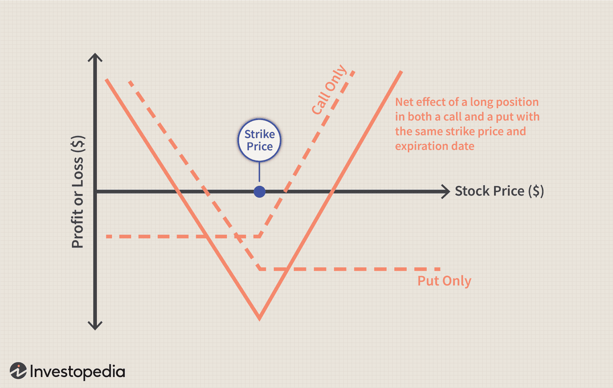

## Table of Contents

## What is a Long Straddle Strategy?

A Long Straddle Strategy is when you buy a call option and a put option at the same time. Both options have the same expiration date and the same strike price. This strategy is used when you think the price of the stock will move a lot, but you're not sure if it will go up or down. You make money if the stock price moves enough in either direction.

The cost of the strategy is the total price you pay for both the call and put options. This is also the maximum amount you can lose. If the stock price doesn't move much, you could lose the entire amount you spent on the options. But if the stock price moves a lot, you can make a lot of money. The more the stock price moves, the more you can earn.

## How does a Long Straddle Strategy work?

A Long Straddle Strategy is when you buy both a call option and a put option on the same stock at the same time. Both options should have the same expiration date and the same strike price. You use this strategy when you think the stock price will move a lot, but you're not sure if it will go up or down. The total cost of the strategy is what you pay for both options, and that's the most you can lose. If the stock price stays the same or doesn't move much, you could lose all the money you spent on the options.

If the stock price moves a lot, either up or down, you can make money. The call option will make money if the stock price goes up a lot, and the put option will make money if the stock price goes down a lot. The more the stock price moves, the more money you can make. This strategy is good when you expect big changes in the stock price, like before a big news announcement or an earnings report.

## What are the key components of a Long Straddle?

A Long Straddle has two main parts: buying a call option and buying a put option on the same stock. Both options need to have the same expiration date and the same strike price. The call option gives you the right to buy the stock at the strike price, and the put option gives you the right to sell the stock at the strike price. You buy these options because you think the stock price will move a lot, but you're not sure if it will go up or down.

The cost of the Long Straddle is what you pay for both the call and put options. This is also the most you can lose. If the stock price doesn't move much by the time the options expire, you could lose all the money you spent on the options. But if the stock price moves a lot, either up or down, you can make money. The more the stock price moves, the more you can earn. This strategy is useful when you expect big changes in the stock price, like before a major news event or an earnings report.

## When should an investor consider using a Long Straddle Strategy?

An investor should think about using a Long Straddle Strategy when they expect a big change in a stock's price but aren't sure if it will go up or down. This can happen before important events like earnings announcements, product launches, or major news that could affect the company. The Long Straddle lets the investor make money if the stock price moves a lot in either direction, which is perfect when there's a lot of uncertainty.

The strategy is also good to use when the market is expecting a lot of [volatility](/wiki/volatility-trading-strategies). If there's a big event coming up and everyone thinks the stock price will move a lot, the Long Straddle can help the investor take advantage of that movement. But, it's important to remember that if the stock price doesn't move much, the investor could lose all the money they spent on the options. So, it's a strategy that works best when big changes are expected.

## What are the potential risks associated with a Long Straddle?

The main risk of a Long Straddle is that you could lose all the money you spent on the options if the stock price doesn't move enough. The total cost of the call and put options is the most you can lose. If the stock price stays the same or only moves a little, both options might expire worthless, and you won't get any of your money back.

Another risk is that time works against you with a Long Straddle. As the options get closer to their expiration date, their value can go down if the stock price doesn't move. This is called time decay, and it can eat away at the value of your options even if the stock price starts to move in the right direction but not quickly enough. So, you need the stock price to move a lot before the options expire to make money.

## How can an investor calculate the break-even points for a Long Straddle?

To find the break-even points for a Long Straddle, an investor needs to know the total cost of the options. The total cost is what you pay for both the call and put options. There are two break-even points because the stock price can move up or down. 

The first break-even point is when the stock price goes up. To find this, add the total cost of the options to the strike price. If the stock price goes above this point by the time the options expire, you start to make money. The second break-even point is when the stock price goes down. To find this, subtract the total cost of the options from the strike price. If the stock price goes below this point by the time the options expire, you also start to make money. Anything in between these two points, and you lose money.

## What are the profit and loss scenarios for a Long Straddle?

With a Long Straddle, you buy a call option and a put option on the same stock with the same expiration date and strike price. The profit comes if the stock price moves a lot in either direction. If the stock price goes up a lot, the call option will make money. If the stock price goes down a lot, the put option will make money. The more the stock price moves away from the strike price, the more profit you can make. There are two break-even points: one above the strike price and one below it. If the stock price goes above the higher break-even point or below the lower break-even point, you start to make money.

The main risk with a Long Straddle is that you can lose all the money you spent on the options if the stock price doesn't move enough. The total cost of the call and put options is the most you can lose. If the stock price stays the same or only moves a little, both options might expire worthless, and you won't get any of your money back. Time decay is another risk because as the options get closer to expiring, their value can go down if the stock price doesn't move quickly enough. So, for a Long Straddle to be profitable, the stock price needs to move a lot before the options expire.

## How does implied volatility affect a Long Straddle Strategy?

Implied volatility is important for a Long Straddle because it shows how much the market thinks the stock price will move. When implied volatility is high, the options you buy for the Long Straddle will be more expensive. This means you pay more upfront, but it also means there's a bigger chance the stock price will move a lot, which is good for your strategy. High implied volatility can make your Long Straddle more likely to be profitable because big price moves are more likely.

On the other hand, if implied volatility is low, the options will be cheaper to buy. But this also means the market thinks the stock price won't move much, which is bad for a Long Straddle. If the stock price doesn't move enough, you could lose all the money you spent on the options. So, it's a good idea to use a Long Straddle when you think implied volatility is going to go up, because that can make your strategy more successful.

## Can you explain the impact of time decay on a Long Straddle?

Time decay, or theta, is the loss of value in options as they get closer to their expiration date. For a Long Straddle, time decay is a big problem because you're buying both a call and a put option. As time goes by, if the stock price doesn't move much, the value of your options goes down. This means that even if the stock price starts to move in the right direction, it might not move fast enough to make up for the loss in value due to time decay.

To make money with a Long Straddle, the stock price needs to move a lot before the options expire. If it doesn't, time decay can eat away at the value of your options, and you could lose all the money you spent on them. So, it's important to use a Long Straddle when you think the stock price will move a lot, and soon, to beat the effects of time decay.

## What are some common mistakes to avoid when implementing a Long Straddle?

One common mistake when using a Long Straddle is not understanding how time decay works. As time goes by, the value of your options goes down if the stock price doesn't move much. If you wait too long for the stock price to move, you could lose all your money even if the price starts to move in the right direction. So, it's important to use a Long Straddle when you think the stock price will move a lot, and soon.

Another mistake is not paying attention to implied volatility. If you buy a Long Straddle when implied volatility is low, the options will be cheaper, but the stock price might not move enough to make you money. On the other hand, if you buy when implied volatility is high, the options will be more expensive, but the stock price is more likely to move a lot, which is good for your strategy. So, it's a good idea to use a Long Straddle when you think implied volatility will go up.

## How does a Long Straddle compare to a Long Strangle?

A Long Straddle and a Long Strangle are both options strategies used when you think a stock's price will move a lot, but you're not sure if it will go up or down. In a Long Straddle, you buy a call option and a put option at the same time, with both options having the same expiration date and the same strike price. This means you're betting that the stock price will move a lot in either direction. The cost of the Long Straddle is what you pay for both options, and that's the most you can lose if the stock price doesn't move enough.

A Long Strangle is similar, but instead of buying options with the same strike price, you buy a call option with a higher strike price and a put option with a lower strike price. Both options still have the same expiration date. This makes the Long Strangle cheaper than a Long Straddle because you're buying options that are further away from the current stock price. However, for a Long Strangle to make money, the stock price needs to move even more than it does for a Long Straddle because the break-even points are further away. So, you need a bigger move in the stock price to start making money, but you spend less money upfront.

## What advanced techniques can enhance the effectiveness of a Long Straddle Strategy?

One way to make a Long Straddle work better is by keeping an eye on implied volatility. If you think implied volatility is going to go up, it might be a good time to start a Long Straddle. When implied volatility goes up, the options you buy will be more expensive, but the stock price is more likely to move a lot, which is what you need for the strategy to make money. You can also look at the VIX, which is a measure of how much the market thinks stock prices will move. If the VIX is going up, it could be a good sign to use a Long Straddle.

Another technique is to manage the timing of your Long Straddle carefully. Since time decay can hurt your options, you want to use a Long Straddle when you think the stock price will move a lot soon. For example, before an earnings report or a big news event, the stock price might move a lot, so that could be a good time to use a Long Straddle. You can also think about closing your position early if the stock price moves a lot before the options expire. This way, you can lock in your profits before time decay starts to eat away at the value of your options.

## References & Further Reading

[1]: Hull, J. C. (2017). ["Options, Futures, and Other Derivatives."](https://www.semanticscholar.org/paper/Options%2C-Futures%2C-and-Other-Derivatives-Hull/89bdee500c8623864fc9eb7a471546aa713acc44) Pearson Education.

[2]: Jansen, S. (2020). ["Machine Learning for Algorithmic Trading: Predictive models to extract signals from market and alternative data for systematic trading strategies with Python."](https://www.amazon.com/Machine-Learning-Algorithmic-Trading-alternative/dp/1839217715) Packt Publishing.

[3]: Aronson, D. R. (2006). ["Evidence-Based Technical Analysis: Applying the Scientific Method and Statistical Inference to Trading Signals."](https://www.amazon.com/Evidence-Based-Technical-Analysis-Scientific-Statistical/dp/0470008741) John Wiley & Sons.

[4]: Chan, E. P. (2009). ["Quantitative Trading: How to Build Your Own Algorithmic Trading Business."](https://github.com/ftvision/quant_trading_echan_book) Wiley Trading.

[5]: Lopez de Prado, M. (2018). ["Advances in Financial Machine Learning."](https://www.amazon.com/Advances-Financial-Machine-Learning-Marcos/dp/1119482089) Wiley.