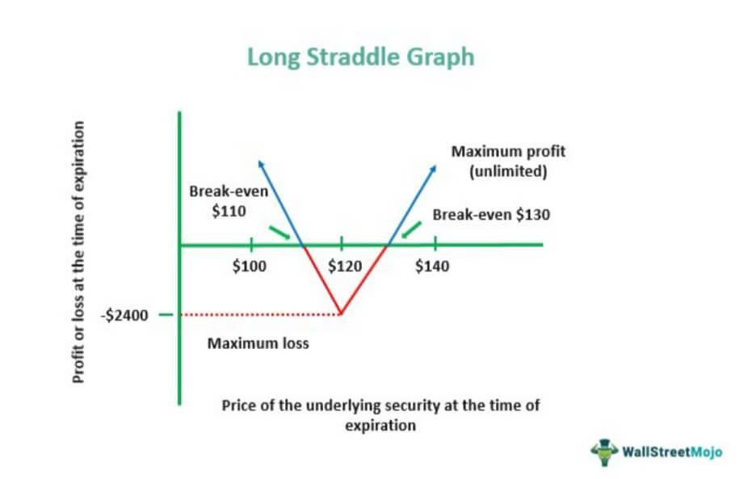

Options trading presents a diverse range of strategies designed to address varying market conditions and fulfill specific investment objectives. Among these, the long straddle options trading strategy stands out as a prominent choice for both individual and institutional investors. This strategy involves purchasing a call and a put option for the same stock with identical strike prices and expiration dates. It's a way to capitalize on expected volatility, as it allows traders to benefit from significant price movements in any direction, whether upward or downward. 

The combination of the long straddle with algorithmic trading marks a modern shift in how investors approach market volatility. Algorithmic trading, which relies on computer programs to execute trades at high speed based on predefined criteria, has made sophisticated strategies like the long straddle more accessible and efficient. By utilizing algorithms, traders can efficiently parse vast amounts of data, identifying optimal moments to enter or exit positions, thus enhancing the precision and speed of their trades.



With the rise of this technology, traders today can embed complex strategies into their algorithmic models, offering improved execution and an ability to quickly respond to shifting market dynamics. This article explores how the long straddle strategy works, its intersection with algorithmic trading, and how it can become a valuable part of your investment arsenal. Whether you're an experienced trader or new to the world of options, understanding the intricacies of this strategy can significantly inform and enhance your trading techniques, allowing you to better navigate market fluctuations.

## Table of Contents

## Understanding Long Straddle Options Trading Strategy

A long straddle options trading strategy involves purchasing both a call and a put option for a particular stock, sharing identical strike prices and expiration dates. This approach allows traders to benefit from the volatility of an underlying asset, with profits being possible from substantial price movements in either direction. The primary condition for this strategy to succeed is that the market movement should surpass the combined cost of both options, known as the "premium."

### Mechanics of a Long Straddle Strategy

A call option gives the holder the right to buy the underlying asset at the specified strike price before the option expires. Conversely, a put option allows the holder to sell the asset at the strike price. In a long straddle, both options are purchased simultaneously, with the expectation that the asset will exhibit significant volatility.

The profitability of a long straddle depends entirely on the magnitude of the underlying asset's price movement. Suppose the asset's price increases significantly beyond the strike price plus the premium, the call option becomes more valuable, while the put option may expire worthless. Conversely, if the price drops considerably below the strike price minus the premium, the put option gains value, potentially rendering the call worthless. The upside of this strategy is theoretically unlimited in the event of extreme price movements, provided the market surpasses the premium costs, enabling profits on one leg of the straddle.

### Ideal Market Conditions

A long straddle is most suitable for markets or assets characterized by high [volatility](/wiki/volatility-trading-strategies). Events such as earnings releases, regulatory announcements, or geopolitical developments commonly drive this volatility. It's crucial that the anticipated market movement is substantial enough to cover the premium expenses, which can be significant due to time and intrinsic value components.

### Risks and Rewards

The greatest advantage of a long straddle lies in its potential to generate profits regardless of the direction of the price change, making it a versatile choice in uncertain markets. However, it carries notable risks. If the market remains stable and does not shift significantly in either direction, the options may expire worthless, resulting in a total loss of the premium paid. Traders must, therefore, carefully assess the likelihood of volatility and weigh it against the cost of entering the strategy.

### Historical Example

One historical example illustrating the effectiveness of a long straddle involves the financial sector during the 2008 crisis. The volatility surrounding financial stocks was notably high, driven by unprecedented market turmoil. Traders who correctly anticipated this volatility and entered long straddles on key financial stocks were able to capitalize on the sharp price movements occurring throughout the crisis period. This underscores how strategic implementation during volatile periods can lead to successful outcomes.

## The Role of Algorithmic Trading in Options Strategies

**The Role of Algorithmic Trading in Options Strategies**

Algorithmic trading, commonly known as algo trading, has revolutionized the financial markets by leveraging computer programs to execute trades with high speed and precision. This advancement holds significant promise for options trading strategies, such as the long straddle, by enabling traders to efficiently process extensive datasets and optimize entry and [exit](/wiki/exit-strategy) points.

In options trading, particularly with strategies like the long straddle, the critical [factor](/wiki/factor-investing) lies in accurately predicting volatility and timing trades precisely. Algorithms equipped with sophisticated data analytics capabilities can identify patterns and signals that human traders might overlook. This increased precision ensures that trades are executed at the most opportune moments, which is crucial in options trading where market conditions can change rapidly.

Traders can leverage algo trading to enhance their decision-making processes in volatile markets. Algorithms continuously monitor a range of market variables, allowing them to respond in milliseconds to changes that might impact options prices. For example, a sudden spike in market volatility could trigger an algorithm to enter a long straddle position, while a sustained drop might prompt an exit.

Numerous technological tools and platforms facilitate the integration of [algorithmic trading](/wiki/algorithmic-trading) with options strategies. Platforms like QuantConnect, [Interactive Brokers](/wiki/interactive-brokers-api) API, and MetaTrader 5 provide environments where traders can develop, backtest, and deploy their trading algorithms. These platforms offer a broad array of libraries and modules for data analysis, making it easier to implement strategies effectively.

Python, widely used for its simplicity and efficiency in handling large datasets, is the preferred language for developing such algorithms. A basic example of an algorithm that identifies optimal trading conditions for a long straddle might look like this in Python:

```python
import numpy as np
import pandas as pd

def calculate_volatility(price_data):
    log_returns = np.log(price_data / price_data.shift(1))
    return np.std(log_returns) * np.sqrt(252)

def determine_straddle_entry(price_data, threshold=0.02):
    volatility = calculate_volatility(price_data)
    if volatility > threshold:
        return "Enter Long Straddle"
    else:
        return "Hold"

# Example usage with dummy data
price_data = pd.Series([100, 102, 104, 103, 105, 108, 110])
print(determine_straddle_entry(price_data))
```

The synergy between algorithmic trading tools and options strategies is evident in how they streamline trading processes. Algorithms reduce the time needed for market analysis, allowing traders to focus on strategy development and optimization. As a result, traders can quickly backtest their strategies against historical data and make necessary adjustments before deploying them in live markets.

In conclusion, algorithmic trading serves as a powerful ally in options trading, enabling strategies like the long straddle to be executed with greater precision and efficiency. As technological advancements continue, the integration between algorithmic tools and options strategies will likely deepen, offering traders better ways to navigate the complexities of markets.

## Integrating Long Straddle with Algorithmic Trading

As financial markets become increasingly volatile, aligning long straddle options strategies with algorithmic trading offers sophisticated methods for traders looking to optimize their returns. Here, we'll examine the process of setting up an algorithm for executing long straddles, including necessary programming considerations, key metrics for determining strategy viability, and the importance of [backtesting](/wiki/backtesting) and optimization.

### Setting Up an Algorithm for Long Straddles

To automate a long straddle strategy using algorithmic trading, traders must engage in several critical programming steps:

1. **Define Parameters**: Establish the underlying asset, strike price, expiration date, budget for premiums, and the volatility metrics to guide entry and exit decisions.

2. **Data Feed Integration**: Connect the algorithm to reliable real-time data feeds to enable instant analysis and execution. Libraries such as `ccxt` for cryptocurrencies or `yfinance` for equities in Python can be used.

3. **Signal Generation**: Program the algorithm to generate trading signals when predetermined criteria, such as volatility thresholds or technical indicators (e.g., Bollinger Bands, RSI), are met.

4. **Execution Logic**: Define the logic for executing orders. Algorithms should send simultaneous orders for call and put options to establish the straddle.

```python
import ccxt

# Example of basic structure in Python for executing trades
def execute_long_straddle(symbol, strike_price, expiration, budget):
    exchange = ccxt.binance()  # Example of an exchange
    market_data = exchange.fetch_ticker(symbol)
    # Signal logic based on volatility conditions
    if market_data['volatility'] >= predefined_threshold:
        execute_order('buy', symbol, 'CALL', strike_price, expiration, budget)
        execute_order('buy', symbol, 'PUT', strike_price, expiration, budget)

def execute_order(order_type, symbol, option_type, strike_price, expiration, budget):
    # Execution logic for trading platform
    pass
```

### Key Metrics and Indicators

Algorithms should continuously monitor several metrics to ascertain the viability of executing a long straddle:

- **Implied Volatility (IV)**: A higher IV suggests greater expected price movement, essential for profit in long straddles. Monitor changes using options pricing models like Black-Scholes.

- **Historical Volatility**: Compare it against IV to anticipate potential market movements.

- **Volatility Skew**: Check for discrepancies in IV across different strike prices, which might affect strategy profitability.

- **Time Decay (Theta)**: Assess the effect of time decay on option premiums as expiration approaches.

### Importance of Backtesting and Optimization

Backtesting is crucial to validate an algorithm's efficacy. By analyzing historical data, traders can refine their strategies to improve resilience and profitability under various market conditions. Backtesting involves:

- Setting aside a separate dataset that wasn't used during algorithm training to evaluate performance.
- Assessing key performance metrics such as Sharpe Ratio, maximum drawdown, and win rate.

Continuous optimization, often through techniques like parameter tuning, ensures the algorithm adapts to changing market conditions, maintaining its relevance and effectiveness.

### Challenges and Limitations

Automating a long straddle strategy brings challenges, including:

- **Latency**: Delays in executing trades due to network issues or inefficient code can affect the strategy's success.

- **Market Impact**: Large order sizes might move the market, necessitating sophisticated execution strategies like order slicing.

- **Algorithm Overfitting**: Tailoring algorithms too closely to historical data can reduce performance in live trading. Mitigation involves using cross-validation techniques and maintaining simplicity in model design.

By addressing these challenges, traders can effectively integrate long straddle strategies with algorithmic trading, harnessing the power of technology to navigate volatile markets.

## Case Studies and Real-world Applications

While a multitude of trading strategies exist in options trading, the combination of the long straddle strategy with algorithmic trading has resulted in notable case studies. These instances offer valuable real-world insights into the potential efficacy of this approach. A notable example is the implementation of the long straddle strategy during significant earnings announcements in the technology sector. The high volatility associated with these events aligns well with the long straddle strategy, which profits from significant price swings—whether upward or downward.

### Industry Analysis

The tech industry, characterized by frequent and pronounced price fluctuations during earnings seasons, has been a prime candidate for employing algorithmic long straddle strategies. For instance, companies like Apple and Amazon often experience substantial stock price movements upon the release of their quarterly earnings. By employing algorithmic tools, traders have automated the execution of long straddles around these events, efficiently capturing the volatility without needing to predict the direction of the price movement.

### Regulatory and Compliance Considerations

When integrating algorithmic trading with options strategies, regulatory compliance is key. Market participants must adhere to guidelines set by financial authorities such as the U.S. Securities and Exchange Commission (SEC) and the Financial Industry Regulatory Authority (FINRA). Traders need to ensure that their algorithmic strategies do not engage in manipulative practices like spoofing or layering, which could attract regulatory scrutiny and penalties.

### Lessons Learned and Takeaways

Case studies indicate several lessons for traders. First, backtesting is crucial; rigorous testing of algorithmic strategies against historical data allows traders to optimize performance and mitigate risk. A robust risk management framework is also essential, which includes setting predefined loss thresholds and using stop-loss orders. Additionally, the dynamic nature of markets necessitates continuous monitoring and adjustment of algorithms to align with current market conditions.

### Future Trends and Evolving Practices

As algorithmic trading technologies evolve, so do the methodologies for integrating them with options strategies. Machine learning and [artificial intelligence](/wiki/ai-artificial-intelligence) are increasingly being leveraged to refine algorithmic strategies further, potentially enhancing their predictive accuracy. The development of more sophisticated algorithms capable of real-time learning and adaptation is on the horizon, promising improvements in strategy performance and efficiency.

In sum, the synergy between long straddle options strategies and algorithmic trading holds substantial promise, particularly in volatile sectors like technology during earnings seasons. By focusing on regulatory compliance and leveraging advanced technological tools, traders can potentially enhance their trading outcomes. The continuous evolution of this domain suggests a need for traders to remain informed and adaptable, ensuring they harness these advancements effectively.

## Conclusion: Balancing Strategy and Technology

The combination of long straddle options strategies with algorithmic trading presents a unique opportunity to harness the power of volatility in financial markets. This synergy allows traders to benefit from significant price movements in either direction, provided the market's shift is strong enough to surpass the collective premium costs of both options involved. Algorithmic trading enhances this strategy by allowing for precise entry and exit points, optimizing the chances for successful trades through the rapid analysis of data and market trends.

Maintaining a balanced approach that blends robust strategy design with cutting-edge technology is critical for traders aiming to succeed in today's fast-paced environment. While the long straddle strategy offers profitability in volatile conditions, algorithmic trading contributes by executing trades with speed and accuracy. However, this requires a deep understanding of both the options market and the technological tools used, underscoring the importance of ongoing education and adaptation to new methodologies.

Traders are encouraged to stay updated with the latest advancements in algorithmic technologies and options trading strategies. This continuous learning can facilitate improved decision-making and better risk management. For further reading, texts such as "Options, Futures, and Other Derivatives" by John C. Hull and resources on platforms like Coursera or edX that focus on algorithmic trading and financial engineering can be invaluable.

In closing, traders should consider exploring algorithmic options strategies in a measured and controlled manner. Before deploying such strategies in live markets, extensive backtesting and simulation can ensure reliability and performance consistency. By experimenting and continuously refining their approach, traders can better harness the potential of combining long straddles with algorithmic capabilities, ultimately leading to more informed and effective trading outcomes.

## References & Further Reading

[1]: Hull, J. C. (2017). ["Options, Futures, and Other Derivatives."](https://www.semanticscholar.org/paper/Options%2C-Futures%2C-and-Other-Derivatives-Hull/89bdee500c8623864fc9eb7a471546aa713acc44) Pearson Education.

[2]: Jansen, S. (2020). ["Machine Learning for Algorithmic Trading: Predictive models to extract signals from market and alternative data for systematic trading strategies with Python."](https://www.amazon.com/Machine-Learning-Algorithmic-Trading-alternative/dp/1839217715) Packt Publishing.

[3]: Aronson, D. R. (2006). ["Evidence-Based Technical Analysis: Applying the Scientific Method and Statistical Inference to Trading Signals."](https://www.amazon.com/Evidence-Based-Technical-Analysis-Scientific-Statistical/dp/0470008741) John Wiley & Sons.

[4]: Chan, E. P. (2009). ["Quantitative Trading: How to Build Your Own Algorithmic Trading Business."](https://github.com/ftvision/quant_trading_echan_book) Wiley Trading.

[5]: Lopez de Prado, M. (2018). ["Advances in Financial Machine Learning."](https://www.amazon.com/Advances-Financial-Machine-Learning-Marcos/dp/1119482089) Wiley.