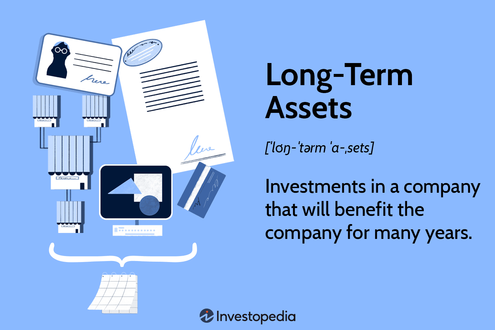

In the ever-evolving landscape of financial management, understanding the concept of asset depreciation is crucial. Depreciation plays a fundamental role not only in how businesses report their financial statements but also significantly influences tax computation and strategic planning processes. As businesses grow and diversify, particularly within high-stakes fields like algorithmic trading, the ability to accurately account for asset depreciation translates to improved financial health and competitive advantage.

Asset depreciation refers to the systematic allocation of the cost of a tangible asset over its useful lifespan. This allocation is essential for reflecting the actual wear and tear on the asset, providing a realistic view of its value on the balance sheet. Understanding this process is vital for crafting reliable financial records, ensuring compliance with regulatory standards, and informing investment decisions within organizations.



Throughout this article, we explore asset depreciation in the context of long-term assets, examining common methodologies such as Straight-Line, Declining Balance, and Units of Production. These methods offer different frameworks for calculating depreciation, each with unique implications for financial optimization. Insight into these methodologies enables businesses to precisely report their financial standing, predict future tax liabilities, and strategically plan resource allocation.

The focus extends to how businesses can leverage this knowledge to optimize financial reporting and refine their trading strategies. For sectors relying on algorithmic trading, integrating depreciation calculations into the core of trading algorithms is essential for maintaining up-to-date asset valuations, ultimately impacting trading outcomes. This article provides practical examples and calculation strategies, detailing how businesses can harness asset depreciation knowledge to enhance financial management and strategic planning.

## Table of Contents

## Understanding Long-Term Assets and Depreciation

Long-term assets are critical components of a company’s balance sheet, representing resources that provide valuable benefits beyond a single fiscal year. These assets encompass tangible resources such as properties, plants, and equipment, as well as intangible assets like patents and trademarks. Tangible long-term assets, often referred to as fixed assets, are physical items essential for the daily operations of a business. In contrast, intangible assets, although lacking physical substance, are equally pivotal in generating future economic benefits for the firm.

Depreciation is a key accounting process, essential for allocating the cost of these tangible long-term assets over their useful lives. This systematic allocation is not merely an accounting formality but a practical necessity, ensuring the accuracy and reliability of financial statements. By spreading out an asset’s cost across its useful lifespan, businesses can better manage their financial forecasting and tax liabilities. The concept of depreciation ensures that the expenses associated with asset usage are matched to the revenues they help generate, thereby adhering to the accrual basis of accounting.

Effective management, reporting, and prediction of depreciation have significant implications for financial accuracy and transparency. Accurately depreciating long-term assets allows companies to represent their financial position faithfully, impacting stakeholders’ perceptions and confidence. Investors, creditors, and analysts often scrutinize these reported figures to gauge a company’s operational efficiency and financial stability.

Moreover, strategic management of long-term assets directly correlates with an organization’s overall financial health. Properly accounting for asset depreciation allows a company to allocate capital efficiently, minimize tax burdens, and plan for future investment needs. This meticulous approach ensures that businesses can sustain their operations while optimizing asset turnover and return on investment.

In summary, understanding and implementing depreciation for long-term assets is vital for maintaining financial transparency and stability. By ensuring accurate capital allocation and reporting, companies can improve stakeholder confidence and foster sustainable growth.

## Types of Depreciation

Depreciation methods are essential tools in financial accounting, allowing businesses to allocate the cost of tangible assets over their useful lives effectively. Different methods cater to various asset types and business needs, impacting both financial records and tax calculations. This section provides an overview of the most common depreciation methods: Straight-Line, Declining Balance, Double-Declining Balance, Sum-of-the-Years' Digits, and Units of Production.

### Straight-Line Method

The Straight-Line Method is the most straightforward depreciation approach, wherein the asset's cost is evenly distributed over its useful life. It is calculated using the formula:

$$
\text{Depreciation Expense} = \frac{\text{Cost} - \text{Salvage Value}}{\text{Useful Life}}
$$

This method is often used for assets providing consistent utility over time, offering simplicity and predictability in financial statements.

### Declining Balance Method

The Declining Balance Method accelerates the depreciation rate compared to the straight-line approach. The Double-Declining Balance (DDB) is a popular variation, using twice the straight-line rate applied to the asset’s remaining book value. The formula is:

$$
\text{Depreciation Expense} = 2 \times \frac{1}{\text{Useful Life}} \times \text{Book Value at Beginning of Year}
$$

This method is beneficial for assets that lose value rapidly after acquisition, aligning depreciation with their usage pattern.

### Sum-of-the-Years’ Digits Method

This accelerated depreciation method involves a fraction based on the sum of the digits of the asset's useful life years. The depreciation expense for a given year is calculated by:

$$
\text{Depreciation Expense} = \frac{\text{Remaining Life of Asset}}{\text{Sum of the Years' Digits}} \times (\text{Cost} - \text{Salvage Value})
$$

The Sum-of-the-Years’ Digits method is advantageous for assets generating more revenue in earlier years.

### Units of Production Method

The Units of Production Method ties depreciation expense directly to the asset's usage, rather than time. It is calculated as:

$$
\text{Depreciation Expense} = \frac{\text{Number of Units Produced in the Period}}{\text{Total Estimated Units}} \times (\text{Cost} - \text{Salvage Value})
$$

Suitable for machinery and equipment, this method aligns depreciation with workload, reflecting the physical wear on the asset.

Each depreciation method presents unique advantages and is selected based on asset characteristics, financial strategy, and tax considerations. Implementing the optimal method can significantly influence how an organization records expenses and reports profits, ultimately affecting strategic business decisions.

## Depreciation Calculation Examples

To better understand asset depreciation, examining various calculation methods through practical examples is essential. These calculations not only indicate how the choice of depreciation method affects financial records but also highlight ways in which businesses can strategically plan for future capital allocations and tax liabilities.

### Straight-Line Depreciation

The straight-line method is straightforward and allocates an equal expense amount over the asset's useful life. For instance, if a company acquires a machine for $50,000 with a salvage value of $5,000 and a useful life of 10 years, the annual depreciation expense is calculated as follows:

$$

\text{Annual Depreciation} = \frac{\text{Cost} - \text{Salvage Value}}{\text{Useful Life}} = \frac{50,000 - 5,000}{10} = 4,500 
$$

Each year, $4,500 will be recorded as depreciation expense, uniformly reducing the asset's book value.

### Declining Balance Depreciation

The declining balance method offers higher depreciation expenses in the early years. Using the double-declining balance (DDB) method, the depreciation expense is twice the rate of straight-line depreciation. For the same machine:

$$

\text{Depreciation Rate} = \frac{2}{\text{Useful Life}} = \frac{2}{10} = 0.2 
$$

For the first year, the depreciation expense would be:

$$

\text{First Year Depreciation} = \text{Cost} \times \text{Depreciation Rate} = 50,000 \times 0.2 = 10,000 
$$

Subsequent years' depreciation costs are calculated based on the reduced book value. 

### Sum-of-the-Years' Digits Depreciation

The sum-of-the-years' digits method allocates depreciation expenses based on a decreasing fraction of the asset's cost. For a 10-year lifespan, the sum of the years is $1 + 2 + \ldots + 10 = 55$. The first year’s depreciation is:

$$

\text{First Year Depreciation} = \frac{10}{55} \times (50,000 - 5,000) = \frac{10}{55} \times 45,000 \approx 8,182 
$$

Each subsequent year, the numerator decreases by one until reaching zero.

### Units of Production Depreciation

This method ties depreciation expenses to the asset's usage, ideal for production-oriented assets. If the machine is expected to produce 100,000 units, and it produces 10,000 units the first year, depreciation is:

$$

\text{Depreciation Per Unit} = \frac{\text{Cost} - \text{Salvage Value}}{\text{Total Estimated Production}} = \frac{50,000 - 5,000}{100,000} = 0.45 
$$

$$

\text{First Year Depreciation} = \text{Depreciation Per Unit} \times \text{Units Produced} = 0.45 \times 10,000 = 4,500 
$$

### Python Script for Automation

Python can automate these calculations, enhancing accuracy and efficiency. Here's a script example for straight-line depreciation:

```python
def straight_line_depreciation(cost, salvage_value, useful_life):
    return (cost - salvage_value) / useful_life

# Example usage
cost = 50000
salvage_value = 5000
useful_life = 10

annual_depreciation = straight_line_depreciation(cost, salvage_value, useful_life)
print(f"Annual Depreciation: {annual_depreciation}")
```

Implementing these calculations through automation tools streamlines financial planning processes within organizations, providing faster adjustments to asset valuations and better financial performance projections. The awareness and application of such methods equip businesses to strategically manage and mitigate tax liabilities and optimize capital investments.

## Algorithmic Trading and Asset Depreciation

Algorithmic trading relies heavily on accurate asset valuations, with depreciation practices significantly influencing these valuations. Depreciation affects the book value of assets, which in turn impacts financial metrics and ratios crucial for trading decisions. For [algorithmic trading](/wiki/algorithmic-trading), especially in environments characterized by high-speed transactions, understanding how depreciation affects these valuations is essential for optimizing trading algorithms.

Depreciation figures directly affect the net income and book value reported in financial statements. As trading algorithms often incorporate financial ratios such as price-to-book and return on equity, incorrect asset valuations due to improper depreciation could lead to flawed trading signals. For example, a trading algorithm might sell a stock if it detects that the return on equity (ROE) has dropped below a certain threshold. However, if the depreciation charge is overstated, leading to lower net income, the ROE might decrease falsely triggering a sell signal.

Machine learning and other advanced tools are increasingly being used to integrate depreciation insights into trading strategies. Machine learning algorithms can analyze historical data, recognize patterns in depreciation schedules, and adjust trading strategies accordingly. These algorithms can be programmed to consider time-based depreciation figures, enabling real-time adjustments to trading algorithms based on recalibrated asset valuations.

In high-frequency trading ([HFT](/wiki/high-frequency-trading-strategies)), the rapid turnover of trades necessitates the swift incorporation of updated asset valuations. Here, algorithms need to efficiently process depreciation schedules and their impact on financial metrics. Implementing automated computational models can assist in predicting future depreciation expenses, allowing for adaptive strategies that maintain competitive edges.

Strategically incorporating depreciation schedules into financial models involves integrating these schedules into the data-driven decision-making processes. Proper alignment of depreciation schedules with trading algorithms ensures that trading signals accurately reflect the economic realities of asset valuations. This alignment is critical in maintaining robust and scalable trading operations, allowing traders to preemptively adjust strategies based on the anticipated future asset values.

In conclusion, mastering the interplay between asset depreciation and algorithmic trading can substantially enhance a firm's trading strategies. By integrating sophisticated tools to manage depreciation effects, trading businesses can sustain operational efficiency and maintain competitive performance in fast-paced trading environments.

## Conclusion

Asset depreciation is essential for accurate financial management and strategic planning. By comprehensively understanding and applying suitable depreciation methods, companies can refine their financial strategies, enabling more precise forecasting and effective budget management. Depreciation impacts an organization’s financial statements by altering asset values and affecting earnings through expense allocations. This approach not only helps in reflecting the true value of assets over time but also aids in tax savings by aligning reported profits with tax regulations.

For trading businesses, particularly those engaged in algorithmic trading, analyzing how asset depreciation affects algorithms is vital for maintaining operational efficiency. These algorithms depend on precise asset valuations to make informed decisions. Therefore, integrating accurate depreciation calculations into trading systems ensures more reliable outcomes. As trading strategies often require real-time data analysis, understanding depreciation becomes crucial in this context, as it directly affects algorithmic predictions and decision-making processes.

Looking forward, advancements in technology promise even more innovative methods of integrating accounting principles into trading systems. Emerging technologies like [artificial intelligence](/wiki/ai-artificial-intelligence) and [machine learning](/wiki/machine-learning) can further refine how depreciation impacts financial strategies. These technologies hold the potential to automate complex calculations and offer predictive analytics, thus allowing businesses to anticipate market changes and asset value decays more accurately. Consequently, incorporating advanced computational techniques could significantly enhance the strategic value of accounting data in financial trading.

Overall, a thorough grasp of asset depreciation facilitates the sustainability of long-term asset value, optimizing investments, and enhancing financial health. This strategic awareness ensures that organizations can maintain competitiveness while navigating the complexities of modern financial landscapes. By leveraging technology and sound accounting principles, businesses are better positioned to achieve robust financial health and thrive in dynamic market environments.

## References & Further Reading

In-depth literature on financial accounting, asset management, and algorithmic trading provides invaluable insights into understanding and applying asset depreciation effectively. Key texts for financial accounting include "Financial Accounting: Tools for Business Decision Making" by Paul Kimmel, Jerry Weygandt, and Donald Kieso. This book offers foundational knowledge on accounting principles and practices, particularly useful for mastering depreciation methods in various business contexts.

For those interested in algorithmic trading, "Algorithmic Trading: Winning Strategies and Their Rationale" by Ernie Chan serves as an essential resource. Chan's work demystifies algorithmic trading, offering strategies that benefit from understanding asset valuations, including the consideration of depreciation impacts.

Articles and primary sources that discuss the intersection of asset depreciation with algorithmic trading are crucial for real-world applications. They provide case studies and empirical analysis on how depreciation figures play into the valuation of assets within trading algorithms, impacting decisions in dynamic trading environments.

Additional resources are available for readers who wish to explore the multi-faceted implications of asset depreciation further. These include academic journals dedicated to financial management and computational finance. Such publications frequently host articles that explore innovative approaches to integrating accounting concepts like depreciation into modern financial models and trading systems.

These references highlight the varied nature of depreciation management, connecting traditional accounting fundamentals to contemporary financial practices. For those seeking advanced understanding, online courses or seminars focusing on both financial accounting principles and algorithmic trading strategies are recommended. Such educational opportunities often provide hands-on experience with software tools and programming, including Python scripts for automating depreciation calculations, thereby enriching the practitioner's skill set in managing and leveraging asset depreciation effectively.

