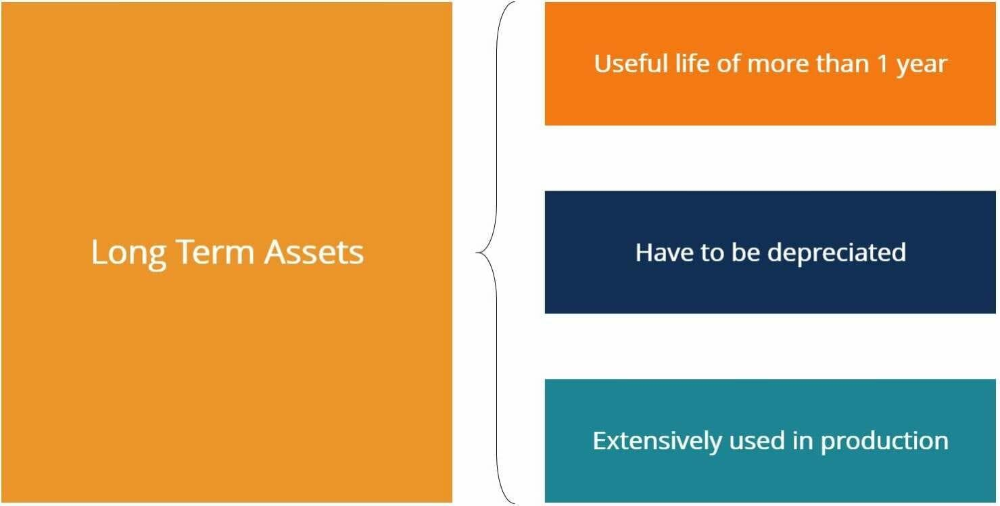

## Table of Contents

## What are long-term assets?

Long-term assets are things a company owns that they plan to use for more than one year. These assets help the company make money over a long time. Examples include buildings, machines, and land. They are different from short-term assets, which a company might use up or sell within a year.

Companies keep track of long-term assets on their balance sheet. This helps them see what they own and how much it's worth. Over time, some long-term assets, like machines, wear out and lose value. This is called depreciation. Companies need to think about depreciation when they figure out how much their assets are worth.

## Why is depreciation important for long-term assets?

Depreciation is important for long-term assets because it helps companies understand how much their assets are worth over time. When a company buys a long-term asset like a machine, it doesn't use up all its value right away. Instead, the value of the machine goes down slowly as it gets older and is used more. Depreciation is the way companies keep track of this decrease in value. By recording depreciation, a company can see how much the asset is still worth and plan for when they might need to replace it.

Also, depreciation affects a company's financial statements. It is listed as an expense on the income statement, which reduces the company's profit. This is important for taxes because a lower profit means the company might pay less in taxes. On the balance sheet, depreciation reduces the value of the asset, which gives a more accurate picture of what the company owns. Understanding depreciation helps companies make better decisions about buying, using, and replacing their long-term assets.

## What are the different methods of depreciation?

There are several methods companies can use to calculate depreciation for their long-term assets. The most common methods are straight-line depreciation, declining balance depreciation, and units of production depreciation. Straight-line depreciation is the simplest method where the cost of the asset is spread evenly over its useful life. For example, if a machine costs $10,000 and will last 10 years, the company would record $1,000 in depreciation each year. Declining balance depreciation, on the other hand, lets companies write off a larger amount of depreciation in the early years of the asset's life. This method is often used for assets that lose value quickly at first, like computers.

Units of production depreciation is another method that bases the depreciation on how much the asset is used. If a machine is expected to produce 100,000 units over its life, and it produces 10,000 units in a year, then the company would record 10% of the machine's cost as depreciation for that year. This method is useful for assets whose wear and tear depends more on how much they are used rather than just time passing. Each method has its own advantages and is chosen based on the nature of the asset and the company's financial strategy.

## Can you explain straight-line depreciation with an example?

Straight-line depreciation is a way to spread out the cost of an asset evenly over the time it's used. Imagine a company buys a delivery truck for $30,000. They think the truck will last for 5 years before it's too worn out to use. To figure out the yearly depreciation, they divide the cost of the truck by the number of years it will be used. So, $30,000 divided by 5 years equals $6,000 per year. Every year, the company will record $6,000 as depreciation expense on their financial statements.

This method is simple and easy to understand. It helps the company see how much the truck is worth each year. At the end of the first year, the truck's value on the balance sheet would be $30,000 minus $6,000, which is $24,000. After the second year, it would be $18,000, and so on. By the end of 5 years, the truck would be fully depreciated, meaning its value on the books would be zero. This way, the company can plan for when they need to buy a new truck.

## How does the declining balance method work?

The declining balance method is a way to figure out how much an asset loses value over time. It's different from the straight-line method because it lets you take off more value in the early years. This can be good for things like computers or cars that lose value faster at first. Instead of dividing the cost evenly, you take a bigger piece of the cost each year, but that piece gets smaller and smaller as time goes on.

To use the declining balance method, you start with the asset's full cost and then take off a certain percentage each year. A common percentage is double the straight-line rate, which is called the double-declining balance method. For example, if a machine costs $10,000 and you expect it to last 5 years, the straight-line rate would be 20% a year (100% divided by 5 years). With the double-declining balance method, you'd use 40% (double of 20%) in the first year. So, you'd take off $4,000 (40% of $10,000) in the first year. The next year, you'd take 40% of the new value, which is $6,000, so you'd take off $2,400. You keep doing this until the asset is fully depreciated or until you reach its expected end value, called the salvage value.

## What is the difference between depreciation and amortization?

Depreciation and amortization are both ways to spread out the cost of something a company owns over time, but they are used for different things. Depreciation is used for physical things like machines, buildings, and vehicles. These are things you can touch and that wear out over time. When a company buys a machine, they don't use up all its value right away. Instead, they spread out the cost over the years they expect to use the machine. This is called depreciation.

Amortization, on the other hand, is used for things you can't touch, like patents, copyrights, and software. These are called intangible assets. Just like with depreciation, a company doesn't use up the whole value of a patent right away. They spread out the cost over the time they expect to use the patent. So, while depreciation is for physical stuff that gets old and worn out, amortization is for non-physical stuff that still loses value over time.

## How do companies decide which depreciation method to use?

Companies choose a depreciation method based on what makes the most sense for their business and the type of asset they have. If they have a machine that loses value quickly at first, like a computer, they might pick the declining balance method. This method lets them take off more value in the early years, which matches how the computer loses value. But if they have something like a building that loses value more slowly and evenly, they might go with the straight-line method. This method spreads out the cost evenly over time, which is simpler and easier to understand.

Another thing companies think about is how the depreciation method affects their taxes and financial statements. The declining balance method can lower their profit more in the early years, which might mean they pay less in taxes then. But the straight-line method keeps the profit and tax numbers more even year to year. Companies also look at what other businesses in their industry do. If most companies in their industry use one method, they might choose that one too, to make it easier to compare their financials with others.

## What are the tax implications of depreciation?

Depreciation can affect how much tax a company has to pay. When a company records depreciation, it shows up as an expense on their income statement. This expense reduces the company's profit for the year. Since taxes are based on profit, a lower profit means the company might pay less in taxes. For example, if a company makes $100,000 in profit before depreciation, and they record $10,000 in depreciation, their taxable profit goes down to $90,000. This can save them money on taxes.

Different depreciation methods can change how much tax a company pays each year. The declining balance method lets a company take off more depreciation in the early years, which can lower their profit and taxes more in those years. The straight-line method spreads out the depreciation evenly, so the tax savings are more even each year. Companies might choose a method that helps them save on taxes now, or they might choose one that makes their financial statements look more consistent over time. It all depends on what's best for their business.

## How does depreciation affect financial statements?

Depreciation affects a company's financial statements in important ways. On the income statement, depreciation is listed as an expense. This means it reduces the company's profit for the year. If a company makes $100,000 before depreciation and records $10,000 in depreciation, their profit goes down to $90,000. A lower profit can mean the company pays less in taxes. So, depreciation is a way for companies to manage their profits and taxes.

On the balance sheet, depreciation changes how much the company's assets are worth. When a company buys a long-term asset like a machine, it starts with the full cost on the balance sheet. Over time, as the company records depreciation, the value of the asset goes down. For example, if a machine cost $30,000 and the company records $6,000 in depreciation each year, after one year the machine's value on the balance sheet would be $24,000. This helps the company keep track of how much their assets are worth and when they might need to replace them.

## What are some common examples of long-term assets that are depreciated?

Long-term assets that are depreciated include things like machines, buildings, and vehicles. Machines, like factory equipment or computers, lose value as they get older and are used more. Companies buy these machines to help them make things or do work, but over time, the machines wear out and aren't worth as much. Buildings, like offices or warehouses, also lose value over time. Even though they might last a long time, things like roofs and walls need to be fixed or replaced, so the building's value goes down.

Vehicles, such as delivery trucks or company cars, are another example of long-term assets that get depreciated. When a company buys a truck, it starts off worth a lot, but as the truck is driven and gets older, it loses value. Companies keep track of this loss in value by recording depreciation each year. This helps them know how much the truck is still worth and when they might need to buy a new one.

## How can changes in depreciation methods impact a company's financial health?

Changing the depreciation method can affect how a company looks on paper. If a company switches from straight-line to declining balance depreciation, they'll record more depreciation in the early years. This means their profit will be lower in those years because depreciation is an expense. Lower profit can mean the company pays less in taxes, which is good for their cash flow. But it can also make the company look less profitable to investors and lenders, which might not be good for getting loans or attracting investment.

On the other hand, if a company switches from declining balance to straight-line depreciation, their profit will be more even year to year. This can make their financial statements look more stable, which might be good for investors and lenders who like to see steady profits. But it could mean they pay more in taxes in the early years because their profit won't be as low. So, changing depreciation methods can be a way for a company to manage its taxes and how it looks to others, but it needs to think about the good and bad sides before making a change.

## What advanced considerations should be taken into account when managing depreciation of long-term assets in multinational corporations?

Managing depreciation of long-term assets in multinational corporations involves extra things to think about because these companies work in many different countries. Each country has its own rules about how to do depreciation. A company might need to use different methods in different places to follow the local laws. This can make things complicated because the company has to keep track of different ways to do depreciation for the same kind of asset in different countries. They also need to think about how to report all this in a way that makes sense to people looking at their financial statements, like investors and lenders.

Another thing to consider is how changes in currency values can affect depreciation. If a company buys a machine in one country and the value of that country's money changes, it can change how much the machine is worth in the company's main financial statements. This can make the depreciation numbers different when they are all put together. Multinational companies need to be careful about this and might need to use special ways of accounting to make sure their financial statements are correct and fair. This can take a lot of work and needs people who know a lot about accounting in different countries.

## What are the types of depreciation?

Depreciation methods are essential tools in financial accounting, allowing businesses to allocate the cost of tangible assets over their useful lives effectively. Different methods cater to various asset types and business needs, impacting both financial records and tax calculations. This section provides an overview of the most common depreciation methods: Straight-Line, Declining Balance, Double-Declining Balance, Sum-of-the-Years' Digits, and Units of Production.

### Straight-Line Method

The Straight-Line Method is the most straightforward depreciation approach, wherein the asset's cost is evenly distributed over its useful life. It is calculated using the formula:

$$
\text{Depreciation Expense} = \frac{\text{Cost} - \text{Salvage Value}}{\text{Useful Life}}
$$

This method is often used for assets providing consistent utility over time, offering simplicity and predictability in financial statements.

### Declining Balance Method

The Declining Balance Method accelerates the depreciation rate compared to the straight-line approach. The Double-Declining Balance (DDB) is a popular variation, using twice the straight-line rate applied to the asset’s remaining book value. The formula is:

$$
\text{Depreciation Expense} = 2 \times \frac{1}{\text{Useful Life}} \times \text{Book Value at Beginning of Year}
$$

This method is beneficial for assets that lose value rapidly after acquisition, aligning depreciation with their usage pattern.

### Sum-of-the-Years’ Digits Method

This accelerated depreciation method involves a fraction based on the sum of the digits of the asset's useful life years. The depreciation expense for a given year is calculated by:

$$
\text{Depreciation Expense} = \frac{\text{Remaining Life of Asset}}{\text{Sum of the Years' Digits}} \times (\text{Cost} - \text{Salvage Value})
$$

The Sum-of-the-Years’ Digits method is advantageous for assets generating more revenue in earlier years.

### Units of Production Method

The Units of Production Method ties depreciation expense directly to the asset's usage, rather than time. It is calculated as:

$$
\text{Depreciation Expense} = \frac{\text{Number of Units Produced in the Period}}{\text{Total Estimated Units}} \times (\text{Cost} - \text{Salvage Value})
$$

Suitable for machinery and equipment, this method aligns depreciation with workload, reflecting the physical wear on the asset.

Each depreciation method presents unique advantages and is selected based on asset characteristics, financial strategy, and tax considerations. Implementing the optimal method can significantly influence how an organization records expenses and reports profits, ultimately affecting strategic business decisions.

## How Can You Calculate Depreciation? Examples Included.

To better understand asset depreciation, examining various calculation methods through practical examples is essential. These calculations not only indicate how the choice of depreciation method affects financial records but also highlight ways in which businesses can strategically plan for future capital allocations and tax liabilities.

### Straight-Line Depreciation

The straight-line method is straightforward and allocates an equal expense amount over the asset's useful life. For instance, if a company acquires a machine for $50,000 with a salvage value of $5,000 and a useful life of 10 years, the annual depreciation expense is calculated as follows:

$$

\text{Annual Depreciation} = \frac{\text{Cost} - \text{Salvage Value}}{\text{Useful Life}} = \frac{50,000 - 5,000}{10} = 4,500 
$$

Each year, $4,500 will be recorded as depreciation expense, uniformly reducing the asset's book value.

### Declining Balance Depreciation

The declining balance method offers higher depreciation expenses in the early years. Using the double-declining balance (DDB) method, the depreciation expense is twice the rate of straight-line depreciation. For the same machine:

$$

\text{Depreciation Rate} = \frac{2}{\text{Useful Life}} = \frac{2}{10} = 0.2 
$$

For the first year, the depreciation expense would be:

$$

\text{First Year Depreciation} = \text{Cost} \times \text{Depreciation Rate} = 50,000 \times 0.2 = 10,000 
$$

Subsequent years' depreciation costs are calculated based on the reduced book value. 

### Sum-of-the-Years' Digits Depreciation

The sum-of-the-years' digits method allocates depreciation expenses based on a decreasing fraction of the asset's cost. For a 10-year lifespan, the sum of the years is $1 + 2 + \ldots + 10 = 55$. The first year’s depreciation is:

$$

\text{First Year Depreciation} = \frac{10}{55} \times (50,000 - 5,000) = \frac{10}{55} \times 45,000 \approx 8,182 
$$

Each subsequent year, the numerator decreases by one until reaching zero.

### Units of Production Depreciation

This method ties depreciation expenses to the asset's usage, ideal for production-oriented assets. If the machine is expected to produce 100,000 units, and it produces 10,000 units the first year, depreciation is:

$$

\text{Depreciation Per Unit} = \frac{\text{Cost} - \text{Salvage Value}}{\text{Total Estimated Production}} = \frac{50,000 - 5,000}{100,000} = 0.45 
$$

$$

\text{First Year Depreciation} = \text{Depreciation Per Unit} \times \text{Units Produced} = 0.45 \times 10,000 = 4,500 
$$

### Python Script for Automation

Python can automate these calculations, enhancing accuracy and efficiency. Here's a script example for straight-line depreciation:

```python
def straight_line_depreciation(cost, salvage_value, useful_life):
    return (cost - salvage_value) / useful_life

# Example usage
cost = 50000
salvage_value = 5000
useful_life = 10

annual_depreciation = straight_line_depreciation(cost, salvage_value, useful_life)
print(f"Annual Depreciation: {annual_depreciation}")
```

Implementing these calculations through automation tools streamlines financial planning processes within organizations, providing faster adjustments to asset valuations and better financial performance projections. The awareness and application of such methods equip businesses to strategically manage and mitigate tax liabilities and optimize capital investments.

## References & Further Reading

In-depth literature on financial accounting, asset management, and algorithmic trading provides invaluable insights into understanding and applying asset depreciation effectively. Key texts for financial accounting include "Financial Accounting: Tools for Business Decision Making" by Paul Kimmel, Jerry Weygandt, and Donald Kieso. This book offers foundational knowledge on accounting principles and practices, particularly useful for mastering depreciation methods in various business contexts.

For those interested in algorithmic trading, "Algorithmic Trading: Winning Strategies and Their Rationale" by Ernie Chan serves as an essential resource. Chan's work demystifies algorithmic trading, offering strategies that benefit from understanding asset valuations, including the consideration of depreciation impacts.

Articles and primary sources that discuss the intersection of asset depreciation with algorithmic trading are crucial for real-world applications. They provide case studies and empirical analysis on how depreciation figures play into the valuation of assets within trading algorithms, impacting decisions in dynamic trading environments.

Additional resources are available for readers who wish to explore the multi-faceted implications of asset depreciation further. These include academic journals dedicated to financial management and computational finance. Such publications frequently host articles that explore innovative approaches to integrating accounting concepts like depreciation into modern financial models and trading systems.

These references highlight the varied nature of depreciation management, connecting traditional accounting fundamentals to contemporary financial practices. For those seeking advanced understanding, online courses or seminars focusing on both financial accounting principles and algorithmic trading strategies are recommended. Such educational opportunities often provide hands-on experience with software tools and programming, including Python scripts for automating depreciation calculations, thereby enriching the practitioner's skill set in managing and leveraging asset depreciation effectively.

