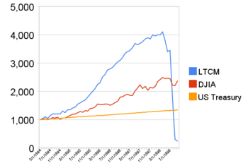

## Table of Contents

## What is Long-Term Capital Management (LTCM)?

Long-Term Capital Management, often called LTCM, was a hedge fund started in 1994. It was created by John Meriwether, who used to work at Salomon Brothers. The fund had many smart people working for it, including two men who won the Nobel Prize in Economics. They used fancy math and computer models to make money by betting on small differences in prices between similar things, like bonds from different countries.

At first, LTCM did very well and made a lot of money. But in 1998, things went wrong. Russia said it couldn't pay back its debts, which caused big problems in the world's money markets. LTCM had borrowed a lot of money to make its bets, and when the markets changed suddenly, it lost a lot of money very quickly. The fund was about to fail, which could have hurt the whole financial system. The U.S. government and big banks had to step in to help fix the problem, showing how risky and connected the world of finance can be.

## Who founded LTCM and what were their backgrounds?

John Meriwether founded Long-Term Capital Management, or LTCM. He used to work at Salomon Brothers, a big investment bank. At Salomon, he was known for making a lot of money by trading bonds. He left Salomon after a big scandal and then started LTCM. He wanted to use his experience to make money in a new way.

LTCM also had other smart people working for it. Two of them, Myron Scholes and Robert C. Merton, even won the Nobel Prize in Economics. They were experts in figuring out how to price things like options and bonds. The fund also had other traders and experts who used to work at big banks and knew a lot about the markets. Together, they thought they could make a lot of money by using fancy math and computer models.

## What was the investment strategy of LTCM?

LTCM's investment strategy was to make money from small differences in prices between similar financial products, like bonds from different countries. They used fancy math and computer models to find these small differences, which are called "[arbitrage](/wiki/arbitrage) opportunities." The idea was to buy something that was priced a little lower and sell something similar that was priced a little higher, making a profit from the difference. To make more money, LTCM borrowed a lot to make bigger bets. This is called using "leverage."

The strategy worked well at first because the market was calm and the price differences were small and predictable. But LTCM's bets were based on things staying normal. If the market changed suddenly, their strategy could lose a lot of money. And that's what happened in 1998 when Russia defaulted on its debt. The markets got very shaky, and the small price differences LTCM was betting on turned into big losses. Because they had borrowed so much money, these losses were huge and nearly caused the fund to fail.

## When was LTCM founded and how did it perform initially?

Long-Term Capital Management, or LTCM, was started in 1994 by John Meriwether. He used to work at Salomon Brothers and wanted to use his experience to make money in a new way. LTCM was different because it had very smart people working for it, including two men who won the Nobel Prize in Economics. They used fancy math and computer models to find small differences in prices between similar things, like bonds from different countries.

At first, LTCM did really well. They made a lot of money by betting on these small price differences. Their strategy worked because the markets were calm and the price differences were small and predictable. This made them think they could keep making money this way. But their bets were based on things staying normal, and if the market changed suddenly, their strategy could lose a lot of money.

## What led to the crisis at LTCM in 1998?

In 1998, LTCM ran into big trouble because of a sudden change in the world's money markets. Russia said it couldn't pay back its debts, which scared a lot of people and made the markets very shaky. LTCM had been making bets on small differences in prices between similar things, like bonds from different countries. But when Russia's debt problems caused big changes in the markets, these small price differences turned into big losses for LTCM.

The problem got worse because LTCM had borrowed a lot of money to make its bets bigger. This is called using "leverage." When the markets changed suddenly, LTCM's losses were huge because they had borrowed so much. The fund was about to fail, which could have hurt the whole financial system. The U.S. government and big banks had to step in to help fix the problem, showing how risky and connected the world of finance can be.

## How did the Federal Reserve respond to the LTCM crisis?

The Federal Reserve was very worried about the LTCM crisis. They thought that if LTCM failed, it could hurt the whole financial system. So, they worked with big banks to help fix the problem. The Fed didn't give LTCM money directly, but they encouraged banks to step in and help. They wanted to make sure that LTCM's problems didn't cause bigger problems for everyone else.

A group of big banks and financial firms came together and put in money to help LTCM. This was done to keep LTCM from failing and causing a bigger crisis. The Fed's role was to make sure this happened smoothly, without panicking the markets. By helping to organize this rescue, the Fed showed how important it is to keep the financial system stable, even when one part of it gets into trouble.

## What was the impact of the LTCM bailout on the financial markets?

The LTCM bailout helped to stop a bigger problem in the financial markets. If LTCM had failed, it could have made other banks and investors lose a lot of money too. This could have caused a big panic and made the markets very unstable. By having big banks step in and help LTCM, the markets stayed calmer. People didn't panic as much, and the financial system didn't fall apart.

But the LTCM crisis showed everyone how risky and connected the world of finance can be. It made people think more about how much risk they were taking and how much they were borrowing. It also showed that even smart people with fancy math and models can make big mistakes. After LTCM, regulators and banks started to be more careful and tried to make rules to stop something like this from happening again.

## How did the LTCM crisis influence financial regulation and risk management practices?

The LTCM crisis made people realize that the financial system could be very risky. It showed that even smart people with fancy math and models could make big mistakes. After LTCM, regulators and banks started to think more about how much risk they were taking and how much they were borrowing. They wanted to make sure that something like the LTCM crisis wouldn't happen again. So, they started to make new rules and change old ones to make the financial system safer.

One big change was that banks had to keep more money on hand, just in case things went wrong. They also had to be more careful about how much they borrowed to make bets. Regulators started to watch the markets more closely and made rules to limit how much risk big investors could take. This was all to stop another crisis like LTCM from happening and to make the financial system more stable.

## What lessons can be learned from the LTCM collapse?

The LTCM collapse showed us that even smart people with fancy math and computer models can make big mistakes. LTCM thought they could always make money by betting on small price differences, but they didn't think about what would happen if the markets changed suddenly. They borrowed a lot of money to make their bets bigger, and when things went wrong, they lost a lot very quickly. This taught us that it's important to think about what could go wrong, not just what could go right.

Another lesson from LTCM is that the financial world is very connected. If one big investor like LTCM gets into trouble, it can hurt a lot of other people and even the whole financial system. This is why the government and big banks had to step in to help LTCM. It showed us that we need to be careful about how much risk we take and how much we borrow. After LTCM, banks and regulators started making new rules to keep the financial system safer and more stable.

## How did the LTCM crisis affect the global economy?

The LTCM crisis in 1998 made people worried about the whole world's money system. LTCM was a big fund that made bets on small differences in prices. When Russia said it couldn't pay back its debts, the markets got very shaky. LTCM lost a lot of money very quickly because they had borrowed a lot to make their bets bigger. If LTCM had failed, it could have made other banks and investors lose money too. This could have caused a big panic and made the markets even more unstable. But big banks and the U.S. government stepped in to help LTCM, which stopped the crisis from getting worse.

The crisis showed everyone that the world of money is very connected. If one part gets into trouble, it can affect a lot of other parts too. This made people think more about how much risk they were taking and how much they were borrowing. After LTCM, banks and the people who make rules for them started to be more careful. They made new rules to keep the money system safer and more stable. The LTCM crisis taught everyone that even smart people with fancy math can make big mistakes, and it's important to always think about what could go wrong.

## What were the long-term effects on hedge fund industry following the LTCM crisis?

The LTCM crisis made a big impact on the [hedge fund](/wiki/hedge-fund-trading-strategies) industry. People realized that even big and smart hedge funds could fail and cause problems for the whole financial system. This made regulators and investors more careful about how much risk hedge funds were taking. After LTCM, new rules were made to make sure hedge funds didn't borrow too much money and take too many risks. Hedge funds had to tell regulators more about what they were doing, so the regulators could watch them more closely. This helped to make the hedge fund industry safer and more stable.

Also, the LTCM crisis changed how hedge funds did their business. Hedge funds started to use less borrowed money, or leverage, to make their bets. They also started to think more about what could go wrong, not just what could go right. This made them more careful about the risks they were taking. The crisis showed everyone that the financial world is very connected, and one big problem can affect a lot of other people. So, hedge funds started to be more open about what they were doing and tried to work together with regulators to keep the financial system safe.

## Can you discuss the role of leverage in the downfall of LTCM?

Leverage was a big reason why LTCM got into trouble. Leverage means borrowing money to make bigger bets. LTCM used a lot of leverage to make money from small differences in prices between similar things, like bonds from different countries. They thought they could make more money by borrowing a lot and betting on these small differences. But when the markets changed suddenly, especially after Russia said it couldn't pay back its debts, the small price differences turned into big losses. Because LTCM had borrowed so much money, these losses were huge and they couldn't pay back what they owed.

The use of leverage made LTCM's problems much worse. If they hadn't borrowed so much, their losses would have been smaller and they might have been able to handle the crisis better. But because they were using so much leverage, even small changes in the market caused big problems for them. This showed everyone that using a lot of borrowed money can be very risky, especially when things don't go as planned. After LTCM, people started to be more careful about how much leverage they used, and regulators made new rules to limit how much risk hedge funds could take.

## References & Further Reading

[1]: Lowenstein, R. (2001). ["When Genius Failed: The Rise and Fall of Long-Term Capital Management"](https://www.amazon.com/When-Genius-Failed-Long-Term-Management/dp/0375758259). Random House.

[2]: Dunbar, N. (2000). ["Inventing Money: The Story of Long-Term Capital Management and the Legends Behind It"](https://www.amazon.com/Inventing-Money-Long-Term-Capital-Management/dp/0471498114). John Wiley & Sons.

[3]: Jorion, P. (2000). ["Risk Management Lessons from Long-Term Capital Management"](https://onlinelibrary.wiley.com/doi/abs/10.1111/1468-036X.00125). The Journal of Finance.

[4]: Macey, J. R. (1999). ["Regulation of Hedge Funds: Long-Term Capital Management and the Future of Financial Markets"](https://www.jstor.org/stable/10.7249/j.ctt1q60xr.11). Journal of Corporation Law.

[5]: Scholes, M. S. (2000). ["Crisis and Risk Management"](https://www.aeaweb.org/articles?id=10.1257/aer.90.2.17). American Economic Review.

[6]: Lo, A. W. (2001). ["Risk Management for Hedge Funds: Introduction and Overview"](https://papers.ssrn.com/sol3/papers.cfm?abstract_id=283308). Financial Analysts Journal.

[7]: Derman, E. (2004). ["My Life as a Quant: Reflections on Physics and Finance"](https://archive.org/details/mylifeasquantref0000derm). John Wiley & Sons.

[8]: MacKenzie, D. (2003). ["Long-Term Capital Management and the Sociology of Arbitrage"](https://www.tandfonline.com/doi/abs/10.1080/03085140303130). Economy and Society.