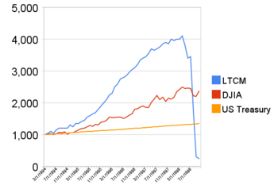

## Table of Contents

## What is Long-Term Capital Management (LTCM)?

Long-Term Capital Management, often called LTCM, was a hedge fund started in 1994 by John Meriwether, a former bond trader from Salomon Brothers. The fund was known for hiring very smart people, including two Nobel Prize winners, Myron Scholes and Robert C. Merton. LTCM used complicated math to make bets on how the prices of bonds and other financial things would change. They thought their strategies were safe because they spread their bets across many different investments.

However, in 1998, LTCM faced big problems. Russia defaulted on its debts, which caused a lot of chaos in the financial markets. This made many of LTCM's bets go wrong at the same time. The fund lost a lot of money very quickly, and it looked like it might collapse. This was scary because LTCM had borrowed a lot of money to make its bets, and if it failed, it could hurt the whole financial system. In the end, a group of big banks had to step in and give LTCM money to keep it from failing. This event showed how risky and connected the world of finance can be.

## Who founded Long-Term Capital Management?

Long-Term Capital Management was started by John Meriwether. He used to work at Salomon Brothers as a bond trader before he decided to create his own hedge fund in 1994. John was known for being really smart and good at his job, which is why he was able to bring together a team of talented people.

The team at LTCM included two Nobel Prize winners, Myron Scholes and Robert C. Merton. These guys were famous for their work in finance and helped LTCM use fancy math to make investment decisions. They thought their strategies were safe because they spread their bets across many different investments, but things didn't turn out as planned.

## When was Long-Term Capital Management established?

Long-Term Capital Management, or LTCM, was set up in 1994. It was started by John Meriwether, who used to work at Salomon Brothers. John was really good at his job and wanted to start his own [hedge fund](/wiki/hedge-fund-trading-strategies). He brought together a team of smart people, including two Nobel Prize winners, Myron Scholes and Robert C. Merton. These guys were known for their work in finance and helped LTCM use complicated math to make investment choices.

LTCM thought their strategies were safe because they spread their bets across many different investments. But in 1998, things went wrong. Russia stopped paying its debts, which caused a lot of chaos in the financial markets. This made many of LTCM's bets go bad at the same time. The fund lost a lot of money very quickly, and it looked like it might fail. Because LTCM had borrowed a lot of money to make its bets, its failure could have hurt the whole financial system. In the end, a group of big banks had to step in and give LTCM money to keep it from collapsing.

## What was the investment strategy of LTCM?

LTCM's investment strategy was based on using fancy math to make bets on how the prices of bonds and other financial things would change. They thought their approach was safe because they spread their bets across many different investments. This was called "[arbitrage](/wiki/arbitrage)," where they tried to take advantage of small differences in prices between similar financial products. They believed that these small differences would eventually even out, and they could make money from that.

However, their strategy depended a lot on things staying calm in the markets. If something big happened, like a country not paying its debts, it could mess up their plans. That's exactly what happened in 1998 when Russia defaulted on its debts. This caused a lot of chaos in the financial markets, and many of LTCM's bets went wrong at the same time. Because LTCM had borrowed a lot of money to make these bets, their losses were huge and very quick.

## How did LTCM achieve early success?

LTCM achieved early success by using fancy math to make smart bets on how the prices of bonds and other financial things would change. They had a team of really smart people, including two Nobel Prize winners, Myron Scholes and Robert C. Merton. These guys helped LTCM figure out how to take advantage of small differences in prices between similar financial products. This strategy, called "arbitrage," worked well because LTCM spread their bets across many different investments. By doing this, they thought they were safe because the small price differences would eventually even out, and they could make money from that.

The early years were good for LTCM. They made a lot of money and became famous in the financial world. Investors trusted them because of their smart strategies and the big names on their team. LTCM's success showed that their approach could work, at least when things were calm in the markets. But their strategy depended a lot on things staying stable, and that's where the trouble started when big changes happened in the financial world.

## What led to the downfall of LTCM?

The downfall of LTCM started when Russia stopped paying its debts in 1998. This caused a lot of chaos in the financial markets. LTCM had made a lot of bets that things would stay calm, but suddenly everything got very messy. Many of their bets went wrong at the same time, and they lost a lot of money very quickly. LTCM had borrowed a lot of money to make these bets, so their losses were huge.

Because LTCM was so big and had borrowed so much, their failure could have hurt the whole financial system. If LTCM went bankrupt, it could have caused a lot of problems for other banks and investors. To stop this from happening, a group of big banks had to step in and give LTCM money to keep it from collapsing. This event showed everyone how risky and connected the world of finance can be, and it made people think more about how to manage risks in the future.

## What were the key events during the LTCM crisis in 1998?

The LTCM crisis started when Russia stopped paying its debts in August 1998. This made the financial markets very chaotic. LTCM had made a lot of bets that things would stay calm, but suddenly everything got very messy. Many of their bets went wrong at the same time, and they lost a lot of money very quickly. LTCM had borrowed a lot of money to make these bets, so their losses were huge. This was a big problem because LTCM was very big and had a lot of connections with other banks and investors.

By September 1998, LTCM was in big trouble. They were about to go bankrupt, and this could have hurt the whole financial system. If LTCM failed, it could have caused a lot of problems for other banks and investors. To stop this from happening, a group of big banks had to step in and give LTCM money to keep it from collapsing. This event showed everyone how risky and connected the world of finance can be. It made people think more about how to manage risks in the future and led to changes in how financial markets are watched and controlled.

## How did the Federal Reserve intervene in the LTCM crisis?

The Federal Reserve didn't directly give money to LTCM during the crisis, but they played a big role in making sure things didn't get out of control. They were worried that if LTCM went bankrupt, it could cause a lot of problems for the whole financial system. So, they encouraged a group of big banks to step in and help LTCM. The Fed told these banks that it was important to keep LTCM from failing because it could cause a lot of chaos.

The Fed also made sure that there was enough money in the financial system so that banks could lend to each other without too much trouble. This helped keep things calm and stopped the crisis from getting worse. By doing these things, the Federal Reserve helped make sure that the LTCM crisis didn't turn into a bigger disaster.

## What were the long-term impacts of the LTCM crisis on financial markets?

The LTCM crisis made people think a lot more about how risky and connected the financial world can be. It showed that if one big player like LTCM gets into trouble, it can cause problems for everyone. After the crisis, people started to be more careful about how much they borrowed and what kind of bets they made. They realized that even smart strategies can go wrong if the markets get too chaotic. This led to changes in how financial markets are watched and controlled, with more rules to make sure that big bets don't put the whole system at risk.

Another big change was that banks and investors started to pay more attention to managing risks. They began to use better tools and methods to understand and control the risks they were taking. The LTCM crisis also made people think about how important it is to have enough money in the financial system to keep things running smoothly, even during a crisis. Overall, the LTCM crisis taught the financial world a lot of lessons about being careful and prepared for unexpected events.

## What lessons can be learned from the LTCM failure?

The LTCM failure taught us that even very smart people can make big mistakes if they're not careful. LTCM used fancy math to make bets on how prices would change, but they didn't think about what would happen if the markets got really chaotic. They borrowed a lot of money to make these bets, and when things went wrong, they lost everything very quickly. This showed everyone that it's important to think about all the things that could go wrong, not just the things that are likely to happen.

Another big lesson from LTCM is that the financial world is very connected. If one big player like LTCM gets into trouble, it can cause problems for everyone else. This made people realize that they need to be more careful about how much they borrow and what kind of bets they make. It also led to new rules to make sure that big bets don't put the whole system at risk. Banks and investors started to use better tools to understand and control their risks, so they could be more prepared for unexpected events.

Overall, the LTCM failure was a big wake-up call for the financial world. It showed that being smart isn't enough if you're not also careful and prepared. It made people think more about managing risks and being ready for anything that could happen. This has helped make the financial system safer and more stable in the long run.

## How did LTCM's use of leverage contribute to its collapse?

LTCM used a lot of borrowed money, or leverage, to make its bets. They thought this was a good idea because it let them make bigger bets with less of their own money. But using so much leverage was risky. When LTCM's bets started going wrong, they lost a lot of money very quickly. Because they had borrowed so much, their losses were much bigger than if they had used less leverage. This made their problems a lot worse and pushed them towards collapse.

When Russia stopped paying its debts in 1998, it caused a lot of chaos in the financial markets. Many of LTCM's bets went wrong at the same time because of this chaos. Because LTCM had used so much leverage, their losses were huge. They couldn't pay back the money they had borrowed, and this put them in big trouble. If LTCM had used less leverage, they might have been able to handle the losses better. But because they had borrowed so much, their collapse was very fast and very bad.

## What regulatory changes were implemented post-LTCM to prevent similar crises?

After the LTCM crisis, people realized that they needed better rules to keep the financial system safe. One big change was that banks and investors had to be more careful about how much they borrowed. They had to follow new rules that made them keep more money on hand, so they could handle losses better if things went wrong. This was called increasing capital requirements. It meant that banks had to have more of their own money to cover their bets, instead of borrowing so much.

Another important change was that regulators started watching the financial markets more closely. They wanted to catch problems before they got too big. They set up new ways to check on big bets and make sure they weren't too risky. This helped to stop another crisis like LTCM from happening. Overall, the LTCM crisis made people think more about how to keep the financial system stable and safe, and these new rules were a big part of that.

## References & Further Reading

[1]: Lowenstein, R. (2001). [*"When Genius Failed: The Rise and Fall of Long-Term Capital Management."*](https://www.amazon.com/When-Genius-Failed-Long-Term-Management-ebook/dp/B000FC1KZC) Random House.

[2]: Patterson, S. (2013). [*"Dark Pools: The Rise of the Machine Traders and the Rigging of the U.S. Stock Market."*](https://www.amazon.com/Dark-Pools-Machine-Traders-Rigging/dp/0307887189) Crown Business.

[3]: Haugen, R. A. (1999). [*"The New Finance: The Case Against Efficient Markets."*](https://books.google.com/books/about/The_New_Finance.html?id=vNaeQgAACAAJ) Prentice Hall.

[4]: Aldridge, I. (2013). [*"High-Frequency Trading: A Practical Guide to Algorithmic Strategies and Trading Systems."*](https://books.google.com/books/about/High_Frequency_Trading.html?id=8QpIsVUMhmEC) Wiley.

[5]: Seides, T. (2016). [*"Soros on Soros: Staying Ahead of the Curve."*](https://www.wiley.com/en-us/Soros+on+Soros%3A+Staying+Ahead+of+the+Curve+-p-9780471119777) Wiley.

[6]: Lewis, M. (2015). [*"Flash Boys: A Wall Street Revolt."*](https://en.wikipedia.org/wiki/Flash_Boys) W. W. Norton & Company.

[7]: Chincarini, L. B., & Kim, D. (2006). [*"Quantitative Equity Portfolio Management: An Active Approach to Portfolio Construction and Management."*](https://www.mhebooklibrary.com/doi/book/10.1036/9781264268931) McGraw-Hill Education.