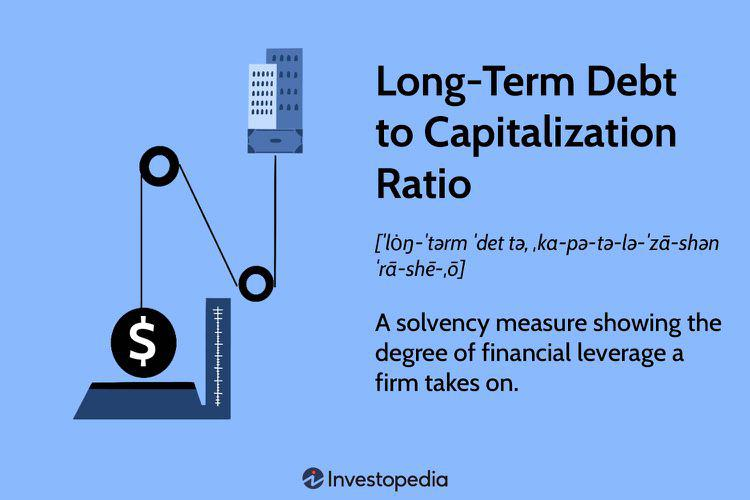

## Table of Contents

## What is the Long-Term Debt to Capitalization Ratio?

The Long-Term Debt to Capitalization Ratio is a financial metric that shows how much a company relies on long-term debt to finance its operations compared to its total capital. It is calculated by dividing the company's long-term debt by the sum of its long-term debt and shareholders' equity. This ratio helps investors and analysts understand the company's financial structure and its ability to meet long-term obligations.

A lower Long-Term Debt to Capitalization Ratio suggests that a company is using less debt and more equity to finance its operations, which generally indicates a healthier financial position. Conversely, a higher ratio means the company is more dependent on debt, which can be riskier because it must repay the debt with interest. This ratio is particularly useful for comparing companies within the same industry to see which ones manage their debt more effectively.

## How is the Long-Term Debt to Capitalization Ratio calculated?

The Long-Term Debt to Capitalization Ratio is calculated by dividing a company's long-term debt by the total of its long-term debt and shareholders' equity. Long-term debt includes loans and other financial obligations that are due more than one year from the date of the balance sheet. Shareholders' equity is the amount of money that would be returned to shareholders if all the company's assets were liquidated and all its debts were paid off.

This ratio helps people see how much a company uses debt compared to equity to run its business. A lower ratio means the company uses less debt and more equity, which is usually seen as safer. A higher ratio shows the company relies more on debt, which can be riskier because it has to pay back the debt with interest. By looking at this ratio, investors can understand how a company manages its money and compare it with other companies in the same industry.

## Why is the Long-Term Debt to Capitalization Ratio important for investors?

The Long-Term Debt to Capitalization Ratio is important for investors because it shows how a company is using debt to grow or run its business. If the ratio is low, it means the company is not using much debt and is relying more on money from shareholders. This can be a good sign because it means the company is not taking on a lot of risk. Investors like this because it suggests the company is financially stable and less likely to have trouble paying back what it owes.

On the other hand, a high Long-Term Debt to Capitalization Ratio can be a red flag for investors. It means the company is using a lot of debt to operate, which can be risky. If the company can't make enough money to pay back the debt and the interest, it could run into financial trouble. By looking at this ratio, investors can compare different companies and decide which ones are managing their debt well and which ones might be too risky.

## What does a high Long-Term Debt to Capitalization Ratio indicate about a company?

A high Long-Term Debt to Capitalization Ratio means that a company is using a lot of borrowed money to run its business. This can be risky because the company has to pay back the money it borrowed, plus interest. If the company doesn't make enough money to cover these payments, it could get into financial trouble. This might worry investors because it shows the company is depending a lot on debt, which can make it harder to handle if things go wrong.

On the other hand, sometimes a high ratio isn't always bad. If a company is using the borrowed money to grow or invest in new projects that will make more money in the future, it could be a good strategy. But it's important for the company to have a plan to pay back the debt. Investors need to look at the whole picture, like how the company is doing and what its plans are, to decide if a high ratio is a problem or not.

## What does a low Long-Term Debt to Capitalization Ratio suggest about a company's financial health?

A low Long-Term Debt to Capitalization Ratio suggests that a company is using less borrowed money and more of its own money to run its business. This is usually a good sign because it means the company is not taking on a lot of debt. When a company doesn't have much debt, it has less to pay back, which makes it easier to stay financially stable. Investors often see a low ratio as a positive thing because it shows the company is managing its money well and is less likely to run into financial trouble.

However, a very low ratio might also mean the company is not taking advantage of opportunities to grow. If a company could borrow money at a low [interest rate](/wiki/interest-rate-trading-strategies) to invest in new projects that would make more money, not doing so might mean they are missing out. So, while a low ratio generally suggests good financial health, it's important to look at the whole picture. Investors need to consider what the company is doing with its money and whether it's making smart choices about growth and investment.

## How does the Long-Term Debt to Capitalization Ratio differ from other debt ratios?

The Long-Term Debt to Capitalization Ratio is different from other debt ratios because it focuses on how much a company uses long-term debt compared to its total capital, which includes both debt and equity. Other common debt ratios, like the Debt to Equity Ratio, look at the total debt (both short-term and long-term) compared to equity. The Long-Term Debt to Capitalization Ratio gives a clearer picture of how a company is using long-term debt to finance its operations, which is important for understanding its long-term financial stability.

Another difference is with the Debt to Assets Ratio, which compares total debt to total assets. This ratio shows how much of a company's assets are financed by debt, but it doesn't separate long-term from short-term debt. The Long-Term Debt to Capitalization Ratio, on the other hand, specifically looks at long-term debt, which is more relevant for assessing a company's long-term financial health and its ability to meet long-term obligations. By focusing on long-term debt, this ratio helps investors understand the company's long-term financial strategy and risk.

## What industries typically have higher Long-Term Debt to Capitalization Ratios?

Some industries often have higher Long-Term Debt to Capitalization Ratios because they need a lot of money to start and keep running. For example, the utility industry, like companies that provide electricity or water, usually have high ratios. These companies need to build big and expensive things like power plants or water treatment facilities. They often borrow money to pay for these because it takes a long time to start making money from them. So, it's normal for utility companies to have more debt compared to their total capital.

Another industry with higher ratios is the telecommunications industry. Companies that provide phone and internet services need to spend a lot on building networks and buying equipment. This can cost billions of dollars, so they often use debt to finance these projects. Like utility companies, telecom companies expect to pay back the debt over many years as they start [earning](/wiki/earning-announcement) money from their services. So, a higher Long-Term Debt to Capitalization Ratio is common in this industry too.

## How can changes in the Long-Term Debt to Capitalization Ratio over time be interpreted?

Changes in the Long-Term Debt to Capitalization Ratio over time can tell us a lot about how a company is managing its money. If the ratio goes up, it means the company is using more long-term debt compared to its total capital. This could happen if the company is borrowing more money to grow or invest in new projects. It might be a good sign if the company is making smart investments that will pay off in the future. But if the company is just borrowing more money because it's having trouble making enough money to cover its costs, a rising ratio could be a warning sign that the company is getting riskier.

On the other hand, if the ratio goes down over time, it means the company is using less long-term debt and relying more on its own money or equity. This usually shows that the company is becoming more financially stable because it has less debt to pay back. It might be using its profits to pay down debt or it might be raising more money from shareholders. A falling ratio is often seen as a positive sign by investors because it suggests the company is managing its money well. But if the ratio is going down because the company is not investing in new projects, it might mean the company is not growing as much as it could.

## What are the limitations of using the Long-Term Debt to Capitalization Ratio as a financial metric?

One limitation of the Long-Term Debt to Capitalization Ratio is that it doesn't tell the whole story about a company's financial health. It only looks at long-term debt and doesn't consider short-term debt, which can also be important. If a company has a lot of short-term debt, it might still be in a risky position even if its Long-Term Debt to Capitalization Ratio is low. Also, this ratio doesn't show how well a company is making money or if it can pay back its debts. So, it's just one piece of the puzzle and should be used with other financial measures to get a full picture.

Another limitation is that the Long-Term Debt to Capitalization Ratio can be different depending on the industry. Some industries, like utilities or telecom, need a lot of money to build big things and might have higher ratios without it being a problem. If you compare a company in one of these industries to a company in a different industry, the ratio might not be fair. It's important to compare companies in the same industry to see if a high or low ratio is normal or not. Also, this ratio doesn't tell you about the interest rates on the debt or how long the company has to pay it back, which can make a big difference in how risky the debt is.

## How do analysts adjust the Long-Term Debt to Capitalization Ratio for more accurate analysis?

Analysts sometimes make changes to the Long-Term Debt to Capitalization Ratio to get a better understanding of a company's financial health. They might add short-term debt to the long-term debt in the calculation if they think it's important to look at all the debt the company has. This gives a more complete picture of how much the company is borrowing. Also, analysts might take out any cash the company has because this can be used to pay off debt, making the company less risky.

Another way analysts adjust the ratio is by looking at different parts of the company's debt. They might separate the debt into different types, like fixed-rate debt and variable-rate debt, because these can have different risks. They could also consider how soon the debt needs to be paid back. If the debt is due soon, it might be riskier than debt that the company has a long time to pay back. By making these adjustments, analysts can get a clearer idea of how well the company is managing its money and how risky its debt really is.

## Can the Long-Term Debt to Capitalization Ratio be used to predict financial distress?

The Long-Term Debt to Capitalization Ratio can give us some clues about whether a company might face financial trouble, but it's not a perfect tool for predicting financial distress. If the ratio is high, it means the company is using a lot of borrowed money to run its business. This can be risky because the company has to pay back the money it borrowed, plus interest. If the company can't make enough money to cover these payments, it might struggle financially. So, a high ratio could be a warning sign that the company might face financial distress if things don't go well.

However, the Long-Term Debt to Capitalization Ratio alone isn't enough to predict financial distress. It doesn't show everything about a company's financial health. For example, it doesn't tell us about the company's short-term debt or how well it's making money. Also, some industries normally have higher ratios, so what might be a problem for one company might be normal for another. To really understand if a company is at risk of financial distress, analysts need to look at many other financial measures and the company's overall situation.

## How does the Long-Term Debt to Capitalization Ratio correlate with a company's cost of capital?

The Long-Term Debt to Capitalization Ratio can affect a company's cost of capital. The cost of capital is the total cost of all the money a company uses to run its business, including the interest it pays on debt and the returns it needs to give to shareholders. When a company has a higher Long-Term Debt to Capitalization Ratio, it means it is using more borrowed money. This can lower the cost of capital because debt usually costs less than equity. Debt interest rates are often lower than the returns shareholders expect, so using more debt can make the overall cost of capital go down.

However, using a lot of debt also comes with risks. If the Long-Term Debt to Capitalization Ratio is very high, lenders might see the company as riskier. They might charge higher interest rates to cover this risk, which can make the cost of capital go up. Also, if the company can't pay back its debt, it might have to pay even more in the future. So, while a higher ratio can lower the cost of capital in some cases, it can also make it go up if the company is seen as too risky. Companies need to find a good balance to keep their cost of capital as low as possible while managing their debt safely.

## What is the understanding of Debt and Capitalization Ratios?

Debt ratios are critical in evaluating a company's financial structure, offering valuable insights into its leverage and the level of risk associated with its financial commitments. At its core, a debt ratio measures the proportion of a company's total assets that are financed by debt. This ratio is expressed as follows:

$$
\text{Debt Ratio} = \frac{\text{Total Debt}}{\text{Total Assets}}
$$

A higher debt ratio suggests that a larger portion of the company's assets are financed through debt, indicating greater leverage and potentially higher financial risk. For investors and analysts, understanding a firm's debt levels is crucial in assessing the company's ability to meet its financial obligations and its long-term solvency.

One of the most prominent debt ratios is the debt-to-equity (D/E) ratio. This ratio provides a comparison of a company's total debt to its shareholder equity, highlighting its dependency on external financing versus internal funding:

$$
\text{Debt-to-Equity Ratio} = \frac{\text{Total Debt}}{\text{Shareholder's Equity}}
$$

A high debt-to-equity ratio generally signals higher leverage, suggesting that a company may be more reliant on debt financing. While this can potentially amplify returns during periods of growth, it also exposes the company to increased risk during economic downturns, as it must service its debt obligations regardless of its financial performance.

The capitalization ratio provides another lens through which to view a company's capital structure. It measures the proportion of debt in a company's total capitalization, which is the sum of its debt and equity. The formula is as follows:

$$
\text{Capitalization Ratio} = \frac{\text{Long-term Debt}}{\text{Long-term Debt} + \text{Shareholder's Equity}}
$$

This ratio enables the evaluation of the degree to which a firm is using debt to finance its operations compared to equity. A higher capitalization ratio indicates a greater reliance on debt, offering both the potential for enhanced profitability due to the tax benefits of debt and heightened risk due to fixed interest obligations.

Analyzing these ratios helps investors assess a firm's risk profile. Companies with elevated debt levels may have less financial flexibility and greater vulnerability to economic fluctuations. Conversely, firms with lower debt ratios might have a more conservative capital structure, potentially lacking the growth potential that leverage can provide but offering greater stability in uncertain markets. Understanding these financial indicators plays a pivotal role in forming a comprehensive view of a company's financial health and informs investment decisions.

## What is the Importance of Financial Calculations in Algo Trading?

Algorithmic trading, also known as algo trading, uses sophisticated mathematical models to make rapid trading decisions based on data analysis. Financial calculations, particularly those involving debt and leverage ratios, are crucial in this context as they offer insights into market risks. These ratios help determine the sustainability of a company's financial structure by assessing its level of debt relative to its equity or assets.

In algo trading, financial metrics such as the debt-to-equity ratio and capitalization ratio are indispensable. The debt-to-equity ratio is calculated as:

$$
\text{Debt-to-Equity Ratio} = \frac{\text{Total Debt}}{\text{Total Equity}}
$$

This ratio provides a snapshot of a company's financial leverage, helping traders evaluate potential risk and return dynamics. Higher leverage can increase potential returns as well as risks, a critical consideration for trading algorithms.

Algorithmic models dynamically integrate these financial ratios, adjusting strategies based on real-time market data. For instance, an increase in a firm's leverage ratio might trigger a reduction in position size within a trading strategy to mitigate potential risk exposure. This adaptability allows for responsive risk management, a key advantage in volatile markets.

Understanding these financial metrics is fundamental for enhancing trading models. Improved risk management and decision-making efficiency result from accurately assessing financial ratios. For algo traders, the integration of financial calculations facilitates optimized capital allocation. By systematically leveraging these metrics, traders can achieve superior investment outcomes, balancing risk and potential profits intelligently.

Incorporating these calculations into [algorithmic trading](/wiki/algorithmic-trading) systems allows for more informed strategy development. It ensures that trading activities align with the changing financial landscapes, leading to more robust and resilient trading performances. As these systems continue to evolve, the significance of such financial computations in fine-tuning strategies and managing risks is set to grow, thereby delivering competitive edges in the trading arena.

## How do debt and leverage ratios influence trading strategies?

Debt ratios are critical tools for traders assessing a company’s financial health and leverage risks. High debt ratios can signal over-leverage, implying that the company has more debt relative to its equity. Such companies might face financial strain, particularly in economic downturns or periods of high-interest rates, as they must fulfill debt obligations regardless of their revenue. For traders, this necessitates cautious investment strategies. 

A high debt-to-equity ratio, for example, suggests that the company relies heavily on borrowed funds, which can amplify profits in good times but also increases vulnerability during downturns. The formula for the debt-to-equity ratio is represented as:

$$
\text{Debt-to-Equity Ratio} = \frac{\text{Total Debt}}{\text{Shareholders' Equity}}
$$

Traders utilize these metrics to adjust leverage in their portfolios, optimally balancing risk against potential returns. By analyzing the leverage within a firm's capital structure through these ratios, traders can make informed decisions on how much of their capital to allocate. 

Algorithmic trading systems are particularly adept at utilizing financial ratios to dynamically adjust strategies. These systems can modify trading behaviors in real-time, responding to changes in a company’s financial health signaled by shifts in debt metrics. For instance, an algorithm might increase short positions or reduce exposure when debt ratios exceed a certain threshold, indicating heightened risk.

Python provides tools to automate these calculations and strategy adjustments. Here's a simple code snippet that calculates the debt-to-equity ratio and triggers an action if a company is overly leveraged:

```python
def calculate_de_ratio(total_debt, equity):
    return total_debt / equity

def trading_decision(de_ratio, threshold):
    if de_ratio > threshold:
        return "Reduce exposure or short sell"
    else:
        return "Maintain or increase position"

# Example usage
total_debt = 5000000  # Example value
equity = 2000000  # Example value
threshold = 2.5  # Set based on risk tolerance

de_ratio = calculate_de_ratio(total_debt, equity)
decision = trading_decision(de_ratio, threshold)

print(f"Debt-to-Equity Ratio: {de_ratio:.2f}")
print(f"Trading Decision: {decision}")
```

This snippet automates the decision-making process, ensuring traders can respond swiftly to financial changes. Crafting strategies based on these ratios can enable traders to achieve robust performance, even amid volatile market conditions, by ensuring positions are aligned with the underlying financial health of the companies in their portfolio.

## References & Further Reading

[1]: ["Financial Ratios for Executives: How to Assess Company Strength, Fix Problems, and Make Better Decisions"](https://link.springer.com/book/10.1007/978-1-4842-0731-4) by Michael Rist, Jacob M. Lammert, and Jacqueline Switzer

[2]: ["Corporate Finance"](https://www.investopedia.com/terms/c/corporatefinance.asp) by Stephen A. Ross, Randolph W. Westerfield, and Jeffrey F. Jaffe

[3]: ["Algorithmic Trading: Winning Strategies and Their Rationale"](https://books.google.com/books/about/Algorithmic_Trading.html?id=WAlFDwAAQBAJ) by Ernest P. Chan

[4]: Modigliani, F., & Miller, M. H. (1958). ["The Cost of Capital, Corporation Finance and the Theory of Investment."](https://www.jstor.org/stable/1812919) The American Economic Review, 48(3), 261-297.

[5]: ["The Little Book that Still Beats the Market"](https://www.amazon.com/Little-Book-Still-Beats-Market/dp/0470624159) by Joel Greenblatt

[6]: ["Risk Management and Financial Institutions"](https://www.amazon.com/Management-Financial-Institutions-Wiley-Finance/dp/1119932483) by John C. Hull