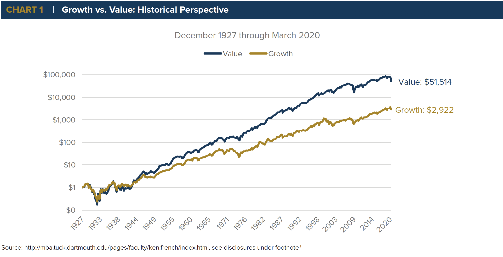

## Table of Contents

## What is long-term growth investing?

Long-term growth investing is when you buy stocks or other investments and hold onto them for a long time, like many years or even decades. The goal is to make money as the value of these investments grows over time. People who do this kind of investing believe that even though the stock market can go up and down a lot in the short term, it will generally go up over many years. They pick companies that they think will do well in the future and keep their investments in those companies for a long time.

This type of investing can be good because it helps you avoid the stress of trying to guess what the market will do every day. Instead, you focus on the big picture and the long-term potential of your investments. However, it requires patience and a belief that the companies you invest in will keep growing. It's important to do a lot of research and pick companies that have strong business models and good chances of success in the future.

## What is value investing?

Value investing is a way of picking stocks that are thought to be priced lower than they should be. People who do value investing look for companies that the market has overlooked or undervalued. They believe that if they buy these stocks at a low price, they can make a good profit when the market realizes the true value of the company and the stock price goes up.

To find these undervalued stocks, value investors look at things like the company's earnings, its book value, and other financial numbers. They compare these numbers to the stock's current price to see if it's a good deal. The idea is to buy the stock when it's cheap and hold onto it until the market corrects the price, which could take some time. Value investing needs patience and a good understanding of a company's real worth, but it can lead to big rewards if you pick the right stocks.

## How do long-term growth and value investing differ?

Long-term growth investing and value investing are two different ways to pick stocks, but they have different goals. Long-term growth investing is about finding companies that will grow a lot over many years. People who do this kind of investing buy stocks and keep them for a long time, hoping that the company will become more valuable as it grows. They focus on the future potential of the company and are willing to wait for years to see their investment grow.

Value investing, on the other hand, is about finding stocks that are cheaper than they should be. Value investors look for companies that the market has not priced correctly. They buy these stocks at a low price, thinking that the market will eventually realize the true value of the company and the stock price will go up. Value investing is more about finding bargains and can involve holding onto stocks until the market corrects the price, which might not take as long as waiting for a company to grow over many years.

Both strategies need patience and research, but they focus on different things. Long-term growth investors look at a company's future growth, while value investors look at whether the current stock price is a good deal. Each approach can be successful, but they suit different types of investors and different investment goals.

## What are the key principles of long-term growth investing?

Long-term growth investing is all about finding companies that will grow a lot over many years. People who do this kind of investing look for businesses that have strong potential to increase their earnings and value in the future. They focus on things like new products, expanding into new markets, and having good management teams. The idea is to buy stocks in these companies and hold onto them for a long time, even if the stock market goes up and down a lot in the short term. The belief is that over many years, the stock price will go up as the company grows.

To be good at long-term growth investing, you need to be patient and believe in the future of the companies you invest in. It's important to do a lot of research and pick companies that have a clear plan for growth. This means looking at the company's financial health, its industry, and how it's doing compared to other companies. Long-term growth investors are not worried about short-term changes in the stock market. Instead, they focus on the big picture and the long-term potential of their investments. This approach can lead to big rewards, but it requires a lot of patience and a strong belief in the companies you choose.

## What are the key principles of value investing?

Value investing is about finding stocks that are cheaper than they should be. People who do value investing look for companies that the market has not priced correctly. They believe that if they buy these stocks at a low price, they can make a good profit when the market realizes the true value of the company and the stock price goes up. To find these undervalued stocks, value investors look at things like the company's earnings, its book value, and other financial numbers. They compare these numbers to the stock's current price to see if it's a good deal.

The idea is to buy the stock when it's cheap and hold onto it until the market corrects the price. This might take some time, so value investing needs patience and a good understanding of a company's real worth. Value investors are not worried about short-term changes in the stock market. Instead, they focus on finding bargains and waiting for the market to recognize the true value of the company. This approach can lead to big rewards if you pick the right stocks, but it requires careful research and a belief that the market will eventually get the price right.

## How can an investor identify a company with long-term growth potential?

To find a company with long-term growth potential, an investor should look at the company's business model and see if it can keep growing over many years. This means checking if the company has new products or services that people will want in the future. It's also important to see if the company can grow into new markets or countries. Investors should look at the company's financial health, like its earnings and how much money it makes. A company that is making more money each year and has a plan to keep doing that is a good sign of long-term growth.

Another thing to look at is the company's management team. A good team can make smart decisions that help the company grow. Investors should also think about the industry the company is in. Some industries, like technology or healthcare, have more chances to grow than others. It's helpful to compare the company to others in its industry to see if it's doing better. By looking at all these things, an investor can get a good idea of whether a company has the potential to grow a lot over the long term.

## What metrics should be used to determine if a stock is undervalued?

To find out if a stock is undervalued, investors often look at a few important numbers. One key metric is the price-to-earnings ratio (P/E ratio). This tells you how much you're paying for each dollar of the company's earnings. A lower P/E ratio than the industry average might mean the stock is undervalued. Another important number is the price-to-book ratio (P/B ratio). This compares the stock's market price to its book value, which is what the company would be worth if it sold all its assets and paid off all its debts. A P/B ratio below 1 can suggest that the stock is undervalued.

Another useful metric is the dividend yield. This is how much the company pays out in dividends each year compared to its stock price. A high dividend yield compared to other companies in the same industry can be a sign that the stock is undervalued. Investors also look at the company's debt levels and its ability to generate cash flow. If a company has low debt and strong cash flow, it might be undervalued if its stock price doesn't reflect these strengths. By looking at these metrics, investors can get a better idea of whether a stock is priced lower than it should be.

## Can long-term growth and value investing strategies be combined? If so, how?

Yes, long-term growth and value investing strategies can be combined. This means an investor can look for companies that not only have the potential to grow a lot over many years but are also priced lower than they should be right now. By doing this, the investor can buy stocks at a good price and hold them for a long time, hoping that the company will grow and the stock price will go up even more. To do this, the investor needs to look at both the future growth potential of the company and whether its current stock price is a good deal.

Combining these strategies involves a lot of research. The investor needs to check the company's earnings, its book value, and other financial numbers to see if the stock is undervalued. At the same time, they need to look at the company's business model, its plans for new products or markets, and its financial health to see if it has strong growth potential. By finding companies that meet both these criteria, an investor can use a blended approach that aims to get the benefits of both long-term growth and value investing. This can lead to big rewards if the right stocks are picked, but it requires patience and a good understanding of the companies being invested in.

## What are some historical examples of successful long-term growth and value investments?

One famous example of a successful long-term growth investment is Amazon. People who bought Amazon stock when it first went public in 1997 and held onto it for many years saw their investment grow a lot. Amazon started as an online bookstore but kept growing into new areas like electronics, groceries, and cloud computing. Even though the stock price went up and down a lot in the short term, it kept going up over the long term as the company grew bigger and more successful. Investors who believed in Amazon's future and were patient made a lot of money.

A good example of a successful value investment is when Warren Buffett bought shares in Coca-Cola in the late 1980s. At that time, Coca-Cola's stock price was low compared to its earnings and other financial numbers. Buffett saw that the company was undervalued and bought a lot of shares. Over the years, Coca-Cola's stock price went up as the market realized its true value. Buffett's patience and belief in the company paid off, and his investment in Coca-Cola became one of his most successful value investments.

Another example that combines both long-term growth and value investing is Apple. In the late 1990s and early 2000s, Apple was seen as undervalued because its stock price was low compared to its potential. Investors who bought Apple stock at that time and held onto it for many years saw huge growth. Apple kept coming out with new products like the iPod, iPhone, and iPad, which helped the company grow a lot. People who saw both the value and the growth potential in Apple made a lot of money over the long term.

## How does market timing affect long-term growth and value investing strategies?

Market timing is when people try to guess when to buy and sell stocks to make the most money. This can be hard and risky, especially for long-term growth and value investing. Long-term growth investors usually don't worry about market timing. They believe that if they pick good companies with strong growth potential, the stock price will go up over many years, no matter what happens in the short term. Trying to time the market can make them miss out on the big growth that happens over time. It's better for them to focus on the company's future and hold onto their investments for a long time.

Value investors also don't usually focus on market timing. They look for stocks that are cheaper than they should be and buy them, hoping the price will go up when the market realizes the true value of the company. If value investors try to time the market, they might miss out on buying good stocks at low prices. Instead, they should do their research and buy undervalued stocks when they find them, then hold onto them until the market corrects the price. Both long-term growth and value investing work best when investors ignore short-term market changes and focus on the long-term potential of their investments.

## What are the common pitfalls and risks associated with long-term growth and value investing?

Long-term growth investing can be risky because it's hard to know for sure which companies will grow a lot in the future. Sometimes, a company that looks like it will do well might not grow as expected. This can happen if the company's new products don't sell well, or if the industry it's in changes a lot. Also, long-term growth investors might hold onto a stock for a long time, even if it's not doing well, hoping it will eventually go up. This can lead to big losses if the company never grows like they thought it would. Another risk is that the stock market can be unpredictable, and even good companies can see their stock prices go down a lot in the short term.

Value investing also has its own set of risks. One big problem is that it can be hard to tell if a stock is really undervalued or if it's cheap for a good reason. Sometimes, a company might look like a good deal, but it could have big problems that make it hard for the stock price to go up. Value investors might also buy a stock and then have to wait a long time for the market to realize its true value. During this time, the stock price could go down even more, and the investor might lose money. Both long-term growth and value investing need a lot of patience and research, and there's always a chance that things won't turn out as planned.

## How should an investor adjust their long-term growth and value investing strategy during different economic cycles?

During different economic cycles, an investor needs to be smart about how they use long-term growth and value investing strategies. In a strong economy, when businesses are doing well and people are spending money, long-term growth investing can be a good choice. This is because companies with good growth potential are more likely to do well and grow even more. Investors can look for companies that are coming out with new products or expanding into new markets. On the other hand, value investing can also work well in a strong economy, but investors need to be careful. They should look for companies that are undervalued but still have strong fundamentals, because the market might be pricing some stocks higher than they should be.

In a weak economy, when businesses are struggling and people are not spending as much, both strategies need to be adjusted. For long-term growth investing, it's important to pick companies that can still grow even when times are tough. These might be companies in industries that are less affected by economic downturns, like healthcare or utilities. Value investing can be a good strategy in a weak economy because more stocks might be undervalued. Investors can find good deals on stocks that the market has overlooked, but they need to make sure the companies they pick can survive the downturn and come out stronger on the other side. By being flexible and adjusting their strategies based on the economic cycle, investors can make the most of their long-term growth and value investing.

## What is Understanding Value Investing?

Value investing is a systematic investment strategy focused on identifying and investing in stocks that are undervalued by the market. These stocks have prices perceived to be lower than their intrinsic worth, thus providing an opportunity for investors to purchase them at a "discount". The aim is to realize gains when the market eventually recognizes the true value of these undervalued securities, leading to price correction.

### Key Metrics Used in Identifying Value Stocks:

1. **Price-to-Earnings (P/E) Ratio:** This ratio is calculated as the market price per share divided by the earnings per share (EPS). A lower P/E ratio may indicate that a stock is undervalued:
$$
   \text{P/E Ratio} = \frac{\text{Market Price per Share}}{\text{Earnings per Share}}

$$

   A low P/E ratio compared to industry averages or historical valuations suggests that the stock may be undervalued.

2. **Dividend Yield:** This metric measures how much a company pays out in dividends each year relative to its stock price, providing insights into the income-generating potential of the stock:
$$
   \text{Dividend Yield} = \frac{\text{Annual Dividends per Share}}{\text{Price per Share}}

$$

   High dividend yields can indicate good value, especially if sustainable.

3. **Price-to-Book (P/B) Ratio:** This ratio compares a firm's market value to its book value, calculated as:
$$
   \text{P/B Ratio} = \frac{\text{Market Value of Equity}}{\text{Book Value of Equity}}

$$

   Stocks with a P/B ratio below one may be undervalued, as the market is pricing the company's assets below their actual worth.

4. **Debt-to-Equity (D/E) Ratio:** This ratio indicates the proportion of debt used to finance the company's assets, critical for assessing financial risk:
$$
   \text{D/E Ratio} = \frac{\text{Total Liabilities}}{\text{Shareholders' Equity}}

$$

   A lower D/E ratio is generally preferred when identifying stable, undervalued investments.

### Long-Term Nature of Value Investing:

Value investing is inherently long-term, relying on the assumption that market inefficiencies will correct over time to reflect the true intrinsic value of a stock. This strategy demands patience as market corrections may take months or even years. During this period, external factors such as economic conditions, market trends, and company performance can influence stock prices. Value investors must be steadfast, relying on thorough financial analysis and fundamental research to inform their decisions. Warren Buffett, a prominent advocate of value investing, famously illustrates the necessity for patience by focusing on businesses he believes will be robust and profitable in the long run, regardless of current market sentiments.

The viability of value investing depends on the core belief that the intrinsic value of a stock will eventually be recognized by the broader market, resulting in substantial capital gains for patient investors.

## Can Algorithmic Trading be Used for Long-Term Growth?

Algorithmic trading is a mechanism that uses computer programs to execute trading decisions based on pre-defined criteria. This approach has transformed investment strategies by leveraging speed, precision, and efficiency far beyond human capability. In the context of long-term growth, [algorithmic trading](/wiki/algorithmic-trading) models are particularly valuable for optimizing strategies by creating portfolios that consistently outperform the market while minimizing risks associated with human biases and emotional decisions.

The efficiency gains associated with algorithmic trading stem from several core capabilities. First, algorithms can process vast amounts of data at speeds unattainable by human traders, instantly identifying opportunities for portfolio optimization. Next, algorithms can execute orders more rapidly and at better prices than traditional methods, thanks to their ability to respond immediately to market changes. Finally, they help in mitigating emotional biases — such as panic selling during market dips — by strictly adhering to objectively defined parameters.

In long-term growth strategies, key financial ratios guide the development of algorithmic models. The Sharpe ratio, a measure of risk-adjusted return, is one vital component, calculated as follows:

$$
\text{Sharpe Ratio} = \frac{E[R_p - R_f]}{\sigma_p}
$$

Where:
- $E[R_p - R_f]$ is the expected excess return of the portfolio over the risk-free rate,
- $\sigma_p$ is the standard deviation of the portfolio's excess return.

This ratio helps assess how much excess return is being received for the extra [volatility](/wiki/volatility-trading-strategies) endured by holding a riskier asset.

Similarly, the Treynor ratio is employed to gauge returns relative to systemic risk instead of total risk, using the formula:

$$
\text{Treynor Ratio} = \frac{E[R_p - R_f]}{\beta_p}
$$

Here:
- $\beta_p$ represents the systematic risk of the portfolio.

The Sortino ratio is another important metric, focusing on downside deviation, which is more relevant for investors concerned with reducing losses. It is calculated as:

$$
\text{Sortino Ratio} = \frac{E[R_p - R_f]}{DR}
$$

Where:
- $DR$ signifies the downside risk.

By leveraging these advanced metrics, algorithms can construct and adjust portfolios that maximize returns for given levels of risk, thereby ensuring long-term growth. The disciplined approach of algorithmic trading eliminates common psychological pitfalls, providing a reliable asset management framework that aligns with contemporary investment goals.

## References & Further Reading

1. **Foundational Texts**  
   - *The Intelligent Investor* by Benjamin Graham: A seminal work on value investing, essential for understanding the principles of identifying undervalued stocks.  
   - *Security Analysis* by Benjamin Graham and David Dodd: This text provides detailed insights into financial analysis, crucial for evaluating investment opportunities.  
   - *Common Stocks and Uncommon Profits* by Philip Fisher: Fisher's work complements traditional value investing with a focus on growth potential.  

2. **Academic Papers**  
   - "The Cross-Section of Expected Stock Returns" by Eugene F. Fama and Kenneth R. French: This paper provides a comprehensive analysis of stock returns, introducing factors such as size and value that influence returns.  
   - "Value and Growth: What Drives Stock Returns?" by Aswath Damodaran: An exploration of the differences between value and growth investing, and their respective impacts on stock performance.  
   - "Algorithmic Trading and Information" by Terrence Hendershott, Charles M. Jones, and Albert J. Menkveld: This study highlights the role of algorithmic trading in market efficiency and information dissemination.  

3. **Practical Guides**  
   - *Algorithmic Trading: Winning Strategies and Their Rationale* by Ernie Chan: Offers practical strategies for developing and implementing algorithmic trading systems.  
   - *Quantitative Trading: How to Build Your Own Algorithmic Trading Business* by Ernie Chan: This guide is valuable for those interested in constructing their own quantitative investment strategies.  

4. **Online Resources**  
   - Investopedia's Value Investing Guide: A comprehensive resource for understanding the basics and advanced concepts of value investing. [Investopedia's Value Investing Guide](https://www.investopedia.com/articles/basics/09/warren-buffett-portfolio.asp)  
   - QuantStart's Algorithmic Trading Tutorials: Provides tutorials and insights into building algorithmic trading systems. [QuantStart](https://www.quantstart.com/articles)  

5. **Professional Bodies and Financial Advisors**  
   - CFA Institute: A global association for investment professionals providing resources and networking opportunities for those interested in finance and investment. [CFA Institute](https://www.cfainstitute.org)  
   - National Association of Investors Corporation (NAIC): Offers resources and support for investment clubs and individual investors. [NAIC](https://www.betterinvesting.org)  

These resources provide a comprehensive foundation for those interested in deepening their understanding of value investing and algorithmic trading.

