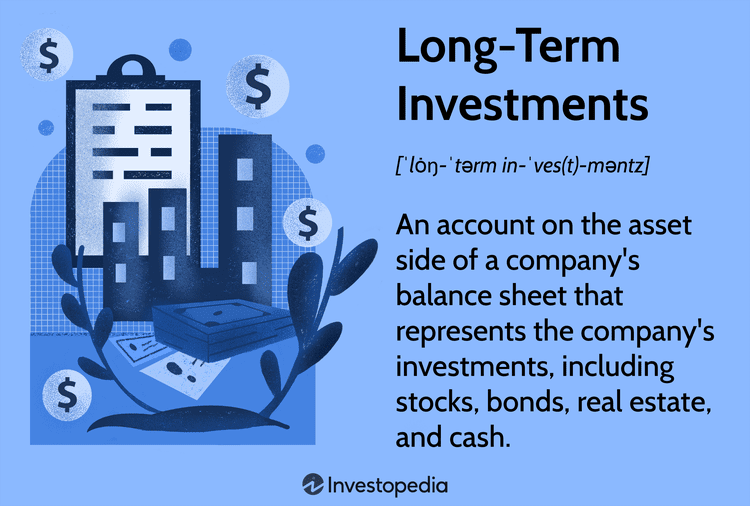

## Table of Contents

## What is long-term investing and why is it important for companies and individuals?

Long-term investing means putting money into things like stocks, bonds, or real estate and keeping it there for a long time, usually many years. It's different from short-term investing, where you might buy and sell quickly to make a quick profit. Long-term investing is about believing that over time, the things you invest in will grow in value and give you good returns.

It's important for both companies and individuals. For companies, long-term investing can help them grow and expand. When people invest in a company for the long term, it gives the company money to use for new projects, research, and other things that can make it bigger and better. For individuals, long-term investing can help them reach big goals like saving for retirement or buying a house. By keeping their money invested over a long time, they can benefit from the growth of their investments and build wealth slowly but surely.

## How does long-term investing differ from short-term investing?

Long-term investing and short-term investing are two different ways to use your money. Long-term investing means you keep your money in things like stocks or real estate for many years. You believe that over time, these things will grow and become worth more money. It's like planting a tree and waiting for it to grow big and strong. You don't check on it every day, but you know it's getting bigger and healthier over the years.

Short-term investing is different. It's like trying to buy and sell things quickly to make a profit. You might buy a stock and sell it a few days or weeks later if you think its price will go up in that short time. It's more about trying to guess what will happen in the market soon, rather than waiting for things to grow over many years. Short-term investing can be exciting, but it can also be risky because the market can change quickly.

Both ways of investing have their place, but they work differently. Long-term investing is often seen as safer because it gives your investments time to recover from any short-term ups and downs in the market. Short-term investing can make money faster, but it needs more attention and can be more stressful because you have to watch the market closely all the time.

## What are the key benefits of long-term investing for companies?

Long-term investing helps companies grow and become stronger. When people invest in a company for a long time, they give the company money it can use to do big things. The company can use this money to start new projects, do research, and expand into new areas. This helps the company get better at what it does and reach more customers. It's like giving a plant the water it needs to grow big and healthy over time.

Another benefit is that long-term investors are more patient. They don't get scared and pull their money out if the company has a bad quarter or if the stock market goes down for a little while. This patience gives the company time to work on long-term plans without worrying about losing money right away. It's like having a steady friend who supports you through good times and bad, helping the company stay focused on its big goals.

## What are the key benefits of long-term investing for individuals?

Long-term investing helps individuals save money for big goals like buying a house or retiring. When you invest your money for a long time, it can grow and become worth more. This is because you give your investments time to go up in value, even if they go down a little sometimes. It's like planting a seed and watching it grow into a big tree over many years. By keeping your money invested, you can build wealth slowly but surely, without having to worry about short-term ups and downs.

Another benefit is that long-term investing is usually less stressful. When you invest for the long term, you don't need to check your investments every day or worry about what the stock market is doing right now. You can relax and let your money grow over time. This makes it easier to stick to your plan and not make quick decisions that might hurt your savings. It's like taking a long, steady walk instead of running a sprint; you get to your goal in a calm and steady way.

## What are some common long-term investment vehicles for companies?

Companies often use long-term investment vehicles like stocks and bonds to grow and expand. When a company issues stocks, it's like selling pieces of itself to investors. These investors become part-owners and hope that the company will do well and their stocks will go up in value over time. Bonds are like loans that the company gets from investors. The company promises to pay back the money with interest after a long time, usually many years. Both stocks and bonds help companies get the money they need to do big projects and grow.

Real estate is another common long-term investment for companies. They might buy land or buildings to use for their business or to rent out to others. Over time, real estate can go up in value, and it can also bring in money from rent. This helps companies have a steady source of income and something valuable that can grow over the years. By investing in real estate, companies can build a strong base for their business and plan for the future.

## What are some common long-term investment vehicles for individuals?

Individuals often invest in stocks for the long term. Stocks are pieces of a company that you can buy. When you own stocks, you hope the company will do well and the value of your stocks will go up over time. Another common investment is bonds. Bonds are like loans you give to a company or the government. They promise to pay you back with interest after a long time. Both stocks and bonds can help you grow your money over many years.

Another popular long-term investment for individuals is real estate. This means buying a house or land. Over time, the value of the property can go up, and if you rent it out, it can also bring in regular money. Retirement accounts like 401(k)s and IRAs are also common. These are special accounts where you can put money to save for when you stop working. The money in these accounts can grow without you having to pay taxes on it until you take it out later. By investing in these ways, individuals can build wealth slowly and reach big goals like buying a home or retiring comfortably.

## How can companies develop a long-term investment strategy?

Companies can develop a long-term investment strategy by first setting clear goals for the future. They need to think about where they want to be in 5, 10, or even 20 years. This could mean growing their business, starting new projects, or expanding into new markets. Once they know their goals, they can decide how much money they need to invest and what kind of investments will help them reach those goals. For example, they might choose to invest in stocks, bonds, or real estate, depending on what fits their plans best.

To make sure their long-term investment strategy works, companies also need to keep an eye on how their investments are doing. They should regularly check if their investments are helping them get closer to their goals. If something isn't working, they might need to change their plan. But they should also be patient and not get scared by short-term ups and downs in the market. By sticking to their long-term plan and making smart adjustments when needed, companies can use their investments to grow and succeed over many years.

## How can individuals develop a long-term investment strategy?

Individuals can develop a long-term investment strategy by first figuring out what they want to achieve in the future. This could be saving for a house, paying for their kids' college, or retiring comfortably. Once they know their goals, they can decide how much money they need to save and what kind of investments will help them get there. For example, they might choose to invest in stocks, bonds, or real estate, depending on what fits their goals and how much risk they're willing to take. They should also think about how long they can keep their money invested, because long-term investing usually means holding onto investments for many years.

To make their long-term investment strategy work, individuals need to keep an eye on their investments and make sure they're on track to meet their goals. This doesn't mean checking every day, but rather reviewing their investments regularly, maybe once a year or so. If they see that something isn't working, they might need to adjust their plan. But they should also stay patient and not get scared by short-term changes in the market. By sticking to their long-term plan and making smart changes when needed, individuals can grow their money over time and reach their big goals.

## What are the risks associated with long-term investing and how can they be mitigated?

Long-term investing comes with some risks. One big risk is that the value of your investments can go down, sometimes a lot. This can happen because of things like a bad economy, problems with the company you invested in, or changes in the world that you didn't expect. Another risk is inflation, which means the money you save might not be worth as much in the future. And sometimes, you might need your money sooner than you planned, but if your investments are down, you might have to sell them at a loss.

To manage these risks, it's important to spread your money around in different types of investments. This is called diversification. If one investment goes down, others might go up, and that can help balance things out. You can also keep some money in safer investments like bonds, which don't go up and down as much as stocks. It's also smart to keep adding money to your investments over time, even if the market is down. This way, you can buy more when prices are low and less when prices are high. And finally, having a plan and sticking to it, even when the market gets scary, can help you stay on track and reach your long-term goals.

## How does diversification play a role in long-term investing for both companies and individuals?

Diversification is really important for both companies and individuals when they invest for the long term. It means spreading your money across different types of investments, like stocks, bonds, and real estate. By doing this, you're not putting all your eggs in one basket. If one investment goes down, others might go up, which can help balance things out. For companies, this can mean investing in different projects or markets, so if one doesn't do well, the others can still help the company grow. For individuals, it means not putting all their money in one stock or one type of investment, which can help protect their savings.

For companies, diversification can help them manage risk and keep growing steadily. If a company only invests in one thing and it fails, it could be in big trouble. But if it spreads its investments, it has a better chance of finding success in at least some areas. This way, the company can keep moving forward and reach its long-term goals. For individuals, diversification can help them feel more secure about their future. By spreading their money around, they're less likely to lose everything if one investment goes bad. This can help them stay calm and stick to their long-term plan, even when the market gets bumpy.

## What role do economic cycles play in long-term investing strategies?

Economic cycles are like the ups and downs that happen in the economy over time. They can affect long-term investing because they change how well different investments do. When the economy is doing well, businesses grow, people have more money to spend, and investments like stocks often go up. But when the economy is in a downturn, businesses might struggle, people might spend less, and investments can lose value. Long-term investors need to understand these cycles and not get scared when things go down. They should stick to their plan and keep investing, knowing that the economy will go back up eventually.

Even though economic cycles can make the market go up and down, they don't change the overall goal of long-term investing. The idea is to keep your money invested for many years, so you can ride out the bad times and benefit from the good times. By staying patient and not selling your investments during a downturn, you give them a chance to recover and grow when the economy gets better. This is why long-term investors often do better than those who try to time the market or only invest for the short term. They understand that while economic cycles can be tough, they're just part of the journey to reaching their long-term goals.

## How can advanced investors use tax strategies to enhance their long-term investment returns?

Advanced investors can use tax strategies to make their long-term investments grow even more. One way is by using tax-advantaged accounts like IRAs and 401(k)s. These accounts let you put money in without paying taxes right away. The money can grow without being taxed until you take it out, usually when you retire. This can make a big difference over many years because you keep more of your money working for you. Another way is by doing tax-loss harvesting. This means selling investments that have gone down in value to get a tax break, then using that money to buy similar investments. This can help lower your taxes while keeping your investment plan on track.

Another smart tax strategy is to hold onto investments for more than a year. In many places, if you sell an investment after holding it for over a year, you pay a lower tax rate on any profits. This is called the long-term capital gains tax rate, and it's usually less than what you'd pay if you sold the investment sooner. By planning to keep your investments for the long term, you can save on taxes and keep more of your money growing. These strategies can help advanced investors make the most of their long-term investments by keeping taxes from taking too big a bite out of their returns.

## What is the role of Algorithmic Trading in Long-Term Investments?

Algorithmic trading, also known as algo trading, employs computer algorithms to automate and optimize the management of trading portfolios. Traditionally, [algorithmic trading](/wiki/algorithmic-trading) has been seen as a tool primarily for short-term and high-frequency trading. However, it has increasingly found utility in enhancing long-term investment strategies by applying systematic data analysis and precise trade execution. This systematic approach aids in minimizing human error, optimizing transaction timing, and effectively managing complex market data over long periods.

One of the significant benefits of incorporating algorithmic trading into long-term investment strategies is its ability to continuously analyze vast data sets and adapt to market dynamics in real time. By applying statistical models and [machine learning](/wiki/machine-learning) techniques, algorithmic systems can identify patterns and trends that might be less perceptible to human investors. This capability allows long-term investors to make more informed decisions and potentially achieve higher returns.

In assessing the performance of long-term investment portfolios managed through algorithmic trading, certain key financial ratios become essential. The Sharpe Ratio is a widely used tool for understanding risk-adjusted returns. It is defined as:

$$
\text{Sharpe Ratio} = \frac{R_p - R_f}{\sigma_p}
$$

Where $R_p$ is the portfolio return, $R_f$ is the risk-free rate, and $\sigma_p$ is the standard deviation of the portfolio's excess return. This ratio helps investors determine whether the returns of a portfolio are due to smart investment decisions or excessive risk-taking.

Similarly, the Sortino Ratio is an adaptation of the Sharpe Ratio that focuses specifically on downside risk. It is calculated using:

$$
\text{Sortino Ratio} = \frac{R_p - R_f}{\sigma_d}
$$

Here, $\sigma_d$ represents the standard deviation of the portfolio's downside return. By concentrating on negative [volatility](/wiki/volatility-trading-strategies), the Sortino Ratio provides insight into how well the portfolio performs relative to riskier, loss-generating events.

The integration of algorithmic trading into long-term investment strategies can serve to enhance these performance metrics by systematically curating more balanced and risk-adjusted portfolios. With the ongoing evolution of algorithmic models and increased computational capabilities, the use of algorithms for long-term investing is likely to expand, offering viable pathways to sustainable financial growth.

## What is Financial Planning for Long-Term Investment?

Effective financial planning is a critical component of long-term investment success, requiring the alignment of investment strategies with specific financial goals. A key aspect of this alignment is diversification, which involves spreading investments across a variety of asset classes to mitigate risk and reduce portfolio volatility. By investing in assets such as equities, bonds, real estate, and commodities, investors can protect against significant losses that might occur if a particular sector or security underperforms.

Diversification’s importance is underscored by the principle of correlation, which measures how asset prices move in relation to each other. By combining assets with low or negative correlations, an investor can achieve a more stable and resilient portfolio. This approach is grounded in Modern Portfolio Theory (MPT), which suggests that an optimally diversified portfolio can achieve higher returns for a given level of risk, or equivalently, lower risk for a given level of expected return.

**Mathematical Formulation:**
A diversified portfolio's expected return $(E)$ and risk (standard deviation, $\sigma$) can be expressed as:

$$
E(R_p) = \sum_{i=1}^{n} w_i E(R_i)
$$

$$
\sigma_p = \sqrt{\sum_{i=1}^{n} (w_i \sigma_i)^2 + \sum_{i \neq j} w_i w_j \sigma_i \sigma_j \rho_{ij}}
$$

where:
- $w_i$ is the weight of asset $i$ in the portfolio,
- $E(R_i)$ is the expected return of asset $i$,
- $\sigma_i$ is the standard deviation of asset $i$,
- $\rho_{ij}$ is the correlation coefficient between assets $i$ and $j$.

Regular portfolio reviews and adjustments are equally crucial to maintaining alignment with personal financial objectives. Market conditions, personal circumstances, and financial goals can change, necessitating periodic reevaluation of investment strategies. This often involves rebalancing the portfolio to restore the desired asset allocation. Rebalancing prevents the portfolio from becoming overly concentrated in a single asset class due to differing asset performance, thereby maintaining the intended risk profile.

**Implementation:**
Rebalancing strategies can be executed using automated tools or manually. An automated approach can involve setting specific thresholds for asset class deviations or time-based reviews (e.g., quarterly or annually). Manual approaches require discretion and analysis, often benefiting from financial advisory services.

Use of software and algorithms can assist in this process. For instance, a Python script utilizing libraries like NumPy and pandas can automate the process of calculating necessary adjustments for rebalancing. Here's a simple example:

```python
import numpy as np
import pandas as pd

# Example portfolio
current_portfolio = {'Stocks': 0.6, 'Bonds': 0.3, 'Real Estate': 0.1}
target_allocation = {'Stocks': 0.5, 'Bonds': 0.4, 'Real Estate': 0.1}

# Calculate the differences
differences = {asset: current_portfolio[asset] - target_allocation[asset] for asset in current_portfolio}

# Display rebalancing actions
for asset, difference in differences.items():
    if difference != 0:
        action = "reduce" if difference > 0 else "increase"
        print(f"{action.capitalize()} {asset} by {abs(difference * 100):.2f}% to rebalance")
```

This script calculates the differences in current versus target allocations and suggests actions to rebalance the portfolio. Such technological applications can simplify complex financial planning processes, aiding investors in aligning their long-term investment strategies with financial goals effectively. 

In conclusion, through diligent diversification and portfolio rebalancing, investors can better manage risk and enhance the likelihood of achieving their long-term financial objectives.

## What is the conclusion?

Long-term investing, when complemented by algorithmic trading, provides a robust framework for investors aiming to meet their financial objectives. By leveraging the power of algorithmic trading, investors can systematically analyze vast amounts of financial data, enabling more informed decision-making processes. Understandably, this integration of technology equips investors with the ability to enhance risk-adjusted returns through sophisticated strategies that are often not possible with traditional investment approaches.

Fundamental to this enhancement is the application of key financial ratios such as the Sharpe ratio and the Sortino ratio. These ratios help investors assess the performance of investment portfolios by considering both return and risk elements. The Sharpe ratio, defined as 

$$
\text{Sharpe Ratio} = \frac{\bar{R} - R_f}{\sigma_R}
$$

where $\bar{R}$ is the expected portfolio return, $R_f$ is the risk-free rate, and $\sigma_R$ is the standard deviation of the portfolio's excess return, offers insight into returns achieved relative to the risk undertaken. Meanwhile, the Sortino ratio provides a similar evaluation but focuses on downside risk, enhancing its relevance for investors primarily concerned with minimizing losses.

Technological advancements continue to propel the domain of algorithmic trading, allowing for increasingly sophisticated models and strategies. With these advancements, algorithmic trading can seamlessly integrate into long-term investment strategies, offering continuous optimization of investment processes and a greater ability to adapt to market changes. This integration not only promises increased efficiency but also the potential for significant advantages in capturing market opportunities that align with long-term financial goals. As technology progresses, investors who embrace these innovations are likely to achieve superior risk-adjusted returns, securing a more prosperous financial future.

## References & Further Reading

[1]: Bergstra, J., Bardenet, R., Bengio, Y., & Kégl, B. (2011). ["Algorithms for Hyper-Parameter Optimization."](https://papers.nips.cc/paper/4443-algorithms-for-hyper-parameter-optimization) Advances in Neural Information Processing Systems 24.

[2]: ["Advances in Financial Machine Learning"](https://www.amazon.com/Advances-Financial-Machine-Learning-Marcos/dp/1119482089) by Marcos Lopez de Prado

[3]: ["Evidence-Based Technical Analysis: Applying the Scientific Method and Statistical Inference to Trading Signals"](https://www.amazon.com/Evidence-Based-Technical-Analysis-Scientific-Statistical/dp/0470008741) by David Aronson

[4]: ["Machine Learning for Algorithmic Trading"](https://github.com/stefan-jansen/machine-learning-for-trading) by Stefan Jansen

[5]: ["Quantitative Trading: How to Build Your Own Algorithmic Trading Business"](https://www.amazon.com/Quantitative-Trading-Build-Algorithmic-Business/dp/1119800064) by Ernest P. Chan