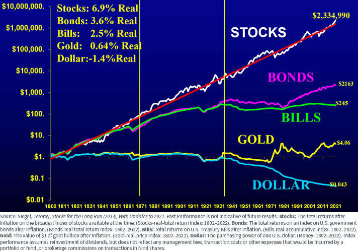

## Table of Contents

## What is gold and why is it considered a valuable investment?

Gold is a shiny, yellow metal that people have valued for thousands of years. It is found in the earth and is used to make jewelry, coins, and other decorative items. Gold is special because it does not rust or tarnish, which means it stays beautiful and lasts a long time. It is also rare, which makes it even more valuable.

People consider gold a valuable investment for several reasons. First, gold often keeps its value over time, even when the economy is not doing well. This makes it a safe place to put money when other investments might be risky. Second, gold is easy to buy and sell all over the world, so it is very liquid. This means that if you need money quickly, you can sell your gold without much trouble. These qualities make gold a popular choice for people looking to protect and grow their wealth.

## How has the price of gold historically performed over the long term?

Over the long term, the price of gold has generally gone up. If you look at the price of gold over many years, you will see that it has increased a lot. For example, in the early 1970s, the price of gold was around $35 per ounce. By the end of 2023, the price had risen to over $2,000 per ounce. This shows that gold can be a good investment if you hold onto it for a long time.

However, the price of gold does not go up in a straight line. It can go up and down a lot from year to year. For example, in the late 1970s, the price of gold went up very quickly, reaching almost $850 per ounce in 1980. Then, it fell back down and stayed low for many years. It started to rise again in the early 2000s. So, while gold can be a good long-term investment, it can also be risky in the short term.

## What factors influence the long-term performance of gold?

Several things can affect how well gold does over a long time. One big thing is inflation. When prices for things like food and houses go up, people might buy gold to keep their money safe. Gold often goes up in price when inflation is high. Another thing is the strength of the US dollar. When the dollar is weak, gold usually costs more because it is priced in dollars. If the dollar is strong, gold might not go up as much. Also, when there is a lot of worry or trouble in the world, like wars or big economic problems, people might buy gold because they think it is safe. This can make the price of gold go up.

Another factor is how much gold is being produced and found. If miners find a lot of new gold, the price might go down because there is more of it. But if it is hard to find new gold, the price might go up. Interest rates can also play a role. When interest rates are low, people might buy gold instead of putting their money in the bank because they can't earn much interest. But when interest rates are high, people might choose to keep their money in the bank instead of buying gold. All these things together help decide how gold will do over many years.

## How does gold compare to other investment options like stocks and bonds over the long term?

Over the long term, gold, stocks, and bonds each have their own ways of performing. Stocks usually grow more than gold and bonds over many years. For example, if you put money in the stock market, you might see your money grow a lot more than if you put it in gold. But stocks can also go down a lot, which can be scary. Bonds are usually safer than stocks but don't grow as much. They give you steady money over time, but if you want your money to grow a lot, bonds might not be the best choice.

Gold is different because it can protect your money when things are not going well in the economy. When stocks and bonds are doing badly, gold might go up. This makes gold a good thing to have when you want to keep your money safe. But over many years, gold does not grow as fast as stocks. So, if you want your money to grow a lot over a long time, you might want to put more in stocks. But if you want to keep your money safe, having some gold can be a good idea.

## What are the benefits of including gold in a long-term investment portfolio?

Including gold in a long-term investment portfolio can help you in a few important ways. One big benefit is that gold can protect your money when the economy is not doing well. When stocks and bonds go down, gold often goes up. This means that if you have some gold, it can help balance out the losses from other parts of your portfolio. It's like having a safety net that can catch you if you fall.

Another benefit is that gold keeps its value over time. Even though the price of gold can go up and down a lot in the short term, over many years, it tends to go up. This makes gold a good way to keep your money safe and maybe even grow it a little bit. So, having some gold in your portfolio can give you peace of mind, knowing that part of your money is in something that has been valuable for thousands of years.

## How can inflation impact the long-term investment performance of gold?

Inflation is when the prices of things like food and houses go up over time. When inflation happens, the money you have now can buy less in the future. This is why people look for ways to protect their money from inflation. Gold can be a good way to do this because its price often goes up when inflation is high. When the value of money goes down because of inflation, gold's value can go up, which helps keep your money's worth safe.

For example, if you have $1,000 and inflation makes everything more expensive, that $1,000 won't buy as much. But if you used that $1,000 to buy gold, and the price of gold goes up because of inflation, you might be able to sell the gold later for more than $1,000. This means your money keeps its value better with gold. So, over the long term, including gold in your investments can help protect your money from losing value because of inflation.

## What role does geopolitical instability play in the long-term value of gold?

Geopolitical instability, like wars or big political problems, can make the value of gold go up. When there is trouble in the world, people often feel scared about their money. They might think that things like stocks and bonds are too risky. So, they buy gold because they believe it is a safe place to keep their money. Gold has been seen as a safe investment for thousands of years, so when the world feels unstable, more people want to buy it. This higher demand can push the price of gold up over the long term.

Even though geopolitical instability can make gold prices go up, it does not always last forever. Once the trouble calms down, people might feel safer and start putting their money back into other investments like stocks and bonds. But because the world can always have new problems, gold keeps its reputation as a safe place to put money. Over many years, this means that gold can keep its value and even grow when there is a lot of uncertainty in the world.

## How do interest rates affect the long-term performance of gold?

Interest rates can have a big effect on how well gold does over a long time. When interest rates are low, people might choose to buy gold instead of putting their money in the bank. This is because they can't earn much interest from the bank, so they look for other ways to keep their money safe. When more people want to buy gold, its price can go up. So, low interest rates can make gold a more popular choice and help its value grow over time.

On the other hand, when interest rates are high, people might decide to keep their money in the bank instead of buying gold. This is because they can earn more interest from the bank, which makes it a better choice for them. When fewer people want to buy gold, its price might not go up as much. So, high interest rates can make gold less attractive and slow down its growth over the long term.

## What are the tax implications of investing in gold for the long term?

When you invest in gold for the long term, you need to think about taxes. If you buy gold and then sell it later for more money, you have to pay a tax on the profit you made. This is called a capital gains tax. How much you pay depends on how long you held the gold before selling it. If you held it for more than a year, it's called a long-term capital gain, and the tax rate is usually lower than if you sold it in less than a year, which is a short-term capital gain. The tax rate for long-term gains can be 0%, 15%, or 20%, depending on your income.

Another thing to think about is if you buy gold in a special way, like through a gold IRA, which is a type of retirement account. In a gold IRA, you don't have to pay taxes on the money you put in or the gains you make until you take the money out when you retire. This can be a good way to save on taxes if you plan to keep your gold for a very long time. But, there are rules about how much you can put in and when you can take the money out, so it's important to understand these rules before you start.

## How does the method of investing in gold (physical, ETFs, mining stocks) affect long-term returns?

The way you choose to invest in gold can make a big difference in how much money you make over a long time. If you buy physical gold, like gold bars or coins, you own the actual metal. This can be good because you can hold it and feel safe knowing you have something real. But, you have to think about costs like storage and insurance, which can eat into your profits. Also, when you want to sell physical gold, you might not get the best price right away, which can affect your long-term returns.

Another way to invest is through gold ETFs, which are like funds that track the price of gold. ETFs are easy to buy and sell, and you don't have to worry about storing the gold yourself. This can be good for your long-term returns because you save on costs and can quickly turn your investment into cash. But, ETFs come with management fees that can lower your returns over time. Lastly, you can invest in gold mining stocks, which are shares in companies that mine gold. These can give you bigger returns if the company does well, but they can also be riskier because the company's success depends on more than just the price of gold. So, the method you choose can affect how much money you make and how safe your investment feels over the long term.

## What are the risks associated with long-term investment in gold?

Investing in gold for a long time can have some risks. One big risk is that gold does not make money by itself. Unlike stocks, which can pay you dividends, or bonds, which give you interest, gold just sits there. Its value can go up, but you won't get any extra money from it while you wait. This means you might miss out on other investments that could grow your money faster.

Another risk is that the price of gold can go up and down a lot. Even though gold can be a safe place to put your money when the economy is bad, it can also lose value when things are going well. If you need to sell your gold at a time when its price is low, you might lose money. Also, if you buy physical gold, you have to think about costs like storage and insurance, which can eat into your profits over time.

## How can investors use gold as a hedge against currency fluctuations in long-term investment strategies?

Investors can use gold as a hedge against currency fluctuations because gold's value often goes up when a currency loses value. For example, if the US dollar gets weaker, the price of gold, which is priced in dollars, might go up. This means that if you have some of your money in gold, it can help protect you if the dollar loses value. When the currency you use every day goes down, the gold you own can go up in value, which helps keep your money safe.

Using gold this way in a long-term investment strategy can give you peace of mind. If you live in a country where the currency is not very stable, having some gold can make sure that part of your money stays valuable. Over many years, this can help you keep your savings safe from big changes in currency value. So, including gold in your investment plan can be a smart way to protect your money from currency ups and downs.

## What has been the historical performance of gold?

The historical performance of gold as an investment asset has been marked by significant resilience and growth, largely driven by economic and geopolitical factors. Gold has long been perceived as a 'safe haven' during periods of financial turbulence, providing security when other asset classes falter. Analyzing distinct historical periods reveals the robustness of gold in maintaining value and offering returns amidst global uncertainties.

Throughout history, gold has experienced various phases of price fluctuations tied to major economic events. During the 1970s, the collapse of the Bretton Woods system, which had pegged currencies to the U.S. dollar and gold, led to rapid inflation and increased demand for gold as a hedge. This era saw gold prices soar, culminating in an all-time high in 1980 at approximately $850 per ounce.

Fast forward to the 2008 financial crisis, another pivotal moment underscoring gold's status as a safe haven. Amidst the collapse of major financial institutions and plummeting stock markets, investors flocked to gold, driving its price upward. By September 2011, gold reached a peak of over $1,900 per ounce, reflecting widespread economic insecurity and investor caution.

Graphical analyses consistently illustrate gold's comparative return on investment over long periods. For instance, a simple calculation of gold's annualized return over several decades can be informative. If you consider:

$$
\text{CAGR} = \left(\frac{\text{Ending Value}}{\text{Beginning Value}}\right)^{\frac{1}{N}} - 1
$$

where CAGR represents the compound annual growth rate, a key metric for evaluating investment performance over time. By applying this formula, one can assess how gold's long-term growth compares to other investments like stocks or bonds.

To visualize, consider plotting gold's historical prices alongside those of major stock indices. Using Python, such a graphical comparison might employ libraries like Matplotlib or Plotly to render clear, informative charts. Here's a simple Python snippet using Matplotlib to plot historical gold prices:

```python
import matplotlib.pyplot as plt
import pandas as pd

# Assume 'gold_prices.csv' contains historical data with 'Date' and 'Price' columns
gold_data = pd.read_csv('gold_prices.csv')
gold_data['Date'] = pd.to_datetime(gold_data['Date'])
plt.figure(figsize=(10, 6))
plt.plot(gold_data['Date'], gold_data['Price'], label='Gold Prices', color='gold')
plt.title('Historical Gold Prices')
plt.xlabel('Year')
plt.ylabel('Price (USD)')
plt.legend()
plt.grid(True)
plt.show()
```

Gold's ability to preserve wealth during crises and its hedge against inflation have entrenched its reputation as a robust investment. Despite periodic volatility, its long-term trajectory has aligned with investors' expectations for stability and value retention. Understanding these historical insights is invaluable for anticipating how gold might behave amidst future economic challenges and opportunities.

## References & Further Reading

[1]: ["Gold as an Inflation Hedge?"](https://www.forbes.com/advisor/investing/gold-inflation-hedge/) by Jill F. Sanborn and David J. Stockton. National Bureau of Economic Research, 2013.

[2]: ["The Golden Dilemma"](https://www.nber.org/papers/w18706) by Claude B. Erb and Campbell R. Harvey, Financial Analysts Journal, 2013.

[3]: ["Advances in Financial Machine Learning"](https://www.amazon.com/Advances-Financial-Machine-Learning-Marcos/dp/1119482089) by Marcos Lopez de Prado

[4]: ["Machine Learning for Asset Managers"](https://epubs.siam.org/doi/book/10.1137/1.9781611977905) by Marcos Lopez de Prado

[5]: ["Quantitative Trading: How to Build Your Own Algorithmic Trading Business"](https://books.google.com/books/about/Quantitative_Trading.html?id=j70yEAAAQBAJ) by Ernest P. Chan

[6]: ["Algorithmic Trading and DMA: An introduction to direct access trading strategies"](https://www.amazon.com/Algorithmic-Trading-DMA-introduction-strategies/dp/0956399207) by Barry Johnson