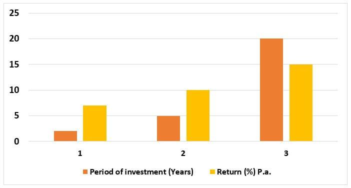

In today's rapidly evolving financial markets, investors are constantly seeking avenues for stable and profitable returns. Among various investment options, gold has consistently stood out as a reliable long-term investment asset. Its unique properties and historical significance have made it a staple in diversified portfolios across the globe. Gold is not only valued for its intrinsic worth but also for its ability to act as a hedge against inflation and economic uncertainty.

This article explores the dynamics of gold investment, historical performance, and how algorithmic trading can enhance investment strategies. Gold's enduring appeal lies in its ability to preserve value over the long term, even amid fluctuating economic conditions. As we examine the historical data, we'll see that gold has often provided stability during periods of financial turmoil, underscoring its role as a "safe haven" asset.



Furthermore, technological advancements are shaping investment decisions by introducing new ways to optimize and manage assets. Algorithmic trading, or algo trading, has emerged as a transformative tool in the financial sector, allowing investors to automate trading strategies and execute transactions with speed and precision. This synergy of traditional investment wisdom and modern technological innovation represents a paradigm shift in how investors approach gold trading.

Join us as we uncover the intricacies of integrating gold investment with cutting-edge algo trading techniques. Through this integration, investors can maximize their potential for stable and profitable returns by mitigating risks and taking advantage of market opportunities with unprecedented efficiency. This article will guide you through understanding how these advanced methodologies are not only reshaping gold investment strategies but are also offering a glimpse into the future of financial trading.

## Table of Contents

## Understanding Gold as a Long-Term Investment

Gold has been a cornerstone of economies for centuries, symbolizing wealth and stability. Its enduring significance is rooted in its physical properties and cultural value, maintaining an intrinsic worth that fiat currencies often lack. This intrinsic value renders gold a reliable hedge against inflation and market volatility, as it is not reliant on the creditworthiness of any institution or government.

Historically, gold has proven resilient during economic downturns, offering a safeguard against currency devaluation and crisis periods. This resilience is showcased through various economic eras, including the collapse of the Bretton Woods system and the more recent 2008 financial crisis, where gold prices surged as investors sought safe haven assets. An analysis of historical data reveals that gold has not only preserved its value over decades but has also delivered substantial price appreciation, particularly during periods of economic uncertainty.

For instance, during the 1970s, a decade marked by high inflation, gold prices increased substantially, providing investors with a buffer against declining currency value. Similarly, in the wake of the 2008 financial crisis, gold's value rose dramatically, reflecting its status as a safety net during turbulent times. This historical performance affirms gold's role as a strategic investment within diversified portfolios.

Gold's stability and value preservation make it a quintessential component of a diversified investment strategy, providing balance against more volatile assets like stocks and currencies. Investors recognize gold's potential to mitigate risk and act as a counterbalance in a portfolio, especially during market turbulence. For example, if an investor holds both stocks and gold, a downturn in the stock market could be offset by the stability or appreciation in gold prices. This complementary dynamic enhances the overall risk-adjusted return of a portfolio.

Moreover, the efficient-market hypothesis (EMH) suggests that it's difficult to achieve consistent returns superior to the market average through individual selection. However, incorporating gold into an investment strategy may enhance portfolio efficiency by reducing [volatility](/wiki/volatility-trading-strategies) and providing non-correlated returns relative to equities and bonds.

In conclusion, gold serves as a strategic long-term investment asset. Its enduring value, historical performance, and stabilization role within diversified portfolios underscore its importance to investors seeking to safeguard wealth against economic uncertainties. Gold remains an asset of choice for those prioritizing stability and value preservation.

## Historical Performance of Gold

The historical performance of gold as an investment asset has been marked by significant resilience and growth, largely driven by economic and geopolitical factors. Gold has long been perceived as a 'safe haven' during periods of financial turbulence, providing security when other asset classes falter. Analyzing distinct historical periods reveals the robustness of gold in maintaining value and offering returns amidst global uncertainties.

Throughout history, gold has experienced various phases of price fluctuations tied to major economic events. During the 1970s, the collapse of the Bretton Woods system, which had pegged currencies to the U.S. dollar and gold, led to rapid inflation and increased demand for gold as a hedge. This era saw gold prices soar, culminating in an all-time high in 1980 at approximately $850 per ounce.

Fast forward to the 2008 financial crisis, another pivotal moment underscoring gold's status as a safe haven. Amidst the collapse of major financial institutions and plummeting stock markets, investors flocked to gold, driving its price upward. By September 2011, gold reached a peak of over $1,900 per ounce, reflecting widespread economic insecurity and investor caution.

Graphical analyses consistently illustrate gold's comparative return on investment over long periods. For instance, a simple calculation of gold's annualized return over several decades can be informative. If you consider:

$$
\text{CAGR} = \left(\frac{\text{Ending Value}}{\text{Beginning Value}}\right)^{\frac{1}{N}} - 1
$$

where CAGR represents the compound annual growth rate, a key metric for evaluating investment performance over time. By applying this formula, one can assess how gold's long-term growth compares to other investments like stocks or bonds.

To visualize, consider plotting gold's historical prices alongside those of major stock indices. Using Python, such a graphical comparison might employ libraries like Matplotlib or Plotly to render clear, informative charts. Here's a simple Python snippet using Matplotlib to plot historical gold prices:

```python
import matplotlib.pyplot as plt
import pandas as pd

# Assume 'gold_prices.csv' contains historical data with 'Date' and 'Price' columns
gold_data = pd.read_csv('gold_prices.csv')
gold_data['Date'] = pd.to_datetime(gold_data['Date'])
plt.figure(figsize=(10, 6))
plt.plot(gold_data['Date'], gold_data['Price'], label='Gold Prices', color='gold')
plt.title('Historical Gold Prices')
plt.xlabel('Year')
plt.ylabel('Price (USD)')
plt.legend()
plt.grid(True)
plt.show()
```

Gold's ability to preserve wealth during crises and its hedge against inflation have entrenched its reputation as a robust investment. Despite periodic volatility, its long-term trajectory has aligned with investors' expectations for stability and value retention. Understanding these historical insights is invaluable for anticipating how gold might behave amidst future economic challenges and opportunities.

## The Advent of Algorithmic Trading

Technological advancements have significantly reshaped the landscape of financial trading, with [algorithmic trading](/wiki/algorithmic-trading), commonly referred to as algo trading, becoming a central element of this transformation. By automating trading strategies, algo trading reduces the influence of human error and emotion-driven decisions, providing a more objective approach to investing.

Algo trading platforms function through pre-set algorithms that systematically execute trades based on established criteria, such as price, timing, or quantity. These algorithms are typically designed using historical data and statistical models to predict future price movements, making them particularly useful in volatile markets like those of gold assets. As a commodity with intrinsic value, gold trading benefits from the precision and consistency that algorithms offer.

The main advantages of algorithmic trading include speed, precision, and scalability. Trades are executed in fractions of a second, which is crucial in markets where prices can change rapidly. This high speed is complemented by precision—algo trading ensures trades are executed exactly as specified by the algorithm, avoiding the potential slips or delays of manual trade. Scalability allows these strategies to handle vast amounts of data and execute large numbers of trades without a proportional increase in resources or time.

Incorporating algorithms in gold trading can optimize returns by swiftly reacting to market fluctuations. For instance, an algorithm might be programmed to buy gold futures if the price drops below a certain threshold and then sell them once the price rebounds, capturing profit margins with minimal delay. This not only enhances efficiency but also capitalizes on short-term market movements that might be missed by traditional trading methods.

Moreover, algorithmic trading supports complex strategies, such as [arbitrage](/wiki/arbitrage), [market making](/wiki/market-making), or [trend following](/wiki/trend-following), which can be more effectively implemented through automation. In the context of gold trading, an arbitrage strategy might exploit price differences between gold futures and physical gold prices across different exchanges.

As the financial markets become increasingly data-driven, the role of algorithms in trading practices will likely continue to grow. By blending traditional investment approaches with technological advancements, traders can potentially improve their decision-making processes and achieve more consistent and profitable outcomes in the gold market.

## Integrating Gold Investment with Algorithmic Trading

The integration of traditional gold investment with algorithmic trading strategies offers investors enhanced opportunities in the financial markets. By developing specific algorithms tailored to the gold market, traders can optimize their trading strategies and potentially increase returns. Algorithmic trading involves the use of automated pre-programmed trading instructions that account for variables such as time, price, and [volume](/wiki/volume-trading-strategy), enabling precise and rapid responses to market conditions.

One approach to developing these algorithms is through the incorporation of historical gold price data, economic indicators, and technical analysis tools. Traders typically use programming languages such as Python to build models that can predict market trends and execute trades. A simple example in Python might include using libraries like pandas for data manipulation, NumPy for numerical calculations, and libraries such as scikit-learn to create predictive models. Here is a basic outline of how one might begin crafting such an algorithm:

```python
import pandas as pd
from sklearn.model_selection import train_test_split
from sklearn.linear_model import LinearRegression

# Load gold price data
data = pd.read_csv('gold_price_data.csv')
X = data[['feature1', 'feature2', 'feature3']]  # Select relevant features
y = data['gold_price']

# Split the data into training and testing sets
X_train, X_test, y_train, y_test = train_test_split(X, y, test_size=0.2, random_state=42)

# Create and train the model
model = LinearRegression()
model.fit(X_train, y_train)

# Predicting future gold prices
predicted_prices = model.predict(X_test)
```

Case studies have demonstrated the success of algorithmic trading in gold investments. For instance, during volatile market conditions, algorithms have been employed to capitalize on short-term price movements, thus providing investors with profitable opportunities. Moreover, the ability to backtest these algorithms using historical data allows traders to assess their efficacy and adjust parameters before deploying them in live markets.

Risk management is critical when employing algorithmic trading. Algorithms must be designed robustly to handle market uncertainties, such as sudden price swings or unexpected geopolitical events. Effective risk management strategies include setting stop-loss orders and defining trade size limits to mitigate potential losses. The adaptability of these systems is crucial, allowing traders to incorporate new data inputs or alter trading strategies in response to changing market conditions.

In conclusion, integrating algorithmic trading with gold investment enables investors to harness technology for more informed and efficient trading decisions. While challenges remain, particularly in managing risk and ensuring system robustness, the potential for enhanced outcomes makes this an appealing approach. As investors continue to embrace technological advancements, the future of trading gold assets looks increasingly promising.

## Challenges and Considerations

Integrating algorithmic trading with gold investments presents several challenges that investors must carefully navigate. One of the most prominent risks is algorithmic glitches. These glitches can arise from coding errors, unexpected market events, or system failures, leading to potentially significant financial losses. For instance, a faulty algorithm might execute excessive trades due to a loop or misinterpret market signals, resulting in unintended positions.

Market anomalies pose another risk, as algorithms primarily rely on historical data to predict future trends. When markets behave unpredictably, such as during geopolitical tensions or sudden economic changes, algorithms might not adapt swiftly enough, potentially leading to suboptimal trading decisions.

An over-reliance on technology in trading strategies could also be detrimental. While algorithms offer precision and speed, they can lack the nuanced understanding and judgment that experienced human traders bring. Human input is essential for interpreting qualitative data and adjusting strategies to reflect complex market dynamics.

Regulatory constraints are crucial considerations. Different jurisdictions have varying rules governing algorithmic trading, including requirements for transparency, reporting, and oversight. Compliance with these regulations is vital to avoid legal repercussions. Investors must stay informed about regulatory changes that might affect their algorithmic trading practices.

To mitigate these challenges, investors can adopt several best practices. Regular testing and validation of algorithms in simulated environments help identify and correct potential glitches before deployment. Incorporating robust error-checking routines in code can further reduce the risk of execution errors.

Diversifying algorithmic strategies to include both quantitative and qualitative analyses can also enhance decision-making. This fosters a balanced approach where algorithms handle rapid transactions while human oversight provides contextual insights and strategic adjustments. For instance, employing sentiment analysis tools could complement algorithmic strategies by capturing market sentiment from news articles and social media, which pure quantitative models might overlook.

Establishing a robust risk management framework is crucial. Setting clear stop-loss limits, diversifying assets, and continuously monitoring market conditions can help manage exposure to unexpected market shifts.

In summary, successful integration of algorithmic trading with gold investments requires a balanced approach that combines the precision of technology with the strategic acumen of human oversight. By acknowledging potential pitfalls and implementing comprehensive risk management protocols, investors can effectively harness the benefits of algorithmic trading in gold investment contexts.

## Conclusion

Gold continues to be an essential component of long-term investment strategies due to its stability and demonstrated historical performance. Its role as a hedge against economic fluctuations and as a reliable store of value reinforces its status in diversified portfolios. The advent of algorithmic trading has introduced a transformative dimension to gold investment strategies, providing investors with enhanced efficiency and potential profitability. By automating trading processes, algorithmic trading reduces human errors and emotions, allowing for precise and timely market operations.

The synergy between traditional investment wisdom and modern technological innovations enables investors to leverage the strengths of both approaches. This combination not only optimizes returns but also aids in navigating complex market environments. As financial landscapes evolve, it is imperative for investors to remain informed of new developments and maintain an adaptable mindset to ensure sustained success.

Additionally, we encourage readers to seek further knowledge and engage with expert advisors to fully realize the potential of their gold investments. By staying proactive and informed, investors can strategically position themselves to capitalize on both the inherent strengths of gold and the technological advancements in trading practices, ultimately maximizing their investment outcomes.

## References & Further Reading

[1]: ["Gold as an Inflation Hedge?"](https://www.forbes.com/advisor/investing/gold-inflation-hedge/) by Jill F. Sanborn and David J. Stockton. National Bureau of Economic Research, 2013.

[2]: ["The Golden Dilemma"](https://www.nber.org/papers/w18706) by Claude B. Erb and Campbell R. Harvey, Financial Analysts Journal, 2013.

[3]: ["Advances in Financial Machine Learning"](https://www.amazon.com/Advances-Financial-Machine-Learning-Marcos/dp/1119482089) by Marcos Lopez de Prado

[4]: ["Machine Learning for Asset Managers"](https://epubs.siam.org/doi/book/10.1137/1.9781611977905) by Marcos Lopez de Prado

[5]: ["Quantitative Trading: How to Build Your Own Algorithmic Trading Business"](https://books.google.com/books/about/Quantitative_Trading.html?id=j70yEAAAQBAJ) by Ernest P. Chan

[6]: ["Algorithmic Trading and DMA: An introduction to direct access trading strategies"](https://www.amazon.com/Algorithmic-Trading-DMA-introduction-strategies/dp/0956399207) by Barry Johnson