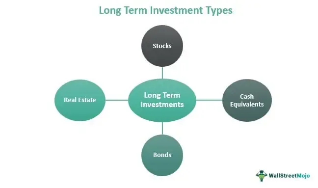

In today's financial landscape, exploring diverse investment strategies is crucial for building long-term wealth. A strategic approach to this involves a combination of monthly stock contributions and algorithmic trading. Small, regular investments can form a robust foundation for an investor's portfolio by allowing for disciplined contributions that benefit from compound growth over time. On the technological front, algorithmic trading plays a significant role by leveraging data-driven insights and automation to enhance investment strategies.

Monthly contributions to stocks help investors mitigate the risk of market volatility through dollar-cost averaging. By spreading investments over time, investors purchase more shares when prices are low and fewer when prices are high. This method reduces the need to time the market perfectly and allows the investor to benefit from the gradual averaging out of stock prices.



Algorithmic trading, a modern technology-driven investment strategy, involves using pre-defined sets of rules or algorithms to execute trades. This allows for more precise and efficient trading by eliminating emotional biases and human errors. Algorithms optimize the timing and execution of trades, potentially maximizing returns and safeguarding against market variability.

Understanding these strategies and their integration can equip investors to optimize their portfolios. This article will explore the mechanics of monthly contributions, the benefits of algorithmic trading, and how both methods can be synergistically combined to build an effective long-term investment strategy. Through exploring these concepts, investors can diversify their approaches and optimize their decision-making processes, ultimately aiming for a balanced and growth-oriented investment portfolio.

## Table of Contents

## The Case for Long-term Investment Strategy

Long-term investments involve committing capital over an extended period to achieve the advantage of compounding growth. This investment strategy relies on the principle that consistent, smaller investments can accumulate substantial wealth over time, primarily through the power of compounded returns. By consistently allocating a fixed amount of money, investors benefit from dollar-cost averaging, which mitigates the risk of market timing and facilitates accumulated growth even amidst market fluctuations.

Historically, long-term investment strategies have proven successful in building wealth and providing financial security. The concept of compounding, where the returns on an investment are reinvested to generate additional earnings over time, plays a crucial role. Albert Einstein famously referred to compound interest as the "eighth wonder of the world," highlighting its potential for exponential growth. For instance, an initial investment of $10,000 with an average annual return of 7% can grow to approximately $76,122 over 30 years, showcasing the power of compound interest.

Long-term investment strategies also offer significant benefits in terms of risk diversification. By spreading investments across various asset classes and sectors, investors can reduce exposure to individual market volatilities. Historically, diversified portfolios have demonstrated resilience during economic downturns and provided steady growth over time. The famous Nobel Prize-winning Modern Portfolio Theory by Harry Markowitz emphasizes the importance of diversification in minimizing risk and maximizing returns.

Psychologically, adopting a long-term investment mindset can alleviate stress associated with market [volatility](/wiki/volatility-trading-strategies). Unlike short-term trading, which often demands constant attention to market movements, long-term investing allows individuals to take a more relaxed approach. By focusing on long-term goals rather than short-term market fluctuations, investors can reduce anxiety and make more rational decisions. Behavioral finance studies suggest that long-term investors are less prone to emotional reactions, such as panic selling during market downturns, thus preserving their portfolio's growth potential.

In summary, long-term investments provide a strategic approach to wealth accumulation by leveraging the principles of compounding growth and risk diversification. These strategies not only offer financial advantages but also contribute to a more stable and less stressful investment experience. By focusing on consistent, smaller investments over time, individuals can build significant wealth while mitigating the impact of market volatility.

## Benefits of Monthly Stock Contributions

Regularly investing in the stock market through monthly contributions, often referred to as a systematic investment plan, is a well-regarded strategy for building wealth. This approach capitalizes on the concept of dollar-cost averaging and compound interest, offering several key benefits to investors.

**Dollar-Cost Averaging and Mitigation of Market Timing Risks**

Dollar-cost averaging (DCA) is a technique that involves investing a fixed amount of money at regular intervals, regardless of the asset’s price. By doing so, investors purchase more shares when prices are low and fewer shares when prices are high. This method helps to smooth out the effects of market volatility and reduces the risk associated with attempting to time the market. The regularity of contributions ensures that investments are made consistently, which can be particularly advantageous during periods of market downturns, ultimately lowering the average cost per share over time.

**Leveraging Compound Interest through Fixed Monthly Contributions**

The power of compound interest can significantly enhance the growth of investments over the long term. With monthly contributions, not only are investors benefiting from the potential appreciation of their investments, but they are also reinvesting their returns, allowing their gains to generate further earnings. The formula for compound interest is:

$$
A = P \left(1 + \frac{r}{n}\right)^{nt}
$$

Where:
- $A$ is the amount of money accumulated after n years, including interest.
- $P$ is the principal investment amount (initial deposit or amount lent).
- $r$ is the annual interest rate (decimal).
- $n$ is the number of times that interest is compounded per unit.
- $t$ is the time the money is invested or borrowed for, in years.

For instance, assume an investor contributes $500 every month into an investment with an average annual return of 6%. Over a period of 30 years, this systematic approach allows the initial contributions to grow exponentially as earnings are reinvested, resulting in potentially significant wealth accumulation.

**Historical Examples and Hypothetical Scenarios**

Historical data supports the impact of regular investments on wealth accumulation. For example, an investor who began contributing consistently to an S&P 500 index fund in the early 1980s would have seen substantial growth over the decades, despite market fluctuations.

To illustrate this with a hypothetical scenario, consider the following Python code that simulates monthly investments over time:

```python
def future_value_contributions(monthly_contribution, annual_rate, years):
    total_months = years * 12
    monthly_rate = annual_rate / 12
    future_value = 0
    for month in range(1, total_months + 1):
        future_value = (future_value + monthly_contribution) * (1 + monthly_rate)
    return future_value

monthly_contribution = 500
annual_rate = 0.06
years = 30

future_value = future_value_contributions(monthly_contribution, annual_rate, years)
print(f"Future Value of Monthly Contributions: ${future_value:,.2f}")
```

This code calculates the future value of a $500 monthly contribution over 30 years with a 6% annual return, demonstrating the growth potential of regular investing.

In summary, monthly stock contributions leverage systematic investment plans' inherent advantages, such as dollar-cost averaging and compound interest, providing investors with a calculated path to amass wealth while mitigating some of the inherent risks of market timing.

## Algorithmic Trading: Enhancing Investment Strategy

Algorithmic trading, often termed algo-trading, involves the use of computer programs to execute trading strategies automatically. This approach leverages mathematical models and complex algorithms to make faster and more efficient trading decisions than humans. Algorithmic trading has gained prominence in modern long-term investing due to its ability to process vast amounts of financial data and perform trades at optimal prices.

The growing prevalence of [algorithmic trading](/wiki/algorithmic-trading) in long-term investments can be attributed to its numerous advantages. By pre-programming algorithms to follow specific rules and strategies, traders can maintain consistent discipline, reducing the influence of emotional biases that often affect human decision-making. This stability is crucial for long-term strategies where patience and adherence to a plan are vital for compounding returns.

Crucial to optimizing investment portfolios are key financial ratios, which algorithms use to evaluate the performance and dynamics of investments. Ratios such as the price-to-earnings (P/E) ratio, return on equity (ROE), and the Sharpe ratio provide insights into the valuation, profitability, and risk-adjusted return of assets. For instance, the P/E ratio assists in gauging if a stock is over or under-valued compared to its historical trends, while the Sharpe ratio helps in understanding the return of an investment compared to its risk. By programming algorithms to monitor these ratios, investors can ensure that their portfolios are optimized continually based on quantitative measures.

Algorithms also enhance timing, executing trades at the most opportune moments based on market signals. Moving averages, relative strength index (RSI), and other technical indicators can be coded into an algorithm to determine buy or sell points with precision. For example, a simple moving average crossover can signal a buy when a short-term moving average crosses above a long-term moving average. Python libraries such as `pandas`, `NumPy`, and `TA-Lib` provide powerful tools for implementing these strategies efficiently. Here's a brief example of how moving average crossovers could be automated in Python:

```python
import pandas as pd
import numpy as np

# Assume data is a DataFrame with 'Close' prices for a stock
data['short_mavg'] = data['Close'].rolling(window=40).mean()
data['long_mavg'] = data['Close'].rolling(window=100).mean()

# Create signals 
data['signal'] = 0.0
data['signal'][40:] = np.where(data['short_mavg'][40:] > data['long_mavg'][40:], 1.0, 0.0)   

# Generate trading orders
data['positions'] = data['signal'].diff()
```

This code snippet creates a trading signal based on moving average crossovers, executing buy orders when the short-term average overtakes the long-term average, indicating a growing trend. This automated approach minimizes human error and ensures that trades are executed at calculated optimal points.

In summary, algorithmic trading enhances long-term investment strategies by maintaining disciplined adherence to well-structured plans, reducing emotional impact, and optimizing execution timing. The integration of algorithmic trading into long-term investment frameworks allows investors to dynamically respond to market changes, capturing value and ensuring efficient portfolio management.

## Integrating Algorithmic Trading with Monthly Contributions

Regular stock contributions combined with algorithmic trading present a powerful synergy in enhancing long-term investment strategies. By integrating these two approaches, investors can potentially optimize returns and mitigate risks more effectively than by using each strategy independently.

**Synergies Between Regular Contributions and Algorithms**

Regular stock contributions, such as monthly investments, provide a systematic approach to investing that encourages consistent portfolio growth. This strategy is particularly effective when combined with algorithmic trading, which can automate and refine the investment process. Algorithms are adept at analyzing vast datasets, identifying patterns, and executing trades with precision, which can be harnessed to optimize the timing and allocation of monthly contributions.

For example, an algorithm can monitor market conditions and adjust the asset allocation of monthly contributions based on predefined criteria or [machine learning](/wiki/machine-learning) models. This dynamic approach helps in anticipating market fluctuations and achieving a more balanced risk-return profile. Algorithms can also implement dollar-cost averaging more efficiently by detecting optimal entry points better than a static, time-based method might.

**Automating and Optimizing Investment Processes**

Algorithms serve as robust tools for automating investment operations, minimizing human error, and ensuring discipline in regular contributions. They can schedule and execute transactions precisely when the market conditions align with the investor's strategic objectives. Python, being a preferred language for building automated trading systems, offers various libraries such as NumPy, pandas, and Backtrader for developing sophisticated algorithms.

For instance, a simple Python script could be structured to automate the process:

```python
import pandas as pd
import numpy as np

# Hypothetical historical data
market_data = pd.read_csv('market_data.csv')

# Define algorithm for decision making
def decision_algorithm(data):
    # Example: simple moving average as a basic strategy
    data['7_day_SMA'] = data['Close'].rolling(window=7).mean()
    data['14_day_SMA'] = data['Close'].rolling(window=14).mean()

    # Generate buy/sell signals
    data['Signal'] = np.where(data['7_day_SMA'] > data['14_day_SMA'], 'Buy', 'Sell')

    return data

# Apply algorithm to market data
processed_data = decision_algorithm(market_data)

# Execute monthly contributions based on signals
monthly_investment = 100  # Example: $100
investment_summary = []

for index, row in processed_data.iterrows():
    action = row['Signal']
    if action == 'Buy':
        investment_summary.append(row['Close'] * monthly_investment)

total_investment = sum(investment_summary)
```

This code snippet demonstrates a basic algorithm that uses a moving average crossover strategy to dictate the automated investment actions.

**Case Studies and Theoretical Examples**

Integrating algorithmic trading with regular contributions has been implemented in diverse settings. For instance, robo-advisors are a real-world application where automated platforms manage client assets by synergizing algorithmic models with periodic contributions. These platforms utilize algorithms to rebalance portfolios automatically, often outperforming traditional investment strategies due to their efficiency and precision.

Theoretical simulations suggest that combining regular contributions with algorithmic adjustments can enhance long-term investment outcomes. For example, several quantitative studies model scenarios where investors who incorporate algorithms see improved risk-adjusted returns compared to those who rely solely on periodic investments without algorithmic insights.

In conclusion, combining regular stock contributions with algorithmic trading allows for a dynamic investment strategy that is both adaptable and disciplined. By leveraging the strengths of both approaches, investors can enhance their portfolios' growth potential while managing risk effectively.

## Risks and Considerations

Market volatility significantly impacts both long-term investments and algorithmic strategies. Stock prices fluctuate due to various factors such as economic indicators, geopolitical events, and changes in market sentiment. For long-term investors, short-term volatility can be unsettling but generally represents less of a concern when viewed in the broader context of an investment horizon spanning several years or decades. On the other hand, algorithmic trading strategies, particularly those executing trades with [high frequency](/wiki/high-frequency-trading), are acutely sensitive to volatility. Algorithms are designed to react to rapid changes in price, and unexpected market swings can result in substantial losses if they deviate significantly from historical patterns. 

Inflation and interest rates also play critical roles in shaping investment outcomes. Inflation erodes the purchasing power of money, meaning that future cash flows from investments need to be discounted at an inflation-adjusted rate to determine their present value accurately. Long-term investors must account for inflation by achieving returns that outpace it to preserve and grow wealth. Interest rates, set by central banks, influence the cost of borrowing and the return on savings. They affect asset prices across financial markets, with rising rates often leading to declining stock prices as borrowing costs increase and vice versa. Both inflation and interest rates thus impact algorithmic trading strategies by altering the economic landscape these models operate in. Algorithms increasingly [factor](/wiki/factor-investing) interest rates and inflation metrics to recalibrate trading strategies and forecast shifts in asset prices.

Platform and data security risks are serious considerations for those utilizing algorithmic trading technologies. Platform stability is crucial, as any failures or downtime can result in missed opportunities or unexpected losses. Data security is equally important, given that trading strategies and executions are heavily reliant on accessing, processing, and analyzing large volumes of market data. Unauthorized access to sensitive data can lead to financial loss, reputational damage, and potential regulatory penalties. Additionally, cybersecurity threats such as hacking, malware attacks, or data breaches pose ongoing risks to trading platforms. Algorithms must constantly be updated and secured to protect against these vulnerabilities. 

Understanding these risks and taking proactive measures to mitigate them is essential for integrating algorithmic trading effectively into long-term investment strategies. Regularly reviewing and adjusting for market conditions, inflation, and interest rates, as well as maintaining robust platform and data security protocols, can help manage the risks inherent in these strategies while maximizing potential rewards.

## Conclusion

In conclusion, combining monthly stock investments with algorithmic trading presents a compelling and effective strategy for long-term wealth accumulation. This approach allows investors to capitalize on both the stability of regular contributions and the precision of algorithmic tools, thus achieving a more resilient financial strategy. Monthly contributions enable steady growth through dollar-cost averaging, mitigating the risks associated with market volatility. Meanwhile, algorithmic trading enhances this process by optimizing the timing, allocation, and diversification of investments, leveraging data-driven insights to avoid human error.

Investors should adopt a balanced approach that integrates the strengths of both strategies. This involves setting clear investment goals, conducting thorough research on suitable algorithms or trading platforms, and ensuring a consistent schedule for monthly contributions. Engaging financial advisors or using trusted robo-advisors can assist in tailoring strategies to individual risk tolerances and financial objectives.

To begin integrating these strategies, investors might consider starting with a basic algorithmic trading platform that aligns with their investment goals. Many platforms offer simulations or demo accounts to practice and fine-tune strategies without risking real capital. Additionally, maintaining regular monthly contributions in a diversified portfolio can further enhance growth potential. 

Moreover, ongoing education remains paramount. The financial landscape is ever-evolving, and understanding changes—be it in technology, regulations, or market trends—is crucial for optimizing investment strategies. Subscribing to reputable financial journals, attending webinars, and participating in investor communities can provide valuable insights and keep investors informed about the latest advancements and opportunities in the field. Continuous adaptation based on new knowledge and technologies will ensure that the strategies remain robust and effective in achieving long-term financial goals.

## References & Further Reading

[1]: Bergstra, J., Bardenet, R., Bengio, Y., & Kégl, B. (2011). ["Algorithms for Hyper-Parameter Optimization."](https://dl.acm.org/doi/10.5555/2986459.2986743) Advances in Neural Information Processing Systems 24.

[2]: ["Advances in Financial Machine Learning"](https://www.amazon.com/Advances-Financial-Machine-Learning-Marcos/dp/1119482089) by Marcos Lopez de Prado

[3]: ["Evidence-Based Technical Analysis: Applying the Scientific Method and Statistical Inference to Trading Signals"](https://www.amazon.com/Evidence-Based-Technical-Analysis-Scientific-Statistical/dp/0470008741) by David Aronson

[4]: ["Machine Learning for Algorithmic Trading"](https://github.com/stefan-jansen/machine-learning-for-trading) by Stefan Jansen

[5]: ["Quantitative Trading: How to Build Your Own Algorithmic Trading Business"](https://www.amazon.com/Quantitative-Trading-Build-Algorithmic-Business/dp/1119800064) by Ernest P. Chan