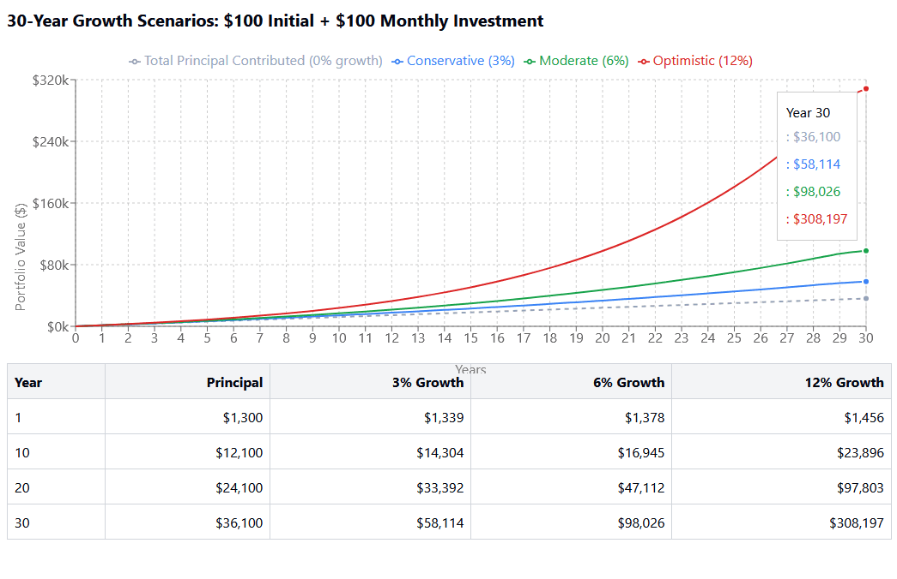

## Table of Contents

## What is a long-term investment strategy?

A long-term investment strategy is a plan to grow your money over many years. Instead of trying to make quick profits, you focus on investments that will increase in value slowly but steadily. This often means investing in things like stocks, bonds, or real estate, and holding onto them for a long time. The idea is to benefit from the power of compounding, where your earnings generate more earnings over time.

One key part of a long-term investment strategy is diversification. This means spreading your money across different types of investments to reduce risk. If one investment does poorly, others might do well and balance it out. Another important aspect is patience. Long-term investing requires you to stay calm during market ups and downs, trusting that your investments will grow over time. By sticking to your plan and not making hasty decisions, you can build wealth gradually and securely.

## Why should someone consider monthly stock contributions?

Someone should consider monthly stock contributions because it helps them build wealth over time. When you put money into stocks every month, you're using a strategy called dollar-cost averaging. This means you buy more shares when prices are low and fewer when prices are high, which can lower the average cost of your investments. It's a way to smooth out the ups and downs of the stock market.

Another reason to do monthly contributions is that it makes saving easier. Instead of trying to save a big amount all at once, you can set aside a smaller amount each month. This can be more manageable for most people. Plus, it helps you get into the habit of saving regularly, which is important for reaching long-term financial goals.

## How does investing over three decades benefit an investor?

Investing over three decades gives you a big advantage because of something called compound interest. Imagine you plant a small seed and it grows into a big tree. That's what happens with your money when you invest it for a long time. The money you earn from your investments starts to earn more money, and this keeps happening over and over. So, even if you start with a little bit, by the end of 30 years, you could have a lot more than you expected.

Another benefit is that you have time to ride out the ups and downs of the market. The stock market can go up and down a lot in the short term, but over 30 years, it tends to go up. If you keep your money invested, you don't have to worry about selling when the market is down. Instead, you can wait for it to go back up. This long-term view helps you avoid making quick decisions that might hurt your investments.

## What are the basic principles of starting a monthly investment plan?

Starting a monthly investment plan is all about setting up a routine to save and invest money regularly. The first thing you need to do is decide how much money you can put aside each month. This amount should be something you can afford without causing financial stress. Once you know how much you can invest, you can choose where to put your money. Many people start with low-cost index funds or ETFs because they are easy to understand and offer good long-term growth.

The next step is to automate your investments. This means setting up automatic transfers from your bank account to your investment account each month. Automating helps you stay consistent and makes sure you don't forget to invest. It's also important to keep an eye on your investments, but don't check them too often. The stock market can go up and down, and it's best to focus on the long term. Over time, your regular contributions will add up and grow, helping you reach your financial goals.

## How can someone begin investing in stocks with limited funds?

If you want to start investing in stocks but don't have a lot of money, you can begin with small amounts. Many online brokerages now offer the ability to buy fractional shares, which means you can invest in parts of a stock instead of having to buy a whole share. This makes it easier to start with whatever amount you can afford, even if it's just a few dollars each month. You can also look into low-cost index funds or ETFs, which let you invest in a basket of stocks for a low fee. These are a great way to spread your risk and start building your investment portfolio without needing a lot of money upfront.

Another way to get started is by using a robo-advisor. These are online services that automatically manage your investments for you. They often have low minimum investment requirements and can help you set up a diversified portfolio based on your goals and risk tolerance. By setting up automatic monthly contributions, you can slowly build your investment over time. The key is to start small and stay consistent. Even small amounts can grow significantly over time, especially if you keep adding to them regularly.

## What types of stocks are suitable for long-term investment?

When you're thinking about long-term investment, you should look at stocks from big, stable companies. These are often called blue-chip stocks. They are companies that have been around for a long time and are known for being reliable. Examples include companies like Apple, Microsoft, and Johnson & Johnson. These companies usually pay dividends, which means they give you a little bit of money regularly just for owning their stock. Over many years, these dividends can add up and help your investment grow even more.

Another type of stock good for long-term investment is growth stocks. These are companies that are expected to grow a lot in the future. They might not pay dividends, but their stock price can go up a lot over time. Companies like Amazon and Tesla are examples of growth stocks. When you invest in growth stocks, you're betting that the company will keep getting bigger and more successful. This can be riskier than investing in blue-chip stocks, but it can also lead to bigger rewards if you're patient and hold onto the stocks for a long time.

You might also want to consider index funds or ETFs that track the overall market. These are not individual stocks, but they can be a great way to invest in a lot of different companies at once. For example, an S&P 500 index fund gives you a piece of the 500 biggest companies in the U.S. This kind of investment is less risky because it's spread out over many stocks. Over the long term, the overall market tends to go up, so investing in an index fund can be a safe and effective way to grow your money.

## How does dollar-cost averaging work in the context of monthly contributions?

Dollar-cost averaging is a smart way to invest money over time. When you use dollar-cost averaging with monthly contributions, you put the same amount of money into stocks or funds every month. This means you buy more shares when the price is low and fewer shares when the price is high. Over time, this can help you pay a lower average price for your investments because you're not trying to guess when the market will be up or down.

This strategy is especially helpful for people who don't have a lot of money to invest all at once. By investing a little bit each month, you can slowly build up your investment without worrying about the ups and downs of the market. It's like saving in a piggy bank, but instead of keeping your money under your bed, you're putting it into the stock market where it can grow over time.

## What are the tax implications of long-term stock investments?

When you invest in stocks for a long time, you need to think about taxes. If you hold onto your stocks for more than a year before selling them, any profit you make is called a long-term capital gain. The good news is that long-term capital gains are usually taxed at a lower rate than your regular income. Depending on how much money you make, you might pay 0%, 15%, or 20% on these gains. This is much better than the tax rate on short-term gains, which are taxed as regular income if you sell your stocks within a year.

Another thing to keep in mind is dividends. Some stocks pay dividends, which are like little payments you get just for owning the stock. If you get dividends from stocks you've held for a long time, they are usually taxed at a lower rate too. These are called qualified dividends, and they are taxed at the same rates as long-term capital gains. So, if you're planning to invest for the long term, you can save on taxes by holding onto your stocks and enjoying the lower tax rates on your gains and dividends.

## How can one assess and adjust their investment strategy over time?

To assess and adjust your investment strategy over time, you need to check how your investments are doing regularly. This doesn't mean looking at them every day, but maybe once every few months or once a year. When you check, see if your investments are growing like you hoped. Are they making money, or are they losing value? Also, think about if your goals have changed. Maybe you want to buy a house sooner than you thought, or maybe you want to retire earlier. Your investment strategy should match your current goals.

If you find that your investments aren't doing well or your goals have changed, it's time to adjust your strategy. You might need to sell some stocks that aren't doing well and buy others that you think will do better. Or, you might need to change how much risk you're taking. If you're getting closer to a big goal like retirement, you might want to move some of your money into safer investments. It's also a good idea to talk to a financial advisor. They can help you make smart choices and keep your investments on track with your goals.

## What role do economic cycles play in long-term investment planning?

Economic cycles are like the ups and downs that happen in the economy over time. They can affect your long-term investment planning because they change how well your investments do. When the economy is doing well, it's called an expansion, and stocks usually go up. But when the economy is not doing so well, it's called a recession, and stocks can go down. Knowing about these cycles can help you plan better. You might decide to invest more when things are cheap during a recession, knowing that they might go up later.

Even though economic cycles can make the stock market go up and down, they don't change the big picture for long-term investors. If you keep your money invested over many years, you can ride out these ups and downs. The stock market tends to grow over time, even with the cycles. So, instead of trying to guess when the next recession will happen, it's better to stick to your long-term plan. Keep investing regularly and don't panic when the market goes down. Over time, your investments will likely grow, no matter what the economy is doing at any one moment.

## How can advanced investors leverage different investment vehicles within a long-term strategy?

Advanced investors can use different types of investments to make their long-term strategy even better. They might mix stocks, bonds, and real estate to spread out their risk. Stocks can grow a lot over time, but they can also go down. Bonds are usually safer and can give you steady income. Real estate can give you both income from rent and growth in value. By having a mix of these, advanced investors can balance the risk and reward. They might also use things like mutual funds or ETFs to invest in a lot of different companies at once, which makes their investments even more diverse.

Another way advanced investors can improve their long-term strategy is by using tax-advantaged accounts like IRAs or 401(k)s. These accounts let you save on taxes, which means more money can stay invested and grow over time. They might also look into more complex investments like options or futures, but these come with more risk and need a lot of knowledge. The key for advanced investors is to keep learning and adjusting their strategy. They need to stay up-to-date with the market and their own goals, making sure their investments are always working as hard as they can to reach those goals.

## What are some common pitfalls to avoid in long-term stock investment?

One common mistake people make with long-term stock investments is trying to time the market. They think they can guess when stocks will go up or down and buy or sell at the perfect time. But this is really hard to do, and it often leads to buying high and selling low, which is the opposite of what you want. Instead of trying to time the market, it's better to stick to a plan and keep investing regularly, no matter what the market is doing.

Another pitfall is not diversifying your investments. If you put all your money into just one or two stocks, you're taking a big risk. If those stocks do badly, you could lose a lot of money. It's smarter to spread your money across different types of investments, like stocks, bonds, and maybe even real estate. This way, if one investment does poorly, the others might do well and balance it out.

Lastly, some people get too emotional about their investments. They might panic and sell their stocks when the market goes down, even though they planned to hold them for the long term. It's important to stay calm and stick to your plan. Remember, the stock market goes up and down, but over many years, it tends to go up. So, don't let short-term ups and downs make you change your long-term strategy.

## What are the benefits of monthly stock contributions?

Regularly investing in the stock market through monthly contributions, often referred to as a systematic investment plan, is a well-regarded strategy for building wealth. This approach capitalizes on the concept of dollar-cost averaging and compound interest, offering several key benefits to investors.

**Dollar-Cost Averaging and Mitigation of Market Timing Risks**

Dollar-cost averaging (DCA) is a technique that involves investing a fixed amount of money at regular intervals, regardless of the asset’s price. By doing so, investors purchase more shares when prices are low and fewer shares when prices are high. This method helps to smooth out the effects of market volatility and reduces the risk associated with attempting to time the market. The regularity of contributions ensures that investments are made consistently, which can be particularly advantageous during periods of market downturns, ultimately lowering the average cost per share over time.

**Leveraging Compound Interest through Fixed Monthly Contributions**

The power of compound interest can significantly enhance the growth of investments over the long term. With monthly contributions, not only are investors benefiting from the potential appreciation of their investments, but they are also reinvesting their returns, allowing their gains to generate further earnings. The formula for compound interest is:

$$
A = P \left(1 + \frac{r}{n}\right)^{nt}
$$

Where:
- $A$ is the amount of money accumulated after n years, including interest.
- $P$ is the principal investment amount (initial deposit or amount lent).
- $r$ is the annual interest rate (decimal).
- $n$ is the number of times that interest is compounded per unit.
- $t$ is the time the money is invested or borrowed for, in years.

For instance, assume an investor contributes $500 every month into an investment with an average annual return of 6%. Over a period of 30 years, this systematic approach allows the initial contributions to grow exponentially as earnings are reinvested, resulting in potentially significant wealth accumulation.

**Historical Examples and Hypothetical Scenarios**

Historical data supports the impact of regular investments on wealth accumulation. For example, an investor who began contributing consistently to an S&P 500 index fund in the early 1980s would have seen substantial growth over the decades, despite market fluctuations.

To illustrate this with a hypothetical scenario, consider the following Python code that simulates monthly investments over time:

```python
def future_value_contributions(monthly_contribution, annual_rate, years):
    total_months = years * 12
    monthly_rate = annual_rate / 12
    future_value = 0
    for month in range(1, total_months + 1):
        future_value = (future_value + monthly_contribution) * (1 + monthly_rate)
    return future_value

monthly_contribution = 500
annual_rate = 0.06
years = 30

future_value = future_value_contributions(monthly_contribution, annual_rate, years)
print(f"Future Value of Monthly Contributions: ${future_value:,.2f}")
```

This code calculates the future value of a $500 monthly contribution over 30 years with a 6% annual return, demonstrating the growth potential of regular investing.

In summary, monthly stock contributions leverage systematic investment plans' inherent advantages, such as dollar-cost averaging and compound interest, providing investors with a calculated path to amass wealth while mitigating some of the inherent risks of market timing.

## References & Further Reading

[1]: Bergstra, J., Bardenet, R., Bengio, Y., & Kégl, B. (2011). ["Algorithms for Hyper-Parameter Optimization."](https://dl.acm.org/doi/10.5555/2986459.2986743) Advances in Neural Information Processing Systems 24.

[2]: ["Advances in Financial Machine Learning"](https://www.amazon.com/Advances-Financial-Machine-Learning-Marcos/dp/1119482089) by Marcos Lopez de Prado

[3]: ["Evidence-Based Technical Analysis: Applying the Scientific Method and Statistical Inference to Trading Signals"](https://www.amazon.com/Evidence-Based-Technical-Analysis-Scientific-Statistical/dp/0470008741) by David Aronson

[4]: ["Machine Learning for Algorithmic Trading"](https://github.com/stefan-jansen/machine-learning-for-trading) by Stefan Jansen

[5]: ["Quantitative Trading: How to Build Your Own Algorithmic Trading Business"](https://www.amazon.com/Quantitative-Trading-Build-Algorithmic-Business/dp/1119800064) by Ernest P. Chan