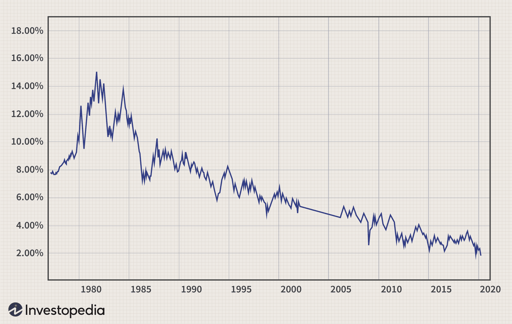

## Table of Contents

## What are U.S. Savings Bonds?

U.S. Savings Bonds are a type of investment that you can buy from the U.S. government. They are safe because they are backed by the full faith and credit of the United States. When you buy a savings bond, you are lending money to the government, and in return, the government promises to pay you back with interest over time. There are different types of savings bonds, like Series EE and Series I, each with its own rules about how much interest they earn and when you can cash them in.

Savings bonds are a good choice for people who want to save money without taking big risks. They are easy to buy and manage, and you can get them for as little as $25. You can buy them for yourself or as gifts for others. The interest on savings bonds is usually exempt from state and local taxes, and you might not have to pay federal tax on the interest if you use the money for qualified education expenses. Overall, savings bonds are a simple and secure way to save money for the future.

## What types of U.S. Savings Bonds are available for long-term investment?

For long-term investment, the U.S. government offers two main types of Savings Bonds: Series EE and Series I. Series EE Bonds are a good choice if you want a bond that will double in value in 20 years. They earn a fixed rate of interest, which means the rate stays the same for the entire time you own the bond. You can buy Series EE Bonds for as little as $25, and they are a safe way to save money because they are backed by the U.S. government.

Series I Bonds are another option for long-term saving. These bonds protect your money from inflation because they earn a rate of interest that changes twice a year. Part of the [interest rate](/wiki/interest-rate-trading-strategies) is fixed, and part changes with inflation. Like Series EE Bonds, you can buy Series I Bonds for as little as $25. They are also backed by the U.S. government, so they are a safe investment. Both types of bonds are good for saving money over many years, but they work a bit differently depending on whether you want a fixed rate or protection against inflation.

## How do U.S. Savings Bonds work as a long-term investment?

U.S. Savings Bonds are a good way to save money for a long time because they are safe and easy to buy. When you buy a Savings Bond, you are lending money to the U.S. government. The government promises to pay you back with interest over time. There are two main types of Savings Bonds for long-term saving: Series EE and Series I. Series EE Bonds earn a fixed rate of interest, which means the rate stays the same for the whole time you own the bond. They are a good choice if you want your money to double in value in 20 years. You can buy them for as little as $25.

Series I Bonds are different because they protect your money from inflation. Inflation is when the prices of things go up over time. Series I Bonds earn a rate of interest that changes twice a year. Part of the rate is fixed, and part changes with inflation. This means your money can keep up with the rising prices. Like Series EE Bonds, you can buy Series I Bonds for as little as $25. Both types of bonds are backed by the U.S. government, so they are a safe way to save money for the future. They are good for people who want to save without taking big risks.

## What are the benefits of investing in U.S. Savings Bonds for the long term?

Investing in U.S. Savings Bonds for the long term has many benefits. They are very safe because they are backed by the U.S. government. This means you won't lose your money, even if the economy is not doing well. Savings Bonds are also easy to buy and manage. You can get them for as little as $25, and you can buy them online or with your tax refund. They are a good choice if you want to save money without taking big risks.

Another benefit is that the interest on Savings Bonds is usually exempt from state and local taxes. If you use the money for qualified education expenses, you might not have to pay federal tax on the interest either. This can save you money. There are two types of Savings Bonds: Series EE and Series I. Series EE Bonds have a fixed interest rate and can double in value in 20 years. Series I Bonds protect your money from inflation because their interest rate changes with the cost of living. Both types are good for saving money over many years.

## What are the risks associated with long-term investment in U.S. Savings Bonds?

U.S. Savings Bonds are a safe way to save money because they are backed by the U.S. government. But there are still some risks to think about. One risk is that the interest rates on Savings Bonds might be lower than other investments like stocks or mutual funds. This means you might not earn as much money over time. If you need your money to grow a lot, Savings Bonds might not be the best choice.

Another risk is that you might need to wait a while to get your money back. If you cash in a Savings Bond before it has been five years, you might lose the last three months of interest. This is called an early redemption penalty. So, if you think you might need your money sooner, Savings Bonds might not be the best fit. But if you can leave your money in for a long time, Savings Bonds can be a good, safe way to save.

## How does inflation impact the value of U.S. Savings Bonds over the long term?

Inflation can affect the value of U.S. Savings Bonds over the long term. Inflation means that the prices of things go up over time, so the money you have can buy less. Series EE Bonds have a fixed interest rate, which means the rate stays the same no matter what happens with inflation. If inflation goes up a lot, the fixed rate of Series EE Bonds might not keep up with the rising prices. This means that over many years, the money you get back from Series EE Bonds might not be worth as much as when you first bought them.

Series I Bonds are different because they are designed to protect your money from inflation. They have an interest rate that changes twice a year. Part of the rate is fixed, and part changes with inflation. This means that if prices go up, the interest rate on Series I Bonds goes up too. Over the long term, Series I Bonds can help your money keep up with inflation, so your savings don't lose value. This makes Series I Bonds a good choice if you're worried about inflation when saving for the future.

## What is the process to purchase U.S. Savings Bonds for long-term investment?

To buy U.S. Savings Bonds for long-term investment, you can do it online through the TreasuryDirect website. First, you need to create an account on TreasuryDirect. You'll need to give them some personal information like your Social Security number and bank details. Once your account is set up, you can buy Savings Bonds. You can choose between Series EE Bonds and Series I Bonds. You can buy them for yourself or as gifts for others. The minimum amount you can buy is $25, and you can pay with money from your bank account.

Another way to buy Savings Bonds is by using your federal tax refund. When you file your taxes, you can choose to use part or all of your refund to buy Savings Bonds. You'll need to fill out a special form called Form 8888 when you file your taxes. This form tells the IRS to use your refund to buy the bonds. You can choose which type of bond you want and how much you want to spend. This is a good option if you want to save some of your tax refund for the future.

## How can one manage and track their U.S. Savings Bonds investment over time?

Managing and tracking your U.S. Savings Bonds is easy with the TreasuryDirect website. Once you've bought your bonds, you can log into your account anytime to see how they're doing. The website will show you the current value of your bonds, how much interest they've earned, and when they will mature. You can also set up alerts to remind you when your bonds are about to reach their full value or when it's a good time to cash them in. If you need to, you can also change the details of your account, like your bank information or contact details, right from the website.

If you prefer to keep track of your bonds without using the internet, you can keep paper records. When you buy a bond, you'll get a confirmation that includes all the important details like the bond's serial number, issue date, and the interest rate. You can keep these papers in a safe place and use them to track your bonds. Every year, you'll get a statement from the Treasury that tells you how much interest your bonds have earned. You can use this information to update your records. This way, you can keep an eye on your savings without needing to go online.

## What are the tax implications of holding U.S. Savings Bonds long term?

When you hold U.S. Savings Bonds long term, you need to think about taxes. The interest you earn on Savings Bonds is usually not taxed by state and local governments. This is good because it means you keep more of the money you earn. But, you do have to pay federal taxes on the interest. You can choose to pay the federal taxes each year or wait until you cash in the bonds or they reach maturity. If you wait, you'll report all the interest earned at once on your taxes.

There's a special rule that can help you save on federal taxes if you use the money from Savings Bonds for education. If you use the money to pay for qualified education expenses, like tuition and fees, you might not have to pay any federal tax on the interest. This can be a big help if you're saving for school. Just remember to keep good records of your education expenses so you can show them to the IRS if they ask.

## How does the interest rate of U.S. Savings Bonds affect long-term investment returns?

The interest rate on U.S. Savings Bonds is really important for how much money you'll make over a long time. Series EE Bonds have a fixed interest rate, which means the rate stays the same no matter what happens. If you buy a Series EE Bond, you know exactly how much interest you'll earn each year. These bonds are designed to double in value in 20 years, so if you hold onto them for that long, you'll get a good return on your money. But if the fixed rate is lower than what you can get from other investments, like stocks, your money might not grow as much.

Series I Bonds work differently because their interest rate changes to keep up with inflation. Part of the rate is fixed, and part changes every six months based on how much prices are going up. This means if inflation goes up, the interest rate on your Series I Bonds goes up too. Over many years, this can help your money keep its value even if prices are rising. So, if you're worried about inflation, Series I Bonds can be a good choice for long-term saving because they can help your investment grow along with the cost of living.

## What strategies can be used to optimize returns from U.S. Savings Bonds over decades?

To optimize returns from U.S. Savings Bonds over decades, it's important to understand the differences between Series EE and Series I Bonds. Series EE Bonds have a fixed interest rate, which means they can double in value in 20 years. If you want to get the most out of Series EE Bonds, you should hold onto them for at least 20 years. This way, you'll get the full benefit of the bond doubling in value. Also, try to buy Series EE Bonds when the fixed rate is high, because that will mean more interest over time. If you need to cash in your bonds before 5 years, you'll lose the last three months of interest, so it's best to only use this money for long-term goals.

Series I Bonds are good for protecting your money from inflation. Their interest rate changes every six months, with part of it fixed and part tied to inflation. To get the best returns from Series I Bonds, you should buy them when inflation is expected to go up. This way, your interest rate will increase, and your money will keep up with rising prices. Holding onto Series I Bonds for a long time can help your savings grow, even if the cost of living goes up. Both types of bonds are safe and backed by the U.S. government, so they're a good choice for saving money over many years without taking big risks.

## How do U.S. Savings Bonds compare to other long-term investment options like stocks or real estate?

U.S. Savings Bonds are a safe and easy way to save money for a long time. They are backed by the U.S. government, so you won't lose your money even if the economy is not doing well. Savings Bonds can be a good choice if you want to save without taking big risks. But, they usually have lower interest rates than other investments like stocks or real estate. This means you might not earn as much money over time. If you need your money to grow a lot, you might want to look at other options. Also, if you cash in your Savings Bonds before they've been held for five years, you'll lose the last three months of interest, which is something to think about if you might need your money sooner.

Stocks and real estate are different because they can offer higher returns, but they also come with more risk. Stocks can go up and down a lot, so you might make a lot of money, but you could also lose some. Real estate can be a good long-term investment because property values often go up over time, and you can earn money from rent. But, real estate needs a lot more money to start and can be hard to manage. You also have to think about things like taxes, repairs, and finding good tenants. So, while stocks and real estate might give you bigger returns, they are not as safe as Savings Bonds. The choice depends on how much risk you're willing to take and how much money you want to invest.

## What is the expected yield and how does it impact financial performance?

U.S. Savings Bonds, particularly Series EE and Series I, offer distinct yield characteristics essential for evaluating their financial performance compared to other bond types like corporate and municipal bonds. 

### Yield Expectations

Series EE bonds are noteworthy for their 20-year guarantee, which ensures investors will receive double the initial purchase price upon maturity. This translates to an effective annual interest rate of approximately 3.53%, derived from the formula for compounded interest required to double an investment over 20 years:

$$
A = P \times (1 + r)^n
$$

Where:
- $A$ is the amount of money accumulated after n years, including interest.
- $P$ is the principal amount (initial investment).
- $r$ is the annual interest rate.
- $n$ is the number of years the money is invested.

Setting $A = 2P$, $n = 20$, and solving for $r$, results in:

$$
2 = (1 + r)^{20}
$$

Taking the 20th root and rearranging, we find:

$$
r = (2)^{1/20} - 1 \approx 0.0353 \text{ or } 3.53\%\]

In comparison, corporate bonds generally offer higher yields to compensate for increased risk. According to data from the Federal Reserve, yields on investment-grade corporate bonds typically range from 2% to 5%, while high-yield corporate bonds can offer between 5% and 7% or more, depending on economic conditions.

Municipal bonds, often appealing due to their tax-exempt status, usually present lower yields. The yield on 10-year municipal bonds generally hovers between 1% and 3%, influenced by the issuer's credit rating and prevailing interest rates.

### Impact of the 20-Year Guarantee on Series EE Bonds

The 20-year guarantee feature of Series EE bonds provides a safety net for investors, ensuring a predictable return regardless of broader economic fluctuations. This guaranteed doubling makes EE bonds particularly attractive during periods of low interest rates or for risk-averse investors prioritizing capital preservation. However, it’s crucial to note that if EE bonds are redeemed before the 20-year mark, the yield is subject to prevailing market rates set by the U.S. Treasury, currently as low as 0.10%.

To summarize, while the predictable yield of Series EE bonds ensures a stable investment outcome over two decades, other bonds like corporate and municipal offer potentially higher returns along with associated risks. Investors must evaluate their risk tolerance, investment horizon, and financial objectives when selecting bonds to optimize their portfolio's performance.

## What are Inflation Protection Mechanisms?

Series I Savings Bonds, commonly known as I bonds, are designed explicitly to offer inflation protection for investors. Unlike traditional fixed-income securities, I bonds provide a composite interest rate composed of a fixed rate and an inflation rate, the latter of which is adjusted semi-annually. The inflation rate component is tied to the Consumer Price Index for All Urban Consumers (CPI-U), a widely used measure of inflation in the United States. 

### Mechanism of Inflation Protection

The unique structure of I bonds allows them to combat the erosion of purchasing power due to inflation. The inflation rate is adjusted every six months based on changes in the CPI-U. When inflation increases, the earnings rate on I bonds also rises, maintaining the real value of the investment. This mechanism ensures that the investor's purchasing power remains relatively stable, making I bonds a suitable option for savers worried about inflation.

Mathematically, the composite interest rate for I bonds can be represented as:

$$
\text{Composite Rate} = \text{Fixed Rate} + 2 \times \text{Semi-Annual Inflation Rate} + (\text{Fixed Rate} \times \text{Semi-Annual Inflation Rate})
$$

This formula illustrates how the fixed rate and inflation rate components work together to provide returns that can outpace inflation.

### Comparison with Regular Treasury Bonds and TIPS

In contrast, traditional Treasury bonds offer a fixed interest rate for the life of the bond. As such, their purchasing power can be significantly diminished in an inflationary environment because the nominal returns remain constant regardless of inflation fluctuations. Therefore, while Treasury bonds are considered low-risk investments, they do not provide direct inflation protection.

Treasury Inflation-Protected Securities (TIPS), on the other hand, are another government-backed option that offers inflation protection. TIPS achieve this by adjusting the principal amount based on changes in the CPI-U, providing returns that maintain value against inflation. While both I bonds and TIPS offer inflation protection, the key difference lies in the adjustment mechanism; I bonds adjust the interest rate, while TIPS adjust the principal.

Investors considering their bond investment options should note that I bonds offer a straightforward way to protect against inflation without the complexities associated with the principal adjustments found in TIPS. Furthermore, I bonds can be purchased in small denominations, offering greater accessibility to a broader range of investors compared to TIPS, which typically require a larger initial investment.

## References & Further Reading

[1]: U.S. Department of the Treasury. ["TreasuryDirect - U.S. Savings Bonds Information."](https://www.treasurydirect.gov/)

[2]: Securities Industry and Financial Markets Association. ["U.S. Savings Bonds: Questions & Answers."](https://www.sifma.org/)

[3]: Su, X. (2019). ["U.S. Treasury Inflation-Protected Securities: A Review of the Basics and Recent Developments."](https://www.dailymotion.com/video/x9bdb3a) Journal of Investment Consulting, 20(1), 45-58.

[4]: Siegel, J. J. (2008). ["Stocks for the Long Run"](https://books.google.com/books/about/Stocks_for_the_Long_Run_4th_Edition.html?id=188sAL2Q5QAC): The Definitive Guide to Financial Market Returns & Long-Term Investment Strategies.

[5]: Thau, A. (2010). ["The Bond Book"](https://www.amazon.com/Bond-Book-Third-Everything-Treasuries/dp/007166470X): Everything Investors Need to Know About Treasuries, Municipals, GNMAs, Corporates, Zeros, Bond Funds, Money Market Funds, and More.