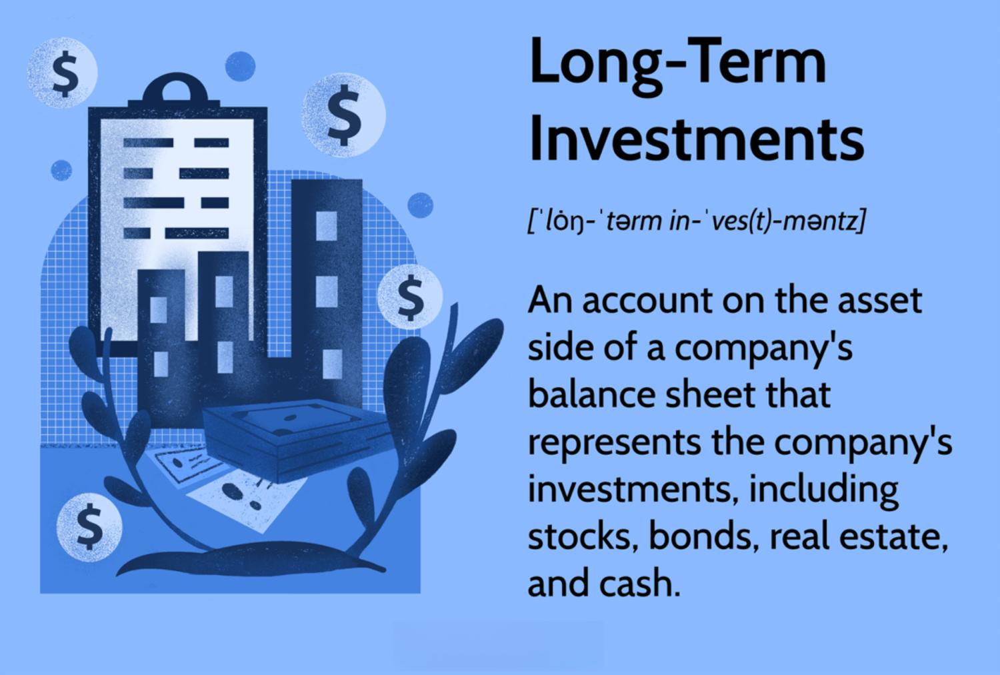

## Table of Contents

## What is a long-term investment?

A long-term investment is when you put your money into something for a long time, usually more than five years. This can be things like stocks, bonds, real estate, or even a retirement account. The idea is that over time, these investments will grow in value and give you more money than you started with. People choose long-term investments because they want their money to grow slowly but steadily, without having to worry about it every day.

One reason people like long-term investments is that they can be less risky than short-term ones. If you keep your money invested for a long time, small ups and downs in the market don't matter as much. Over many years, the overall trend is usually upward. This means you can be patient and wait for your investment to grow, rather than trying to make quick profits. It's like planting a tree; you water it and take care of it, and eventually, it grows big and strong.

## Why do companies include long-term investments on their balance sheets?

Companies put long-term investments on their balance sheets to show everyone how much money they have invested in things that will pay off in the future. This helps people who might want to invest in the company, like shareholders, understand how the company is planning to grow its money over time. It also shows that the company is thinking about the future and not just trying to make quick profits.

Including long-term investments on the balance sheet also helps the company keep track of its own financial health. It shows what assets the company owns that are expected to bring in money over a long period. This can include things like stocks, bonds, or even real estate. By showing these investments, the company can plan better for the future and make sure it has enough money coming in to keep running smoothly.

## What are the different types of long-term investments that can appear on a corporate balance sheet?

Long-term investments on a corporate balance sheet can include stocks and bonds. Stocks are pieces of ownership in other companies. When a company buys stocks, it hopes that the value of those stocks will go up over time. Bonds are like loans that the company gives to other companies or governments. The company gets interest payments over time and gets its money back when the bond matures. Both stocks and bonds can help the company make more money in the future.

Another type of long-term investment is real estate. This means the company owns land or buildings that it expects to increase in value over time. The company might also rent out the property to get regular income. Some companies also invest in other businesses, which are called subsidiaries. These are separate companies that the parent company controls and expects to grow and make money over the long term.

Lastly, companies might have long-term investments in things like patents or trademarks. These are called intangible assets because you can't touch them, but they can still be very valuable. A patent might give the company the right to make a special product, and a trademark can help protect the company's brand. These investments can help the company make money for many years into the future.

## How are long-term investments accounted for on a balance sheet?

Long-term investments on a balance sheet are shown under the section called "non-current assets." This part of the balance sheet lists all the things the company owns that it doesn't plan to turn into cash within the next year. The value of these investments is usually written down as what the company paid for them, but sometimes they can be shown at their current market value if the company chooses to do that. This helps everyone see how much money the company has tied up in investments that will pay off over time.

When a company buys stocks or bonds, they are usually shown at their cost on the balance sheet. If the value of these investments goes up or down, the company might not change the number on the balance sheet right away. Instead, they might wait until they sell the investment to show any profit or loss. For real estate or other physical assets, the company might show the value at what they paid for it, minus any wear and tear over time. This helps keep the balance sheet accurate and shows how much the company expects to get back from these investments in the long run.

## What is the difference between held-to-maturity, available-for-sale, and trading securities?

Held-to-maturity securities are investments that a company plans to keep until they reach their due date. These are usually bonds or other debt instruments. When a company buys these, they record them on their balance sheet at the price they paid. They don't change the value on the balance sheet even if the market price goes up or down. The company only shows any profit or loss when the bond matures and they get their money back.

Available-for-sale securities are investments that a company might sell before they mature. These can be stocks or bonds. On the balance sheet, these are shown at their current market value. If the market value goes up or down, the company records this change in a special part of their equity, but it doesn't affect their profit and loss until they actually sell the investment. This helps show how much the investments are worth right now, even if the company plans to keep them for a while.

Trading securities are investments that a company plans to buy and sell quickly to make a profit. These are usually stocks or short-term bonds. On the balance sheet, they are shown at their current market value, just like available-for-sale securities. But any changes in the market value go straight to the company's profit and loss statement. This means that if the value of these securities goes up or down, it affects the company's earnings right away.

## How do long-term investments impact a company's financial health and stability?

Long-term investments can help a company's financial health and stability by giving it a way to grow its money over time. When a company puts money into stocks, bonds, or real estate, it's hoping that these investments will increase in value. This can make the company's balance sheet look stronger because it shows that the company owns things that are worth more money. Plus, some long-term investments, like bonds, can give the company regular interest payments, which adds to its income and helps it stay stable.

But long-term investments can also be risky. If the value of the investments goes down, it can make the company's balance sheet look weaker. This is especially true if the company has to sell the investments before they have a chance to recover their value. Also, if the company has put too much money into long-term investments, it might not have enough cash on hand to pay its bills or handle unexpected problems. So, it's important for a company to balance its long-term investments with its need for short-term cash, to keep its financial health and stability strong.

## What are the risks associated with long-term investments on a corporate balance sheet?

Long-term investments on a corporate balance sheet can be risky because their value can go up or down over time. If the stock market crashes or the real estate market drops, the value of these investments can fall a lot. This can make the company's balance sheet look weaker and could scare away investors who might think the company is not doing well. Also, if the company needs money quickly, it might have to sell these investments at a bad time, which could mean losing money.

Another risk is that long-term investments tie up a lot of money that the company can't use for other things. If the company has put too much money into long-term investments, it might not have enough cash to pay its bills or handle unexpected problems. This can make the company less stable and more likely to run into financial trouble. So, it's important for the company to balance its long-term investments with its need for short-term cash to stay financially healthy.

## How do companies decide which long-term investments to make?

Companies decide which long-term investments to make by looking at their goals and how much risk they are willing to take. They think about what they want to achieve in the future, like growing their business or making more money. They also look at how much money they can afford to put into investments without hurting their day-to-day operations. For example, if a company wants to expand into new markets, it might invest in stocks of companies that are already successful in those markets. Or, if they want steady income, they might buy bonds that pay interest over time.

Another thing companies consider is the risk of the investment. Some investments, like stocks, can go up and down a lot, which is riskier. Others, like bonds, are usually more stable but might not grow as much. Companies also look at the economy and what experts are saying about the future. If they think the economy will do well, they might be more willing to take risks. But if they think things might get tough, they might choose safer investments. By weighing all these factors, companies try to pick long-term investments that will help them reach their goals while keeping their financial health strong.

## What role does the management of long-term investments play in corporate strategy?

The management of long-term investments is a big part of a company's overall plan. When a company decides where to put its money for the long term, it's thinking about how to grow and make more money in the future. The people in charge look at the company's goals and decide if they want to take risks or play it safe. For example, if the company wants to get bigger, they might buy stocks in other businesses that can help them grow. Or, if they want steady income, they might choose bonds that pay interest over time. Managing these investments well helps the company reach its goals and stay strong financially.

It's also important for the company to keep a good balance between long-term investments and the money they need right now. If they put too much money into long-term investments, they might not have enough cash to pay bills or handle surprises. So, the people managing the investments need to think about how much risk they're willing to take and how the economy is doing. By making smart choices about long-term investments, the company can plan for the future and make sure it stays healthy and stable.

## How are long-term investments reported in financial statements and what disclosures are required?

Long-term investments are shown on a company's balance sheet under the section called "non-current assets." This part of the balance sheet lists all the things the company owns that it doesn't plan to turn into cash within the next year. The value of these investments is usually written down as what the company paid for them, but sometimes they can be shown at their current market value if the company chooses to do that. This helps everyone see how much money the company has tied up in investments that will pay off over time.

In the company's financial statements, there are also notes that give more details about these long-term investments. These notes explain what kinds of investments the company has, like stocks, bonds, or real estate. They also tell you how much the company paid for these investments and how much they are worth now. If the value of the investments has gone up or down, the notes will say why and how this affects the company's money. This helps people who read the financial statements understand the company's plans and how well it's doing with its long-term investments.

## What are the tax implications of long-term investments for corporations?

When a company makes long-term investments, it has to think about taxes. If the company makes money from these investments, like when it sells stocks or bonds for more than it paid, it has to pay taxes on that profit. This is called capital gains tax. But if the company holds onto the investment for a long time, usually more than a year, the tax rate might be lower than if it sold the investment quickly. This can make long-term investments a good choice for saving on taxes.

Also, some long-term investments can help a company lower its taxes in other ways. For example, if a company buys real estate, it can take a tax deduction for the wear and tear on the property over time. This is called depreciation. And if the company invests in certain kinds of bonds, the interest it earns might not be taxed at all. So, by choosing the right long-term investments, a company can manage its taxes better and keep more of its money.

## How do analysts and investors evaluate the long-term investment strategy of a company?

Analysts and investors look at a company's long-term investment strategy to see if it's making smart choices with its money. They check the company's balance sheet to see what kinds of long-term investments it has, like stocks, bonds, or real estate. They want to know if these investments are helping the company grow and make more money over time. They also look at how much risk the company is taking with its investments. If the company is putting a lot of money into risky investments, it might be trying to grow fast, but it could also lose a lot if things go wrong.

Another thing analysts and investors do is read the notes in the company's financial statements. These notes give more details about the long-term investments, like how much the company paid for them and how much they are worth now. They also explain any changes in the value of the investments and why those changes happened. By looking at all this information, analysts and investors can decide if the company's long-term investment strategy is good for its future and if it's a safe place to put their own money.

## What is the relationship between Algorithmic Trading and Long-Term Investments?

Algorithmic trading, often associated with rapid-fire transactions and minute price movements, has traditionally been utilized within short-term trading paradigms to capitalize on fleeting market inefficiencies. However, [algorithmic trading](/wiki/algorithmic-trading) extends beyond these conventional applications, showing potential to enhance long-term investment strategies by leveraging systematic analysis and execution. This approach integrates robust mathematical models and sophisticated algorithms, facilitating the precise management of complex investment portfolios.

For long-term investments, algorithmic trading provides the advantage of continuous portfolio management through real-time data analysis. This ensures that investment decisions align seamlessly with predefined strategies, thereby optimizing portfolios for risk-adjusted returns. Central to this optimization are key financial metrics such as the Sharpe Ratio and Treynor Ratio.

The Sharpe Ratio, a measurement of risk-adjusted return, is calculated as:

$$
\text{Sharpe Ratio} = \frac{R_p - R_f}{\sigma_p}
$$

where $R_p$ represents the return on the portfolio, $R_f$ is the risk-free rate, and $\sigma_p$ is the standard deviation of the portfolio's excess return. Employing this ratio allows investors to understand the added value of portfolio risk management through algorithmic strategies, determining how much risk is being borne to achieve the excess return.

Similarly, the Treynor Ratio, another pivotal metric, measures returns earned in excess of what could have been earned on a riskless investment per unit of market risk. It is computed as:

$$
\text{Treynor Ratio} = \frac{R_p - R_f}{\beta_p}
$$

where $\beta_p$ signifies the beta of the portfolio, reflecting its systemic risk relative to the broader market. Using these ratios allows for comparative assessments, aiding investors to optimize their portfolio compositions corresponding to varying market conditions.

Incorporating algorithmic trading within long-term investment strategies supports the synthesis of automatic portfolio adjustments with predefined models, enabling investors to harness extensive data analytics. This integration facilitates a balance between capturing growth potential and managing risks, ensuring sustained portfolio enhancement and resilience against market volatilities.

As market conditions fluctuate, algorithmic systems can dynamically adjust asset allocations to maintain alignment with strategic investment goals, bearing the capacity for continuous learning and adaptation as new data emerges. This results in more informed decision-making processes, setting the stage for improved financial outcomes over extended investment horizons.

## What are the key ratios and strategies in algo trading?

To effectively manage long-term investment portfolios using algorithmic trading, several key ratios are critical in assessing risk-adjusted performance. Among these, the Sharpe Ratio and Treynor Ratio are particularly significant for evaluating the efficiency and risk associated with investment strategies.

### Sharpe Ratio

The Sharpe Ratio is a measure of risk-adjusted return, providing insights into how much excess return an investment can deliver per unit of [volatility](/wiki/volatility-trading-strategies). It is calculated as:

$$
\text{Sharpe Ratio} = \frac{R_p - R_f}{\sigma_p}
$$

Where:
- $R_p$ is the expected portfolio return,
- $R_f$ is the risk-free rate of return,
- $\sigma_p$ is the portfolio's standard deviation of return.

A higher Sharpe Ratio indicates a more attractive risk-adjusted return. It is widely used by investors to compare portfolio performance against risk-free assets and to benchmark different portfolios.

### Treynor Ratio

The Treynor Ratio, similar to the Sharpe Ratio, measures returns adjusted for risk but focuses specifically on systematic risk by using beta ($\beta$), which reflects the portfolio's sensitivity to market movements. It is defined as:

$$
\text{Treynor Ratio} = \frac{R_p - R_f}{\beta_p}
$$

Where:
- $\beta_p$ is the beta of the portfolio.

A higher Treynor Ratio suggests a better performance for the level of market risk undertaken. This is especially useful in comparing portfolios or strategies with similar beta values.

### Common Strategies in Algorithmic Trading

**Mean Reversion**: This strategy assumes that asset prices and historical returns will revert to their long-term mean over time. Algorithms identify deviations from average price levels, signaling potential buy or sell opportunities as prices revert to mean. 

**Trend Following**: This approach is predicated on the belief that securities exhibiting upward momentum will continue rising, and those trending downward will continue falling. Algorithms detect trends based on historical data, using indicators such as moving averages to execute trades aligned with the trend direction.

**Momentum Investing**: Similar to trend following, momentum investing capitalizes on the continuance of existing market trends. However, it focuses mainly on buying securities with strong upward price movements and short-selling those with poor performance.

### Python Example

To illustrate, here is a simple Python example of calculating the Sharpe Ratio:

```python
import numpy as np

# Example returns
portfolio_returns = np.array([0.15, 0.10, 0.12, 0.09, 0.14])
risk_free_rate = 0.03

# Calculate expected portfolio return and standard deviation
expected_return = np.mean(portfolio_returns)
std_dev = np.std(portfolio_returns)

# Calculate Sharpe Ratio
sharpe_ratio = (expected_return - risk_free_rate) / std_dev
print(f"Sharpe Ratio: {sharpe_ratio}")
```

This code computes the Sharpe Ratio for given portfolio returns, helping investors assess investment performance relative to the inherent risk.

By understanding and strategically employing these ratios and algorithmic approaches, investors can construct robust, well-balanced portfolios capable of achieving consistent returns over the long term.

## References & Further Reading

[1]: Bergstra, J., Bardenet, R., Bengio, Y., & Kégl, B. (2011). ["Algorithms for Hyper-Parameter Optimization."](https://papers.nips.cc/paper/4443-algorithms-for-hyper-parameter-optimization) Advances in Neural Information Processing Systems 24.

[2]: ["Advances in Financial Machine Learning"](https://www.amazon.com/Advances-Financial-Machine-Learning-Marcos/dp/1119482089) by Marcos Lopez de Prado

[3]: ["Evidence-Based Technical Analysis: Applying the Scientific Method and Statistical Inference to Trading Signals"](https://www.amazon.com/Evidence-Based-Technical-Analysis-Scientific-Statistical/dp/0470008741) by David Aronson

[4]: ["Machine Learning for Algorithmic Trading"](https://github.com/PacktPublishing/Machine-Learning-for-Algorithmic-Trading-Second-Edition) by Stefan Jansen

[5]: ["Quantitative Trading: How to Build Your Own Algorithmic Trading Business"](https://books.google.com/books/about/Quantitative_Trading.html?id=j70yEAAAQBAJ) by Ernest P. Chan