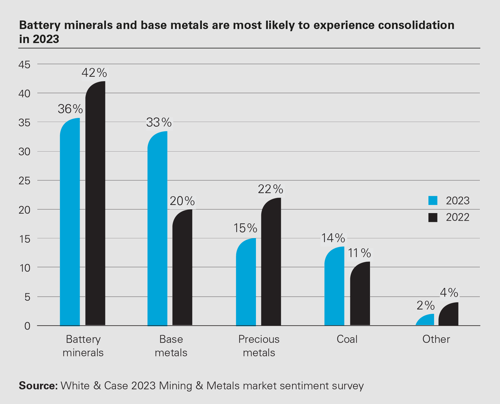

## Table of Contents

## What are the primary metals involved in the mining sector?

The mining sector focuses on extracting different metals from the earth. Some of the main metals they mine are iron, copper, and gold. Iron is very important because it is used to make steel, which is used in buildings and cars. Copper is also important because it is a good conductor of electricity, so it is used in wires and electronics. Gold is valuable and used in jewelry and some electronics too.

Another important metal in mining is aluminum. It is light and strong, so it's used in airplanes and cans. Zinc is also mined a lot. It is used to protect other metals from rusting, like in galvanized steel. Nickel is another metal that miners look for. It is used in batteries and some special kinds of steel. These metals are all important for different reasons, and the mining industry works hard to get them out of the ground.

## How does the demand for metals influence the mining industry?

The demand for metals has a big effect on the mining industry. When people want more metals, like for building things or making electronics, miners need to find and dig up more of them. This can mean opening new mines or working harder at old ones. If the demand goes up a lot, the price of metals can go up too. This can make mining companies want to mine more because they can make more money.

But if the demand for metals goes down, it can be hard for the mining industry. When people don't need as many metals, the price can drop. This might make some mines not worth keeping open because they cost too much to run. Sometimes, mining companies might have to close mines or lay off workers. So, the mining industry always has to watch the demand for metals closely and be ready to change how they work.

## What are the current global trends affecting the metals and mining sector?

One big trend affecting the metals and mining sector right now is the push for greener and more sustainable practices. More and more, people want mining companies to use less energy, produce less waste, and be kinder to the environment. This means mining companies are trying new ways to mine that are less harmful. They are also looking for metals that help with green technologies, like lithium and cobalt for electric car batteries. This trend is changing how mining is done and what metals are most important.

Another trend is the growing demand for metals used in technology and renewable energy. As more people use smartphones, computers, and electric cars, the need for metals like copper, nickel, and rare earth elements is going up. This is good for the mining industry because it means more business, but it also means they need to find new places to mine and figure out how to get these metals out of the ground in a way that's good for the planet. Balancing this demand with sustainable practices is a big challenge for the mining sector right now.

## How do environmental regulations impact the long-term outlook for mining?

Environmental regulations are making a big difference in the long-term outlook for mining. These rules are getting stricter all the time because people want to protect the environment. Mining companies have to follow these rules, which can make mining more expensive. They might need to spend more money on new technology to clean up after mining or to make sure they don't harm the environment while they work. This can make some mines less profitable or even not worth keeping open.

On the other hand, these regulations can also push mining companies to find better ways to do things. They might come up with new ways to mine that are kinder to the earth. This can help them in the long run because people and governments will like them more if they are seen as being good to the environment. Also, if they can find ways to mine that don't harm the environment as much, they might be able to keep mining in places where they couldn't before. So, while environmental regulations can make things harder for mining companies in the short term, they can also lead to better, more sustainable ways of mining in the long term.

## What role does technological advancement play in the future of metal extraction?

Technological advancement is really important for the future of metal extraction. New technologies can help miners find metals easier and dig them up in a way that's better for the environment. For example, better machines and computers can help miners find where the metals are hidden deep underground. This means they can mine in places they couldn't before. Also, new tools can make mining safer for the people who work in the mines. This is good because it means fewer accidents and healthier workers.

Another way technology helps is by making mining cleaner. New ways of mining can use less water and energy, and they can make less waste. This is important because people care more about the environment now. If mining companies can use these new technologies, they can keep mining without hurting the planet as much. This can also help them follow the rules about the environment, which are getting stricter. So, technology can make mining better for everyone in the long run.

## How are geopolitical factors shaping the metals and mining industry?

Geopolitical factors are really important for the metals and mining industry. Countries that have a lot of metals can have more power because other countries need those metals. For example, if a country has a lot of copper or lithium, they can control how much it costs and who gets it. This can make some countries try to be friends with them or even fight over the metals. Also, if there are problems like wars or bad relationships between countries, it can make it hard to mine and sell metals. This can make the price of metals go up and down a lot.

Another way geopolitics affects mining is through trade rules and sanctions. Some countries might put rules on how much metal can be sold to other countries, or they might stop selling metals to certain countries because of politics. This can make it hard for mining companies to know how much they can sell and where they can sell it. It can also make them think about moving their mining operations to different countries where the rules are better for them. So, the politics between countries can change a lot about how the mining industry works and where it happens.

## What are the economic forecasts for major metals like copper, iron, and gold?

The economic forecasts for major metals like copper, iron, and gold depend on a lot of things. For copper, the demand is expected to keep going up because it's used in so many things, like electric cars and renewable energy. This could make the price of copper go up too. But if new mines open up or if people find new ways to use less copper, the price might not go up as much. For iron, the demand is mostly from building things and making cars. If the economy is doing well and people are building a lot, the demand for iron could stay strong. But if there's a slowdown in building, the price of iron might go down.

For gold, things are a bit different. Gold is seen as a safe place to put money when the economy is not doing well. So, if there's a lot of uncertainty or if people are worried about the economy, the price of gold could go up. But if the economy is doing well and people feel safe putting their money in other things, the demand for gold might not be as high. Overall, the prices of these metals can change a lot based on what's happening in the world, like new technology, how fast the economy is growing, and even politics between countries.

## How does the shift towards renewable energy sources affect metal demand?

The shift towards renewable energy sources is changing the demand for metals a lot. When we use more solar panels, wind turbines, and electric cars, we need more metals like copper, lithium, and rare earth elements. Copper is used in the wires for these things because it's good at carrying electricity. Lithium and cobalt are important for the batteries in electric cars. So, as more people use renewable energy, the demand for these metals goes up. This can be good for the mining industry because they can sell more metals, but it also means they need to find new places to mine and do it in a way that's good for the environment.

But this shift can also make things harder for some metals. For example, if fewer people use cars that run on gas, the demand for iron and steel might go down because these metals are used a lot in making those cars. This can make some mines less busy or even close if there's not enough demand. So, the move to renewable energy changes what metals are needed the most. Mining companies need to pay attention to these changes and be ready to switch to mining the metals that are in demand. This can help them keep making money and doing well in the future.

## What are the potential risks and challenges facing the mining sector in the next decade?

In the next ten years, the mining sector will face many risks and challenges. One big challenge is the need to follow stricter environmental rules. Governments are making these rules tougher because people want to protect the earth. This can make mining more expensive because companies have to spend money on new technology to be cleaner and safer. If they can't do this, some mines might have to close. Another risk is the changing demand for metals. As the world uses more renewable energy, the demand for metals like lithium and copper will go up, but the demand for metals used in old kinds of energy, like iron for gas cars, might go down. Mining companies need to be ready to change what they mine to stay in business.

Another challenge is dealing with geopolitical issues. Countries with a lot of important metals can use this to have more power. If there are fights or bad relationships between countries, it can be hard to mine and sell metals. This can make the price of metals go up and down a lot. Also, trade rules and sanctions can make it tough for mining companies to know where they can sell their metals. They might need to move their mining to different countries where the rules are better. All these things can make it hard for the mining industry to plan for the future and stay successful.

Lastly, technological advancements will also bring challenges. While new technology can help find and mine metals in better ways, it can be expensive to use. Mining companies might need to spend a lot of money to get these new machines and computers. If they don't keep up with the new technology, they might fall behind other companies. Also, there's always the risk that new technology could make some metals less important if people find new ways to do things without them. So, the mining sector needs to be smart about using technology to stay ahead and keep mining in a way that's good for the planet and their business.

## How can sustainability practices be integrated into long-term mining strategies?

Mining companies can make their long-term plans more sustainable by using new technology that is kinder to the environment. They can use machines that use less energy and make less waste. This can help them follow the rules about the environment and also save money in the long run. Another way to be more sustainable is to think about the whole life of a mine, from when it starts to when it closes. Companies can plan to clean up the land after they finish mining so it can be used for other things, like parks or farms. This can make people and governments happier with mining and help the companies keep their good name.

Also, mining companies can work with local people and listen to what they want. This can mean hiring people from the area or helping to build schools and hospitals. By being good neighbors, mining companies can make sure they are welcome to keep mining in the area. Another important thing is to keep looking for new ways to use metals that are good for the environment, like using more recycled metals or finding new metals that help with green technology. By doing all these things, mining companies can make sure they are around for a long time and help take care of the planet too.

## What are the investment opportunities in the metals and mining sector for the next 20 years?

Over the next 20 years, there will be many good chances to invest in the metals and mining sector. One big opportunity is in metals that help with green energy, like lithium and cobalt. These metals are used in batteries for electric cars and in storing energy from solar and wind power. As more people use these green technologies, the demand for these metals will go up a lot. Investing in companies that mine these metals could be a smart move because they will likely make more money as the demand grows.

Another good opportunity is in companies that use new technology to mine in a way that's better for the environment. People and governments care more about the earth now, so mining companies that can find and use metals without hurting the planet as much will do well. These companies might need money to buy new machines and computers, so investing in them can help them grow and make more money. Also, as the world keeps changing, there might be new metals that become important, so keeping an eye on new trends and investing in companies that can quickly change to mine these new metals could be a good idea too.

## How might the global supply chain for metals evolve in response to future market demands?

The global supply chain for metals will change a lot in the next few years because of what people want. As more people use electric cars and green energy, the need for metals like lithium, cobalt, and copper will go up. This means mining companies will have to find more places to mine these metals and make sure they can get them to the people who need them quickly. They might need to build new mines or make old ones bigger. Also, countries that have a lot of these important metals might become more powerful because other countries will need to buy from them. This can change how countries trade with each other and might even cause fights over who gets to mine where.

Another way the supply chain will change is because of new technology and rules about the environment. Mining companies will have to use new machines and computers that use less energy and make less waste. This can make mining more expensive, but it's important to follow the new rules. Also, as people care more about where their metals come from, mining companies might need to be more open about how they mine and make sure they treat the earth and local people well. This can mean working with local people and cleaning up the land after they finish mining. All these changes will make the supply chain for metals more complicated, but also more important for the future.

## References & Further Reading

[1]: ["Advances in Financial Machine Learning"](https://www.amazon.com/Advances-Financial-Machine-Learning-Marcos/dp/1119482089) by Marcos Lopez de Prado

[2]: Bergstra, J., Bardenet, R., Bengio, Y., & Kégl, B. (2011). ["Algorithms for Hyper-Parameter Optimization."](https://dl.acm.org/doi/10.5555/2986459.2986743) Advances in Neural Information Processing Systems 24.

[3]: ["Machine Learning for Algorithmic Trading"](https://github.com/stefan-jansen/machine-learning-for-trading) by Stefan Jansen

[4]: ["Evidence-Based Technical Analysis: Applying the Scientific Method and Statistical Inference to Trading Signals"](https://www.amazon.com/Evidence-Based-Technical-Analysis-Scientific-Statistical/dp/0470008741) by David Aronson

[5]: ["Quantitative Trading: How to Build Your Own Algorithmic Trading Business"](https://github.com/LucindaYa/quant-resources/blob/master/Quantitative%20Trading%20How%20to%20Build%20Your%20Own%20Algorithmic%20Trading%20Business.pdf) by Ernest P. Chan