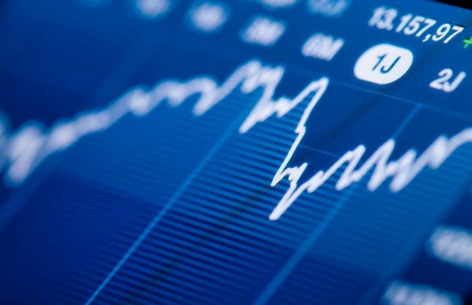

The stock market presents a wide array of investment strategies that cater to long-term growth and wealth creation. With the advent of technology and advanced computing, algorithmic trading has emerged as a prominent trend within investment portfolios. This integration is reshaping how investors manage their portfolios by leveraging data-driven techniques to improve decision-making and execution efficiency.

Long-term investment in the stock market is a well-established method for building wealth, primarily through the benefits of compounding returns and capitalizing on economic growth over extended periods. Algorithmic trading enhances these advantages by facilitating strategies that are consistent, precise, and devoid of emotional bias. By executing trades based on pre-defined criteria and real-time market conditions, algorithmic trading offers a level of accuracy and speed that is difficult to achieve manually.



This article examines the ways in which long-term investments benefit from stock market participation, addressing the power of compound interest and strategic holding through periods of volatility. Additionally, it explores how algorithmic trading can complement long-term investment approaches by optimizing entry and exit points, minimizing trading costs, and reducing the impact of market volatility. The mechanics of algorithmic trading, including the use of computer programs and algorithms, supports investors in achieving these goals efficiently.

The synergy between traditional long-term investment strategies and modern algorithmic trading tools positions investors to capture the best of both worlds—sustained wealth accumulation bolstered by technological innovation. The integration of these methodologies reflects an evolution in investment strategy, where data and technology drive smarter, more effective investment decisions. As the investment landscape continues to evolve, understanding the role of algorithmic trading within a long-term investment strategy presents a significant opportunity for modern investors.

## Table of Contents

## Benefits of Long-Term Stock Market Investment

Investing in stocks for the long term delivers considerable financial benefits that can substantially enhance an investor's wealth over time. One of the primary advantages is the effect of compounding returns. Compounding occurs when investment earnings are reinvested to generate additional income across multiple periods. This exponential growth can significantly amplify an investor's wealth, as demonstrated by the formula for compound interest:

$$
A = P \left(1 + \frac{r}{n}\right)^{nt}
$$

where $A$ is the amount of money accumulated after $n$ years, including interest. $P$ is the principal investment amount, $r$ is the annual interest rate, $n$ is the number of times that interest is compounded per year, and $t$ is the time in years.

Long-term investments in stocks also incur less frequent trading costs. Since the investor is not continuously buying and selling securities, transaction fees are minimized, leading to lower overall expenses. This cost efficiency plays a critical role in enhancing net returns over time.

Additionally, tax considerations bolster the appeal of long-term stock investments. Long-term capital gains are typically subject to lower tax rates compared to short-term gains, which are taxed as ordinary income. This tax advantage provides considerable benefits to investors who hold their investments over extended periods.

Empirical evidence supports the potential of long-term stock investments to generate wealth. For example, historical data from the S&P 500 index indicates consistent positive returns for the majority of 20-year holding periods. This reliability underscores the capacity of long-term stock investments to increase wealth effectively.

Moreover, long-term investing offers the advantage of stabilizing an investor’s return profile amidst market [volatility](/wiki/volatility-trading-strategies). By focusing on a longer horizon, investors can endure periods of market downturns and recoveries, mitigating the influence of short-term price fluctuations. This stability curtails emotional trading, which often leads to suboptimal decisions driven by fear or greed.

In conclusion, the practice of holding stocks for the long term is underscored by compelling benefits, including compound growth, reduced trading costs, favorable taxation, reliable returns, and a buffer against market volatility, all of which combine to facilitate effective wealth creation over time.

## Understanding Algorithmic Trading

Algorithmic trading harnesses the power of computer programs to execute trades based on pre-defined criteria. This form of trading is characterized by speed, efficiency, and precision, largely eliminating the need for human intervention. At its core, [algorithmic trading](/wiki/algorithmic-trading) involves the use of complex mathematical models and automated systems to make high-frequency trading decisions with minimal latency.

The significant advantage of algorithmic trading is its ability to execute trades at a speed and frequency that is impossible for a human trader. This rapid execution is achieved through sophisticated algorithms that scan the market for trading opportunities using statistical and mathematical techniques. The algorithms can assess multiple market conditions simultaneously, making decisions in a fraction of a second.

One key benefit of algorithmic trading is the reduced influence of human emotions and errors. By relying on pre-set instructions and comprehensive data, these algorithms can prevent impulsive decisions that often plague manual trading. This leads to improved accuracy in trade execution, as predetermined strategies are followed consistently.

Algorithmic strategies can be tailored to follow various trading methodologies, including trend-following and mean reversion. Trend-following algorithms focus on identifying and capitalizing on market [momentum](/wiki/momentum), buying stocks that show upward price momentum and selling those showing a downward trend. An example of a simple trend-following strategy could involve moving averages, which are calculated to smooth out price data over a specified period, helping identify the direction of the trend. 

On the other hand, mean reversion strategies are based on the statistical theory that asset prices tend to revert to their historical mean or average level over time. In this approach, the algorithm might buy asset classes when their price is below their historical average and sell them when the price is above the average, predicting a reversal back towards the mean.

Consistent with automation's primary goals, algorithmic trading makes it possible to test strategies using historical market data, a process known as [backtesting](/wiki/backtesting). This helps traders validate the efficacy of strategies before deploying them in the live market, optimizing performance and minimizing risks.

In conclusion, algorithmic trading significantly enhances trading efficiency and precision, representing a powerful tool for both institutional and individual investors. These systems allow traders to leverage data-driven strategies and achieve more consistent and reliable trading results.

## How Algorithmic Trading Benefits Long-Term Investors

Algorithmic trading offers significant advantages for long-term investors, primarily by eliminating emotional bias and enabling data-driven decision-making. By adhering strictly to predefined criteria, these algorithms ensure that buy and sell points are optimized based on quantitative data rather than subjective emotions. This is crucial for maintaining consistency in investment strategies over time, especially during volatile market conditions where investor psychology can lead to irrational decisions.

One of the key benefits of algorithmic trading is its ability to reduce transaction costs. By executing trades at the most opportune times and prices, algorithms can minimize the market impact, thereby lowering the expenses associated with trading. This efficiency is particularly important for long-term investors who are concerned with maximizing net returns. Additionally, algorithms support backtesting capabilities, which allow investors to evaluate trading strategies using historical data to determine their effectiveness before actual implementation. This analytical approach enhances the robustness of investment decisions.

Long-term investors can utilize specific algorithmic strategies such as Volume Weighted Average Price (VWAP) and Time Weighted Average Price (TWAP). These strategies are particularly beneficial because they aim to execute trades at prices that approximate historical averages, thereby reducing market impact and improving execution quality. VWAP calculates the average price of a security over a set period, weighted by [volume](/wiki/volume-trading-strategy), and is typically used as a benchmark for trade execution. On the other hand, TWAP divides a large order into smaller, equally spaced trades over a given period, ensuring consistent execution over time.

Incorporating these algorithmic strategies into a long-term investment portfolio can significantly enhance performance by ensuring that trades are executed efficiently and strategically. By minimizing human error and emotional decision-making, algorithms help investors maintain a disciplined approach to portfolio management, ultimately leading to better overall returns. As such, embracing algorithmic trading technologies can offer substantial benefits in optimizing the long-term growth and sustainability of investment portfolios.

## Financial and Technical Requirements for Algorithmic Trading

Successful implementation of algorithmic trading hinges on a robust software setup, continuous connectivity, and access to real-time market data. This technological infrastructure is critical for executing trades efficiently and capturing opportunities in the fast-paced financial markets.

At the forefront is the necessity for high-performance trading platforms capable of executing complex algorithms with minimal latency. These platforms must be equipped to handle substantial data throughput, as they process large volumes of market data to identify profitable trading signals. Continuous connectivity is another crucial requirement, ensuring that traders maintain uninterrupted access to market exchanges. This is typically achieved through direct market access (DMA) services, which offer high-speed connections for executing trades at optimal prices.

Real-time market data access forms the backbone of algorithmic trading strategies. This data includes price feeds, trading volume, and [order book](/wiki/order-book-trading-strategies) depth, which are critical inputs for generating and executing trading commands. Access to reliable and low-latency data feeds is essential to remain competitive, as outdated or incorrect information can lead to suboptimal trading decisions.

Programming skills are vital for traders who design and test bespoke algorithms. Proficient knowledge of languages such as Python, R, or C++ is often required to develop and implement trading strategies. Python, in particular, is favored for its extensive libraries like Pandas and NumPy, which facilitate data manipulation and analysis. Traders can employ the following Python example to calculate a moving average, a common component in many algorithmic strategies:

```python
import pandas as pd

# Sample data: Date and Price
data = {'Date': pd.date_range(start='2023-01-01', periods=10, freq='D'),
        'Price': [110, 108, 112, 115, 114, 117, 119, 118, 120, 122]}

df = pd.DataFrame(data)

# Calculate the 3-day moving average
df['3-day MA'] = df['Price'].rolling(window=3).mean()

print(df)
```

Many platforms now offer pre-built tools that simplify the deployment of algorithmic trading strategies. These platforms often provide user-friendly interfaces and pre-coded modules, allowing traders to focus on strategy optimization rather than software development.

For long-term investors, understanding the basics of algorithmic strategies can significantly enhance portfolio performance by optimizing trade execution. Algorithmic trading techniques can minimize trading costs and slippage, thus preserving capital. As the investment landscape evolves with technological advancements, integrating algorithmic strategies into traditional investment practices is becoming increasingly advantageous.

## Common Strategies in Algorithmic Trading

Algorithmic trading encompasses a range of strategies designed to capitalize on market inefficiencies and optimize trade execution. Among these, trend-following strategies, [arbitrage](/wiki/arbitrage) opportunities, and index fund rebalancing are prevalent.

Trend-following strategies aim to capture gains through the recognition and analysis of price trends. Algorithms facilitate these strategies by utilizing moving averages and other technical indicators to identify and follow upward or downward price movements efficiently. For instance, a common trend-following method is the moving average crossover. This strategy utilizes calculations of short-term and long-term moving averages, with a simple algorithm that triggers a buy signal when the short-term average crosses above the long-term average, and a sell signal when it crosses below. This systematic approach reduces human error and emotional biases, allowing for consistent strategy application.

Arbitrage strategies focus on exploiting price differentials across different markets or assets. Algorithms enable traders to execute simultaneous buy and sell orders to capture these price inefficiencies. For example, [statistical arbitrage](/wiki/statistical-arbitrage) involves complex algorithms that identify relationships between asset prices and execute trades when deviations from statistical norms occur. This capability to process vast amounts of data rapidly and execute trades almost instantaneously is crucial, given that arbitrage opportunities can be fleeting.

Index fund rebalancing involves adjusting the components of a fund to mirror a specific market index consistently. Algorithms can manage this process by executing trades that align with benchmark indices, minimizing tracking error and ensuring consistent returns over the long term. By automating order placement to maintain the desired asset allocation, algorithms enhance the efficiency and accuracy of fund management.

These algorithmic trading strategies demonstrate the powerful role technology plays in modern finance. By automating complex trading strategies, investors can improve execution speed, reduce transaction costs, and increase the reliability of their investment decisions.

## Conclusion

Long-term investment in the stock market has historically been a reliable strategy for wealth creation, allowing investors to capitalize on the market's overall upward trajectory. This approach benefits from the compounding effect, where returns earned over time generate their own earnings. Algorithmic trading introduces an additional layer of efficiency and precision, enabling data-driven decision-making that enhances this tried-and-tested investment method.

By implementing algorithms, investors can streamline their portfolio management strategies, effectively reducing the potential for human error and emotional biases that often lead to suboptimal decisions. Algorithms enable automated trade executions, which helps in achieving optimal entry and [exit](/wiki/exit-strategy) points based on predefined criteria, thus optimizing returns over an extended period.

Moreover, algorithmic trading offers significant advantages in terms of backtesting strategies. Investors can use historical data to evaluate the performance of specific strategies before deploying them in live trading, thereby ensuring that the chosen approach is statistically sound and has the potential to perform well in various market conditions. This characteristic allows for a robust analysis and optimization of strategies to meet long-term investment goals.

As financial markets continue to evolve, keeping pace with technological advancements becomes crucial. Embracing algorithmic trading not only aligns investors with modern practices but also equips them with tools to navigate complex and fast-paced markets effectively. By leveraging these technologies, investors can enhance their competitive edge, enabling more informed decisions that align with their long-term financial objectives.

## References & Further Reading

[1]: Bergstra, J., Bardenet, R., Bengio, Y., & Kégl, B. (2011). ["Algorithms for Hyper-Parameter Optimization."](https://papers.nips.cc/paper/4443-algorithms-for-hyper-parameter-optimization) Advances in Neural Information Processing Systems 24.

[2]: ["Advances in Financial Machine Learning"](https://www.amazon.com/Advances-Financial-Machine-Learning-Marcos/dp/1119482089) by Marcos Lopez de Prado

[3]: ["Evidence-Based Technical Analysis: Applying the Scientific Method and Statistical Inference to Trading Signals"](https://www.amazon.com/Evidence-Based-Technical-Analysis-Scientific-Statistical/dp/0470008741) by David Aronson

[4]: ["Machine Learning for Algorithmic Trading"](https://github.com/stefan-jansen/machine-learning-for-trading) by Stefan Jansen

[5]: ["Quantitative Trading: How to Build Your Own Algorithmic Trading Business"](https://www.amazon.com/Quantitative-Trading-Build-Algorithmic-Business/dp/1119800064) by Ernest P. Chan