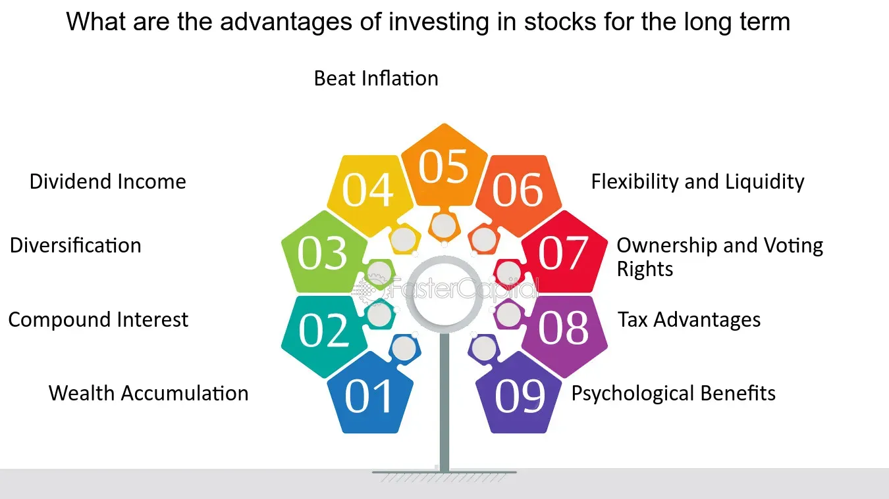

## Table of Contents

## What is long-term stock investment?

Long-term stock investment means buying stocks and holding them for a long time, usually many years. People do this because they believe the company will grow and the stock price will go up over time. This is different from short-term trading, where people buy and sell stocks quickly to make fast profits. Long-term investors are more patient and focus on the future potential of the company.

When you invest in stocks for the long term, you might see your money grow a lot over time. This is because good companies can increase their profits and become more valuable. Long-term investing can also be less stressful than short-term trading because you don't need to watch the stock market every day. However, it's important to choose your stocks carefully and be ready to wait for years to see big returns.

## How does long-term stock investment differ from short-term trading?

Long-term stock investment and short-term trading are two different ways to make money from stocks. Long-term investing means buying stocks and keeping them for many years. People who do this believe that the companies they invest in will grow over time, making their stocks more valuable. They are patient and don't worry about small changes in the stock price every day. Instead, they focus on the big picture and the future potential of the company.

On the other hand, short-term trading is about buying and selling stocks quickly, often within days or weeks. Traders who do this are trying to make quick profits from small changes in stock prices. They need to watch the market closely and make fast decisions. This can be exciting but also stressful because the stock market can be unpredictable in the short term. Short-term trading requires a lot of time and attention, while long-term investing is more about waiting and being patient.

Both strategies have their own risks and rewards. Long-term investing can lead to big gains over time but requires patience and a belief in the company's future. Short-term trading can make money faster but is riskier and more demanding. Choosing between the two depends on your goals, how much time you can spend, and how much risk you are willing to take.

## What are the basic advantages of investing in stocks for the long term?

Investing in stocks for the long term has several big advantages. One main advantage is that it gives your money more time to grow. When you hold onto stocks for many years, you can benefit from the power of compounding. This means that not only do your stocks grow in value, but the gains you make can also earn more money over time. This can lead to big increases in your investment over the long run. Another advantage is that long-term investing can be less stressful. You don't need to watch the stock market every day or worry about small ups and downs. Instead, you can focus on the overall growth of the companies you invest in.

Another benefit is that long-term investing can help you ride out market ups and downs. The stock market can be bumpy in the short term, but it tends to go up over many years. By staying invested for the long term, you can avoid selling your stocks when the market is down and miss out on the recovery. This strategy can help you build wealth slowly and steadily. Plus, many long-term investors can take advantage of tax benefits, like lower tax rates on long-term capital gains, which can help you keep more of your profits.

## Can you explain the concept of compound interest in the context of long-term stock investment?

Compound interest is a powerful idea in long-term stock investment. It means that not only does your initial money grow, but the money you earn from that initial investment can also earn more money over time. Imagine you buy a stock and it goes up in value. If you keep that stock, the gains you made can also increase in value. This is like [earning](/wiki/earning-announcement) interest on your interest, which can make your money grow a lot faster than if you were just earning simple interest.

When you invest in stocks for the long term, compound interest works in your favor. Over many years, even small gains can add up to big increases in your investment. For example, if you invest in a company that grows steadily, the value of your stock will keep going up. The longer you hold onto your stocks, the more time compound interest has to work its magic. This is why starting early and being patient can lead to big rewards in long-term stock investing.

## How does long-term investment help in reducing the impact of market volatility?

Long-term investment helps reduce the impact of market volatility because it allows you to ride out the ups and downs of the stock market. When you invest for the long term, you don't need to worry about short-term price changes. The stock market can go up and down a lot in the short term, but over many years, it usually goes up. By staying invested, you can avoid selling your stocks when the market is down and missing out on the recovery. This means you can keep your money invested and let it grow over time, even if there are some rough patches along the way.

Another way long-term investment helps with market volatility is by giving you a broader view of the market. When you focus on the long term, you see the big picture instead of getting caught up in daily or weekly changes. This can make investing less stressful because you know that temporary drops in the market are just part of the journey. Over many years, the overall trend of the market is upward, so long-term investors can benefit from this growth while avoiding the stress of trying to time the market. This approach can lead to more stable and successful investing over time.

## What role does diversification play in a long-term stock investment strategy?

Diversification is really important when you're investing in stocks for the long term. It means spreading your money across different kinds of stocks and other investments. This helps lower your risk because if one stock or company does badly, it won't hurt your whole investment. Instead of putting all your money in one place, you can invest in different industries, sizes of companies, and even different countries. This way, if one part of the market goes down, other parts might go up, balancing out your losses.

By diversifying, you give your long-term investment a better chance to grow steadily over time. It's like not putting all your eggs in one basket. If you only invest in one type of stock and that type does poorly, you could lose a lot of money. But if you spread your money around, you're more likely to have some winners that can make up for any losers. This can make your long-term investing safer and more likely to succeed, helping you reach your financial goals without as much worry about what's happening in the market day to day.

## How can long-term investing contribute to achieving financial goals like retirement?

Long-term investing can really help you reach big financial goals like retirement. When you invest in stocks for a long time, your money has the chance to grow a lot. This is because of something called compound interest. It means that the money you earn from your investments can also earn more money over time. So, if you start investing early and keep your money in the market for many years, you can end up with a lot more money than if you just saved it in a bank. This can make a big difference when you retire and need money to live on.

Another way long-term investing helps with retirement is by letting you ride out the ups and downs of the stock market. The market can be bumpy in the short term, but over many years, it usually goes up. If you keep your money invested for the long term, you won't have to worry about selling your stocks when the market is down. This means you can avoid missing out on the recovery and keep your money growing steadily. By being patient and sticking with your investments, you can build a big enough nest egg to enjoy a comfortable retirement.

## What are some tax advantages associated with long-term stock investments?

Long-term stock investments come with some tax benefits that can help you keep more of your money. One big advantage is that the tax rate on long-term capital gains is usually lower than the tax rate on short-term gains. If you hold onto a stock for more than a year before selling it, any profit you make is considered a long-term capital gain. In many countries, including the United States, these gains are taxed at a lower rate than if you sold the stock within a year. This means you get to keep more of your profits when you invest for the long term.

Another tax advantage is that you can use tax-advantaged accounts like IRAs or 401(k)s for your long-term investments. These accounts let your investments grow without being taxed until you take the money out, often in retirement. This can make a big difference over many years because you don't have to pay taxes on your gains each year. By using these accounts, you can let your money grow even more and have more to live on when you retire.

## How do historical data and trends support the case for long-term stock investment?

Historical data shows that long-term stock investment can be a good way to grow your money. If you look at the stock market over many years, you'll see that it usually goes up. For example, the S&P 500, which is a big group of American stocks, has had an average yearly return of about 10% over the last 90 years. This means that if you invested in the S&P 500 and held onto it for a long time, your money would likely grow a lot. Even though there have been some big drops in the market, like during the Great Depression or the 2008 financial crisis, the market has always come back and kept growing over time.

Trends also support the idea of long-term investing. Companies that do well over many years can become much more valuable, and their stock prices go up. This is because good companies can increase their profits and grow their business. For example, if you had invested in companies like Apple or Amazon many years ago and held onto those stocks, you would have seen huge gains. These trends show that if you pick good companies and stay invested for the long term, you can benefit from their growth and success. This is why many people believe that long-term stock investment is a smart way to build wealth over time.

## What advanced strategies can be used to optimize returns in long-term stock investing?

One advanced strategy for long-term stock investing is called dollar-cost averaging. This means you invest a fixed amount of money into stocks at regular times, like every month. By doing this, you buy more stocks when prices are low and fewer when prices are high. Over time, this can help you pay a lower average price for your stocks and reduce the risk of investing all your money at a bad time. It's a simple but effective way to grow your investment steadily without trying to guess the best time to buy.

Another strategy is to use a mix of different types of investments, called asset allocation. This means you don't just invest in stocks, but also in things like bonds, real estate, or even cash. By spreading your money around, you can lower your risk because different investments do well at different times. For example, if the stock market goes down, your bonds might still be doing okay. Over the long term, this mix can help you get better returns and protect your money from big drops in the market.

A third strategy is to focus on dividend reinvestment. Some companies pay dividends, which are like little payments to their shareholders. Instead of taking this money out, you can use it to buy more shares of the same company. Over time, this can really add up because you're using the dividends to buy more stock, which can then pay you even more dividends. This is another way to use the power of compounding to grow your investment over the long term.

## How can an investor assess the performance of their long-term stock portfolio?

To assess the performance of a long-term stock portfolio, an investor should first look at the overall return on their investment. This means figuring out how much their money has grown over time. They can do this by comparing the current value of their portfolio to what they originally invested. It's also helpful to look at the annualized return, which shows how much the portfolio has grown each year on average. This gives a clearer picture of how well the investments are doing over the long term. An investor might also want to compare their portfolio's performance to a benchmark, like the S&P 500, to see if they're doing better or worse than the market as a whole.

Another way to assess the performance is by looking at the risk-adjusted return. This means considering how much risk the investor took to get their returns. A common measure for this is the Sharpe ratio, which compares the portfolio's return to the risk-free rate of return, like what you might get from a savings account, and then divides by the portfolio's volatility. A higher Sharpe ratio means the investor got better returns for the amount of risk they took. It's also important to check how well the portfolio is diversified. If one stock or sector is doing really well but others are not, it might be a sign to rebalance the portfolio to spread out the risk. By looking at these different aspects, an investor can get a good sense of how their long-term stock portfolio is performing and make smart decisions about their investments.

## What are the potential risks and how can they be mitigated in a long-term stock investment approach?

Long-term stock investing can have some risks. One big risk is market volatility, which means the stock market can go up and down a lot. This can make your investments lose value in the short term, even if they do well over many years. Another risk is that the companies you invest in might not do as well as you hoped. They could have problems or not grow as fast as you expected, which can hurt your investment. Also, inflation can eat away at the value of your money over time, making your returns worth less.

To mitigate these risks, you can use a few smart strategies. Diversifying your investments is a good start. This means not putting all your money in one stock or one type of investment. Instead, spread your money across different stocks, industries, and even other types of investments like bonds. This can help lower your risk because if one investment does badly, others might do well. Another way to mitigate risk is to keep investing regularly, even when the market is down. This strategy, called dollar-cost averaging, can help you buy more stocks when prices are low and less when prices are high, smoothing out the ups and downs. Finally, it's important to stay patient and not panic when the market drops. If you believe in the long-term potential of your investments, holding onto them through the rough patches can pay off in the end.

## What are the benefits of long-term stock market investment?

Investing in stocks for the long term delivers considerable financial benefits that can substantially enhance an investor's wealth over time. One of the primary advantages is the effect of compounding returns. Compounding occurs when investment earnings are reinvested to generate additional income across multiple periods. This exponential growth can significantly amplify an investor's wealth, as demonstrated by the formula for compound interest:

$$
A = P \left(1 + \frac{r}{n}\right)^{nt}
$$

where $A$ is the amount of money accumulated after $n$ years, including interest. $P$ is the principal investment amount, $r$ is the annual interest rate, $n$ is the number of times that interest is compounded per year, and $t$ is the time in years.

Long-term investments in stocks also incur less frequent trading costs. Since the investor is not continuously buying and selling securities, transaction fees are minimized, leading to lower overall expenses. This cost efficiency plays a critical role in enhancing net returns over time.

Additionally, tax considerations bolster the appeal of long-term stock investments. Long-term capital gains are typically subject to lower tax rates compared to short-term gains, which are taxed as ordinary income. This tax advantage provides considerable benefits to investors who hold their investments over extended periods.

Empirical evidence supports the potential of long-term stock investments to generate wealth. For example, historical data from the S&P 500 index indicates consistent positive returns for the majority of 20-year holding periods. This reliability underscores the capacity of long-term stock investments to increase wealth effectively.

Moreover, long-term investing offers the advantage of stabilizing an investor’s return profile amidst market [volatility](/wiki/volatility-trading-strategies). By focusing on a longer horizon, investors can endure periods of market downturns and recoveries, mitigating the influence of short-term price fluctuations. This stability curtails emotional trading, which often leads to suboptimal decisions driven by fear or greed.

In conclusion, the practice of holding stocks for the long term is underscored by compelling benefits, including compound growth, reduced trading costs, favorable taxation, reliable returns, and a buffer against market volatility, all of which combine to facilitate effective wealth creation over time.

## References & Further Reading

[1]: Bergstra, J., Bardenet, R., Bengio, Y., & Kégl, B. (2011). ["Algorithms for Hyper-Parameter Optimization."](https://papers.nips.cc/paper/4443-algorithms-for-hyper-parameter-optimization) Advances in Neural Information Processing Systems 24.

[2]: ["Advances in Financial Machine Learning"](https://www.amazon.com/Advances-Financial-Machine-Learning-Marcos/dp/1119482089) by Marcos Lopez de Prado

[3]: ["Evidence-Based Technical Analysis: Applying the Scientific Method and Statistical Inference to Trading Signals"](https://www.amazon.com/Evidence-Based-Technical-Analysis-Scientific-Statistical/dp/0470008741) by David Aronson

[4]: ["Machine Learning for Algorithmic Trading"](https://github.com/stefan-jansen/machine-learning-for-trading) by Stefan Jansen

[5]: ["Quantitative Trading: How to Build Your Own Algorithmic Trading Business"](https://www.amazon.com/Quantitative-Trading-Build-Algorithmic-Business/dp/1119800064) by Ernest P. Chan