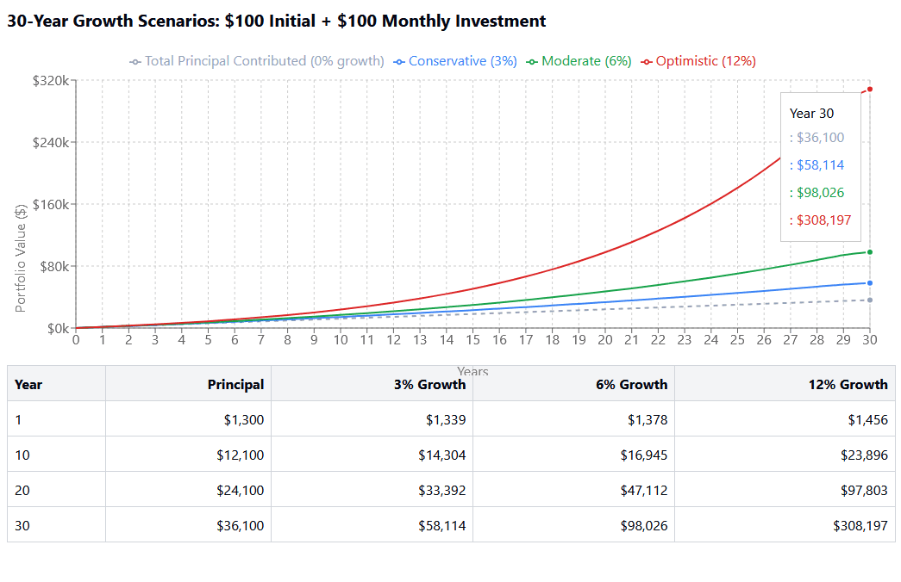

## Table of Contents

## What is long-term stock investment?

Long-term stock investment means buying stocks and holding onto them for a long time, usually several years or more. People do this because they believe the value of the stocks will go up over time. This is different from short-term trading, where people buy and sell stocks quickly to make quick profits. Long-term investors are more interested in the overall growth of a company and the economy, rather than daily price changes.

When you invest in stocks for the long term, you are betting on the future success of the companies you invest in. This can be less risky than trying to time the market, because it gives companies time to grow and overcome short-term problems. Over many years, the stock market has generally gone up, so long-term investing can be a good way to build wealth. It's important to do research and pick good companies, but once you do, you can mostly leave your investments alone and let them grow over time.

## Why should someone consider investing $100 monthly for 20 years?

Investing $100 every month for 20 years can really help you grow your money over time. This is because of something called compound interest. When you invest, you earn interest not just on the money you put in, but also on the interest that money earns. Over 20 years, this can add up a lot. If you start with $100 a month, and the stock market grows at an average rate, you could end up with a lot more money than you put in.

Another good reason to invest $100 a month for 20 years is that it helps you get into the habit of saving regularly. When you set aside money every month, it becomes a routine. This can help you build a strong financial future. Plus, if you start early, you give your money more time to grow. Even if $100 doesn't seem like a lot each month, over 20 years, it can make a big difference in your financial life.

## How does compound interest work in long-term stock investments?

Compound interest in long-term stock investments means that the money you earn from your investments starts earning money too. Imagine you invest some money and it grows by a certain percentage each year. The next year, you earn interest not just on the money you originally put in, but also on the interest you earned the year before. Over many years, this can make your money grow a lot more than if you just earned interest on your original amount.

Let's say you invest $100 and it grows by 10% in a year. Now you have $110. The next year, you earn 10% on $110, not just the original $100. So, you get $11 more, making your total $121. This keeps happening year after year. The longer you keep your money invested, the more powerful compound interest becomes. That's why starting early and leaving your money in for a long time can really help it grow a lot.

## What are the risks associated with long-term stock investing?

Long-term stock investing comes with some risks. One big risk is that the stock market can go down. Even if you plan to keep your money in for a long time, a big drop in the market can mean your investments lose value. This can be scary, especially if you need the money soon. Another risk is that the companies you invest in might not do well. If a company you own stock in has problems, its stock price can go down, and it might take a long time to recover, or it might never recover at all.

Another risk to think about is inflation. Over many years, the cost of things can go up, and if your investments don't grow faster than inflation, your money might not be worth as much in the future. Also, you might need to pay taxes on the money you make from your investments, which can cut into your profits. It's important to understand these risks and maybe talk to a financial advisor to help you make smart choices about your long-term investments.

## How can one start investing $100 monthly in stocks?

To start investing $100 monthly in stocks, the first step is to open a brokerage account. You can do this online with many companies that offer these services. They have websites and apps that make it easy to set up an account. Once your account is set up, you'll need to link it to your bank account so you can move money into it. After that, you can start putting in $100 each month.

Once you have your account set up and money in it, you can start buying stocks. One good way to do this is by using something called a dollar-cost averaging strategy. This means you buy a little bit of stock every month, instead of all at once. This can help you avoid buying when the stock price is really high. You can pick stocks of companies you believe in, or you can invest in something called an index fund, which is a way to own a little bit of a lot of different companies all at once. Over time, as you keep adding $100 each month, your investments can grow.

## What types of stocks are suitable for long-term investment?

When you're looking for stocks to invest in for the long term, you should think about companies that have a good chance of growing over many years. These are often big, stable companies that have been around for a while and have a strong track record. They might be in industries like technology, healthcare, or consumer goods. These companies often pay dividends, which is like getting a little extra money just for owning their stock. Some examples might be companies like Apple, Johnson & Johnson, or Coca-Cola. These companies have a history of doing well and are likely to keep growing.

Another type of stock to consider for long-term investment is growth stocks. These are companies that are expected to grow a lot faster than the average company. They might not pay dividends because they're using their money to grow even bigger. These stocks can be riskier, but if you pick the right ones, they can grow a lot over time. Companies like Amazon or Netflix were once growth stocks and have become huge over the years. When you're picking growth stocks, it's important to do your research and pick companies you believe in for the long haul.

Lastly, you might want to look into index funds or ETFs (exchange-traded funds) for long-term investment. These are funds that own a bunch of different stocks, so you're not betting on just one company. They track things like the S&P 500, which is a group of 500 big companies. By investing in an index fund, you're spreading your risk out and getting a piece of the overall growth of the market. This can be a safer way to invest for the long term, and it's easy to set up automatic investments into these funds each month.

## How does dollar-cost averaging benefit long-term stock investment?

Dollar-cost averaging means you put the same amount of money into stocks every month, no matter what the stock prices are doing. This helps you avoid the risk of putting all your money in at one time when the prices might be really high. Instead, you buy a little bit every month. When stock prices are low, your $100 buys more shares, and when prices are high, it buys fewer shares. Over time, this can help you pay less on average for each share because you're buying at different prices.

This strategy is really good for long-term stock investment because it helps you stay calm during ups and downs in the market. If the stock market goes down, you don't have to worry as much because you're not putting all your money in at once. You just keep investing the same amount every month. This can make it easier to stick with your plan and not get scared out of the market. Over many years, this steady approach can help your investments grow a lot, even if there are some rough times along the way.

## What are the tax implications of long-term stock investments?

When you invest in stocks for a long time, you need to think about taxes. If you sell a stock and make a profit, you have to pay capital gains tax. But if you hold onto the stock for more than a year before selling, you pay a lower tax rate on that profit. This is called a long-term capital gain. The tax rate for long-term capital gains is usually less than what you'd pay if you sold the stock in less than a year, which is called a short-term capital gain. So, holding onto your stocks for a long time can save you money on taxes.

Another thing to think about is dividends. Some companies pay dividends to their shareholders, which is like getting a little extra money just for owning their stock. If you get dividends, you have to pay taxes on them too. But the tax rate on dividends can be lower if you hold the stock for a long time. This is called qualified dividend income. So, not only can long-term investing help your money grow, but it can also help you pay less in taxes on the money you make from your investments.

## How can one diversify a long-term stock investment portfolio?

Diversifying your long-term stock investment portfolio means spreading your money across different types of investments. This helps reduce risk because if one type of investment goes down, others might go up or stay the same. You can diversify by buying stocks from different industries, like technology, healthcare, and consumer goods. You might also want to invest in companies of different sizes, from big, well-known companies to smaller, growing ones. Another way to diversify is by investing in different countries, so your money isn't all tied to how one country's economy is doing.

Another good way to diversify is by including other types of investments in your portfolio, not just stocks. You can add bonds, which are like loans you give to companies or governments that pay you back with interest. Real estate investment trusts (REITs) are another option, which let you invest in properties without buying them directly. You might also consider commodities, like gold or oil, which can act differently from stocks and bonds. By mixing these different types of investments, you can create a balanced portfolio that's more likely to grow steadily over the long term.

## What are the common mistakes to avoid in long-term stock investing?

One common mistake in long-term stock investing is trying to time the market. A lot of people think they can guess when stock prices will go up or down and buy or sell at just the right time. But this is really hard to do, even for experts. It's better to pick good companies and hold onto them for a long time, instead of trying to guess what the market will do next. Another mistake is not diversifying enough. If you put all your money into just one or two stocks, you're taking a big risk. If those companies do badly, you could lose a lot of money. It's smarter to spread your money across different types of investments so you're not betting everything on just a few stocks.

Another big mistake is letting emotions control your decisions. It's easy to get scared when the stock market goes down and sell your investments at a loss. But if you're in it for the long term, it's usually better to stay calm and stick with your plan. Over many years, the stock market has generally gone up, so selling when it's down can mean you miss out on the recovery. Also, some people forget to keep an eye on their investments. It's important to check on them now and then to make sure they're still doing well and to make changes if needed. But you don't need to check them every day. Long-term investing is about being patient and not making quick, emotional decisions.

## How can one monitor and adjust a long-term investment strategy?

To monitor your long-term investment strategy, you should check your investments every few months or once a year. This helps you see how they're doing over time. Look at the overall performance of your portfolio, not just the daily ups and downs. You can use tools on your brokerage's website or app to see how your stocks and other investments are doing. It's also a good idea to keep an eye on news about the companies you've invested in, to make sure they're still doing well. If you see that one part of your portfolio is doing much better or worse than the others, you might need to make some changes.

Adjusting your long-term investment strategy means making changes to keep your portfolio balanced and on track with your goals. If one type of investment has grown a lot, you might want to sell some of it and buy more of another type to keep things balanced. This is called rebalancing. Also, as you get older or your financial situation changes, your goals might change too. You might want to take less risk or start saving for something new. When this happens, you can adjust your investments to match your new goals. It's important to think about these changes carefully and maybe talk to a financial advisor to make sure you're making smart choices.

## What advanced strategies can enhance returns in a long-term stock investment plan?

One advanced strategy to enhance returns in a long-term stock investment plan is to use a strategy called value investing. This means looking for companies that you think are worth more than their current stock price. These companies might be going through a tough time, but if you believe they'll get better, you can buy their stocks at a lower price and hold onto them until they recover. Over time, as the company does better, the stock price can go up a lot. This can lead to big returns if you pick the right companies. It takes a lot of research and patience, but it can really pay off in the long run.

Another strategy is to use something called dividend reinvestment. When you own stocks that pay dividends, you can take that money and use it to buy more shares of the same stock. This can help your investment grow even faster because you're using the money you earn to buy more of the stock. Over many years, this can make a big difference in how much your investment grows. It's like getting a little boost every time the company pays a dividend, and it can help you build wealth over the long term.

A third strategy is to use options to enhance your returns. Options are like contracts that give you the right to buy or sell a stock at a certain price. You can use options to make money from the ups and downs of the stock market without having to buy the stocks themselves. This can be a bit more complicated and risky, but if you know what you're doing, it can help you make more money from your investments. It's important to learn a lot about options and maybe talk to a financial advisor before you start using them, but they can be a powerful tool for long-term investors.

## What is Understanding Long-Term Investment?

Long-term investment is a strategy that involves holding assets for an extended period, typically a minimum of 20 years. This approach aims to maximize returns while minimizing risks that are often associated with short-term market fluctuations. Unlike short-term trading, which focuses on capitalizing on immediate market movements, long-term investing exploits the concept of time to harness growth.

The advantages of long-term investing are multi-faceted. One primary benefit is capital growth. Over long durations, the stock market has historically shown an upward trajectory, creating opportunities for significant value appreciation. Investors who maintain patience and discipline can benefit from the gradual increase in stock prices.

Another critical benefit is potential dividend income. Many stocks offer dividends, which are periodic payments made to shareholders from a company's earnings. Consistently reinvesting these dividends rather than cashing them out can substantially boost the overall return of an investment through compounding. Compounding is a powerful mechanism where the returns generated from an investment are reinvested to generate more returns over time, effectively creating a snowball effect. Mathematically, the formula for compound interest can be expressed as:

$$
A = P \left(1 + \frac{r}{n}\right)^{nt}
$$

where:
- $A$ is the amount of money accumulated after n years, including interest.
- $P$ is the principal amount (initial investment).
- $r$ is the annual interest rate (decimal).
- $n$ is the number of times that interest is compounded per year.
- $t$ is the number of years the money is invested for.

Historical evidence supports the notion that long-term investments in the stock market tend to yield higher returns compared to more conservative investment avenues like bonds and savings accounts. Although these safer options offer lower risk, they typically provide returns that may barely outpace inflation, limiting real wealth growth. For instance, historical stock market returns have traditionally averaged between 6% and 7% per annum after accounting for inflation, which substantially exceeds the returns from bonds and savings over similar periods.

In summary, long-term investing capitalizes on market growth trends and the compounding effect to achieve substantial returns. While market downturns may occur, the long-term investor's horizon allows for recovery and growth, thereby balancing risks and rewards over decades.

## What is the Role of Monthly Investments?

Monthly investments play a crucial role in stock market strategies, primarily through the concept of dollar-cost averaging (DCA). This investment technique involves allocating a consistent amount of money to purchase shares at regular intervals, regardless of market conditions. By doing so, investors spread out their purchase prices over time, potentially reducing the impact of market [volatility](/wiki/volatility-trading-strategies) on their portfolios.

The principle behind dollar-cost averaging aims to mitigate the risk of investing a large sum in a single market position, which may coincide with market highs. Instead, by investing consistently, regardless of price, investors buy more shares when prices are low and fewer when prices are high. This results in a lower average cost per share over the long term, optimizing potential gains. The mathematical representation of this strategy is crucial for understanding its impact. Consider $P_n$ as the price per share at the $n$-th interval and $I$ as the fixed investment amount per period. The number of shares purchased, $S_n$, at each interval is given by:

$$
S_n = \frac{I}{P_n}
$$

Over time, the total number of shares accumulated, $S_{\text{total}}$, and the average purchase price, $P_{\text{avg}}$, can be computed as:

$$
S_{\text{total}} = \sum_{n=1}^{N} S_n
$$

$$
P_{\text{avg}} = \frac{\sum_{n=1}^{N} (S_n \times P_n)}{S_{\text{total}}}
$$

A significant advantage of monthly investments is the discipline they instill. Regular investments foster disciplined saving habits, as individuals commit to set aside a portion of their income systematically. This discipline is essential for long-term wealth accumulation, ensuring that investments grow in a structured manner despite market fluctuations.

The benefits of this approach are evident in its psychological impact as well, reducing the emotional stress of deciding when to enter the market. By adhering to a predetermined plan, investors avoid the pitfalls of market timing, which can lead to suboptimal investment decisions driven by short-term market movements.

In summary, monthly investments through dollar-cost averaging provide a strategic framework for managing risk and enhancing investment returns over time. By instilling discipline and leveraging the natural fluctuations of the market, this approach optimizes portfolio growth, making it a valuable component of any long-term investment strategy.

## How can long-term and algorithmic strategies be combined?

Integrating algorithmic strategies with long-term investment approaches can significantly enhance portfolio management by optimizing risk-adjusted returns. These strategies leverage computational models to handle extensive datasets, enabling a more precise assessment of market conditions and executing trades with improved timing and accuracy.

### Key Metrics for Assessment

When implementing algorithmic strategies in long-term investments, certain metrics are pivotal for evaluating performance and risk. The **Sharpe ratio** is a crucial measure indicating the average return earned over the risk-free rate per unit of volatility. It can be expressed mathematically as:

$$
\text{Sharpe Ratio} = \frac{R_p - R_f}{\sigma_p}
$$

where:
- $R_p$ is the expected portfolio return,
- $R_f$ is the risk-free rate,
- $\sigma_p$ is the standard deviation of the portfolio's excess return.

A higher Sharpe ratio indicates a more favorable risk-adjusted return, which is paramount for long-term investors seeking to mitigate risks while maximizing returns.

The **beta** coefficient is another essential metric used to determine the tendency of the portfolio's returns to respond to changes in the overall market. A beta of 1 implies the portfolio's returns mirror the market, while a beta greater than 1 indicates higher volatility than the market. Using beta, investors can balance their portfolios to match their risk tolerance.

### Diversification and Dynamic Rebalancing

Diversification remains a cornerstone in integrating long-term strategies with algorithmic trading as it helps spread risk across various asset classes and sectors. This approach minimizes the impact of adverse movements in any single investment, thereby stabilizing the portfolio's overall returns.

Dynamic rebalancing complements diversification by routinely adjusting the portfolio's allocation in response to market changes and asset performance. Algorithmic trading systems are particularly effective for this purpose due to their ability to constantly monitor market data and execute trades automatically when certain conditions are met, ensuring the portfolio remains aligned with the investor's strategic objectives.

By applying these principles, investors can leverage the precision and efficiency of algorithms to maintain a well-diversified, dynamically managed portfolio that optimally balances risk and return over the long term.

## What are the outcomes of investing $100 a month according to the case study?

Investing $100 a month in stocks is a widely accessible strategy that demonstrates the effectiveness of compounding and disciplined, consistent investment. This case study highlights the potential growth achievable through regular contributions and the integration of algorithmic trading.

### Power of Compounding
Compounding refers to the process by which investment earnings are reinvested to generate additional earnings over time. The longer the investment period, the more significant the compounding effect. For instance, by consistently investing $100 each month at an average annual return of 7%, an investor can potentially grow their investment significantly over the long term.

Mathematically, the future value $FV$ of a series of monthly investments can be calculated using the future value of a series formula:

$$
FV = P \times \frac{{(1 + r)^n - 1}}{r} \times (1 + r)
$$

Where:
- $P$ is the monthly investment ($100 in this scenario),
- $r$ is the monthly interest rate (annual rate divided by 12),
- $n$ is the total number of investments (years multiplied by 12).

For example, over 30 years, investing $100 monthly at an annual return of 7% results in:

```python
P = 100
annual_rate = 0.07
monthly_rate = annual_rate / 12
years = 30
n = years * 12

FV = P * ((1 + monthly_rate)**n - 1) / monthly_rate * (1 + monthly_rate)
print(FV)
```

The code evaluates to approximately $121,997, illustrating significant growth from consistent investment and compounding over time.

### Market Performance and Algorithmic Trading
Market performance can vary greatly over decades, with bull and bear markets influencing returns. Algorithmic trading, leveraging historical data and predictive analytics, can enhance buy-and-hold strategies by optimizing entry and [exit](/wiki/exit-strategy) points, reallocating investments, and managing risk.

**Scenario Analysis:**
Algorithmic strategies can simulate various market conditions to stress-test the robustness of a $100 monthly investment strategy. By employing algorithms to identify and respond to market trends, investors might optimize their returns compared to a passive strategy. 

For example, consider different market scenarios yielding annualized returns of 5%, 7%, and 9%. The same Python code can calculate potential outcomes for these rates to understand better how fluctuations impact growth:

```python
def future_value(P, annual_rate, years):
    monthly_rate = annual_rate / 12
    n = years * 12
    FV = P * ((1 + monthly_rate)**n - 1) / monthly_rate * (1 + monthly_rate)
    return FV

future_value_5 = future_value(100, 0.05, 30)
future_value_7 = future_value(100, 0.07, 30)
future_value_9 = future_value(100, 0.09, 30)

print(f"5% return: {future_value_5}")
print(f"7% return: {future_value_7}")
print(f"9% return: {future_value_9}")
```

### Long-term Impact
Over a 20- to 30-year horizon, the cumulative effect of compounding at average returns of 7% can multiply an individual's modest monthly contributions into a substantial portfolio. Therefore, this approach is not only practical for individual investors but also beneficial in long-term wealth accumulation and financial security.

Emphasizing the disciplined application of both consistent investing and advanced trading strategies can help optimize long-term growth irrespective of periodic market fluctuations. This underscores the importance of strategic planning and the potential of algorithmic assistance in maximizing future values.

## References & Further Reading

[1]: Bodie, Z., Kane, A., & Marcus, A. J. (2014). "Investments" (10th ed.). McGraw-Hill Education.

[2]: Malkiel, B. G. (2019). ["A Random Walk Down Wall Street: The Time-Tested Strategy for Successful Investing"](https://yourknowledgedigest.org/wp-content/uploads/2020/04/a-random-walk-down-wall-street.pdf). W. W. Norton & Company.

[3]: Pardo, R. (2008). ["The Evaluation and Optimization of Trading Strategies"](https://onlinelibrary.wiley.com/doi/book/10.1002/9781119196969). Wiley.

[4]: Tharp, V. (2013). ["Trading Beyond the Matrix: The Red Pill for Traders and Investors"](https://vantharpinstitute.com/product/trading-beyond-the-matrix-the-red-pill-for-traders-and-investors/). Wiley.

[5]: Fabozzi, F. J., Focardi, S. M., & Kolm, P. N. (2010). ["Quantitative Equity Investing: Techniques and Strategies"](https://www.semanticscholar.org/paper/Quantitative-Equity-Investing%3A-Techniques-and-Fabozzi-Focardi/1c49a2a53919f7e65cb96f16691b8ff726fd3cd7). Wiley.

[6]: Harris, L. (2003). ["Trading and Exchanges: Market Microstructure for Practitioners"](https://www.amazon.com/Trading-Exchanges-Market-Microstructure-Practitioners/dp/0195144708). Oxford University Press.