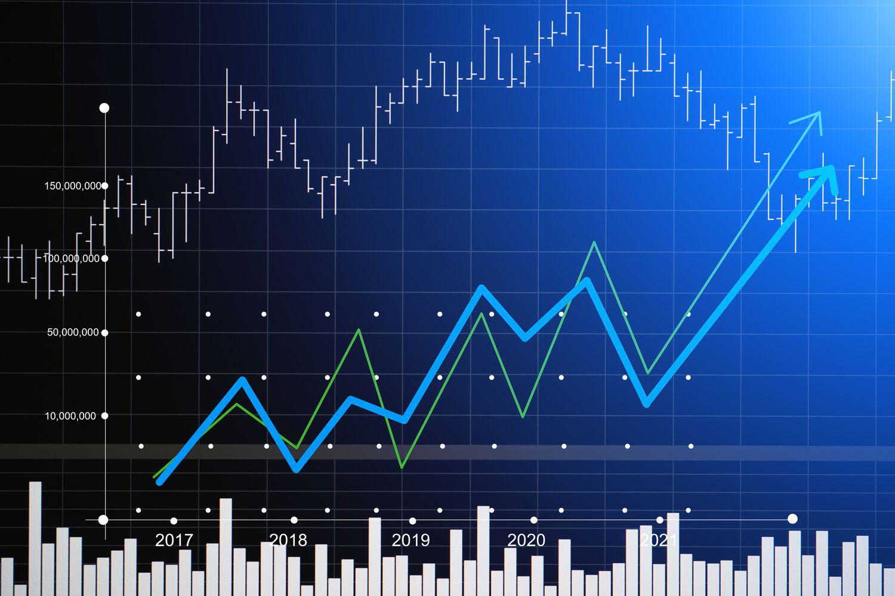

The stock market provides a diverse array of opportunities for investors aiming to grow their wealth through strategic financial decisions. A common and effective approach within this financial landscape is long-term investment. By focusing on an extended time horizon, typically 20 years or more, long-term investment strategies aim to offer superior returns while mitigating risks associated with market volatility. Historical data underscores the efficacy of this approach, indicating that long-term investments often yield higher returns compared to traditional savings accounts or bonds.

A key component that enhances the efficacy of long-term investing is the practice of making consistent monthly investments. This technique, known as dollar-cost averaging, involves investing a fixed amount regularly, regardless of market conditions. By spreading investments over time, investors buy more shares when prices are low and fewer shares when prices are high, which can maximize potential gains. Moreover, monthly investments capitalize on the power of compounding, where the earnings on an investment generate their own earnings over time, thereby accelerating wealth accumulation.



In recent years, algorithmic trading has emerged as an influential factor in the stock market. Though often associated with high-frequency trading, algorithmic strategies are increasingly being recognized for their potential to enhance long-term investment strategies. These algorithms can efficiently analyze extensive datasets to identify market trends, manage portfolios, and execute trades with precision and at scale.

This article discusses the integration of monthly investment plans, long-term investment strategies, and the role of algorithmic trading in optimizing stock market investments. By combining these elements, investors can potentially enhance portfolio performance and achieve their financial goals in a systematic and disciplined manner.

## Table of Contents

## Understanding Long-Term Investment

Long-term investment is a strategy that involves holding assets for an extended period, typically a minimum of 20 years. This approach aims to maximize returns while minimizing risks that are often associated with short-term market fluctuations. Unlike short-term trading, which focuses on capitalizing on immediate market movements, long-term investing exploits the concept of time to harness growth.

The advantages of long-term investing are multi-faceted. One primary benefit is capital growth. Over long durations, the stock market has historically shown an upward trajectory, creating opportunities for significant value appreciation. Investors who maintain patience and discipline can benefit from the gradual increase in stock prices.

Another critical benefit is potential dividend income. Many stocks offer dividends, which are periodic payments made to shareholders from a company's earnings. Consistently reinvesting these dividends rather than cashing them out can substantially boost the overall return of an investment through compounding. Compounding is a powerful mechanism where the returns generated from an investment are reinvested to generate more returns over time, effectively creating a snowball effect. Mathematically, the formula for compound interest can be expressed as:

$$
A = P \left(1 + \frac{r}{n}\right)^{nt}
$$

where:
- $A$ is the amount of money accumulated after n years, including interest.
- $P$ is the principal amount (initial investment).
- $r$ is the annual interest rate (decimal).
- $n$ is the number of times that interest is compounded per year.
- $t$ is the number of years the money is invested for.

Historical evidence supports the notion that long-term investments in the stock market tend to yield higher returns compared to more conservative investment avenues like bonds and savings accounts. Although these safer options offer lower risk, they typically provide returns that may barely outpace inflation, limiting real wealth growth. For instance, historical stock market returns have traditionally averaged between 6% and 7% per annum after accounting for inflation, which substantially exceeds the returns from bonds and savings over similar periods.

In summary, long-term investing capitalizes on market growth trends and the compounding effect to achieve substantial returns. While market downturns may occur, the long-term investor's horizon allows for recovery and growth, thereby balancing risks and rewards over decades.

## The Role of Monthly Investments

Monthly investments play a crucial role in stock market strategies, primarily through the concept of dollar-cost averaging (DCA). This investment technique involves allocating a consistent amount of money to purchase shares at regular intervals, regardless of market conditions. By doing so, investors spread out their purchase prices over time, potentially reducing the impact of market [volatility](/wiki/volatility-trading-strategies) on their portfolios.

The principle behind dollar-cost averaging aims to mitigate the risk of investing a large sum in a single market position, which may coincide with market highs. Instead, by investing consistently, regardless of price, investors buy more shares when prices are low and fewer when prices are high. This results in a lower average cost per share over the long term, optimizing potential gains. The mathematical representation of this strategy is crucial for understanding its impact. Consider $P_n$ as the price per share at the $n$-th interval and $I$ as the fixed investment amount per period. The number of shares purchased, $S_n$, at each interval is given by:

$$
S_n = \frac{I}{P_n}
$$

Over time, the total number of shares accumulated, $S_{\text{total}}$, and the average purchase price, $P_{\text{avg}}$, can be computed as:

$$
S_{\text{total}} = \sum_{n=1}^{N} S_n
$$

$$
P_{\text{avg}} = \frac{\sum_{n=1}^{N} (S_n \times P_n)}{S_{\text{total}}}
$$

A significant advantage of monthly investments is the discipline they instill. Regular investments foster disciplined saving habits, as individuals commit to set aside a portion of their income systematically. This discipline is essential for long-term wealth accumulation, ensuring that investments grow in a structured manner despite market fluctuations.

The benefits of this approach are evident in its psychological impact as well, reducing the emotional stress of deciding when to enter the market. By adhering to a predetermined plan, investors avoid the pitfalls of market timing, which can lead to suboptimal investment decisions driven by short-term market movements.

In summary, monthly investments through dollar-cost averaging provide a strategic framework for managing risk and enhancing investment returns over time. By instilling discipline and leveraging the natural fluctuations of the market, this approach optimizes portfolio growth, making it a valuable component of any long-term investment strategy.

## Algorithmic Trading in the Stock Market

Algorithmic trading employs computer algorithms to facilitate trading based on pre-established criteria, ensuring precision and efficiency. This approach has been widely recognized within the context of short-term trading, where rapid execution and real-time data analysis are paramount. However, [algorithmic trading](/wiki/algorithmic-trading) strategies can also be adapted for long-term investment portfolios, where the focus shifts from quick turnaround profits to sustained growth over extended periods.

These algorithms are capable of processing large volumes of financial data to identify enduring trends that may influence investment decisions. By leveraging [machine learning](/wiki/machine-learning) techniques, algorithms can discern patterns that might not be immediately evident to human analysts, thereby optimizing the timing and execution of trades. For instance, algorithms can be programmed to purchase stocks when they are undervalued based on historical price data and hold them until predefined target metrics are achieved.

Algorithmic trading systems offer the functionality to manage entire portfolios autonomously, adapting to market dynamics as they unfold. This flexibility is crucial for maintaining the balance between risk and reward over time. By continuously assessing market conditions, these algorithms can make adjustments such as reallocating assets or recalibrating investment parameters to optimize returns while mitigating potential losses.

The automation inherent in algorithmic trading also reduces emotional bias, a common pitfall in manual trading. Decisions are made based on systematic analysis rather than human impulses, aligning with the long-term investment objective of consistent and rational growth. Algorithms can also be integrated with modern financial tools to execute trades automatically, ensuring that they occur at optimal times without delay.

In summary, algorithmic trading's ability to analyze extensive datasets and execute trades with precision makes it an advantageous tool not just for short-term traders, but also for investors pursuing long-term growth. Balancing technological advantages with strategic planning allows investors to potentially enhance their portfolio's performance over decades.

## Combining Long-Term and Algorithmic Strategies

Integrating algorithmic strategies with long-term investment approaches can significantly enhance portfolio management by optimizing risk-adjusted returns. These strategies leverage computational models to handle extensive datasets, enabling a more precise assessment of market conditions and executing trades with improved timing and accuracy.

### Key Metrics for Assessment

When implementing algorithmic strategies in long-term investments, certain metrics are pivotal for evaluating performance and risk. The **Sharpe ratio** is a crucial measure indicating the average return earned over the risk-free rate per unit of volatility. It can be expressed mathematically as:

$$
\text{Sharpe Ratio} = \frac{R_p - R_f}{\sigma_p}
$$

where:
- $R_p$ is the expected portfolio return,
- $R_f$ is the risk-free rate,
- $\sigma_p$ is the standard deviation of the portfolio's excess return.

A higher Sharpe ratio indicates a more favorable risk-adjusted return, which is paramount for long-term investors seeking to mitigate risks while maximizing returns.

The **beta** coefficient is another essential metric used to determine the tendency of the portfolio's returns to respond to changes in the overall market. A beta of 1 implies the portfolio's returns mirror the market, while a beta greater than 1 indicates higher volatility than the market. Using beta, investors can balance their portfolios to match their risk tolerance.

### Diversification and Dynamic Rebalancing

Diversification remains a cornerstone in integrating long-term strategies with algorithmic trading as it helps spread risk across various asset classes and sectors. This approach minimizes the impact of adverse movements in any single investment, thereby stabilizing the portfolio's overall returns.

Dynamic rebalancing complements diversification by routinely adjusting the portfolio's allocation in response to market changes and asset performance. Algorithmic trading systems are particularly effective for this purpose due to their ability to constantly monitor market data and execute trades automatically when certain conditions are met, ensuring the portfolio remains aligned with the investor's strategic objectives.

By applying these principles, investors can leverage the precision and efficiency of algorithms to maintain a well-diversified, dynamically managed portfolio that optimally balances risk and return over the long term.

## Case Study: Investing $100 a Month

Investing $100 a month in stocks is a widely accessible strategy that demonstrates the effectiveness of compounding and disciplined, consistent investment. This case study highlights the potential growth achievable through regular contributions and the integration of algorithmic trading.

### Power of Compounding
Compounding refers to the process by which investment earnings are reinvested to generate additional earnings over time. The longer the investment period, the more significant the compounding effect. For instance, by consistently investing $100 each month at an average annual return of 7%, an investor can potentially grow their investment significantly over the long term.

Mathematically, the future value $FV$ of a series of monthly investments can be calculated using the future value of a series formula:

$$
FV = P \times \frac{{(1 + r)^n - 1}}{r} \times (1 + r)
$$

Where:
- $P$ is the monthly investment ($100 in this scenario),
- $r$ is the monthly interest rate (annual rate divided by 12),
- $n$ is the total number of investments (years multiplied by 12).

For example, over 30 years, investing $100 monthly at an annual return of 7% results in:

```python
P = 100
annual_rate = 0.07
monthly_rate = annual_rate / 12
years = 30
n = years * 12

FV = P * ((1 + monthly_rate)**n - 1) / monthly_rate * (1 + monthly_rate)
print(FV)
```

The code evaluates to approximately $121,997, illustrating significant growth from consistent investment and compounding over time.

### Market Performance and Algorithmic Trading
Market performance can vary greatly over decades, with bull and bear markets influencing returns. Algorithmic trading, leveraging historical data and predictive analytics, can enhance buy-and-hold strategies by optimizing entry and [exit](/wiki/exit-strategy) points, reallocating investments, and managing risk.

**Scenario Analysis:**
Algorithmic strategies can simulate various market conditions to stress-test the robustness of a $100 monthly investment strategy. By employing algorithms to identify and respond to market trends, investors might optimize their returns compared to a passive strategy. 

For example, consider different market scenarios yielding annualized returns of 5%, 7%, and 9%. The same Python code can calculate potential outcomes for these rates to understand better how fluctuations impact growth:

```python
def future_value(P, annual_rate, years):
    monthly_rate = annual_rate / 12
    n = years * 12
    FV = P * ((1 + monthly_rate)**n - 1) / monthly_rate * (1 + monthly_rate)
    return FV

future_value_5 = future_value(100, 0.05, 30)
future_value_7 = future_value(100, 0.07, 30)
future_value_9 = future_value(100, 0.09, 30)

print(f"5% return: {future_value_5}")
print(f"7% return: {future_value_7}")
print(f"9% return: {future_value_9}")
```

### Long-term Impact
Over a 20- to 30-year horizon, the cumulative effect of compounding at average returns of 7% can multiply an individual's modest monthly contributions into a substantial portfolio. Therefore, this approach is not only practical for individual investors but also beneficial in long-term wealth accumulation and financial security.

Emphasizing the disciplined application of both consistent investing and advanced trading strategies can help optimize long-term growth irrespective of periodic market fluctuations. This underscores the importance of strategic planning and the potential of algorithmic assistance in maximizing future values.

## Key Takeaways and Best Practices

Consistency in monthly investments and the strategic use of algorithmic trading can significantly enhance long-term returns. By maintaining a regular investment schedule, investors harness the power of dollar-cost averaging, which minimizes the impact of market volatility by spreading out the purchase of securities over time. This disciplined approach not only fosters a habit of regular saving but also optimizes the growth potential of the investment portfolio through compounding returns.

Monitoring market trends is essential for adjusting strategies and maintaining optimal portfolio performance. By closely watching economic indicators, interest rates, and stock performance, investors can make informed decisions to shift their investments in response to changing market environments. Incorporating dividend analysis is equally crucial. Reinvesting dividends can further compound returns, contributing to greater overall growth.

The role of technology in modern investment cannot be underestimated. Algorithmic trading offers a sophisticated method for analyzing vast amounts of data and executing trades with precision. Investors should remain flexible, leveraging these technological advancements to refine strategies and adapt to market transitions. Algorithmic systems can help identify new investment opportunities, optimize asset allocation, and rebalance portfolios dynamically, ensuring that the portfolio remains aligned with long-term objectives.

To sum up, successful investment strategies rely on consistency, informed decision-making, and the utilization of cutting-edge technology. By remaining adaptable and informed, investors can navigate the complexities of the stock market to achieve sustainable wealth growth over time.

## Conclusion

Long-term investments combined with monthly contributions represent a sustainable strategy for wealth accumulation. This approach allows investors to benefit from the consistent growth potential of the stock market, coupled with the advantages of dollar-cost averaging. Regular monthly contributions help to smooth out market volatility and encourage disciplined investment behavior, laying a solid foundation for long-term financial growth.

Algorithmic trading offers critical benefits in this investment paradigm. It enhances operational efficiency by automating the execution of trades according to predefined criteria, reducing the potential for human error. Moreover, it serves as a tool for developing and refining investment strategies tailored to individual goals. By analyzing extensive datasets, algorithms can identify emerging trends and optimize portfolio management, potentially increasing risk-adjusted returns.

In today's rapidly evolving financial markets, strategic planning is more crucial than ever. Investors must commit to continuous learning to stay abreast of market trends and technological advancements in trading. This knowledge enables adaptation to market changes and the leveraging of new tools and methodologies to maintain a competitive edge.

Leveraging technology can further optimize investment outcomes. As technology progresses, integrating advanced analytics, machine learning, and other innovations into investment strategies can improve decision-making and opportunity identification.

In summary, combining long-term investments with monthly contributions, underpinned by algorithmic trading and strategic planning, provides a robust framework for wealth accumulation. Embracing technological advances and committing to continuous learning will enable investors to navigate the complex landscape of stock market investments effectively.

## References & Further Reading

[1]: Bodie, Z., Kane, A., & Marcus, A. J. (2014). "Investments" (10th ed.). McGraw-Hill Education.

[2]: Malkiel, B. G. (2019). ["A Random Walk Down Wall Street: The Time-Tested Strategy for Successful Investing"](https://yourknowledgedigest.org/wp-content/uploads/2020/04/a-random-walk-down-wall-street.pdf). W. W. Norton & Company.

[3]: Pardo, R. (2008). ["The Evaluation and Optimization of Trading Strategies"](https://onlinelibrary.wiley.com/doi/book/10.1002/9781119196969). Wiley.

[4]: Tharp, V. (2013). ["Trading Beyond the Matrix: The Red Pill for Traders and Investors"](https://vantharpinstitute.com/product/trading-beyond-the-matrix-the-red-pill-for-traders-and-investors/). Wiley.

[5]: Fabozzi, F. J., Focardi, S. M., & Kolm, P. N. (2010). ["Quantitative Equity Investing: Techniques and Strategies"](https://www.semanticscholar.org/paper/Quantitative-Equity-Investing%3A-Techniques-and-Fabozzi-Focardi/1c49a2a53919f7e65cb96f16691b8ff726fd3cd7). Wiley.

[6]: Harris, L. (2003). ["Trading and Exchanges: Market Microstructure for Practitioners"](https://www.amazon.com/Trading-Exchanges-Market-Microstructure-Practitioners/dp/0195144708). Oxford University Press.