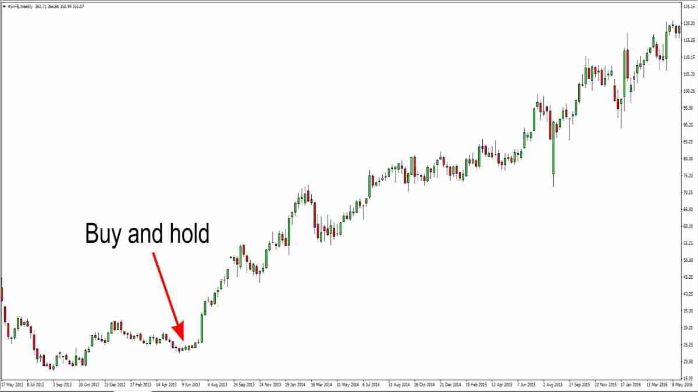

Long-term trading stands as a strategic approach in financial markets where investments are held for an extended period, often several years. This method contrasts starkly with short-term trading tactics such as day trading or swing trading. The essence of long-term trading lies in its focus on capturing substantial market moves over months or years, rather than the quick fluctuations exploited in shorter-term strategies.

In this comprehensive guide, readers will be introduced to the multifaceted world of long-term trading. The article dives into the distinctive nature of long-term trading strategies, comparing and contrasting them with other trading styles. We will explore the various benefits and challenges associated with this approach, from potentially higher returns and reduced transaction costs to the implications of market volatility and capital commitment.

Key strategies integral to long-term trading will be thoroughly examined, including the tried-and-true buy-and-hold approach, value investing, growth investing, and dividend investing. Identifying sustainable long-term investment opportunities is critical, and we will deep dive into effective techniques for market research, fundamental analysis, and even technical analysis in this context.

Risk management, an indispensable aspect of long-term trading, will be discussed with a focus on diversification, setting stop losses, and the importance of regular portfolio review. The psychological elements – patience, discipline, and the avoidance of common pitfalls – are also crucial components for success in this field.

## Table of Contents

## Understanding Long-Term Trading

Long-term trading revolves around a strategy where investments are held over an extended period, typically spanning several years. This approach is deeply rooted in the belief that, despite short-term market fluctuations, the value of solid investments will increase over time. The fundamental characteristics of long-term trading strategies include a focus on enduring market trends, company fundamentals, and macroeconomic factors, rather than short-term price movements.

In contrast to other trading styles, long-term trading stands out for its strategic patience and lower frequency of transactions. While position trading also takes a relatively long-term view, it typically involves holding securities for weeks or months, not years. Swing trading operates on an even shorter timeline, capitalizing on market [momentum](/wiki/momentum) to take advantage of price swings occurring over days or weeks. Day trading, the shortest-term strategy, involves buying and selling securities within the same trading day, focusing purely on intraday market movements.

Long-term trading's distinction lies in its strategic approach. It requires a comprehensive understanding of the market's long-term trends and the patience to withstand short-term market volatilities. This strategy is less about timing the market perfectly and more about participating in the market's overall growth over time, leveraging the power of compounding and market cycles. By focusing on long-term growth potential and value, long-term traders aim to build a robust portfolio that can weather market ups and downs, providing substantial returns over extended periods.

## Advantages and Disadvantages of Long-Term Trading

### Benefits

The realm of long-term trading offers several compelling benefits, key among them being the potential for reduced stress, lower transaction costs, and the likelihood of realizing higher returns over time.

Firstly, the long-term trading approach inherently demands less frequent buying and selling of assets, which in turn translates to **reduced stress for the investor**. This lowered stress level is attributed to the strategy’s detachment from the daily [volatility](/wiki/volatility-trading-strategies) and noise of the markets. Traders are not constantly glued to their screens, worrying about short-term market swings. Instead, they focus on the bigger picture, investing in trends or assets that demonstrate potential over years or even decades.

Another significant advantage of long-term trading is the **reduction in transaction costs**. Since this strategy involves fewer trades, the cumulative cost of commissions and fees typically associated with trading is substantially lower. This aspect is particularly important because even small fees can add up over time, eating into the overall profitability of an investment.

Perhaps the most enticing benefit of long-term trading is the **potential for higher returns**. Historically, the stock market has provided substantial returns over long periods. By holding investments for a longer duration, traders can ride out the volatility and benefit from the overall upward trajectory of the markets. Moreover, long-term investments often qualify for favorable tax treatment, which can further enhance returns.

Additionally, the **power of compounding** plays a pivotal role in long-term trading. Reinvesting dividends or interest over years can lead to exponential growth of an investment portfolio, a phenomenon often referred to as the “eighth wonder of the world” by investment enthusiasts.

In summary, the benefits of long-term trading lie in its ability to minimize stress, reduce the costs associated with frequent trading, and capitalize on the potential for higher returns through the power of compounding and favorable market trends over time. These advantages make long-term trading an appealing strategy for those looking to build wealth steadily and sustainably.

### Challenges

While long-term trading has its set of benefits, it's not without its challenges and limitations. One of the primary challenges is the capital tie-up. Long-term trading strategies often require locking in capital for extended periods. This approach can lead to **missed opportunities** elsewhere, as funds are not readily available for other investments or unforeseen needs. This limitation necessitates a well-planned financial strategy, ensuring that investors have sufficient [liquidity](/wiki/liquidity-risk-premium) for other obligations and opportunities.

**Market volatility** also poses a significant challenge for long-term traders. Although the idea is to overlook short-term fluctuations and focus on long-term gains, periods of high volatility can test an investor’s resolve. This is particularly true during market downturns, where substantial paper losses can be psychologically daunting, even if the fundamental long-term outlook remains unchanged.

Another limitation is the **risk of change in fundamental business dynamics**. For instance, a company or sector that seems promising over a decade may undergo unexpected transformations due to technological advancements, regulatory changes, or shifts in consumer preferences. Such shifts can derail long-term investment theses, leading to underperformance or losses.

Long-term investments also require a **more thorough and continuous analysis**. Since these investments are held for longer durations, it’s essential to monitor the underlying assets' ongoing viability. This need for sustained diligence can be both time-consuming and demanding, especially for individual investors without access to extensive research resources.

Finally, long-term trading strategies might lead to **underperformance in rapidly growing markets**. By committing to a long-term approach, investors might miss out on short-term gains that more active trading strategies could capture. This situation often requires a balanced mindset, focusing on long-term wealth accumulation rather than short-term market movements.

In summary, while long-term trading can be a route to substantial returns, it requires navigating through challenges like capital tie-up, market volatility, shifts in business fundamentals, the need for continuous analysis, and potential underperformance in rapidly growing markets. Understanding and preparing for these challenges is crucial for anyone considering long-term trading as a part of their investment strategy.

## Key Strategies for Long-Term Trading

### Buy and Hold

The 'Buy and Hold' strategy is a cornerstone of long-term trading, representing a commitment to holding investments over extended periods, often spanning years or even decades. This approach is grounded in the belief that while markets may fluctuate in the short term, they generally trend upwards over the long term. The strategy involves purchasing stocks, bonds, mutual funds, or other investment vehicles and holding them through market ups and downs, with the expectation of realizing substantial returns over time.

Application of this strategy requires a careful selection of investments. Ideally, these are high-quality assets with a proven track record of stability and growth, such as blue-chip stocks or well-established mutual funds. The idea is to invest in companies or funds that have the potential for steady appreciation over time. Investors practicing this strategy typically focus on the inherent value and future prospects of an investment rather than short-term price movements.

One of the significant advantages of the 'Buy and Hold' strategy is its simplicity. It doesn’t require constant monitoring of market trends or frequent buying and selling, which can not only be stressful but also increase transaction costs and tax liabilities. By holding investments for longer periods, investors can also benefit from compounding returns, where [earning](/wiki/earning-announcement)s from an asset are reinvested to generate their own earnings.

However, 'Buy and Hold' is not about ignoring market changes entirely. It's crucial to periodically review the portfolio to ensure that the initial reasons for the investment still hold true. In some cases, it might be necessary to adjust the portfolio, especially if there's a fundamental change in a company's prospects or in overall market conditions.

In summary, the 'Buy and Hold' strategy is about making thoughtful, long-term investment choices and resisting the urge to react to short-term market fluctuations. It requires patience, a tolerance for market volatility, and a firm belief in the long-term growth potential of the markets. This strategy has been time-tested and is often favored for retirement and other long-range financial goals.

### Value Investing

Value investing is a pivotal strategy in long-term trading that revolves around identifying and investing in stocks that appear undervalued by the market. This approach is grounded in the belief that the stock market doesn't always reflect the true intrinsic value of a company due to various [factor](/wiki/factor-investing)s, including market overreactions, investor sentiment, and short-term market trends. Value investors seek to exploit these discrepancies by purchasing stocks at a price lower than their intrinsic value and holding them until their price aligns with their true worth.

The core of value investing lies in rigorous [fundamental analysis](/wiki/fundamental-analysis). This involves a deep dive into a company's financial statements, including income statements, balance sheets, and cash flow statements. Key metrics such as the price-to-earnings (P/E) ratio, price-to-book (P/B) ratio, dividend yields, and debt-to-equity ratio are scrutinized to assess a company's financial health and growth potential. The idea is to find stocks that are not just cheap but are fundamentally sound with strong potential for growth.

Warren Buffett, a proponent of value investing, emphasizes the importance of looking at companies with a competitive advantage or 'moat,' such as strong brand recognition, unique products, or high entry barriers for competitors. These attributes often contribute to a company's ability to sustain profits and grow in the long term.

Value investing is not just about [picking](/wiki/asset-class-picking) stocks with low prices. It's about finding companies that are fundamentally undervalued by the market. This could be due to various reasons, including being in an unfashionable industry, temporary setbacks, or simply being overlooked by the market. The key is to have a long-term perspective, patience, and discipline to wait for the market to recognize the true value of these investments.

However, value investing also comes with challenges. It requires a comprehensive understanding of financial analysis and the patience to wait, sometimes years, for an investment to reach its potential. Moreover, there's a risk of investing in a company that is cheap for a reason, such as structural problems within the company or industry that are not easily solvable.

In summary, value investing is a time-honored strategy in long-term trading. It focuses on acquiring undervalued stocks with solid fundamentals and holding them until their market price reflects their true intrinsic value. This approach requires thorough research, analytical skills, and a considerable amount of patience and discipline.

### Growth Investing

Growth investing is a dynamic strategy within long-term trading that focuses on capitalizing on the future potential of a company. This approach involves investing in companies that exhibit signs of above-average growth, even if their current share price appears expensive in terms of metrics like price-to-earnings (P/E) ratios. The underlying belief is that these companies will continue to achieve high levels of earnings growth, which will eventually translate into rising stock prices.

One of the primary characteristics of growth investing is the focus on companies that are expanding their revenues and profits faster than their industry or the overall market. These companies are often in the forefront of innovation, developing new technologies, products, or services, or exploring new markets. They might be in high-growth sectors like technology, biotech, or renewable energy.

The strategy isn't just about picking any fast-growing company; it's about identifying those with sustainable growth prospects. Growth investors look for companies with strong management teams, a competitive advantage in their industry, a track record of robust earnings growth, and a clear plan for continued expansion. These companies often reinvest their earnings back into the business, fueling further growth instead of paying out dividends.

Investing in [growth stocks](/wiki/growth-stocks) can be more volatile and riskier than other types of investing. These companies are often more sensitive to market changes and can see more significant price swings. The high valuation of growth stocks also means they have further to fall in a market downturn. However, the potential for above-average returns makes them an attractive option for long-term investors willing to weather short-term market fluctuations.

Growth investing requires a forward-looking perspective. Investors need to assess not just where a company has been, but where it's headed. This might involve keeping an eye on emerging industry trends, new product developments, or shifts in consumer behavior. It's about finding companies that are not just growing, but are positioned to continue growing in the future.

In summary, growth investing is a proactive approach in long-term trading, targeting companies that have the potential for significant future growth. While this strategy comes with higher volatility and risk, the payoff can be substantial if the right growth stocks are selected and held over time. As with any investment strategy, thorough research and a clear understanding of one's risk tolerance are essential.

### Dividend Investing

Dividend investing is a cornerstone strategy in the world of long-term trading, appealing particularly to those seeking regular income alongside capital appreciation. This approach involves investing in companies that pay out a significant portion of their profits in the form of dividends. The attraction lies in the dual potential for earning regular dividend payouts and benefiting from any long-term appreciation in the stock’s price.

Key to dividend investing is the selection of stocks that not only pay dividends but have a history of consistently maintaining or increasing their dividend payouts. These are typically well-established companies with a stable earnings history and a strong financial footing. Such companies are often found in sectors like utilities, consumer goods, and healthcare, where cash flow is relatively predictable and business models are less susceptible to economic cycles.

An essential aspect of dividend investing is understanding the dividend yield, which is the annual dividend payment divided by the stock's price. While a high dividend yield is attractive, it's crucial to assess the sustainability of these payouts. An unusually high yield can sometimes be a red flag, indicating potential trouble within the company.

Another critical factor is the dividend payout ratio, which measures the percentage of earnings paid out as dividends. A lower payout ratio could mean the company is reinvesting more back into the business for growth, while a higher ratio could indicate more generous dividend payments. However, extremely high payout ratios can be unsustainable in the long term.

Dividend investing isn't just about the current yield. It's also about the potential for dividend growth. Companies that consistently increase their dividends can offer an inflation-beating income stream, making them particularly attractive for long-term investors.

While dividend investing can provide a regular income and potentially lower volatility than other investment strategies, it also comes with risks. Companies can cut or eliminate their dividends in economic downturns, impacting income-focused investors. Moreover, focusing too heavily on dividends can lead to a lack of diversification if it leads to an overconcentration in certain sectors or companies.

In summary, dividend investing is a strategy well-suited for long-term traders looking for steady income and moderate growth. It requires careful selection of financially sound companies with a consistent dividend history and a forward-looking approach to assessing their ability to continue delivering dividends. As with any investment approach, balancing the benefits of dividend payouts with the overall investment goals and risk tolerance is vital.

## Identifying Long-Term Investment Opportunities

### Market Research

In long-term trading, market research stands as a fundamental pillar. It's not just about picking stocks or assets; it's about understanding the broader economic landscape in which these investments operate. Effective market research encompasses a comprehensive analysis of various factors, including industry trends, economic indicators, company performance, and geopolitical events.

Market research involves delving into the sectors or industries of interest, understanding their growth potential, and identifying the key drivers of that growth. This means staying informed about technological advancements, regulatory changes, consumer behavior shifts, and competitive dynamics within the industry. For instance, an investor interested in the renewable energy sector would need to stay abreast of technological innovations, government policies regarding green energy, and global energy consumption patterns.

Economic indicators also play a crucial role in market research for long-term trading. These include metrics such as GDP growth rates, employment data, inflation rates, and [interest rate](/wiki/interest-rate-trading-strategies) trends. These indicators help in gauging the overall health of an economy and can have a profound impact on different sectors and asset classes. For example, rising interest rates might be unfavorable for high-debt companies but could benefit sectors like banking.

In addition to macroeconomic factors, thorough market research also involves a deep dive into individual companies. This means analyzing their financial statements, understanding their business models, assessing the strength of their management teams, and keeping an eye on their competitors. It also involves understanding their risk factors, such as exposure to specific economic downturns or sensitivity to currency fluctuations.

Another aspect of market research is staying updated with global events and news, as these can have immediate and significant impacts on financial markets. Political events, natural disasters, and international conflicts can cause market volatility, and being aware of these can help in making informed long-term investment decisions.

### Fundamental Analysis

Fundamental analysis is a cornerstone of long-term trading, focusing on the intrinsic value of investments. It involves examining a company's financial statements, assessing its management and competitive advantages, and analyzing its market position to make informed trading decisions. This approach goes beyond surface-level metrics, delving deep into a company's core financial health and future prospects.

Key financial metrics fundamental analysts scrutinize include earnings, revenue growth, return on equity, profit margins, and debt levels. These metrics offer insights into a company’s operational efficiency, profitability, and financial stability. For instance, a consistently high return on equity might indicate a company's adeptness at using shareholders' funds to generate profits.

Another aspect of fundamental analysis is the evaluation of a company's management. Effective leadership is often a driver of a company's success, so assessing the track record and expertise of executive teams is vital. Additionally, understanding a company's business model and its competitive advantages – such as unique technology, brand value, or market dominance – can provide a clearer picture of its long-term potential.

Market position and industry analysis are also essential. This involves understanding the sector in which the company operates, including market size, growth potential, and cyclical nature. For example, companies in a growing industry like renewable energy might offer more long-term growth potential compared to those in a declining sector.

Economic indicators and broader market conditions are also considered in fundamental analysis. This includes assessing macroeconomic factors like interest rates, inflation, and economic growth, which can significantly impact businesses and, consequently, their stock prices.

### Technical Analysis

Technical analysis is an integral tool in long-term trading, complementing fundamental analysis by focusing on market trends, price movements, and trading [volume](/wiki/volume-trading-strategy)s. It involves analyzing statistical trends gathered from trading activity, such as price movement and volume, to forecast future price movements of stocks, bonds, commodities, or any tradable asset.

Long-term traders use technical analysis to identify broader market trends and align their strategies accordingly. While often associated with short-term trading, technical indicators can be incredibly effective for long-term decision-making. This is particularly true when it comes to timing entries and [exit](/wiki/exit-strategy)s in a longer-term investment or spotting early signs of trend reversals.

Key technical indicators relevant for long-term traders include moving averages, trend lines, and Relative Strength Index (RSI). A moving average, for instance, helps smooth out price data over a specified period, giving a clearer view of the overall trend direction. Long-term traders might use a 200-day moving average to gauge the underlying trend of a stock or an index. When prices are consistently above this average, it could indicate a long-term uptrend, suggesting a potential buying opportunity. Conversely, prices consistently below the moving average might signal a downtrend.

The RSI is another valuable tool, measuring the magnitude of recent price changes to evaluate overbought or oversold conditions. For long-term trading, an RSI can signal if a stock is undervalued (potentially oversold) or overvalued (potentially overbought), which can inform buying or selling decisions.

Chart patterns also play a crucial role in technical analysis. Patterns such as head and shoulders, triangles, and flags can indicate continuation or reversal of trends. Recognizing these patterns can help long-term traders anticipate potential market movements.

Moreover, technical analysis can provide insights into market sentiment and investor psychology, both of which are pivotal in understanding market dynamics. For example, high trading volumes accompanying price movements typically reinforce the strength of the trend, providing more confidence in the longevity of the trend.

It's important to note that technical analysis is not foolproof and should be used in conjunction with other analysis methods, particularly fundamental analysis. By combining insights from both technical and fundamental perspectives, long-term traders can make more informed, balanced decisions, taking into account both market trends and the intrinsic value of investments.

In summary, technical analysis in long-term trading is about understanding and using market trends and technical indicators to make strategic investment decisions. It’s a way to add another layer of understanding to the investment process, providing valuable insights that purely fundamental analysis might miss.

## Risk Management in Long-Term Trading

Risk management is a cornerstone of successful long-term trading, ensuring that investors can navigate through market ups and downs while protecting their investments. In long-term trading, risk management goes beyond just preventing losses; it's about optimizing the overall investment strategy to ensure sustainable growth over time. Here are key aspects of risk management in long-term trading:

**Diversification**

Diversification is the practice of spreading investments across various financial instruments, industries, and other categories to reduce exposure to any one particular asset or risk. The fundamental idea is not to put all eggs in one basket. In long-term trading, diversification could mean investing in a mix of stocks, bonds, commodities, and real estate, or diversifying within a single asset class, like holding stocks from different sectors or regions. This strategy helps mitigate the risk because the underperformance of one investment can be balanced by the better performance of others.

**Stop Losses and Take Profit Strategies**

Stop-loss and take-profit orders are essential tools for long-term traders to manage risks and protect gains. A stop-loss order is an order placed with a broker to buy or sell once the stock reaches a certain price. It's designed to limit an investor's loss on a security position. Conversely, a take-profit order specifies the exact price at which to close out an open position for a profit. While long-term trading often involves riding out market volatility, these tools help prevent emotional decision-making and ensure that decisions align with broader investment goals.

**Regular Portfolio Review**

In the dynamic landscape of financial markets, regular portfolio review and rebalancing are crucial. This involves assessing the performance of investments and realigning the distribution of assets in a portfolio to maintain the desired level of asset allocation and risk. As market conditions change, certain investments may become a larger or smaller percentage of a portfolio than intended. Regular reviews, perhaps on an annual or semi-annual basis, ensure that investments remain in line with long-term objectives and risk tolerance. They also provide opportunities to weed out underperforming assets and capitalize on emerging opportunities.

Implementing these risk management strategies in long-term trading helps in stabilizing portfolio returns and managing potential losses effectively. These practices are fundamental in building a resilient investment portfolio capable of withstanding market fluctuations and delivering sustainable growth over the long term.

## Psychological Aspects of Long-Term Trading

Long-term trading demands a significant amount of patience and discipline, traits that are crucial for success in this arena. Unlike short-term trading where quick decisions and rapid movements are the norms, long-term trading involves holding positions for extended periods, often through volatile market phases. Patience is required to wait for the right investment opportunities and not rush into impulsive decisions. It also plays a crucial role in allowing investments to mature and reach their potential over time. Discipline, on the other hand, is vital in adhering to a pre-defined investment strategy. It helps traders to stay the [course](/wiki/best-algorithmic-trading-courses) and not deviate from their plans despite market pressures or emotional biases. This combination of patience and discipline helps in effectively navigating the uncertainties of the market and in making rational, well-thought-out investment decisions.

Long-term traders often face certain pitfalls that can hinder their investment journey. A primary challenge is not falling for market hype or getting swayed by short-term market noises. It's easy to get caught up in the latest market trends or panic sell during a downturn. However, long-term trading requires a focus on the bigger picture and an understanding that markets are inherently cyclical. Succumbing to the fear of missing out (FOMO) or panic selling can lead to deviating from one’s investment strategy and potentially result in untimely exits or entries, harming long-term returns. Another common pitfall is overreacting to short-term market volatility. Understanding that fluctuations are a natural part of market behavior helps in maintaining a calm approach and making decisions based on long-term objectives rather than short-term market movements.

Developing the right psychological mindset is as crucial as having a solid financial strategy in long-term trading. Cultivating patience, discipline, and a level-headed approach helps traders navigate through the complexities of the market and achieve their long-term investment goals.

## Conclusion

In summary, long-term trading is a strategic approach in the financial markets characterized by patience, discipline, and a thorough analysis of investment opportunities. It stands in contrast to other trading styles like [day trading](/wiki/day-trading-spy) and swing trading, offering distinct advantages such as potentially higher returns, reduced transaction costs, and lower stress levels. However, it also comes with challenges, including the need for significant capital commitment and vulnerability to market volatility.

Key strategies in long-term trading include the classic buy-and-hold approach, value investing in undervalued stocks, growth investing in companies with high potential, and dividend investing for steady income. Effective long-term trading relies heavily on comprehensive market research, fundamental analysis of financial metrics and company performance, and technical analysis to guide strategic decisions.

Risk management is crucial in long-term trading, requiring diversification of investments, effective use of stop losses and take profit strategies, and regular portfolio reviews. The psychological aspect of trading, such as maintaining patience and avoiding common pitfalls like market hype, is equally important.

## References & Further Reading

- ["The Intelligent Investor"](https://www.amazon.com/Intelligent-Investor-Definitive-Investing-Essentials/dp/0060555661) by Benjamin Graham - Often referred to as the bible of value investing, this book offers timeless wisdom on investing with a long-term perspective.
- ["Common Stocks and Uncommon Profits"](https://www.amazon.com/Common-Stocks-Uncommon-Profits-Writings/dp/0471445509) by Philip Fisher - This classic work investigates into growth investing and how to identify companies with potential for significant long-term growth.
- ["One Up On Wall Street"](https://www.goodreads.com/book/show/762462.One_Up_On_Wall_Street) by Peter Lynch - Lynch shares his philosophy of “invest in what you know,” making the case for personal experience as a critical tool in choosing stocks.
- ["The Little Book That Still Beats the Market"](https://www.goodreads.com/book/show/8247775-the-little-book-that-still-beats-the-market) by Joel Greenblatt - A concise guide on long-term investing strategies, particularly focusing on a formulaic approach to beating the market.
- ["A Random Walk Down Wall Street"](https://en.wikipedia.org/wiki/A_Random_Walk_Down_Wall_Street) by Burton Malkiel - This book covers various investment strategies, including buy-and-hold, and emphasizes efficient market hypothesis.