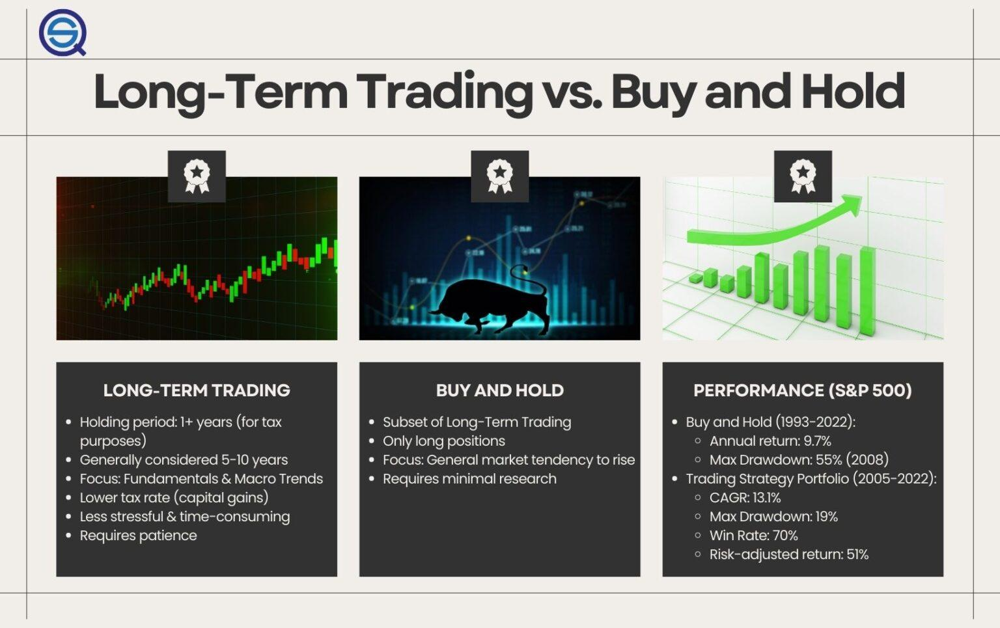

Algorithmic trading, often referred to as algo trading, employs sophisticated computer programs and mathematical models to execute trading decisions at speed and efficiency levels unattainable by human traders. The essence of algo trading lies in its ability to utilize precise algorithms that determine optimal trading strategies, managing vast amounts of data to identify lucrative opportunities. Within this sophisticated framework, long-term trading strategies stand out as a vital component influencing successful trading outcomes.

A long-term trading strategy in algorithmic trading involves maintaining a position for a substantial duration—ranging from several months to years. This approach is predicated on the objective of capturing long-lasting market trends and economic shifts. By focusing on macroeconomic indicators, fundamental analysis, and prolonged economic cycles, such strategies aim to capitalize on sustainable movements within various financial markets. The essence of this strategy is patience, as it requires a tolerance for short-term market volatility while anticipating favorable outcomes aligning with the overarching market trajectory.



This article comprehensively examines diverse long-term trading strategies incorporated within the domain of algorithmic trading, exploring their intrinsic benefits. It seeks to delineate the methods by which these strategies can be robustly implemented, offering potential pathways to achieve significant returns over extended timelines. Through an analysis of their strategic design, execution, and the challenges they entail, the article provides insightful guidance for traders aiming to leverage long-term algo trading strategies effectively.

## Table of Contents

## What are Long-Term Trading Strategies in Algo Trading?

Long-term trading strategies in algorithmic trading involve leveraging the buy-and-hold principle through automated systems. These strategies are designed to maintain positions over extended durations, ranging from months to several years, allowing traders to capitalize on enduring market trends, economic cycles, and fundamental shifts. By their nature, these strategies aim to capture greater potential gains by following sustained market movements rather than short-lived price fluctuations.

The implementation of long-term strategies within algorithmic frameworks requires a comprehensive understanding of market fundamentals, such as macroeconomic indicators, interest rates, GDP growth, and earnings reports. These factors play a crucial role in influencing the strategic decision-making process by contributing to the identification of sustainable trends and potential inflection points.

One of the primary objectives of these long-term strategies is to exploit broad market [momentum](/wiki/momentum), capturing upward or downward trends as they develop. By focusing on these macroeconomic variables, long-term algorithms can effectively align their trading signals with underlying economic conditions, thus enhancing the probability of achieving favorable outcomes.

Compared to short-term trading, these algorithms demand less frequent monitoring, providing a more passive approach to investment management. However, the requirement for a solid grasp of economic indicators and [fundamental analysis](/wiki/fundamental-analysis) remains imperative. This understanding aids in constructing strategies that are robust and adaptive to changing market conditions.

By embracing automated solutions, traders benefit from systematic and disciplined execution, minimizing the emotional biases that often affect manual trading decisions. This approach allows for consistent adherence to the strategic plan over the defined investment horizon, thereby maximizing the potential to realize gains as market trends evolve.

## Benefits of Long-Term Trading Strategies in Algo Trading

Long-term trading strategies in [algorithmic trading](/wiki/algorithmic-trading) provide several benefits that make them appealing options for investors seeking to capitalize on major market trends and macroeconomic shifts. One of the primary advantages is the ability to capture significant market trends that might be overlooked by short-term strategies. By maintaining positions over extended periods, long-term strategies allow traders to benefit from broader economic cycles and long-standing shifts in the market, leading to potentially higher stability and returns.

Algorithmic trading enhances these benefits by minimizing human emotional bias, which often leads to impulsive decisions in manual trading. Algorithms are designed to make objective decisions based on predefined criteria, ensuring consistency in execution irrespective of market [volatility](/wiki/volatility-trading-strategies). This systematic approach helps traders adhere to their strategies without influence from market noise.

Another crucial advantage is the capability for [backtesting](/wiki/backtesting), which is essential for assessing the robustness of trading strategies under diverse market conditions. Backtesting involves running the algorithm through historical market data to evaluate its performance and make necessary adjustments. This process ensures that the strategy can withstand various market environments and optimize its effectiveness over time.

Furthermore, long-term trading strategies in algo trading generally involve lower execution costs compared to high-frequency trading strategies. This is primarily due to the reduced frequency of trades, which consequently lowers transaction fees and slippage—the difference between the expected price of a trade and the actual price. High-frequency strategies require constant trading, accruing substantial costs over time, whereas long-term strategies, with their less frequent transactions, offer a cost-efficient alternative to achieving market exposure.

In summary, long-term trading strategies within algorithmic trading systems provide enhanced stability, reduced emotional bias, effective backtesting opportunities, and lower execution costs. These attributes make them highly effective for traders looking to harness long-term market trends while optimizing the balance between costs and potential returns.

## Designing Effective Long-Term Trading Strategies

To create an effective long-term trading strategy in algorithmic trading, it is essential to integrate several key factors, including risk management, diversification, and comprehensive market analysis.

**Risk Management**: Efficient risk management is critical for long-term success. This involves setting appropriate stop-loss levels and position sizes to ensure that market fluctuations do not lead to significant losses. Traders can employ techniques such as Value at Risk (VaR) to quantify potential losses in their portfolios over a specific timeframe. VaR provides a probabilistic estimate of potential losses, which helps in making informed decisions about risk exposure.

**Diversification**: Diversification is a fundamental principle in risk mitigation. By investing across various asset classes or sectors, traders can reduce the impact of adverse movements in any single market or industry. For instance, holding a mix of equities, bonds, and commodities can provide stability and capitalize on different market conditions. Diversified portfolios are less susceptible to market volatility, providing a smoother performance over the long term.

**Market Analysis**: A thorough understanding of market trends, economic indicators, and fundamental factors is essential for designing robust long-term strategies. Fundamental analysis involves evaluating the intrinsic value of assets based on economic conditions, company performance, and industry trends. Traders should consider indicators such as GDP growth rates, employment statistics, and inflation to assess the overall economic environment. This analysis helps in identifying potential opportunities and risks associated with long-term investments.

**Backtesting**: Backtesting is a crucial process where trading strategies are tested against historical data to assess their efficacy. This helps in identifying potential flaws and areas for improvement before implementation in live markets. The use of backtesting software allows traders to simulate their strategies across various market conditions, thus providing insights into potential performance. Python, with libraries like pandas and backtrader, can be useful for backtesting purposes:

```python
import pandas as pd
from backtrader import Cerebro, Strategy, feed

class LongTermStrategy(Strategy):
    def __init__(self):
        # Initialize strategy
        pass

    def next(self):
        # Define logic for each timestep
        pass

# Data loading and strategy execution
data = pd.read_csv('historical_data.csv')
cerebro = Cerebro()
feed = bt.feeds.PandasData(dataname=data)
cerebro.adddata(feed)
cerebro.addstrategy(LongTermStrategy)
cerebro.run()
```

**Combining Fundamental Analysis with Algorithms**: Integrating fundamental analysis into algorithmic strategies enhances decision-making by considering both quantitative and qualitative factors. Algorithms can process vast amounts of data to identify patterns and trends, while fundamental analysis provides context about economic impacts. This combination ensures a holistic view of the market, allowing for more informed and effective long-term trading strategies.

By focusing on these elements, traders can design robust long-term trading strategies capable of navigating complex market environments while optimizing returns and managing risks efficiently.

## Backtesting Long-Term Trading Strategies

Backtesting is a crucial component of developing long-term trading strategies in algorithmic trading, as it enables traders to assess the viability and potential effectiveness of their strategies using historical data. This process provides insights into how a given strategy might perform under various market conditions by simulating trades and observing their outcomes over past market cycles.

To conduct effective backtesting, traders first need to perform a comprehensive analysis of historical market trends and economic cycles. This helps in aligning their trading strategies with scenarios that are likely to occur in the future. By understanding the past market behavior and its driving forces, traders can better anticipate future trends and adjust their strategies accordingly.

Key metrics are essential in the evaluation of backtested strategies to gauge both risk and return potential. Among these metrics, the Compound Annual Growth Rate (CAGR) is commonly used to measure the average annual return of the strategy over the test period. It is calculated using the formula:

$$

\text{CAGR} = \left( \frac{\text{Ending Value}}{\text{Beginning Value}} \right)^{\frac{1}{n}} - 1
$$

where $n$ is the number of years over which the strategy was tested. This metric helps in understanding the growth rate of investments had the strategy been applied over a multi-year period.

Another critical metric in assessing a strategy's risk is the Maximum Drawdown, which quantifies the greatest peak-to-trough decline the strategy experienced during backtesting. This metric is crucial for understanding the potential risk of loss which investors might face. A lower maximum drawdown indicates a strategy that has the ability to withstand unfavorable market conditions with minimal capital erosion.

Additionally, the Sharpe Ratio is used to evaluate a strategy's risk-adjusted return. It is calculated as:

$$

\text{Sharpe Ratio} = \frac{\text{Average Portfolio Return} - \text{Risk-Free Rate}}{\text{Standard Deviation of Portfolio Returns}} 
$$

This ratio provides insight into how much excess return is generated for each unit of risk undertaken. A higher Sharpe Ratio suggests that a strategy offers better risk-adjusted returns, favoring those strategies with more consistent performance.

In implementing a backtesting process, algorithmic traders often employ programming languages such as Python. Python offers various libraries like `pandas`, `numpy`, and `[backtrader](/wiki/backtrader)` that facilitate efficient data manipulation and strategy simulation. For example, `backtrader` is an open-source backtesting framework in Python that allows users to test their trading strategies with ease across different market data.

In summary, backtesting long-term trading strategies is an invaluable task for predicting future performance, requiring a detailed examination of past data and the use of crucial performance metrics. When executed accurately, it empowers traders with insights to refine their strategies and enhance decision-making.

## Long-Term vs. Short-Term Strategies

Short-term and long-term strategies in algorithmic trading differ fundamentally in their approach, objectives, and risk profiles. Short-term strategies, often associated with high-frequency trading, aim to capitalize on minor price fluctuations over brief periods, sometimes even milliseconds. By executing a large [volume](/wiki/volume-trading-strategy) of trades in a short timeframe, these strategies seek quick profits from market inefficiencies.

Conversely, long-term trading strategies prioritize capturing larger trends and macroeconomic shifts. These strategies function over extended periods, ranging from months to years. The primary focus lies in leveraging sustained market trends, economic cycles, and intrinsic value changes that may not be immediately apparent.

Long-term strategies generally exhibit lower volatility compared to their short-term counterparts, as they are designed to weather market fluctuations while aiming for consistent capital growth. The reduced trading frequency results in lower transaction costs and minimizes the impact of market noise that can cloud short-term decision-making. As a result, long-term strategies are particularly suited for investors seeking steady growth with a reduced need for constant monitoring.

Combining short-term and long-term strategies can enhance a trader's portfolio by diversifying risk and optimizing returns. Each strategy type functions differently under various market conditions, and their interaction can offer a more balanced risk-return profile. For instance, while short-term strategies might perform well in volatile markets, long-term strategies can offset the risk by exploiting established trends and economic insights.

To illustrate the integration of these strategies in a portfolio, consider this simple Python example:

```python
# Example code to simulate mixing short-term and long-term strategies in a portfolio

# Import necessary libraries
import numpy as np

# Generate hypothetical returns for short-term and long-term strategies
np.random.seed(42)
short_term_returns = np.random.normal(0.001, 0.01, 252)  # Daily returns
long_term_returns = np.random.normal(0.005, 0.02, 252)   # Monthly returns

# Assume a portfolio with 70% long-term and 30% short-term investments
portfolio_weights = {'long_term': 0.7, 'short_term': 0.3}

# Calculate portfolio returns
portfolio_returns = (portfolio_weights['long_term'] * np.sum(long_term_returns) +
                     portfolio_weights['short_term'] * np.sum(short_term_returns))

print(f"Annualized Portfolio Return: {np.mean(portfolio_returns) * 252:.2%}")
```

Overall, while short-term and long-term strategies operate on different premises, their integration can effectively harness market potential across various timeframes, leading to optimized returns and diversified risk management in algorithmic trading.

## Common Challenges and Pitfalls

Algorithmic long-term trading requires a meticulous approach to mitigate common challenges and pitfalls. One of the primary concerns is overfitting, which occurs when a trading algorithm is excessively tailored to historical data, capturing noise rather than true market signals. This issue can lead to unrealistic expectations of future performance. Overfitting can be detected and minimized through techniques such as cross-validation and by ensuring the model is not overly complex relative to the amount of data available.

Another significant challenge is adapting to evolving economic policies and market structures. Changes in regulatory frameworks or economic environments can render previously successful strategies ineffective. Traders must remain vigilant, regularly updating their algorithms and underlying assumptions to reflect current market conditions and policy shifts. This requires a robust mechanism for incorporating new data and adapting algorithms without excessive delays.

Additionally, understanding and accounting for transaction costs and slippage is crucial for accurately assessing the profitability of a long-term trading strategy. Transaction costs can accumulate over time and erode potential profits, especially in markets with high levels of trading activity. Slippage, the difference between the expected price of a trade and the actual price, can further impact returns, particularly in volatile markets or those with [liquidity](/wiki/liquidity-risk-premium) constraints. To address these issues, traders should integrate realistic transaction cost models and slippage estimates into their strategy evaluation processes.

In practice, transaction costs can be modeled as a fixed percentage of the trade value or as a function of the trade volume. Slippage might be quantified using historical data to estimate typical deviations from expected prices under varying market conditions. For example, a Python function could simulate the impact of transaction costs and slippage on a trading strategy:

```python
def adjust_for_costs(price, volume, transaction_cost=0.001, slippage=0.0005):
    # Adjusts price for transaction costs and slippage
    cost_adjusted_price = price * (1 + transaction_cost)
    slippage_adjusted_price = cost_adjusted_price * (1 + slippage)
    return slippage_adjusted_price

# Example usage:
adjusted_price = adjust_for_costs(price=100, volume=1000)
```

By considering these factors and implementing robust testing and adaptation processes, traders can navigate the complexities of algorithmic long-term trading more effectively, enhancing their potential for sustained success in the market.

## Conclusion

Long-term trading strategies in algorithmic trading provide a systematic approach to capitalize on market opportunities over extended periods. By leveraging advanced algorithms, these strategies aim to capture substantial market trends and macroeconomic shifts that shorter-term strategies may overlook. Proper implementation of long-term trading strategies can facilitate significant growth while maintaining a balanced risk profile. This balance is crucial as it mitigates the impact of market volatility on the portfolio, allowing for steady capital appreciation over time.

The success of long-term algorithmic trading strategies hinges on several key factors. Continuous evaluation is essential to ensure that the strategies remain effective across varying market conditions. This iterative process involves regularly revisiting and refining the strategy based on both historical data and future market projections. Additionally, adapting to market changes is vital as economic landscapes evolve due to policy shifts, technological advancements, or other macroeconomic factors. Being responsive to these changes helps maintain strategy relevance and performance.

Moreover, the integration of technical analysis and fundamental insights further enhances the robustness of long-term strategies. Technical analysis focuses on patterns and trends in historical data, while fundamental analysis considers broader economic indicators and company performance metrics. By combining these approaches, traders can develop a holistic strategy that benefits from quantitative data and qualitative assessments of economic health.

In conclusion, long-term trading strategies in algo trading offer a structured pathway to achieve consistent growth with managed risk. Success in this arena requires a commitment to ongoing strategy evaluation, market adaptability, and the synergy of technical and fundamental analysis. With these elements in place, traders can effectively harness the potential of long-term market movements and achieve their investment objectives.

## References & Further Reading

[1]: Bergstra, J., Bardenet, R., Bengio, Y., & Kégl, B. (2011). ["Algorithms for Hyper-Parameter Optimization."](https://dl.acm.org/doi/10.5555/2986459.2986743) Advances in Neural Information Processing Systems 24.

[2]: ["Advances in Financial Machine Learning"](https://www.amazon.com/Advances-Financial-Machine-Learning-Marcos/dp/1119482089) by Marcos Lopez de Prado

[3]: ["Evidence-Based Technical Analysis: Applying the Scientific Method and Statistical Inference to Trading Signals"](https://www.amazon.com/Evidence-Based-Technical-Analysis-Scientific-Statistical/dp/0470008741) by David Aronson

[4]: ["Machine Learning for Algorithmic Trading"](https://github.com/stefan-jansen/machine-learning-for-trading) by Stefan Jansen

[5]: ["Quantitative Trading: How to Build Your Own Algorithmic Trading Business"](https://books.google.com/books/about/Quantitative_Trading.html?id=j70yEAAAQBAJ) by Ernest P. Chan