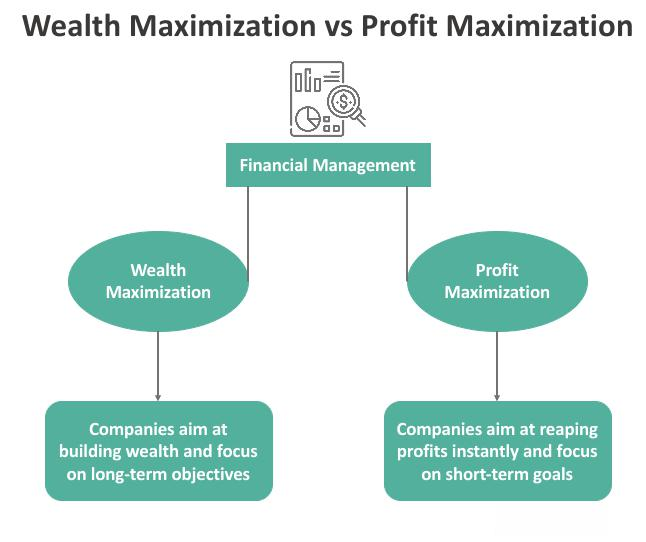

Algorithmic trading has significantly altered the dynamics of financial markets by allowing traders to execute strategies with unparalleled precision and speed. This evolution in trading technology leverages complex algorithms and high-frequency data analytics to make informed trading decisions, emphasizing the role of speed and accuracy in executing market transactions. The primary focus of this article is on understanding how algorithmic trading can be used for long-term wealth maximization, a goal that requires insight into robust strategies and techniques.

The automation and sophistication inherent in algorithmic trading have equipped traders and investors with advanced tools that were not previously available in manual trading environments. These tools have expanded the capabilities for market participants to process and analyze large volumes of data, recognize profitable opportunities, and execute trades within milliseconds, often ahead of their human counterparts. However, trading in such a technology-driven landscape is not without its challenges; the competition remains intense, with numerous market players implementing similar strategies.



To stay competitive and enhance wealth over the long term, traders must align their strategies with a comprehensive understanding of the principles and methodologies underlying algorithmic trading. This involves not only designing efficient algorithms but also ensuring they are adaptable to various market conditions. Profound knowledge in quantitative finance, statistical methods, data science, and technology is indispensable for developing and deploying successful trading algorithms. Moreover, a continual adaptation to new information, emerging technologies, and market dynamics is essential for sustained success in this rapidly evolving field. Such an approach can empower traders to maximize returns while managing risk effectively.

## Table of Contents

## Understanding Algorithmic Trading

Algorithmic trading, commonly known as algo trading, leverages computer algorithms to make precise and speedy trading decisions. These algorithms are constructed to capitalize on market inefficiencies, execute trades with high precision, and manage associated risks effectively.

The strategies employed in [algorithmic trading](/wiki/algorithmic-trading) are diverse, each serving different purposes and market conditions. Some of the most common types include trend-following, mean reversion, [arbitrage](/wiki/arbitrage), and market-making. 

Trend-following strategies are predicated on the notion that asset prices, influenced by underlying factors, will continue moving in their current direction over time. They often rely on indicators such as moving averages to generate buy or sell signals.

Mean reversion strategies, in contrast, operate on the hypothesis that asset prices will revert to their historical averages over time. These strategies generally involve statistical analysis to identify deviations from these historical norms, signaling potential trading opportunities.

Arbitrage strategies aim to exploit price discrepancies of the same asset in different markets. These can be particularly effective in high-frequency trading environments where minute price differences can be rapidly identified and acted upon to capture profits.

Market-making strategies involve providing [liquidity](/wiki/liquidity-risk-premium) to the market, profiting from the bid-ask spread. These strategies necessitate maintaining a balance between buying and selling to ensure the spread is captured without excessive inventory risk.

A critical component of algorithmic trading is the reliance on quantitative analysis and [backtesting](/wiki/backtesting). Quantitative analysis allows traders to apply mathematical and statistical models to historical data to identify potential trading signals. Backtesting, on the other hand, involves testing these strategies on historical data to evaluate their effectiveness and potential profitability. It enables the identification of strategy weaknesses and the refining of parameters to enhance strategy performance.

Through these methodologies, algorithmic trading not only aims to enhance the precision and speed of trades but also strives to generate consistent returns over time. This is achieved by systematically analyzing vast amounts of data, thereby minimizing human error and emotional bias, and making informed decisions based solely on quantitative evidence.

## Benefits of Algo Trading for Long-Term Wealth

Algorithmic trading offers several distinct advantages over manual trading, particularly for those focused on long-term wealth maximization. One of the primary benefits is the elimination of emotional bias. By relying on data-driven algorithms, trades are executed based on predefined criteria, minimizing the influence of human emotions such as fear and greed, which can often lead to irrational decision-making. This objectivity enhances the reliability and consistency of trading outcomes.

Moreover, algorithmic trading facilitates the automation of trading processes. Automated systems can swiftly analyze vast amounts of market data and execute trades at optimal times, which is often not feasible in manual trading. This capability significantly increases the potential for profit, as the algorithms can capture fleeting market opportunities that human traders might miss. Through automation, traders can capitalize on the small price inefficiencies that occur within fractions of a second.

Another significant advantage is the use of backtesting and optimization. Before deploying a strategy, traders can test it against historical market data to evaluate its performance and refine it for improvement. This process allows for the development of robust strategies that have the potential for better risk-adjusted returns. By analyzing how a strategy would have performed in the past, traders can optimize their parameters and identify potential weaknesses, increasing confidence in the expected future performance.

Algorithmic trading is also highly scalable and efficient, which means traders can handle larger volumes of trades and employ multiple strategies contemporaneously. This scalability is beneficial for trading multiple securities across different exchanges and time zones. The algorithms can be designed to operate continuously, thus exploiting opportunities in various markets and increasing exposure to potential profit opportunities across a wider range of assets.

In summary, the use of algorithmic trading for long-term wealth maximization is advantageous due to its ability to eliminate emotional bias, automate trading processes, improve through backtesting and optimization, and enhance scalability and efficiency. These factors collectively empower traders to manage larger portfolios and deploy more sophisticated strategies, increasing the probability of sustained long-term profitability.

## Designing a Strategy for Wealth Maximization

Successful algorithmic trading with the aim of long-term wealth maximization begins with clearly identified objectives and well-defined trading goals. The initial step involves determining the desired outcomes, such as target return rates, acceptable risk levels, and investment horizons. These objectives guide the selection and design of suitable algorithmic strategies.

A critical component of strategy development is extensive research and backtesting. Historical data is analyzed to identify patterns and inefficiencies in the market. By simulating different strategies using past market data, traders can assess potential performance and refine their approach. Backtesting helps determine whether a strategy can generate consistent returns in various market conditions. It involves using statistical methods to validate the robustness of the strategy and to adjust parameters for optimized performance.

Diversification is another cornerstone of wealth maximization strategies. By spreading investments across different asset classes, sectors, and timeframes, traders can mitigate risks associated with market [volatility](/wiki/volatility-trading-strategies). Diversification reduces the impact of adverse movements in a specific market segment, enhancing the potential for stable returns. For instance, a portfolio may include equities, fixed income, commodities, and alternative investments to balance risk-reward ratios effectively.

Regular monitoring and optimization are vital for adapting strategies to evolving market conditions. As markets are inherently dynamic, strategies that perform well in one environment might struggle in another. Continuous monitoring allows traders to identify shifts in market trends and adjust their strategies accordingly. Optimization involves fine-tuning algorithm parameters, revisiting assumptions, and incorporating new data to enhance performance.

Python, a popular language for algorithmic trading, offers tools for both backtesting and optimization. Here is a basic example of how Python can be used to evaluate a strategy's performance:

```python
import pandas as pd
import numpy as np

# Load historical price data
data = pd.read_csv('historical_prices.csv')
prices = data['Close']

# Define a simple moving average strategy
short_window = 40
long_window = 100

# Calculate moving averages
signals = pd.DataFrame(index=prices.index)
signals['Signal'] = 0.0
signals['Short_MA'] = prices.rolling(window=short_window, min_periods=1).mean()
signals['Long_MA'] = prices.rolling(window=long_window, min_periods=1).mean()

# Generate signals
signals['Signal'][short_window:] = np.where(
    signals['Short_MA'][short_window:] > signals['Long_MA'][short_window:], 1.0, 0.0)

# Generate trading orders
signals['Position'] = signals['Signal'].diff()

# Visualize signals
import matplotlib.pyplot as plt

plt.figure(figsize=(10, 5))
plt.plot(prices, label='Price')
plt.plot(signals['Short_MA'], label='40-Day MA')
plt.plot(signals['Long_MA'], label='100-Day MA')
plt.plot(signals[signals['Position'] == 1.0].index, 
         signals['Short_MA'][signals['Position'] == 1.0],
         '^', markersize=10, color='g', lw=0, label='Buy Signal')
plt.plot(signals[signals['Position'] == -1.0].index, 
         signals['Short_MA'][signals['Position'] == -1.0],
         'v', markersize=10, color='r', lw=0, label='Sell Signal')
plt.title('Simple Moving Average Strategy')
plt.legend()
plt.show()
```

This example demonstrates a simplistic moving average crossover strategy, highlighting where a trader might buy or sell an asset. Such strategies, coupled with diversification, regular monitoring, and optimization, can significantly contribute to long-term wealth maximization in algorithmic trading.

## Risk Management in Algo Trading

Risk management is a fundamental aspect of algorithmic trading, integral to safeguarding investments and optimizing long-term wealth. Effective risk management strategies include the use of stop-loss orders, position sizing, and hedging.

Stop-loss orders are automated commands to sell an asset when it reaches a certain price, thereby limiting potential loss. By predetermining acceptable loss levels, traders can shield their portfolios from significant downturns. Position sizing refers to determining the number of units or contracts to trade, based on the trader's risk tolerance and account size. This method ensures a balanced risk-to-reward ratio across trades and mitigates the impact of any single unprofitable trade on the overall portfolio.

Hedging involves using financial instruments to offset potential losses from existing positions. For example, traders might employ options or futures contracts to protect against adverse price movements. This strategy is particularly useful in volatile markets, where asset prices can change rapidly.

Monitoring transaction costs and slippage is crucial in algorithmic trading. Transaction costs include broker fees, taxes, and other charges associated with buying and selling assets. High transaction costs can erode profits, particularly for high-frequency trading strategies. Slippage occurs when there is a difference between the expected price of a trade and the price at which it is executed. This discrepancy can negatively impact returns, especially in fast-moving markets.

The trading infrastructure, which encompasses hardware, software, and network components, is vital for executing trades efficiently and accurately. A robust infrastructure reduces the risk of technical failures, delays, and errors, which can lead to substantial financial losses.

Minimizing risk exposure yields enhanced wealth maximization. Traders should regularly evaluate their algorithms' performance, adjusting strategies as necessary to adapt to evolving market conditions. This proactive approach helps in maintaining strategy robustness and effectiveness.

In conclusion, sound risk management in algorithmic trading is indispensable for preserving capital and facilitating sustainable growth. By meticulously implementing measures such as stop-loss orders, position sizing, and hedging, along with vigilant oversight of transaction costs, slippage, and trading infrastructure, traders can significantly enhance their potential for long-term wealth accumulation.

## Challenges and Pitfalls

Algorithmic trading has revolutionized the financial markets, allowing trades to be executed with unprecedented speed and precision. However, despite its advantages, there are several significant challenges and pitfalls that practitioners must navigate to ensure success and sustainability.

### Overfitting Strategies to Historical Data

One of the most substantial challenges in algorithmic trading is the risk of overfitting strategies to historical data. Overfitting occurs when a trading model is excessively tailored to fit past price movements, thereby capturing noise instead of genuine market patterns. While an overfitted model might show impressive backtest results, it often fails to perform in real-time trading due to the dynamic nature of financial markets. To mitigate this risk, traders should use techniques like walk-forward optimization and cross-validation to test the robustness of their strategies. These methods help in assessing how well the trading algorithm adapts to new, unseen data without sacrificing performance.

### Ignoring Transaction Costs and Slippage

Another significant pitfall is the oversight of transaction costs and slippage when simulating trading performance. Transaction costs, such as commissions and fees, can erode profits, especially in high-frequency trading where the [volume](/wiki/volume-trading-strategy) of trades is substantial. Slippage, the difference between the expected and actual trade execution price, can also adversely impact performance, particularly in volatile or illiquid markets. To address these issues, algorithmic traders should incorporate realistic estimates of transaction costs and slippage in their models. This can be achieved by analyzing historical trading data to derive average execution costs and using these inputs during backtesting.

### Developing a Robust System

Creating a robust trading system that can withstand varying market conditions is crucial for long-term success. Financial markets are influenced by a myriad of factors, including economic indicators, geopolitical events, and investor sentiment, leading to shifts in volatility and liquidity. A robust system should incorporate features such as adaptive algorithms that adjust to changing market environments and diversification strategies that spread risk across multiple assets or markets. Moreover, continuous monitoring and fine-tuning of algorithms are necessary to ensure they remain effective as market conditions evolve.

### Continuous Education and Market Awareness

Staying informed about the latest regulatory changes and market dynamics is essential for maintaining an edge in algorithmic trading. Regulatory bodies frequently update policies regarding trading practices and data usage, which can impact the operation of trading algorithms. Additionally, staying abreast of technological advancements, such as [machine learning](/wiki/machine-learning) techniques or [alternative data](/wiki/best-alternative-data) sources, can provide valuable insights for enhancing trading strategies. Continuous education through courses, seminars, and industry conferences can help traders remain knowledgeable and adaptive to changes, thereby enhancing their decision-making capabilities.

In conclusion, recognizing and addressing these challenges and pitfalls is vital for achieving sustained success in algorithmic trading. By avoiding common mistakes such as overfitting and ignoring costs, and by developing robust and adaptable trading systems, traders can position themselves to maximize returns in the competitive financial markets.

## Conclusion

Algorithmic trading offers a promising route to long-term wealth maximization, provided it is grounded in disciplined strategy development and robust risk management practices. The potential of algorithmic trading is vast, yet realizing this potential necessitates a strong foundation in data analysis, programming, and a deep understanding of market dynamics. Knowledge in these areas allows traders to create sophisticated algorithms capable of capturing market inefficiencies and adapting to evolving market conditions.

For traders aiming to achieve sustained success, it is imperative to focus on diversification, continuous optimization, and efficient risk management. Diversification—across different asset classes, sectors, and investment timeframes—reduces exposure to unsystematic risk and enhances portfolio resilience against market volatility. Continuous optimization ensures trading algorithms remain effective by adapting strategies based on historical data analysis and real-time performance metrics. Furthermore, an emphasis on risk management—through the use of stop-loss orders, position sizing, and hedging—protects capital and maintains the potential for steady growth.

Investment in technology and education also plays a key role in unlocking the full potential of algorithmic trading. Advanced computing power and state-of-the-art software tools facilitate the development and execution of complex trading strategies at high speeds and with precision. Simultaneously, ongoing education equips traders with the necessary skills to navigate ever-changing trading environments and adapt to new technologies and regulatory landscapes. By prioritizing these components, traders can maximize returns and maintain a competitive edge, ensuring the prolonged viability and profitability of their trading endeavors.

## FAQ

What is algorithmic trading, and how can it maximize long-term wealth?

Algorithmic trading utilizes computer programs to execute pre-defined trading strategies automatically. By leveraging algorithms, traders can exploit market inefficiencies and capitalize on opportunities that may be invisible to the human eye. This precision enables traders to execute trades rapidly, minimizing the impact of slippage and other market variables that can erode profits. In the pursuit of long-term wealth maximization, algorithmic trading offers the advantage of data-driven decision-making, eliminating emotional biases that can cloud judgment in manual trading. Consistent application of algorithms can help traders achieve steady returns over time, contributing to wealth accumulation.

How do risk management strategies apply to algo trading?

Risk management is integral to successful algorithmic trading, as it safeguards investments and maximizes profit potential. Strategies such as implementing stop-loss orders can mitigate losses by automatically exiting trades when they surpass predetermined loss thresholds. Position sizing, or determining the appropriate amount to invest in a trade, helps control exposure to risk. Additionally, hedging strategies can offset potential losses in one position with gains in another. Monitoring transaction costs and slippage ensures that the cost of executing trades does not outweigh the benefits. Effective risk management enhances the durability and success of trading strategies.

What are the most common challenges faced in algorithmic trading?

Algorithmic trading is not without its challenges. One significant issue is the risk of overfitting strategies to historical data, which can result in poor performance when applied to live markets. Algorithms must be robust enough to operate effectively under varying market conditions, requiring continuous refinement and adaptation. Ignoring transaction costs and slippage can lead to overestimated profits. Furthermore, staying informed about regulatory changes and evolving market dynamics is necessary to maintain a competitive edge. Understanding and addressing these challenges is essential for the long-term viability of algorithmic trading strategies.

How important is backtesting in algo trading strategy development?

Backtesting is a critical component of algorithmic trading strategy development. It involves testing a trading strategy using historical market data to evaluate its performance before deploying it in live markets. This process allows traders to identify strengths and weaknesses, ensuring that the strategy is fundamentally sound. Through backtesting, traders can measure various performance metrics such as profitability, drawdowns, and risk-adjusted returns. It also provides an opportunity to optimize strategy parameters, further enhancing its potential for success. Without rigorous backtesting, a strategy may lack the robustness needed to thrive in real-world trading environments.

What are some of the best practices for maintaining a competitive edge in algorithmic trading?

To maintain a competitive edge in algorithmic trading, continuous education and technological investment are paramount. Keeping abreast of the latest developments in finance, data analysis, and programming helps traders adapt to changing conditions. Diversification across different asset classes and trading strategies mitigates risk and opens new opportunities for profit. Regular optimization of algorithms, informed by market conditions and backtesting results, ensures strategies remain effective. Additionally, leveraging advanced trading infrastructure, such as low-latency networks and high-performance computing, can enhance execution speed and reliability, offering a significant edge in highly competitive markets.

## References & Further Reading

[1]: Bergstra, J., Bardenet, R., Bengio, Y., & Kégl, B. (2011). ["Algorithms for Hyper-Parameter Optimization."](https://dl.acm.org/doi/10.5555/2986459.2986743) Advances in Neural Information Processing Systems 24.

[2]: ["Advances in Financial Machine Learning"](https://www.amazon.com/Advances-Financial-Machine-Learning-Marcos/dp/1119482089) by Marcos Lopez de Prado

[3]: ["Evidence-Based Technical Analysis: Applying the Scientific Method and Statistical Inference to Trading Signals"](https://www.amazon.com/Evidence-Based-Technical-Analysis-Scientific-Statistical/dp/0470008741) by David Aronson

[4]: ["Machine Learning for Algorithmic Trading"](https://github.com/stefan-jansen/machine-learning-for-trading) by Stefan Jansen

[5]: ["Quantitative Trading: How to Build Your Own Algorithmic Trading Business"](https://books.google.com/books/about/Quantitative_Trading.html?id=j70yEAAAQBAJ) by Ernest P. Chan