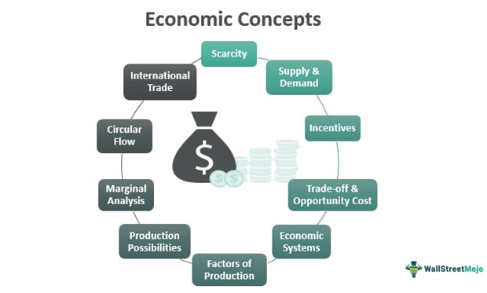

The convergence of financial trading strategies and technology has led to the development of sophisticated methods like algorithmic trading, commonly referred to as algo trading. This integration of technology into the financial markets has not only enhanced trading efficiency but also opened up new avenues for leveraging complex strategies. In this article, our focus will be on a specific trading strategy known as "long the basis," and its significance within the trading world. 

"Long the basis" is a strategic approach used by traders, particularly within commodity markets, to hedge investments and capitalize on future price movements. The term "basis" in this context refers to the difference between the spot price of a commodity and its corresponding futures price. Traders opting for this strategy typically aim to benefit from favorable changes in this price differential. As financial markets become more volatile, the need for such skilled strategies becomes increasingly crucial for both risk management and profit maximization.



We'll explore how algorithmic trading—the use of mathematical models and advanced software to execute trades at high speeds—can optimize the "long the basis" strategy. This involves breaking down key financial terms and concepts such as futures contracts, hedging, and basis risk. Understanding these elements is fundamental to grasping how algorithmic execution can enhance traditional trading methods.

Ultimately, our goal is to provide readers with a comprehensive understanding of how the integration of these modern concepts can pave the way for effective trading strategies. This article is crafted to cater to both novice traders who are beginning to discover the intricacies of market strategies and experienced traders looking to refine their approaches with the latest technological advancements.

## Table of Contents

## Understanding 'Long the Basis'

'Long the basis' is a term used in commodity trading to describe a specific strategy whereby traders purchase the cash commodity while simultaneously selling futures contracts for the same commodity. This approach is often employed by traders seeking to profit from the price difference, known as the basis, between the spot price of a commodity and its futures price.

### Hedging with Futures Contracts

The primary purpose of the 'long the basis' strategy is to hedge against market fluctuations. Traders use futures contracts, which are standardized agreements to buy or sell a commodity at a predetermined price at a specific time in the future, to offset potential losses in the cash market. This dual position allows traders to protect themselves against adverse price movements while capitalizing on favorable ones.

### Financial Terms Explained

**Futures Contracts:** These are legal agreements to buy or sell a particular commodity asset at a predetermined price at a specified future date. Futures contracts are standardized in terms of quantity, quality, and delivery location, and they are traded on futures exchanges.

**Hedging:** This is a risk management strategy used to offset potential losses in an investment. In the context of 'long the basis', hedging involves taking opposite positions in the cash and futures markets to mitigate price risk.

**Basis Risk:** This refers to the risk that the cash-futures price relationship, or the basis, will not move in a predictable manner. Even though hedging can mitigate some price risk, basis risk remains because the basis itself may fluctuate due to changes in supply and demand, transportation costs, and other market dynamics.

### When to 'Long the Basis'

A trader who chooses to 'long the basis' is typically bullish on the cash commodity, expecting its price to increase more relative to the futures price. This strategy is often employed when the current basis is weak (the cash price is lower than the futures price), and the trader anticipates that the basis will strengthen (the cash price will increase or the futures price will decrease). This change in the basis provides the opportunity for [arbitrage](/wiki/arbitrage) profits.

By executing this strategy, traders can benefit from the narrowing basis while ensuring they are protected against unwanted price [volatility](/wiki/volatility-trading-strategies) through the futures position. Understanding the dynamics of the basis is crucial for traders employing this strategy, as it heavily relies on predicting the convergence of the cash and futures prices over time.

## How Algorithmic Trading Enhances the 'Long the Basis' Strategy

Algorithmic trading plays a significant role in executing 'long the basis' strategies with enhanced efficiency. The primary features of [algorithmic trading](/wiki/algorithmic-trading)—automation, speed, and precision—are crucial in optimizing this strategy.

Firstly, automation in algorithmic trading enables the continuous execution of 'long the basis' strategies without the need for constant human oversight. Automated systems can place and manage orders based on predefined criteria, allowing traders to capitalize on opportunities swiftly. This feature ensures that trades are executed at the right moments, leveraging slight market movements that would be challenging to capture manually.

The speed of algorithmic trading is another vital feature. Algorithms can process vast amounts of data almost instantaneously, executing trades within milliseconds. This speed is particularly beneficial for 'long the basis' strategies, which often rely on the rapid adjustment of positions to hedge against basis risk effectively. The market dynamics can change quickly, and the ability to respond at such speed provides a competitive edge.

Precision is also a key component. Algorithms are programmed to execute trades with a high degree of accuracy, following predefined rules that eliminate the risk of errors common in manual trading. This precision ensures that the 'long the basis' strategy is implemented as intended, maintaining the integrity of the hedging or speculative positions.

One of the significant advantages of using algorithms is their capability for real-time data analysis. By continuously analyzing market data, algorithms can identify trends and insights relevant to the 'long the basis' strategy. Additionally, [backtesting](/wiki/backtesting) is an essential process that algorithms facilitate. By using historical data, traders can test the effectiveness of the 'long the basis' strategy, refining their approach before deploying it in live markets. Backtesting results can indicate potential weaknesses in the strategy and offer a statistical basis for confident decision-making.

Moreover, algorithmic trading minimizes human error and reduces the impact of emotional biases on trading decisions. Emotions like fear and greed can lead to suboptimal trading choices and inconsistent execution. Algorithms, devoid of emotions, strictly adhere to the programmed criteria, ensuring that trades remain logical and systematic. This objectivity is crucial when adhering to a 'long the basis' strategy, as it requires disciplined execution to manage risks effectively.

In conclusion, the convergence of 'long the basis' strategies with algorithmic trading significantly enhances their execution. The automation, speed, and precision provided by algorithms optimize the efficiency of these strategies. By leveraging real-time data analysis and minimizing human errors, traders can implement 'long the basis' with greater accuracy and effectiveness.

## Financial Terms in Algo Trading

### Financial Terms in Algo Trading

Understanding key financial terms is essential for implementing effective algorithmic trading strategies, especially when employing approaches such as 'long the basis'. This section provides a glossary of crucial terms, including 'arbitrage', 'trend-following', 'market-making', and '[statistical arbitrage](/wiki/statistical-arbitrage)', and illustrates their application in practical trading scenarios.

#### Arbitrage

Arbitrage involves the simultaneous purchase and sale of an asset to profit from a difference in price. This typically occurs in different markets or in derivative forms of an asset. The effectiveness of arbitrage is contingent on the speed and precision of execution, both of which are enhanced by algorithmic trading. For example, if a commodity is priced differently on two exchanges, an algorithm can execute trades to buy at the lower price and sell at the higher price almost instantaneously, capturing risk-free profit.

#### Trend-Following

Trend-following is a strategy that attempts to capture gains through the analysis of an asset's [momentum](/wiki/momentum) in a particular direction. Traders using this approach typically enter a long position when an asset is trending upwards and a short position when it trends downwards. Algorithmic trading facilitates trend-following by allowing for the rapid analysis and execution of trades based on complex mathematical models and historical data patterns. Such algorithms can be programmed in Python:

```python
import pandas as pd

# Example of a simple moving average trend-following algorithm
def moving_average_trend(data, short_window=40, long_window=100):
    signals = pd.DataFrame(index=data.index)
    signals['price'] = data['price']
    signals['short_mavg'] = data['price'].rolling(window=short_window, min_periods=1).mean()
    signals['long_mavg'] = data['price'].rolling(window=long_window, min_periods=1).mean()
    signals['signal'] = 0.0
    signals['signal'][short_window:] = np.where(signals['short_mavg'][short_window:] > signals['long_mavg'][short_window:], 1.0, 0.0)   
    signals['positions'] = signals['signal'].diff()

    return signals
```

#### Market-Making

Market-making involves placing a bid and an offer on a particular financial instrument in order to capitalize on the spread between the buying and selling price. This strategy requires efficiently managing inventory and reacting quickly to market changes. Algorithms can systematically manage these decisions and execute them at high speeds, improving [liquidity](/wiki/liquidity-risk-premium) and reducing transaction costs.

#### Statistical Arbitrage

Statistical arbitrage (StatArb) is a quantitative strategy that utilizes statistical models to identify and exploit market inefficiencies. This encompasses techniques like pairs trading, where algorithms statistically determine relationships between different asset prices and capitalize on deviations from these historical norms. Python can be used for statistical analysis in this domain:

```python
import statsmodels.api as sm

# Example pairs trading algorithm
def pairs_trading_strategy(asset1, asset2):
    model = sm.OLS(asset1, asset2).fit()
    residuals = model.resid

    # Determine entry and exit points
    mean_resid = residuals.mean()
    std_resid = residuals.std()

    # Generate buy/sell signals based on residual thresholds
    buy_signals = residuals < (mean_resid - std_resid)
    sell_signals = residuals > (mean_resid + std_resid)

    return buy_signals, sell_signals
```

#### Importance for Strategy Implementation

A solid grasp of these terms is vital for traders employing algorithmic strategies. Arbitrage opportunities must be swiftly identified and executed to be profitable, trend-following relies on recognizing and acting upon price movements efficiently, market-making demands precise bid/ask management, and statistical arbitrage requires rigorous quantitative analysis. By understanding these concepts, traders can enhance their decision-making processes, reduce risks, and optimize returns.

In practical scenarios, these strategies are used by hedge funds and proprietary trading firms to automate trading processes, improving accuracy and efficiency while minimizing emotional biases. They serve as the backbone for developing robust trading algorithms that align with specific investment goals and risk profiles.

## Practical Applications and Real-World Examples

## Practical Applications and Real-World Examples

To understand the practical application of the 'long the basis' strategy in commodity markets, consider a scenario involving a tech firm that specializes in the development of advanced algorithmic trading software. The firm is interested in trading [crude oil](/wiki/crude-oil) futures and spot markets. The 'long the basis' strategy can be employed here by leveraging futures to secure a favorable pricing position in anticipation of a fluctuation in spot prices.

### Case Study: Crude Oil Market

A tech firm identifies a basis opportunity where the spot price of crude oil is expected to increase relative to its futures price. By going long the basis, the firm buys crude oil futures contracts while simultaneously purchasing physical crude oil, effectively locking in the current price with the expectation that the spread will narrow favorably. This setup allows the firm to benefit from an anticipated rise in spot prices while minimizing the risks associated with sudden market volatility.

### Role of Algorithmic Trading

Algorithmic trading can be instrumental in executing the 'long the basis' strategy efficiently. The firm develops complex algorithms to monitor markets and execute trades at optimal moments, based on predefined conditions. These algorithms utilize real-time data analysis to detect slight movements in basis, which might be imperceptible to human traders. Python can be employed to automate these processes as follows:

```python
import pandas as pd
from some_trading_api import TradingAPI

# Initialize trading API
api = TradingAPI(api_key='your_api_key')

# Fetch real-time market data
spot_prices = api.get_spot_prices('crude_oil')
futures_prices = api.get_futures_prices('crude_oil')

# Calculate the basis
basis = futures_prices - spot_prices

# Execute trade based on basis movement
def execute_long_basis_trade():
    for i in range(len(basis)):
        if basis[i] < threshold_value:  # threshold value determined by the trader
            api.long_futures('crude_oil', quantity)
            api.buy_spot('crude_oil', quantity)

execute_long_basis_trade()
```

### Risk Management Techniques

Incorporating risk management techniques is crucial in ensuring the effectiveness of the strategy. One common method is the use of stop-loss orders, which aim to limit potential losses by triggering a sell order when prices drop to a certain level. This ensures that positions are automatically liquidated to mitigate unforeseen risks.

Another key technique is portfolio diversification. By diversifying, the firm can spread risk across different asset classes, thereby reducing the impact of adverse price movements in crude oil. This helps maintain a balanced trading portfolio.

### Potential Pitfalls and Mitigation

Despite its advantages, trading strategies are not devoid of pitfalls. One potential risk is the misidentification of basis opportunities. Algorithmic trading can mitigate this by conducting thorough backtesting and ensuring models are robust against historical data.

Moreover, overexposure to one market can lead to significant losses. By setting position limits and continuously monitoring market conditions through algorithms, firms can avoid excessive risk. Optimization of algorithms through [machine learning](/wiki/machine-learning) techniques can also be explored to adapt to changing market trends and improve decision-making accuracy.

By employing a combination of precise algorithmic trading and robust risk management, the 'long the basis' strategy can be effectively implemented, yielding optimized outcomes while navigating the complexities of commodity markets.

## Overcoming Challenges in Algo Trading

Algorithmic trading faces several challenges, including technical failures and overfitting, which can hinder the potential benefits of automation in trading strategies. Technical failures often result from hardware malfunctions or software bugs that can disrupt real-time trading operations. Efficient algorithms should be designed to monitor system health and implement fail-safe mechanisms, such as redundant systems and automatic switchovers, to mitigate the impact of technical glitches. 

Overfitting is another critical challenge. It occurs when a trading algorithm is too tailored to historical data, causing it to perform poorly on new, unseen data. To combat overfitting, traders can use regularization techniques and cross-validation methods to ensure that their models generalize well to new data. For example, using k-fold cross-validation, one can divide the data into k subsets, train the model on k-1 subsets, and validate it on the remaining subset. This process is repeated k times, with a different subset used as the validation set each time.

Adapting to changing market conditions is essential for maintaining the effectiveness of trading algorithms. Continuous monitoring and model updates are crucial for this purpose. By utilizing machine learning algorithms, such as [reinforcement learning](/wiki/reinforcement-learning), traders can create adaptive models that learn from real-time market conditions and improve their performance over time. Implementing an online learning approach allows algorithms to update their parameters incrementally as new data becomes available.

Selecting the right platform and tools is key when developing trading algorithms. An ideal platform should provide comprehensive backtesting capabilities, low-latency data feeds, and compatibility with multiple programming languages. Python is a preferred language for algorithmic trading due to its rich libraries like NumPy, pandas, and scikit-learn, which facilitate complex calculations and data analysis. Platforms like QuantConnect and MetaTrader offer robust environments for developing, testing, and deploying trading algorithms across various markets.

Optimizing algorithms for better risk-adjusted returns involves minimizing risk while maximizing potential profits. Traders can incorporate risk management techniques such as stop-loss orders and position sizing into their algorithms. Additionally, optimizing the Sharpe Ratio, defined as:

$$
\text{Sharpe Ratio} = \frac{E[R_p - R_f]}{\sigma_p}
$$

where $E[R_p - R_f]$ is the expected excess return of the trading strategy over the risk-free rate, and $\sigma_p$ is the standard deviation of the excess return, can help assess the risk-adjusted performance of an algorithm. By maximizing this ratio, traders can identify strategies that offer better returns per unit of risk.

In conclusion, overcoming the challenges in algorithmic trading requires a combination of robust system design, adaptive modeling techniques, careful platform selection, and rigorous optimization of trading strategies. By addressing these aspects, traders can enhance the performance and reliability of their algorithmic trading systems.

## Conclusion

Combining the 'long the basis' strategy with algorithmic trading forms a powerful synergy that can significantly enhance trading outcomes. By leveraging algorithms, traders are able to execute this strategy with greater efficiency, speed, and precision, leading to optimized financial results. The automation inherent in algorithmic trading reduces the likelihood of human error and mitigates emotional biases, allowing for a more disciplined approach to the 'long the basis' strategy.

As technology continues to evolve, it's imperative for traders to embrace these advancements to stay competitive and maximize returns. However, they must also remain vigilant to the inherent risks, such as technical failures and algorithmic overfitting, by ensuring continuous monitoring and updating of their trading systems. This vigilance helps in adapting to changing market conditions and maintaining the efficacy of the employed strategies.

The ever-changing landscape of financial markets underscores the importance of continuous learning and adapting to new financial innovations. Traders should not only focus on mastering existing tools and strategies but also be open to new methodologies that can offer a competitive edge.

In conclusion, traders are encouraged to actively explore and experiment with algorithmic trading strategies to refine and optimize their trading practices. The integration of algorithmic trading into strategies like 'long the basis' not only provides a contemporary edge but also fortifies the trader's ability to navigate the complexities of modern financial markets.

## References & Further Reading

[1]: Bergstra, J., Bardenet, R., Bengio, Y., & Kégl, B. (2011). ["Algorithms for Hyper-Parameter Optimization."](https://dl.acm.org/doi/10.5555/2986459.2986743) Advances in Neural Information Processing Systems 24.

[2]: ["Advances in Financial Machine Learning"](https://www.amazon.com/Advances-Financial-Machine-Learning-Marcos/dp/1119482089) by Marcos Lopez de Prado

[3]: ["Evidence-Based Technical Analysis: Applying the Scientific Method and Statistical Inference to Trading Signals"](https://www.amazon.com/Evidence-Based-Technical-Analysis-Scientific-Statistical/dp/0470008741) by David Aronson

[4]: ["Machine Learning for Algorithmic Trading"](https://github.com/stefan-jansen/machine-learning-for-trading) by Stefan Jansen

[5]: ["Quantitative Trading: How to Build Your Own Algorithmic Trading Business"](https://www.amazon.com/Quantitative-Trading-Build-Algorithmic-Business/dp/1119800064) by Ernest P. Chan