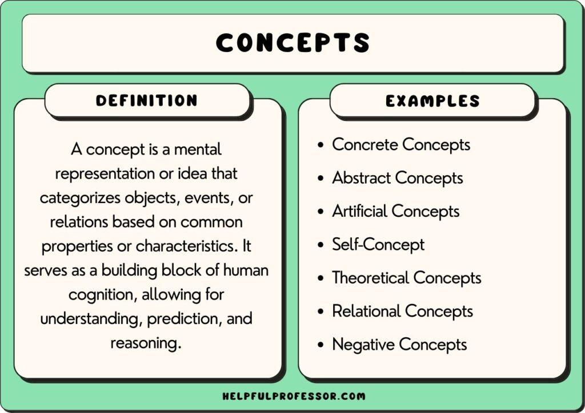

## Table of Contents

## What is the basic concept of 'Long the Basis'?

'Long the Basis' is a strategy used in futures trading. It involves buying the physical commodity, like wheat or oil, and at the same time, selling a futures contract for that commodity. The goal is to make money from the difference between the price of the commodity now and its price in the future.

This strategy is often used by people who produce the commodity, like farmers or oil companies. They want to lock in a price for their product now, but still sell it later. If the price of the commodity goes up more than expected, they might lose money on the futures contract, but they will make more money selling the actual commodity. If the price goes down, they will lose money on the commodity, but make money on the futures contract. The hope is that the gains from one will be more than the losses from the other.

## How does 'Long the Basis' differ from other trading strategies?

'Long the Basis' is different from other trading strategies because it involves owning the actual commodity and selling a futures contract at the same time. Most trading strategies focus on either buying or selling futures contracts without owning the physical product. For example, a common strategy is just buying futures if you think the price will go up, or selling futures if you think the price will go down. With 'Long the Basis,' you are trying to make money from the difference between the current price of the commodity and its future price, which is not the main focus of other strategies.

Another way 'Long the Basis' differs is that it is often used by people who produce the commodity, like farmers or oil companies. These producers want to protect themselves from price changes. They can sell their product in the future, but they want to know what price they will get now. Other trading strategies might be used by people who don't own the commodity and are just trying to make money from price movements. 'Long the Basis' helps producers manage their risk, while other strategies might be more about trying to make a profit from the market.

## What are the key components involved in a 'Long the Basis' strategy?

The first key component of a 'Long the Basis' strategy is owning the physical commodity. This means you actually have the product, like wheat or oil, in your possession. You are not just trading papers or contracts; you have the real thing. This is important because your goal is to sell this commodity in the future, but you want to know what price you will get now.

The second key component is selling a futures contract for the same commodity. A futures contract is an agreement to sell the commodity at a set price on a specific date in the future. By selling this contract, you lock in the price you will get for your commodity, even though you will actually sell it later. The difference between the price you get from selling the futures contract and the price you get when you sell the actual commodity is what you are trying to make money from.

## Can you explain the functionality of 'Long the Basis' in simple terms?

When you use the 'Long the Basis' strategy, you are doing two things at the same time. First, you own the actual product, like wheat or oil. Second, you sell a futures contract for that product. A futures contract is a promise to sell the product at a certain price on a future date. By selling this contract, you lock in the price you will get for your product, even though you will sell it later.

The main idea is to make money from the difference between the price you get from the futures contract and the price you get when you sell the actual product. If the price of the product goes up more than expected, you might lose money on the futures contract, but you will make more money selling the actual product. If the price goes down, you will lose money on the product, but make money on the futures contract. The hope is that the gains from one will be more than the losses from the other. This strategy is often used by people who produce the product, like farmers or oil companies, to protect themselves from big changes in price.

## What are the potential benefits of using a 'Long the Basis' strategy?

Using a 'Long the Basis' strategy can help producers like farmers or oil companies manage their risk. By owning the actual product and selling a futures contract at the same time, they lock in a price for their product now, even though they will sell it later. This means they know how much money they will get, which helps them plan better and not worry so much about big changes in price. If the price of the product goes up a lot, they might lose money on the futures contract, but they will make more money selling the actual product. If the price goes down, they will lose money on the product, but make money on the futures contract. The goal is for the gains from one to be more than the losses from the other.

Another benefit of the 'Long the Basis' strategy is that it can help producers take advantage of small changes in price. If the price of the product goes up just a little bit more than expected, they can still make some extra money. This is because they are trying to make money from the difference between the price they get from the futures contract and the price they get when they sell the actual product. Even small differences can add up over time, which can be good for producers who are always selling their product.

## What are the risks associated with 'Long the Basis' and how can they be mitigated?

One of the main risks of using a 'Long the Basis' strategy is that the price of the commodity might change a lot. If the price goes up much more than expected, you could lose money on the futures contract you sold. This is because you agreed to sell the commodity at a lower price than what it's worth now. On the other hand, if the price goes down a lot, you could lose money on the actual commodity you own, even though you might make some money on the futures contract. The hope is that the gains from one will be more than the losses from the other, but there's no guarantee.

To mitigate these risks, you can try to predict how much the price of the commodity might change. This can be hard, but you can look at things like weather reports, which can affect crops, or news about oil production, which can affect oil prices. Another way to manage the risk is to only use the 'Long the Basis' strategy for a small part of your product. That way, if the price changes a lot, you won't lose too much money. It's also a good idea to keep learning about the market and how it works, so you can make better decisions about when to use this strategy.

## How does one set up a 'Long the Basis' position in the market?

To set up a 'Long the Basis' position, you first need to own the actual commodity. This means you have to buy or already have the product, like wheat or oil. Once you have the commodity, you go to a futures market and sell a futures contract for that same commodity. A futures contract is a promise to sell the commodity at a set price on a specific date in the future. By selling this contract, you lock in the price you will get for your commodity, even though you will sell it later.

The next step is to keep track of the prices. You need to watch both the price of the commodity you own and the price of the futures contract you sold. The difference between these two prices is what you are trying to make money from. If the price of the commodity goes up more than expected, you might lose money on the futures contract, but you will make more money selling the actual commodity. If the price goes down, you will lose money on the commodity, but make money on the futures contract. The goal is for the gains from one to be more than the losses from the other.

## What market conditions are most favorable for a 'Long the Basis' strategy?

The 'Long the Basis' strategy works best when the price of the commodity is expected to go up a little bit more than what the futures market predicts. This means if you think the actual price of the commodity will be higher than the price you get from the futures contract, you can make some extra money. For example, if you are a farmer and you think the price of wheat will go up because of good weather or high demand, 'Long the Basis' can be a good strategy. You own the wheat and sell a futures contract, so if the price goes up more than expected, you make more money selling the wheat than you lose on the futures contract.

Another good condition for 'Long the Basis' is when the market for the commodity is stable and not too volatile. If the price doesn't change a lot, you can still make money from small differences between the price you get from the futures contract and the price you get when you sell the actual commodity. This is helpful for producers who want to lock in a price now but sell the product later. They can plan better and not worry so much about big price changes. So, if the market is calm and the price is expected to go up just a bit, 'Long the Basis' can be a smart move.

## Can you provide a real-world example of 'Long the Basis' being used effectively?

Imagine a farmer named John who grows corn. John wants to make sure he gets a good price for his corn, so he decides to use the 'Long the Basis' strategy. He owns a lot of corn and thinks the price will go up a bit because of good weather and high demand. So, John sells a futures contract for his corn at today's price, which locks in what he will get in the future. A few months later, the price of corn does go up more than John expected. He loses a little money on the futures contract, but he makes more money selling his actual corn at the higher price. In the end, John makes a profit because the extra money from selling the corn is more than the money he lost on the futures contract.

Another example is an oil company that uses 'Long the Basis' to manage its risk. The company owns a lot of oil and thinks the price will go up a little bit because of new demand from other countries. They sell a futures contract for the oil at today's price, which means they know what they will get in the future. Over time, the price of oil does go up more than they thought. The company loses some money on the futures contract, but they make more money selling the actual oil at the higher price. This way, the oil company makes a profit because the gains from selling the oil are bigger than the losses from the futures contract.

## How do advanced traders optimize their 'Long the Basis' strategies?

Advanced traders often use more detailed research to make their 'Long the Basis' strategies better. They look at things like weather reports, news about the economy, and trends in the market to guess how much the price of the commodity might change. For example, if a trader knows that a big storm might hurt crops, they might decide to use 'Long the Basis' because they think the price will go up. They also might use computer programs to help them analyze all this information and make smarter choices about when to buy the commodity and sell the futures contract.

Another way advanced traders optimize 'Long the Basis' is by using different futures contracts. Instead of just selling one futures contract, they might sell contracts that expire at different times. This can help them make money from small changes in price over a longer period. They also might change the amount of the commodity they own and the number of futures contracts they sell, depending on how sure they are about their predictions. By doing these things, advanced traders can make the most out of the 'Long the Basis' strategy and manage their risks better.

## What are the common pitfalls to avoid when implementing a 'Long the Basis' strategy?

One common mistake people make with the 'Long the Basis' strategy is not doing enough research. It's important to know what might make the price of the commodity go up or down. If you don't pay attention to things like weather reports, news about the economy, or changes in demand, you might make bad choices about when to buy the commodity and sell the futures contract. This can lead to losing money if the price doesn't change the way you expected.

Another pitfall to avoid is not managing your risk well. If you put all your money into one 'Long the Basis' position, you could lose a lot if the price changes a lot. It's better to only use this strategy for a small part of your product or money. That way, if something goes wrong, you won't lose too much. Also, make sure you understand how futures contracts work and keep learning about the market so you can make better decisions.

## How does 'Long the Basis' fit into a broader commodity trading and risk management framework?

'Long the Basis' is a key part of a bigger plan for trading commodities and managing risk. It helps producers like farmers or oil companies to protect themselves from big changes in price. By owning the actual commodity and selling a futures contract at the same time, they lock in a price for their product now, even though they will sell it later. This means they know how much money they will get, which helps them plan better and not worry so much about big price changes. It's a way to manage risk because if the price goes up a lot, they might lose money on the futures contract but make more money selling the actual product. If the price goes down, they will lose money on the product but make money on the futures contract. The goal is for the gains from one to be more than the losses from the other.

In a broader trading and risk management framework, 'Long the Basis' can be used along with other strategies to make a complete plan. For example, a company might use 'Long the Basis' for part of their product to lock in prices, but also use other strategies like buying or selling more futures contracts to try to make more money from price changes. They might also use options, which are like insurance policies for the price of the commodity, to protect themselves even more. By combining these different strategies, companies can manage their risk better and try to make the most money possible from their commodities.

## How can one overcome challenges in algo trading?

Algorithmic trading faces several challenges, including technical failures and overfitting, which can hinder the potential benefits of automation in trading strategies. Technical failures often result from hardware malfunctions or software bugs that can disrupt real-time trading operations. Efficient algorithms should be designed to monitor system health and implement fail-safe mechanisms, such as redundant systems and automatic switchovers, to mitigate the impact of technical glitches. 

Overfitting is another critical challenge. It occurs when a trading algorithm is too tailored to historical data, causing it to perform poorly on new, unseen data. To combat overfitting, traders can use regularization techniques and cross-validation methods to ensure that their models generalize well to new data. For example, using k-fold cross-validation, one can divide the data into k subsets, train the model on k-1 subsets, and validate it on the remaining subset. This process is repeated k times, with a different subset used as the validation set each time.

Adapting to changing market conditions is essential for maintaining the effectiveness of trading algorithms. Continuous monitoring and model updates are crucial for this purpose. By utilizing [machine learning](/wiki/machine-learning) algorithms, such as [reinforcement learning](/wiki/reinforcement-learning), traders can create adaptive models that learn from real-time market conditions and improve their performance over time. Implementing an online learning approach allows algorithms to update their parameters incrementally as new data becomes available.

Selecting the right platform and tools is key when developing trading algorithms. An ideal platform should provide comprehensive [backtesting](/wiki/backtesting) capabilities, low-latency data feeds, and compatibility with multiple programming languages. Python is a preferred language for [algorithmic trading](/wiki/algorithmic-trading) due to its rich libraries like NumPy, pandas, and scikit-learn, which facilitate complex calculations and data analysis. Platforms like QuantConnect and MetaTrader offer robust environments for developing, testing, and deploying trading algorithms across various markets.

Optimizing algorithms for better risk-adjusted returns involves minimizing risk while maximizing potential profits. Traders can incorporate risk management techniques such as stop-loss orders and position sizing into their algorithms. Additionally, optimizing the Sharpe Ratio, defined as:

$$
\text{Sharpe Ratio} = \frac{E[R_p - R_f]}{\sigma_p}
$$

where $E[R_p - R_f]$ is the expected excess return of the trading strategy over the risk-free rate, and $\sigma_p$ is the standard deviation of the excess return, can help assess the risk-adjusted performance of an algorithm. By maximizing this ratio, traders can identify strategies that offer better returns per unit of risk.

In conclusion, overcoming the challenges in algorithmic trading requires a combination of robust system design, adaptive modeling techniques, careful platform selection, and rigorous optimization of trading strategies. By addressing these aspects, traders can enhance the performance and reliability of their algorithmic trading systems.

## References & Further Reading

[1]: Bergstra, J., Bardenet, R., Bengio, Y., & Kégl, B. (2011). ["Algorithms for Hyper-Parameter Optimization."](https://dl.acm.org/doi/10.5555/2986459.2986743) Advances in Neural Information Processing Systems 24.

[2]: ["Advances in Financial Machine Learning"](https://www.amazon.com/Advances-Financial-Machine-Learning-Marcos/dp/1119482089) by Marcos Lopez de Prado

[3]: ["Evidence-Based Technical Analysis: Applying the Scientific Method and Statistical Inference to Trading Signals"](https://www.amazon.com/Evidence-Based-Technical-Analysis-Scientific-Statistical/dp/0470008741) by David Aronson

[4]: ["Machine Learning for Algorithmic Trading"](https://github.com/stefan-jansen/machine-learning-for-trading) by Stefan Jansen

[5]: ["Quantitative Trading: How to Build Your Own Algorithmic Trading Business"](https://www.amazon.com/Quantitative-Trading-Build-Algorithmic-Business/dp/1119800064) by Ernest P. Chan