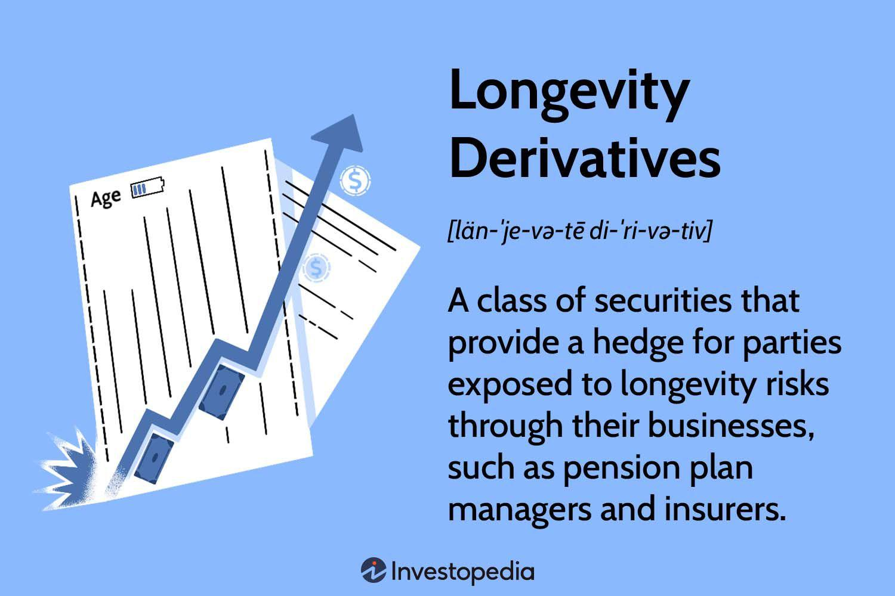

## Table of Contents

## What are longevity derivatives?

Longevity derivatives are financial instruments that help manage the risk associated with how long people live. They are used by insurance companies and pension funds to protect themselves against the financial impact of people living longer than expected. For example, if people live longer, pension funds have to pay out benefits for a longer time, which can be costly. Longevity derivatives allow these companies to transfer some of that risk to other parties who are willing to take it on.

These derivatives work by betting on the average lifespan of a group of people. If the average lifespan turns out to be longer than expected, the party that sold the derivative has to pay the buyer. If the average lifespan is shorter than expected, the buyer has to pay the seller. This way, insurance companies and pension funds can better predict their costs and manage their finances more effectively. Longevity derivatives are still a relatively new and complex type of financial product, but they are becoming more important as people around the world live longer.

## How do longevity derivatives work?

Longevity derivatives are financial tools that help companies like insurance firms and pension funds handle the risk of people living longer than expected. Imagine a pension fund that has to pay money to people every month until they die. If people live longer, the fund has to keep paying for more years, which can be expensive. To manage this risk, the pension fund can use longevity derivatives. They work by making a bet on how long a group of people will live on average.

Here's how it works: the pension fund might buy a longevity derivative from another company. If the average lifespan of the group of people turns out to be longer than expected, the company that sold the derivative has to pay the pension fund. This helps the pension fund cover the extra costs of paying pensions for longer. But if the average lifespan is shorter than expected, the pension fund has to pay the company that sold the derivative. This way, the pension fund can better plan its finances and not worry as much about people living longer than expected.

## What are the main types of longevity derivatives?

There are mainly two types of longevity derivatives: longevity bonds and longevity swaps. Longevity bonds are like regular bonds, but their payments change based on how long people live. If people live longer than expected, the bond pays more. If they live shorter lives, it pays less. This helps companies like pension funds because they can get more money if they need to pay pensions for longer.

Longevity swaps are agreements between two parties to exchange cash flows based on how long people live. One party might agree to pay a fixed amount each year, while the other pays based on the actual lifespans of a group of people. If people live longer, the party paying based on lifespans pays more, and the one paying the fixed amount gets more money. This helps companies manage the risk of people living longer without the need for bonds. Both types help companies plan better and manage the financial risks of longer lifespans.

## Who are the typical buyers and sellers of longevity derivatives?

The typical buyers of longevity derivatives are pension funds and insurance companies. These organizations need to pay money to people for a long time, maybe until they die. If people live longer than expected, these companies have to pay more money. So, they buy longevity derivatives to protect themselves from this risk. By buying these derivatives, they can get extra money if people live longer, which helps them cover the extra costs.

The typical sellers of longevity derivatives are usually big banks or other financial institutions. These sellers are willing to take on the risk that people might live longer than expected. They get paid a fee for taking on this risk. If people live shorter lives than expected, the sellers get to keep the money they were paid. This way, they can make a profit if their predictions about lifespans are right.

## What are the primary benefits of using longevity derivatives for risk management?

Longevity derivatives help pension funds and insurance companies manage the risk of people living longer than expected. When people live longer, these companies have to pay out money for more years, which can be very expensive. By using longevity derivatives, these companies can protect themselves. If people live longer than expected, the companies get extra money from the derivatives to help cover the extra costs. This makes it easier for them to plan their finances and not worry as much about unexpected expenses.

Another benefit is that longevity derivatives allow these companies to transfer the risk to other parties, like big banks or financial institutions. These other parties are willing to take on the risk of people living longer in exchange for a fee. This means that pension funds and insurance companies don't have to worry as much about the financial impact of longer lifespans. They can focus on their main job of paying pensions and insurance, while the risk is managed by others who are better equipped to handle it.

## How can longevity derivatives help pension funds and insurance companies?

Longevity derivatives help pension funds and insurance companies by managing the risk of people living longer than expected. When people live longer, these companies have to pay out money for more years, which can be very expensive. By using longevity derivatives, these companies can get extra money if people live longer than expected. This extra money helps them cover the costs of paying pensions and insurance for longer periods. It makes it easier for them to plan their finances and not worry as much about unexpected expenses.

Longevity derivatives also allow pension funds and insurance companies to transfer the risk of people living longer to other parties, like big banks or financial institutions. These other parties are willing to take on the risk in exchange for a fee. This means that pension funds and insurance companies don't have to worry as much about the financial impact of longer lifespans. They can focus on their main job of paying pensions and insurance, while the risk is managed by others who are better equipped to handle it.

## What are the potential limitations and risks associated with longevity derivatives?

Longevity derivatives can be helpful, but they also come with some limitations and risks. One big problem is that it's hard to predict how long people will live. If the predictions are wrong, the companies buying or selling these derivatives might lose a lot of money. Also, longevity derivatives are not used very often, so they can be hard to buy or sell when you need them. This means that if a company wants to use them to manage risk, they might not be able to find someone to trade with.

Another risk is that longevity derivatives can be very complicated. Not everyone understands how they work, which can lead to mistakes. If a company makes a mistake, they could end up with more risk instead of less. Plus, the rules about longevity derivatives can change, and this can affect how much they cost or how they work. Companies need to keep an eye on these changes to make sure they are still getting the protection they need.

## How is the market for longevity derivatives regulated?

The market for longevity derivatives is regulated to make sure it works fairly and safely. In many countries, financial regulators like the Securities and Exchange Commission (SEC) in the United States or the Financial Conduct Authority (FCA) in the United Kingdom keep an eye on these markets. They make rules to protect companies and people who use longevity derivatives. These rules can include how the derivatives are sold, what information has to be shared, and how much money companies need to have to trade them.

Regulation also helps to make sure that the market stays stable. If something goes wrong with longevity derivatives, it could affect a lot of people and companies. So, regulators work to prevent big problems. They might require companies to report their trades and keep good records. They also watch for any signs of fraud or bad behavior. By doing this, regulators help make the market for longevity derivatives safer and more reliable for everyone involved.

## What are some real-world examples of longevity derivatives transactions?

One real-world example of a longevity derivatives transaction happened in 2009 when the British pension fund, The Pensions Regulator, worked with J.P. Morgan to create a longevity swap. This swap was meant to help the pension fund manage the risk of its members living longer than expected. In this deal, the pension fund paid a fixed amount each year to J.P. Morgan. In return, J.P. Morgan agreed to pay the pension fund based on how long the members actually lived. If the members lived longer, J.P. Morgan would pay more, helping the pension fund cover the extra costs.

Another example took place in 2014 when the Dutch pension fund, AEGON, entered into a longevity swap with Deutsche Bank. AEGON wanted to protect itself from the risk of its members living longer. In this deal, AEGON paid Deutsche Bank a fixed amount each year. If AEGON's members lived longer than expected, Deutsche Bank would pay AEGON more money to help cover the costs. This helped AEGON manage its financial risks better and plan for the future.

## How do longevity derivatives impact the broader financial market?

Longevity derivatives can affect the broader financial market by helping big companies like pension funds and insurance companies manage their money better. When these companies use longevity derivatives, they can protect themselves from the risk of people living longer than expected. This makes them feel more secure about their finances. When these big companies are more secure, they might be willing to invest more money in other parts of the financial market. This can help the whole market grow and stay stable.

But there are also some risks. If something goes wrong with longevity derivatives, it could cause problems in the financial market. For example, if a lot of companies made bad predictions about how long people will live, they might lose a lot of money. This could make them less willing to invest, which could slow down the financial market. Also, because longevity derivatives are complicated and not used very often, there might not be enough people trading them. This can make it hard for companies to use them to manage their risks, which can affect the whole market.

## What advanced strategies can be employed using longevity derivatives?

One advanced strategy using longevity derivatives is called a layered approach. In this strategy, a pension fund might use different types of longevity derivatives at the same time to protect against different risks. For example, they could use a longevity bond to cover the risk of people living a little longer than expected, and a longevity swap to cover the risk of people living much longer than expected. By using both, the pension fund can be ready for different situations and manage their money better.

Another strategy is to use longevity derivatives to balance the risk in different parts of the world. If a pension fund has members in different countries, they might use longevity derivatives in each country to manage the risk of people living longer in those places. This way, if people in one country live longer than expected, the pension fund can get money from the longevity derivatives in that country to help cover the costs. This helps the pension fund manage their risks no matter where their members live.

## What are the future trends and developments expected in the longevity derivatives market?

The future of the longevity derivatives market looks like it will grow and change. More companies might start using these tools as people live longer and the need to manage this risk becomes more important. New types of longevity derivatives might be created to help companies in different ways. For example, there could be derivatives that cover the risk of people living longer in certain jobs or in certain parts of the world. Also, as more people learn about longevity derivatives, they might become easier to buy and sell, which would make the market bigger and more active.

Another trend could be more rules and regulations about longevity derivatives. As these tools become more popular, governments and financial regulators might want to make sure they are used safely and fairly. This could mean new rules about how longevity derivatives are sold and who can use them. These rules might help make the market more stable and trustworthy. But they could also make it harder for some companies to use longevity derivatives if the rules are too strict. Overall, the future of the longevity derivatives market looks busy and full of changes as more companies look for ways to manage the risk of people living longer.

## References & Further Reading

[1]: ["Swaps and Other Derivatives"](https://www.investopedia.com/ask/answers/060215/what-difference-between-derivatives-and-swaps.asp) by Richard Flavell

[2]: Davies, G. R. (2010). ["Flash Crash Analysis."](http://www.nanex.net/20100506/FlashCrashAnalysis_Intro.html) Journal of Applied Finance.

[3]: ["Derivatives: Principles and Practice"](https://www.academia.edu/94069601/Derivatives_principles_and_practice) by Richard B. Haynes and Vijay V. karnik

[4]: Aldridge, I. (2013). ["High-Frequency Trading: A Practical Guide to Algorithmic Strategies and Trading Systems."](https://www.amazon.com/High-Frequency-Trading-Practical-Algorithmic-Strategies/dp/1118343506) John Wiley & Sons.

[5]: ["Handbook of Market Risk"](https://onlinelibrary.wiley.com/doi/book/10.1002/9781118572979) by Christian Skerjanec

[6]: Hull, J. (2017). ["Options, Futures, and Other Derivatives."](https://elibrary.pearson.de/book/99.150005/9781292212920) Pearson.