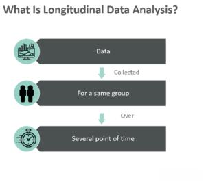

In today's rapidly changing world, data-driven decision making has become a cornerstone of innovation across numerous industries. At the heart of this revolution is the strategic integration of longitudinal data with economic and financial analysis, offering unprecedented opportunities for businesses and policymakers alike. Longitudinal data—characterized by repeated observations of the same entities over time—enables a deeper understanding of temporal dynamics and trends, thus providing a rich foundation for economic insights and financial forecasting.

This article serves as a comprehensive guide to the application of longitudinal data, showcasing its potential to unravel complex economic trends, refine financial projections, and enhance algorithmic trading strategies. By examining both theoretical frameworks and practical implementations, we aim to illustrate how such data can be instrumental in driving informed, strategic decisions.



Algorithmic trading, a rapidly evolving field in the financial sector, exemplifies one of the most promising areas benefiting from longitudinal data analysis. Through the detailed examination of historical market trends and behavioral patterns over time, algorithmic trading systems can gain insights that allow them to adapt to shifting market conditions with greater agility and precision. By capturing the subtle nuances of market movements over extended periods, longitudinal data provides invaluable insights that can significantly augment the effectiveness and reliability of trading algorithms.

The discussion will proceed to cover foundational aspects of longitudinal data, explore its pivotal role in economics and finance, and highlight its transformative impact on algorithmic trading. Through this exploration, readers will gain a detailed understanding of how longitudinal data not only supports but also enhances decision-making processes in today's data-driven world. As we navigate these topics, we aim to enlighten and empower professionals and academics seeking to leverage the power of longitudinal data in economic and financial realms.

## Table of Contents

## Understanding Longitudinal Data

Longitudinal data, also referred to as panel data, involves collecting multiple observations from the same subjects across different time periods. This structure allows for the examination of changes and trends at the individual level, contrasting with cross-sectional data, which provides a snapshot at a single point in time. Longitudinal data offers a dynamic perspective that is essential for analyzing temporal evolution in both economic and financial contexts.

The ability to track the same subjects over time is invaluable for capturing the evolution of behavioral patterns and correlations. For example, understanding how individual consumption patterns react to economic shifts or how company performance fluctuates over successive quarters requires longitudinal analysis. This data type facilitates the assessment of both short-term changes and long-term trends, ensuring a comprehensive understanding of subject behavior.

A key advantage of longitudinal data is its repeated measures, which allow researchers to isolate the variables influencing behavior more effectively. By controlling for time-invariant attributes, these repeated observations help in honing predictive models with increased accuracy. For instance, in economic studies, variables such as education or inherent ability are constant over time, meaning that observed changes can be more confidently attributed to economic variables like income or policy changes.

In financial studies, longitudinal data supports trend analysis and predictive modeling by providing insights into past and potential future market behaviors. Given this, analysts can develop more nuanced models that are well-suited for anticipating market trends. As an example, in predictive financial modeling, longitudinal data helps assess the impact of a new economic regulation over time on a company's stock performance, factoring in historical data for a well-grounded analysis.

Finally, the mathematical modeling of longitudinal data often involves employing fixed effects or random effects models. Fixed effects models focus on heterogeneity across individuals by assuming individual-specific, time-invariant characteristics, which helps in understanding influence from variables of interest. On the other hand, random effects models treat individual-specific effects as random variables. This complexity in modeling ensures that longitudinal data provides a robust foundation for understanding temporal trends and relationships. Together, these methodological approaches enable comprehensive analyses that enhance the predictive power of economic and financial models.

## Role in Economics and Finance

Longitudinal data is a fundamental tool for elucidating various complex economic phenomena. It provides a dynamic view of data over time, enabling economists to decipher the intricate patterns and trends behind unemployment rates, inflation trajectories, and the effectiveness of policy implementations. By tracing these phenomena continuously, longitudinal data allows for an analysis of how and why economies change, creating a clearer picture of economic health and stability.

In finance, longitudinal data is indispensable for ongoing assessments of company performance and risk. It enables analysts to discern trends and shifts in market dynamics resulting from broader economic changes. For instance, by applying longitudinal data, financial professionals can evaluate how a corporation’s market position varies dependent on economic cycles or sectoral shifts. Such insights are vital for crafting strategies aimed at maximizing financial growth while minimizing exposure to risk.

Moreover, economists and financial analysts rely on longitudinal data to construct sophisticated predictive models. These models aim to forecast economic outcomes more accurately, facilitating strategic decision-making at both company and policy levels. The longitudinal approach empowers analysts to identify causal relationships over time, such as the impact of specific regulatory changes on economic performance, rather than relying solely on correlations that could be skewed by temporal factors.

Furthermore, longitudinal studies are extremely useful for assessing the impacts of fiscal and monetary policies across different economic phases. This is because they provide insights into not just immediate effects but also long-term consequences, thereby painting a comprehensive picture of policy effectiveness. By monitoring economic indicators over an extended period, analysts can distinguish between transient fluctuations and substantive shifts, enabling more nuanced policy evaluations.

The versatility of longitudinal data makes it a powerful tool in economic and financial contexts. It enriches the analytical capabilities of economists and financiers, granting them the ability to make informed predictions and develop strategies that are both timely and empirically grounded. By offering a continuous, rather than static, view of economic dynamics, longitudinal data supports a deeper understanding of how economies function and evolve, ultimately contributing to more informed and effective economic policymaking.

## Applications in Algorithmic Trading

Algorithmic trading systems leverage longitudinal data effectively to forecast future market trends by utilizing historical data. This approach hinges on the detailed analysis of temporal patterns that longitudinal data affords, enabling traders to construct algorithms capable of responding to dynamic market conditions.

One primary benefit of utilizing longitudinal data in [algorithmic trading](/wiki/algorithmic-trading) is the ability to develop resilient trading algorithms. By examining historical trends and [volatility](/wiki/volatility-trading-strategies) patterns, these algorithms can predict shifts in the market, enabling informed trading decisions. The richness of longitudinal data allows for the formulation of complex models that identify correlations and causations in market behaviors over time.

Techniques such as time-series analysis and multivariate functional principal component analysis (MFPCA) are instrumental in refining trading strategies. Time-series analysis involves techniques like Autoregressive Integrated Moving Average (ARIMA) and Generalized Autoregressive Conditional Heteroskedasticity (GARCH) models, which help analyze data points collected sequentially over time to predict future values based on historical observations.

For instance, the ARIMA model is often used for forecasting in finance due to its ability to handle data that shows trends and seasonality. Its mathematical formulation is given by:

$$

X_t = c + \phi_1 X_{t-1} + \phi_2 X_{t-2} + \cdots + \phi_p X_{t-p} + \theta_1 \epsilon_{t-1} + \cdots + \theta_q \epsilon_{t-q} + \epsilon_t 
$$

where $X_t$ is the time series data, $\phi$ and $\theta$ are model parameters, $c$ is a constant, and $\epsilon$ is white noise.

MFPCA further enriches the analysis by allowing multiple time-dependent variables to be reduced to principal components, thus simplifying the detection of relevant patterns that transcend simple time-series analysis.

Moreover, [backtesting](/wiki/backtesting) strategies with historical longitudinal data is crucial for enhancing the reliability and performance of algorithmic models. Backtesting involves testing trading algorithms using past data to verify their effectiveness before deploying them in live markets. It provides insights into how a strategy might perform in different market conditions by simulating trades over historical periods.

Here’s a simple Python code snippet demonstrating a basic backtest of a mean-reversion strategy using historical data:

```python
import pandas as pd
import numpy as np

# Load historical data
data = pd.read_csv('historical_prices.csv')

# Calculate moving average
data['MA'] = data['Close'].rolling(window=20).mean()

# Identify buy/sell signals
data['Signal'] = np.where(data['Close'] > data['MA'], 1, -1)

# Calculate returns
data['Return'] = data['Close'].pct_change()

# Calculate strategy performance
data['Strategy'] = data['Signal'].shift(1) * data['Return']

# Summarize results
cumulative_return = (1 + data['Strategy']).cumprod()[-1]
print(f'Cumulative Return: {cumulative_return}')
```

By employing such analytical techniques, algorithmic trading systems can substantially benefit from the insights provided by longitudinal data. This enables the prediction of market movements more accurately, ultimately leading to more effective trading strategies that can withstand diverse market environments.

## Analytical Techniques and Challenges

Longitudinal data analysis is enhanced by various analytical techniques that address specific complexities inherent in the nature of such data. The fixed effects and random effects models are foundational, offering methods to manage individual-specific, time-invariant characteristics and unobserved heterogeneity. Fixed effects models are advantageous when the interest lies in understanding the impact of variables that vary over time while controlling for time-invariant characteristics. These models assume that individual-specific effects are correlated with the independent variables. In mathematical terms, a simple fixed effects model can be expressed as:

$$
Y_{it} = \alpha + \beta X_{it} + \gamma Z_i + \epsilon_{it}
$$

where $Y_{it}$ is the dependent variable, $X_{it}$ represents time-varying covariates, $Z_i$ captures time-invariant characteristics, and $\epsilon_{it}$ is the error term.

Conversely, random effects models assume that individual effects are uncorrelated with the explanatory variables, enabling more efficient use of data by including both within and between variations. The random effects model is generally represented as:

$$
Y_{it} = \alpha + \beta X_{it} + \mu_i + \epsilon_{it}
$$

where $\mu_i$ is the random, individual-specific effect assumed to be normally distributed.

Time-series models like ARIMA (AutoRegressive Integrated Moving Average) and GARCH (Generalized Autoregressive Conditional Heteroskedasticity) are crucial for longitudinal financial data, given their ability to model serial correlation and time-varying volatility. ARIMA models are widely used for forecasting purposes, representing the series as a combination of autoregressive and moving average processes:

$$
X_t = \sum_{i=1}^{p} \phi_i X_{t-i} + \varepsilon_t + \sum_{j=1}^{q} \theta_j \varepsilon_{t-j}
$$

where $p$ is the number of lag observations, $q$ is the size of the moving average window, $\phi$ and $\theta$ are model parameters, and $\varepsilon_t$ is white noise.

GARCH models extend ARIMA by allowing the conditional variance to change over time as a function of past errors, useful for capturing volatility clustering:

$$
\sigma_t^2 = \alpha_0 + \sum_{i=1}^{q} \alpha_i \varepsilon_{t-i}^2 + \sum_{j=1}^{p} \beta_j \sigma_{t-j}^2
$$

where $\sigma_t^2$ is the conditional variance, $\alpha$ and $\beta$ are parameters.

Challenges in longitudinal data analysis include issues like missing data, which can bias results if not properly managed. Techniques such as multiple imputations or expectation-maximization algorithms are often applied to mitigate the impact of missingness. Autocorrelation, where observations over time are correlated, complicates standard error estimation and hypothesis testing. Correcting for such dependence typically involves using robust standard errors or incorporating autocorrelation structures directly into model specification.

Time-varying covariates pose additional analytical challenges since their dynamic nature can lead to complex patterns that demand advanced modeling techniques. Efficient data management is critical, as the longitudinal structure often results in large datasets. Tools and languages like Python offer extensive libraries like pandas and statsmodels to facilitate data manipulation and model implementation. A basic Python implementation for analyzing a fixed effects model might include:

```python
import pandas as pd
import statsmodels.api as sm
from linearmodels.panel import PanelOLS

# Data preparation: 'data' is a DataFrame containing panel data
# with multi-level index (entity, time) and relevant columns.
data = pd.read_csv('longitudinal_data.csv')
data = data.set_index(['entity', 'time'])

# Fixed effects model with PanelOLS
mod = PanelOLS.from_formula('Y ~ X + EntityEffects', data=data)
res = mod.fit()
print(res.summary())
```

Ultimately, leveraging longitudinal data requires effective use of both classical statistical techniques and modern computational tools to overcome inherent challenges and extract valuable insights.

## Future Directions and Conclusion

The future landscape of algorithmic trading is poised for significant transformation as it increasingly integrates advanced data techniques, utilizing longitudinal insights to predict market trends with greater accuracy. This progress is driven largely by the enhanced capabilities of [machine learning](/wiki/machine-learning) and [artificial intelligence](/wiki/ai-artificial-intelligence) models, which are anticipated to provide more profound insights into longitudinal data patterns. These insights will in turn foster more refined economic and trading strategies, capable of adjusting swiftly to rapidly changing financial environments.

Enhanced machine learning algorithms will play a pivotal role in this evolution. By leveraging the rich temporal information embedded in longitudinal data, these algorithms can better capture and adapt to market sentiments and behaviors over time. For instance, models such as recurrent neural networks (RNNs) and [long short](/wiki/equity-long-short)-term memory (LSTM) networks are particularly effective at handling sequential data, making them ideal candidates for analyzing financial time series data. These models can be trained to recognize complex patterns over sequential data points, offering predictive insights that are integral to developing effective trading strategies.

```python
import numpy as np
from keras.models import Sequential
from keras.layers import LSTM, Dense

# Create artificial longitudinal data
data = np.random.rand(1000, 10)  # 1000 samples, 10 features

# Reshape data into 3D array for LSTM input: [samples, timesteps, features]
data = data.reshape((data.shape[0], 1, data.shape[1]))

# Define LSTM model
model = Sequential()
model.add(LSTM(50, activation='relu', input_shape=(data.shape[1], data.shape[2])))
model.add(Dense(1))
model.compile(optimizer='adam', loss='mse')

# Fit model
model.fit(data, np.random.rand(1000), epochs=200, verbose=0)
```

As we look forward, the burgeoning synergy between economic theory and technological advancements is expected to result in the continuous refinement of algorithms. These innovations will enable traders to systematically exploit anomalies and inefficiencies in the market, improving both the speed and accuracy of trades.

In conclusion, longitudinal data is central to constructing economically and financially robust algorithms that afford significant competitive advantages in the volatile landscape of modern financial markets. As the field progresses, the continued amalgamation of sophisticated mathematical models, AI, and comprehensive longitudinal data analytics promises to yield transformative impacts on finance and trading. Embracing these advancements will empower industry participants to navigate challenges with greater acumen, driving more informed and strategic financial decision-making.

## References & Further Reading

[1]: Bergstra, J., Bardenet, R., Bengio, Y., & Kégl, B. (2011). ["Algorithms for Hyper-Parameter Optimization."](https://papers.nips.cc/paper/4443-algorithms-for-hyper-parameter-optimization) Advances in Neural Information Processing Systems 24.

[2]: ["Advances in Financial Machine Learning"](https://www.amazon.com/Advances-Financial-Machine-Learning-Marcos/dp/1119482089) by Marcos Lopez de Prado

[3]: ["Evidence-Based Technical Analysis: Applying the Scientific Method and Statistical Inference to Trading Signals"](https://www.amazon.com/Evidence-Based-Technical-Analysis-Scientific-Statistical/dp/0470008741) by David Aronson

[4]: ["Machine Learning for Algorithmic Trading"](https://github.com/stefan-jansen/machine-learning-for-trading) by Stefan Jansen

[5]: ["Quantitative Trading: How to Build Your Own Algorithmic Trading Business"](https://www.amazon.com/Quantitative-Trading-Build-Algorithmic-Business/dp/1119800064) by Ernest P. Chan