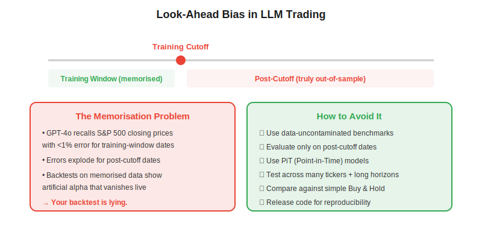

**Look-ahead bias in LLM trading** occurs when a large language model uses information from its training data — which includes historical market outcomes — to make trading decisions during a backtest, producing artificially inflated performance that vanishes in live trading. This is the single most dangerous methodological flaw in the rapidly growing field of LLM-based financial strategies. Lopez-Lira et al. (2025) demonstrated that GPT-4o can recall exact S&P 500 closing prices with less than 1% error for dates within its training window — meaning any LLM "predicting" prices it has already memorised is not predicting at all.

## What Is Look-Ahead Bias?

In classical [backtesting](https://paperswithbacktest.com/wiki/backtesting-with-python), look-ahead bias means using information at time $t$ that was not yet available at time $t$ — for example, using tomorrow's earnings announcement to make today's trade. It is the most common source of inflated backtest results and is well-understood in quantitative finance.

With LLMs, look-ahead bias takes a new and more insidious form: **training data memorisation**. An LLM trained on internet data through, say, April 2024 has implicitly "seen" stock prices, earnings results, analyst ratings, and news headlines from that entire period. When you ask it to "analyse market conditions on March 15, 2024 and decide whether to buy AAPL," it is not reasoning from first principles — it already knows what happened.



## The Memorisation Problem: How Bad Is It?

The evidence is striking:

**Price recall.** Research has shown that frontier LLMs can recall exact closing prices for major indices within their training window with errors below 1%. For post-cutoff dates, errors increase dramatically — confirming that the model is recalling memorised data, not learning genuine predictive patterns.

**Backtest inflation.** A KDD 2026 study evaluated multiple LLM investing strategies across a large universe of stocks and extended time horizons. The finding: most strategies that showed strong performance on training-window data failed to outperform a simple buy-and-hold strategy on truly out-of-sample data. The authors specifically flagged **survivorship bias** (delisted stocks excluded), **look-ahead bias** (memorised outcomes), and **narrow evaluation** (few tickers, short test periods) as pervasive problems in the LLM trading literature.

**Publication bias.** Papers reporting LLM trading results on 5–10 stocks over 3–6 months within the training window are common. Papers reporting results on 100+ stocks over 2+ years including post-cutoff data are rare — because the results are far less impressive.

## Why This Is Worse Than Classical Look-Ahead Bias

Classical look-ahead bias is detectable: you can audit your code to verify that no future data leaks into past decisions. LLM memorisation is **invisible**: the model's weights contain the future data, and there is no way to "audit" which specific facts it has memorised. You cannot tell whether a model's bullish call on AAPL in February 2024 comes from genuine analysis of the provided context or from memorised knowledge that AAPL rose 15% in Q1 2024.

$$\text{Apparent Alpha} = \text{True Alpha} + \text{Memorisation Alpha}$$

In most published LLM trading studies, the memorisation component dominates. Separating the two requires rigorous out-of-sample evaluation.

## How to Properly Evaluate LLM Trading Strategies

### 1. Use Only Post-Cutoff Data

The most direct solution: evaluate the strategy exclusively on dates after the model's training data cutoff. If you are using GPT-4o with a training cutoff of April 2024, your test set should start in May 2024 at the earliest.

```python
import pandas as pd

# Define contamination boundary
MODEL_CUTOFF = pd.Timestamp("2024-04-01")
SAFETY_BUFFER = pd.DateOffset(months=2)  # extra margin

# Filter backtest to uncontaminated period only
df = pd.read_csv("backtest_results.csv", parse_dates=["date"])
clean = df[df["date"] >= MODEL_CUTOFF + SAFETY_BUFFER]

print(f"Total trades: {len(df)}")
print(f"Clean (post-cutoff) trades: {len(clean)}")
print(f"Contaminated trades dropped: {len(df) - len(clean)}")

# Compute metrics on clean data only
returns = clean["strategy_return"]
sharpe = returns.mean() / returns.std() * (252 ** 0.5)
print(f"Post-cutoff Sharpe ratio: {sharpe:.2f}")
```

### 2. Test Across Many Tickers and Long Horizons

A strategy that works on 5 mega-cap tech stocks over 3 months proves nothing. Robust evaluation requires:
- **50+ stocks** across sectors and market caps
- **12+ months** of out-of-sample data
- **Inclusion of delisted stocks** to avoid survivorship bias
- **Transaction cost assumptions** (slippage, commissions)

### 3. Benchmark Against Simple Baselines

Always compare LLM strategies against:
- **Buy-and-hold** — the simplest possible strategy
- **Equal-weight portfolio** — a naive diversification baseline
- **Momentum / mean-reversion** — classical quant factors
- **Random decisions** — to test if the model is adding signal beyond noise

If the LLM strategy does not statistically significantly outperform buy-and-hold on post-cutoff data across many tickers, it is likely capturing memorisation rather than alpha.

### 4. Use Data-Uncontaminated Benchmarks

Purpose-built benchmarks are emerging. The AI-Trader benchmark (Fan et al., 2025) implements a "fully autonomous minimal information paradigm" where agents receive only essential context and must independently search and verify market information — eliminating the possibility of relying on memorised data. Their finding: "general intelligence does not automatically translate to effective trading capability."

### 5. Consider Point-in-Time (PiT) Models

A new class of models called **PiT (Point-in-Time) models** are specifically designed to avoid memorisation by modifying the pre-training process to exclude future information. The research shows a "scaling paradox": standard models degrade as they scale (stronger memorisation creates stronger false priors), while PiT models improve as they scale (cleaner reasoning without contamination).

## A Practical Checklist

| Check | Question | Red Flag |
|---|---|---|
| Test period | Does it include only post-cutoff dates? | Testing on 2020–2023 with a 2024 model |
| Stock universe | 50+ stocks including small caps? | Only AAPL, GOOG, AMZN, MSFT, TSLA |
| Duration | 12+ months of out-of-sample? | 3-month test window |
| Survivorship | Delisted stocks included? | Only current S&P 500 members |
| Baselines | Compared to buy-and-hold? | Only compared to other LLM strategies |
| Code | Is it reproducible? | No code release |
| Costs | Transaction costs modelled? | Zero-cost assumption |

## Impact on LLM Trading Agent Design

This bias has direct implications for how [LLM trading agents](https://paperswithbacktest.com/wiki/llm-trading-agents) should be designed:

**Separate knowledge from reasoning.** Use the LLM for reasoning (interpreting news, debating bull/bear cases) but feed it only current, real-time data — not historical context it may have memorised. RAG architectures that retrieve live documents are inherently safer than approaches that ask the LLM to "recall" market history.

**Use classical backtests for signal validation.** When an LLM generates a trading signal, validate it using [combinatorial purged cross-validation](https://paperswithbacktest.com/wiki/combinatorial-purged-cross-validation-cpcv) on the numerical component — not by asking the LLM to "backtest" its own idea.

**Log and audit.** Record every piece of information the agent uses to make a decision. If the agent produces a correct prediction without being provided the relevant data, it may be using memorised knowledge.

## Limitations

**No perfect solution exists.** Even post-cutoff evaluation has limitations: the model may have memorised patterns (e.g., "AAPL tends to rally after product launches") that remain useful even after the cutoff. The line between legitimate learning and look-ahead bias is blurry.

**New models shift the cutoff.** Every few months, new model versions extend the training data cutoff, invalidating previous "clean" test periods. Ongoing re-evaluation is necessary.

## Conclusion

Look-ahead bias is the elephant in the room of LLM trading research. The vast majority of published results showing impressive LLM trading performance are contaminated by training data memorisation. As an algo trader evaluating LLM strategies, demand post-cutoff evaluation, large stock universes, long test periods, and comparison against simple baselines. Any LLM strategy that cannot beat buy-and-hold on truly out-of-sample data is not worth deploying — no matter how sophisticated its architecture.

---

**Explore further on PapersWithBacktest:**
- Browse [backtested trading strategies](https://paperswithbacktest.com/strategies) with Python code and performance metrics
- Access [clean historical market data](https://paperswithbacktest.com/datasets) for equities, crypto, and futures
- Take the [algo trading course](https://paperswithbacktest.com/course) — 60+ video lessons and notebooks
- Related wiki pages: [LLM Trading Agents](https://paperswithbacktest.com/wiki/llm-trading-agents) · [Backtesting with Python](https://paperswithbacktest.com/wiki/backtesting-with-python) · [Combinatorial Purged Cross-Validation](https://paperswithbacktest.com/wiki/combinatorial-purged-cross-validation-cpcv)
