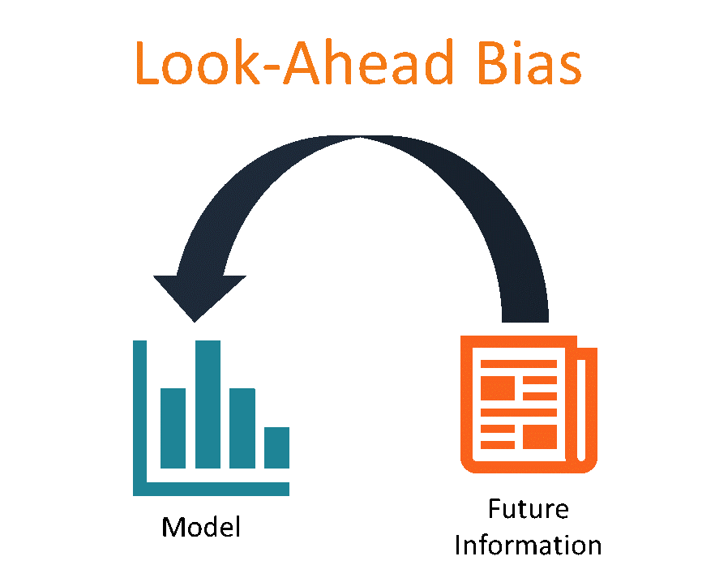

## Table of Contents

## What is look-ahead bias?

Look-ahead bias is a mistake that happens when people use information they shouldn't have known at the time they are making a decision. Imagine you're trying to figure out if a certain way of picking stocks would have worked well in the past. If you use information that only became available later, like a company's earnings report that came out after you would have bought the stock, you're using look-ahead bias.

This kind of bias can make it seem like a strategy is better than it really is. It's like cheating on a test by looking at the answers beforehand. In real life, you can't predict the future, so using information from the future to judge past decisions is not fair and can lead to wrong conclusions about how good a strategy really is.

## How does look-ahead bias occur in data analysis?

Look-ahead bias in data analysis happens when someone uses information that wasn't available at the time they're studying. For example, if you're looking at how well a stock did in the past, you might accidentally use data like future earnings reports or news events that happened after the time you're analyzing. This makes your analysis seem more accurate or successful than it would have been in real life, because in the real world, you can't know the future.

This kind of mistake can really mess up your results. If you're trying to test a strategy or make predictions based on past data, using information from the future can make it look like your strategy works better than it really does. It's important to only use the information that would have been available at the time you're studying, to make sure your analysis is honest and realistic.

## Can you give an example of look-ahead bias in financial markets?

Imagine you're trying to see if a way of [picking](/wiki/asset-class-picking) stocks would have made money in the past. You look at how a stock did from January to June, and then you use the company's earnings report from July to decide if you should have bought the stock in January. But in real life, you wouldn't have known about the July earnings report back in January. By using that future information, you're making it seem like your stock-picking method is better than it really is.

This mistake is called look-ahead bias. It's like cheating on a test by looking at the answers before you start. When people do this in financial markets, they might think their strategy is great, but it's not fair because they're using information that wouldn't have been available at the time they're supposed to be making decisions. This can lead to wrong ideas about how good their strategy really is.

## What are the consequences of look-ahead bias in research?

Look-ahead bias in research can make things look better than they really are. If researchers use information from the future to judge the past, their results might seem great, but they're not honest. This can trick people into thinking a method or strategy works well when it doesn't. For example, if someone is studying how to pick stocks and they use future earnings reports, they might think their way of picking stocks is amazing. But in real life, without knowing the future, their method might not work as well.

This kind of mistake can also lead to bad decisions. If people believe in a strategy that looks good because of look-ahead bias, they might use it in real life and lose money or make other mistakes. It's important for researchers to be careful and only use information that was available at the time they're studying. This helps make sure their research is fair and can be trusted. By avoiding look-ahead bias, researchers can give better advice and help people make smarter choices.

## How can look-ahead bias affect the results of a backtest?

Look-ahead bias can make a backtest seem much better than it really is. When you're doing a backtest, you're trying to see how well a strategy would have worked in the past. If you accidentally use information that you wouldn't have known at the time, like future news or earnings reports, it can make your strategy look great. But in real life, you can't know the future, so using that information is like cheating.

This mistake can lead to wrong conclusions about your strategy. If your backtest looks successful because of look-ahead bias, you might think your strategy is really good and decide to use it. But when you try it in the real world, without knowing the future, it might not work as well as you thought. That's why it's important to be careful and only use the information that was available at the time you're testing, to make sure your backtest results are honest and useful.

## What are common sources of look-ahead bias in datasets?

Look-ahead bias often comes from using data that wasn't available at the time you're studying. For example, if you're looking at how stocks did in the past, you might use earnings reports or news that came out later. This can make your analysis seem better than it really is because you're using information from the future.

Another common source is when datasets are updated over time. If you're using a dataset that gets new information added to it, you might accidentally include data that wasn't there when you should be making your decision. This can happen a lot in financial markets where data is always changing.

To avoid look-ahead bias, it's important to be careful about which data you use. Make sure you only use information that would have been available at the time you're studying. This helps keep your analysis honest and realistic.

## How can one identify look-ahead bias in a study or model?

To find look-ahead bias in a study or model, you need to check if the information used was really available at the time the decisions were supposed to be made. If you're looking at how stocks did in the past, make sure you're not using earnings reports or news that came out later. If you see that the study used data from the future, that's a sign of look-ahead bias. Also, look at how the data was collected and updated. If the dataset got new information over time, it's easy to accidentally include data that wasn't there when it should have been used.

Once you've found look-ahead bias, it's important to fix it to make sure your study or model is honest. Go back and only use the information that was available at the time you're studying. This might mean redoing parts of your analysis or model with the right data. By doing this, you can make sure your results are realistic and can be trusted. Avoiding look-ahead bias helps make your work more accurate and useful for real-life decisions.

## What steps can be taken to prevent look-ahead bias during data collection?

To prevent look-ahead bias during data collection, you need to be careful about which information you use. Only use data that was available at the time you're studying. If you're looking at how stocks did in the past, don't use earnings reports or news that came out later. It's like playing a game where you can only use the information you have right now, not what you'll learn in the future.

Another way to prevent look-ahead bias is to keep your dataset separate from new information that comes in over time. If you're using a dataset that gets updated, make a copy of it at the time you start your study and don't add new data to it later. This helps you avoid accidentally using information from the future. By being careful with your data and only using what was available at the time, you can make sure your study is honest and realistic.

## How do you correct for look-ahead bias if it's found in historical data?

If you find look-ahead bias in your historical data, you need to fix it to make your study honest. Look at the data you used and see if there's any information that wouldn't have been available at the time you're studying. For example, if you used a company's earnings report from July to decide if you should have bought their stock in January, that's look-ahead bias. You need to remove that future information and only use what was known back in January.

Once you've taken out the future information, redo your study with the right data. This means going back and redoing your analysis or model using only the information that was available at the time you're studying. By doing this, you make sure your results are realistic and can be trusted. It's like playing a game fair, where you only use the information you have at the time, not what you'll learn later.

## What are the advanced techniques for detecting look-ahead bias in complex models?

To find look-ahead bias in complex models, you need to check the data and the model carefully. One way to do this is by using time-stamping, where you add a date to each piece of data to make sure you're only using information that was available at the time. Another way is to use a method called cross-validation, where you split your data into different parts and test your model on each part separately. This helps you see if your model is using future information by checking if it works the same way on different sets of data.

Another advanced technique is to use a method called walk-forward optimization. This means you test your model step-by-step, using only the information that was available at each step. By doing this, you can see if your model's performance changes when you add new data, which can show if it's using future information. These methods help you make sure your model is honest and realistic, so you can trust the results and use them to make good decisions.

## How does look-ahead bias impact machine learning algorithms?

Look-ahead bias can make [machine learning](/wiki/machine-learning) algorithms seem better than they really are. When you train a machine learning model, you're teaching it to make predictions based on past data. If you accidentally use information from the future, like using next month's stock prices to predict this month's, your model will look really good. But in real life, you can't know the future, so using that information is cheating. This can trick you into thinking your model is great when it's not, leading to wrong predictions and bad decisions.

To avoid look-ahead bias in machine learning, you need to be careful about the data you use. Only use information that was available at the time you're trying to predict. For example, if you're predicting stock prices for January, don't use data from February. By doing this, you make sure your model is honest and can be trusted. It's like playing a fair game where you only use the information you have right now, not what you'll learn later. This helps your machine learning model give you realistic and useful predictions.

## Can you discuss a case study where look-ahead bias significantly altered the outcome of a major research project?

In the early 2000s, a well-known financial research project aimed to test a new stock-picking strategy. The researchers looked at how well their method would have worked from 1990 to 2000. They used data like stock prices and earnings reports to see if their strategy could have made money. But they made a big mistake: they used earnings reports from the end of each year to decide which stocks to buy at the start of the year. This is look-ahead bias because in real life, you wouldn't know the end-of-year earnings in January.

When the researchers found out about their mistake, they had to redo their study without using future earnings reports. The new results showed that their strategy didn't work as well as they first thought. Instead of making a lot of money, their method only made a little bit. This case shows how important it is to be careful with the data you use. Look-ahead bias can make things look great, but it's not honest. By fixing the bias, the researchers gave a more realistic picture of how their strategy would work in the real world.

## Examples of Look-Ahead Bias in Algorithmic Trading

Look-ahead bias in [algorithmic trading](/wiki/algorithmic-trading) often manifests through several distinct examples, each highlighting the critical importance of using only contemporaneously available information during strategy development and testing.

First, selection bias often arises when a trading strategy is constructed based on stocks or assets that are retrospectively known to have performed well. This bias is introduced when [backtesting](/wiki/backtesting) uses a dataset populated with these successful stocks without accounting for whether the information necessary to select them was available at the time. Such practice can lead to inflated performance results. Suppose a strategy is backtested on a basket of technology stocks that significantly appreciated, but the selection criteria used could only be constructed retroactively. This scenario creates a misleading representation of potential profitability because future information was effectively "leaked" into historical decision-making processes.

Second, data observation and revision discrepancies further contribute to look-ahead bias. This occurs when strategies utilize economic indicators or company financial data that are subject to later revisions. Initial data releases often contain preliminary numbers that are updated once more complete information becomes available. For instance, a model might rely on GDP growth figures as inputs; if these inputs are not historically accurate (i.e., reflect revised rather than initially reported figures), the model predictions are non-representative of what real-time decisions would have achieved.

Differences between data release dates and actual information availability also play a significant role. Market actors make decisions based on data accessibility rather than theoretical availability at release time. For example, an earnings announcement might technically occur after trading hours, but algorithmic trading models incorrectly assume instantaneous market adjustments. If a strategy is trained on outcomes resulting from trading the very moment earnings became public, it disregards the realistic delay in market response.

Each of these cases demonstrates how look-ahead bias can be inadvertently introduced into trading models. Careful consideration of the temporal context of data availability is paramount to ensure models reflect genuine market conditions. Recognizing these biases and adjusting backtesting methodologies to align with historical knowledge improves strategy's live-market robustness.

## Strategies to Mitigate Look-Ahead Bias

Mitigating look-ahead bias is crucial for the development of accurate and reliable trading strategies in algorithmic trading. The following strategies aim to minimize the influence of this bias and enhance the integrity of backtesting processes:

1. **Bitemporal Data Storage**: This approach involves maintaining two distinct timelines for data: the original data at the time of its collection and any subsequent revisions. Such a framework ensures that backtests can be conducted using the exact data available when decisions were supposedly made, avoiding the incorporation of data that only became available later. Bitemporal data systems provide a more realistic representation of historical information, allowing traders to evaluate their strategies based on the same conditions experienced in real time.

2. **Event-Driven Backtesting Systems**: By focusing on event-driven methodologies, traders can synchronize their trading decisions with the actual availability of information. This system emphasizes the importance of aligning strategy execution with the real-world release of data, reducing the risk of inadvertently including future information that skews backtesting results. Implementing an event-driven approach ensures that the information utilized within the backtest mirrors the conditions present during the original trading decision-making process.

3. **Audits of Backtested Strategies**: Thoroughly auditing strategies after backtesting can reveal potential areas where look-ahead bias may have been introduced. Audits should scrutinize the sequence of data usage, decision points, and the conditions under which trades were made. By conducting detailed reviews, traders can identify and rectify any inaccuracies or assumptions that may not hold in real-world trading environments.

4. **Education and Awareness**: Fostering a culture of vigilance among developers and traders is essential in minimizing look-ahead bias. By promoting education and increased awareness, professionals in the field can better recognize biases and proactively address them. Training sessions, workshops, and continuous learning opportunities can equip traders with the necessary tools to understand and counteract the effects of look-ahead bias in their models.

Each of these strategies plays an integral role in ensuring that trading strategies remain robust and reflective of real market conditions. By systematically addressing look-ahead bias, traders can improve the reliability and accuracy of their algorithmic trading systems, leading to more consistent and dependable performance outcomes.

## References & Further Reading

[1]: ["Advances in Financial Machine Learning"](https://www.amazon.com/Advances-Financial-Machine-Learning-Marcos/dp/1119482089) by Marcos Lopez de Prado

[2]: ["Evidence-Based Technical Analysis: Applying the Scientific Method and Statistical Inference to Trading Signals"](https://www.amazon.com/Evidence-Based-Technical-Analysis-Scientific-Statistical/dp/0470008741) by David Aronson

[3]: ["Machine Learning for Algorithmic Trading"](https://github.com/PacktPublishing/Machine-Learning-for-Algorithmic-Trading-Second-Edition) by Stefan Jansen

[4]: ["Quantitative Trading: How to Build Your Own Algorithmic Trading Business"](https://books.google.com/books/about/Quantitative_Trading.html?id=j70yEAAAQBAJ) by Ernest P. Chan

[5]: Bailey, D. H., Borwein, J., de Prado, M. L., & Zhu, Q. J. (2014). ["Pseudo-mathematics and financial charlatanism: The effects of backtest overfitting on out-of-sample performance."](https://papers.ssrn.com/sol3/papers.cfm?abstract_id=2308659) Notices of the American Mathematical Society. 

[6]: Tomasini, E., & Jaekle, U. (2011). ["Trading Systems: A New Approach to System Development and Portfolio Optimisation."](https://www.semanticscholar.org/paper/Trading-Systems%3A-A-New-Approach-to-System-and-Tomasini-Jaekle/3a78e97f127beffaa768392826464d79bb4a1ffc) Apress.