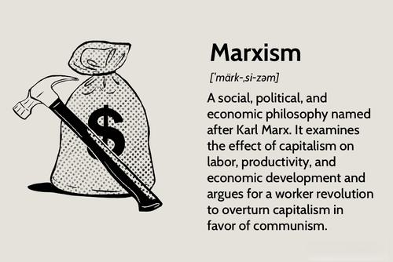

In the rapidly evolving field of algorithmic trading, contracts serve as fundamental tools that define relationships and establish expectations between various parties. These contracts are indispensable in ensuring that automated trading operations are conducted within agreed parameters, mitigating the risk of misunderstandings or disputes. This focus on contracts becomes particularly significant when examining "look-alike" contracts, which are standardized agreements often employed across diverse trading environments.

The usefulness of look-alike contracts in algorithmic trading is widely acknowledged due to their efficiency and simplicity. These contracts allow traders and firms to engage in transactions without the need to craft individual agreements, thereby reducing time and resource expenditure. However, their standardized nature can also present challenges, as they may not adequately account for the specific needs or unique strategies employed within a particular trading framework. This potential misalignment can lead to complications, underscoring the importance of carefully assessing the predictive power and applicability of these contracts in the context of algorithmic trading.

For traders, firms, and legal professionals operating in this sector, understanding the dynamics of look-alike contracts is critical. These contracts not only shape the landscape of modern trading dynamics but also influence the strategies and financial outcomes of those who employ them. By exploring both the advantages and limitations of look-alike contracts, individuals in the trading ecosystem can better navigate the complexities of algorithm-based trading. This article aims to illuminate the dual nature of these contracts—highlighting their practical benefits while also addressing the potential drawbacks they present.

## Table of Contents

## Understanding Contracts in Algorithmic Trading

Contracts play a crucial role in algorithmic trading by formalizing agreements and ensuring clarity in transactions. These instruments, integral to the trading ecosystem, define the parameters within which trading strategies are developed, implemented, and managed. In the context of algorithmic trading, where automation is paramount, contracts ensure that all involved parties have a mutual understanding of the operational framework.

The automated nature of algorithmic trading necessitates stringent agreements that align parties on various parameters and expectations. A well-structured contract delineates the responsibilities of each party, thus incorporating measures to prevent potential abuses or misunderstandings. This is vital in maintaining the integrity and smooth operation of trading activities.

Contracts in algorithmic trading often specify key elements of trading strategies, including risk management protocols, execution timing, and data usage limitations. For example, a contract might stipulate the maximum permissible drawdown or specify trading frequency constraints to mitigate risk. Such provisions help align the risk appetites and strategic goals of the parties involved.

Several basic types of contracts are used in [algorithmic trading](/wiki/algorithmic-trading), helping frame the understanding of this niche. The primary categories include:

1. **Service Level Agreements (SLAs):** These contracts specify the quality and performance standards expected from trading systems and services. SLAs ensure that algorithmic trading systems meet predefined performance benchmarks, minimizing operational disruptions.

2. **Data Usage Agreements:** With the growing importance of data in algorithmic strategies, contracts often outline the specifics of data access, usage rights, and sharing protocols. This includes provisions on the types of data available, permissible usage, and restrictions on data redistribution.

3. **Licensing Agreements:** Many algorithmic traders rely on proprietary software or tools, making licensing agreements essential. These contracts govern the use of trading platforms, outlining user rights, licensing fees, and intellectual property considerations.

4. **Risk Management Contracts:** These agreements define acceptable levels of risk and outline contingency plans for adverse scenarios. Contracts might include specific conditions under which trading activities may be paused or altered to protect the interests of all parties involved.

5. **Performance-Based Contracts:** These focus on aligning incentives by tying compensation or fees to the performance of trading strategies. Such contracts might specify benchmarks like return thresholds or volatility targets that trigger variable compensation adjustments.

Understanding these contract types provides valuable context for algorithmic traders, firms, and legal professionals. By clearly defining roles, responsibilities, and expectations, these contracts help create a structured and secure trading environment, paving the way for efficient and effective algorithmic trading operations.

## The Nature of Look-Alike Contracts

Look-alike contracts are standardized agreements utilized extensively in diverse trading environments, including algorithmic trading. They serve as templates to streamline transactional processes, enabling parties to engage in trading without the need to draft unique, bespoke contracts each time. This standardization is particularly beneficial in high-frequency trading scenarios, where speed and efficiency are paramount. A look-alike contract reduces the time and cost associated with negotiating new terms for every transaction, thus offering significant operational efficiencies.

The main advantage of look-alike contracts lies in their simplicity and uniformity. By employing a template approach, they help reduce negotiation time and accelerate the execution of trades. This is especially critical in algorithmic trading, where algorithms execute orders at speeds and frequencies that human traders cannot match. For example, using a look-alike contract, two trading parties can agree on predefined terms quickly, allowing the algorithm to perform its functions without delay.

Despite their advantages, the generic nature of these contracts can also present challenges. One major issue is the risk of misalignment between the standardized terms and the specific objectives or nuances of a trading strategy. For instance, a contract designed for traditional trading might not fully account for the intricacies of an algorithm that uses advanced predictive analytics to make trading decisions. In such cases, the lack of flexibility inherent in a standardized contract may prevent it from adequately addressing the specific needs of sophisticated trading algorithms.

Moreover, the high-level generality of look-alike contracts may fail to accommodate unique risk factors associated with certain trading strategies. For example, a highly complex algorithm might employ leverage in a way that is not adequately covered by the standard terms, potentially exposing parties to unforeseen risks. These risks arise from the gaps between the generic provisions of the contract and the specific contingencies encountered during trading activities.

Understanding the dual nature of look-alike contracts—embracing both their efficiencies and limitations—is essential for their successful deployment in algorithmic trading. While they provide a valuable tool for simplifying the trading process, participants must be vigilant in recognizing when these contracts may not fully serve their tactical or strategic requirements. Tailoring or adapting these contracts when necessary can help ensure that they support, rather than hinder, the effective execution of algorithmic trading strategies.

## Criticism of Look-Alike Contracts in Algo Trading

Critics of look-alike contracts in algorithmic trading emphasize that these standardized agreements tend to oversimplify the intricate complexities of the field. In algorithmic trading, where diverse strategies and proprietary technologies prevail, such contracts may not adequately account for specific risk factors, potentially leading to adverse financial outcomes. For instance, unique trading algorithms may involve sophisticated predictive models or [machine learning](/wiki/machine-learning) techniques that necessitate distinct contractual terms to address unforeseen market behaviors and execution risks. Without provisions for these unique elements, traders might find themselves inadequately protected against financial losses.

Moreover, the standardized terms inherent in look-alike contracts can stifle innovation by imposing rigid frameworks that do not accommodate novel trading strategies. Algorithmic traders often require the flexibility to adapt to new market conditions and technological advancements. Rigid contracts can hinder their ability to experiment with or rapidly deploy innovative solutions, as the constraints of standard agreements may inhibit the adoption of cutting-edge trading methodologies.

Legal ambiguities and disputes are further potential issues arising from the lack of customization in look-alike contracts. As these contracts are not tailored to individual needs, they may fail to address specific legal concerns unique to particular algorithmic systems or operational workflows. This oversight can lead to misunderstandings and conflicts between parties, as ambiguities in contract terms can become contentious when interpreting the responsibilities and liabilities involved in trading activities.

Ultimately, these criticisms highlight the necessity for tailored contract solutions within algorithmic trading. Customized agreements offer the advantage of being specifically designed to cater to the unique requirements and challenges faced by individual traders and firms. By allowing for a higher degree of specificity, such contracts can mitigate potential risks, support innovation, and reduce the likelihood of legal disputes, proving more advantageous in the dynamic and competitive environment of algorithmic trading.

## Contract Limitations and Their Impact

Despite their widespread application in algorithmic trading, look-alike contracts possess certain limitations that can significantly impact trading outcomes. These generic agreements often fail to accommodate the dynamic and unpredictable nature of financial markets. Market [volatility](/wiki/volatility-trading-strategies) can introduce scenarios that these contracts, given their standardized nature, are not equipped to handle. By oversimplifying complex trading environments, they may not adequately protect against unexpected events that deviate from anticipated market trends, potentially leading to unfavorable trading results.

Furthermore, the rapid technological evolution characterizing algorithmic trading poses another significant challenge for look-alike contracts. Algorithmic trading is driven by advances in computational power, data analytics, and [artificial intelligence](/wiki/ai-artificial-intelligence), which constantly reshape trading strategies and execution methods. Standardized contracts, however, tend not to be adaptable enough to keep pace with these technological developments. This mismatch can lead to inefficiencies or non-compliance with evolving best practices, thereby impairing a trader’s competitive edge.

The constraints imposed by the rigidity of look-alike contracts often compel traders to explore alternative agreements that provide greater flexibility and specificity. Custom-tailored agreements can be more responsive to the unique requirements of particular algorithms or trading strategies, accommodating specific risk profiles and operational parameters. This shift towards more bespoke contractual arrangements allows traders to better align their legal frameworks with their strategic goals, thereby enhancing resilience in volatile markets.

Recognizing these limitations empowers traders to make more deliberate and informed decisions regarding their contractual commitments. By critically assessing the suitability of look-alike contracts in the context of their specific trading operations, traders can identify potential vulnerabilities and strategically opt for agreements that better match the complexity and fluidity of their environment. This approach not only mitigates risks but also facilitates a more agile response to market and technological changes, ultimately supporting more robust trading performance.

## Strategies to Overcome Contractual Challenges

In algorithmic trading, navigating the intricacies of contracts, especially look-alike contracts, requires strategic approaches to address potential pitfalls. Customized contracts, tailored specifically for the involved parties, often prove more advantageous. Unlike standardized agreements, bespoke contracts can incorporate clauses that consider the unique nuances of both the trading strategies and the algorithms employed. This customization allows for addressing particular risk factors and ensures alignment between contractual terms and the intended trading operations.

Negotiating terms that reflect a dynamic trading environment is crucial. The inherent nature of markets involves constant shifts and uncertainties. Hence, incorporating terms that adapt to these dynamics can significantly reduce the risks associated with static or overly generic contracts. This proactive negotiation approach ensures that contracts remain relevant and protective over time.

Legal consultations play a pivotal role in the structuring of such flexible agreements. Engaging with legal experts allows traders to craft contracts that not only fulfill the necessary legal requirements but also offer enhanced protection against unforeseen market conditions or legal disputes. These consultations help in identifying potential gaps or ambiguities in contracts, which might otherwise lead to significant financial or operational consequences.

Regular reviews and updates of contracts are equally important. As market conditions evolve and trading strategies are refined, contracts should mirror these changes. Implementing a systematic approach to contract review and amendment ensures that they remain aligned with current strategies and market realities. This ongoing process involves not only reactive adjustments but also strategic foresight to anticipate future developments in trading environments.

An adaptive approach to contracts ultimately enhances resilience and efficiency in algorithmic trading. By integrating mechanisms for periodic evaluations and revisions, traders can better weather the volatility and rapid technological advancements characteristic of modern financial markets. This strategic flexibility supports sustained competitive advantage and operational robustness, safeguarding against potential contractual inadequacies.

In summary, while look-alike contracts may facilitate immediate setup efficiencies, they often lack the flexibility needed in today's fast-paced trading landscape. Embracing customized agreements, informed negotiation, expert legal advice, and consistent contract evaluations fosters a more secure and effective trading framework.

## Conclusion

In conclusion, look-alike contracts in algorithmic trading offer distinct advantages through their streamlined processes and reduced transaction costs. These contracts provide a straightforward framework that can expedite dealings and reduce the complexities associated with contract formation. However, traders must carefully weigh these efficiencies against potential drawbacks. The standardization intrinsic to look-alike contracts can sometimes overshadow the unique needs of specific trading strategies. This may lead to misalignment with traders' goals or the market conditions they encounter.

Finding the right balance between standardization and customization is crucial. Tailored contracts may better accommodate particular risk factors or innovative trading techniques that do not fit standardized formats. As the trading landscape continues to evolve with technological advancements and market volatility, contracts must also adapt to reflect these changes. This agility can prevent legal disputes and financial loss.

Ultimately, staying informed and maintaining flexibility are key to success in this competitive market. Traders should regularly review their contractual agreements to ensure they remain aligned with current market dynamics and technological capabilities. By doing so, they can mitigate potential risks and enhance the resilience of their algorithmic trading operations, harnessing both the efficiencies of look-alike contracts and the specificity of customized agreements.

## References & Further Reading

[1]: de Prado, M. L. (2018). ["Advances in Financial Machine Learning."](https://www.amazon.com/Advances-Financial-Machine-Learning-Marcos/dp/1119482089) Wiley.

[2]: Chan, E. P. (2009). ["Quantitative Trading: How to Build Your Own Algorithmic Trading Business."](https://github.com/ftvision/quant_trading_echan_book) Wiley.

[3]: Jansen, S. (2020). ["Machine Learning for Algorithmic Trading: Predictive Models to Extract Signals from Market and Alternative Data for Systematic Trading Strategies with Python."](https://github.com/stefan-jansen/machine-learning-for-trading) Packt Publishing.

[4]: Aronson, D. R. (2006). ["Evidence-Based Technical Analysis: Applying the Scientific Method and Statistical Inference to Trading Signals."](https://onlinelibrary.wiley.com/doi/book/10.1002/9781118268315) Wiley.

[5]: Hull, J. C. (2012). ["Options, Futures, and Other Derivatives."](https://www.semanticscholar.org/paper/Options%2C-Futures%2C-and-Other-Derivatives-Hull/89bdee500c8623864fc9eb7a471546aa713acc44) Pearson.

[6]: Bergstra, J., Bardenet, R., Bengio, Y., & Kégl, B. (2011). ["Algorithms for Hyper-Parameter Optimization."](https://dl.acm.org/doi/10.5555/2986459.2986743) Advances in Neural Information Processing Systems.

[7]: Aldridge, I. (2013). ["High-Frequency Trading: A Practical Guide to Algorithmic Strategies and Trading Systems."](https://www.ahmetbeyefendi.com/wp-content/uploads/2020/07/High-Frequency-Trading-Irene-Aldridge.pdf) Wiley.