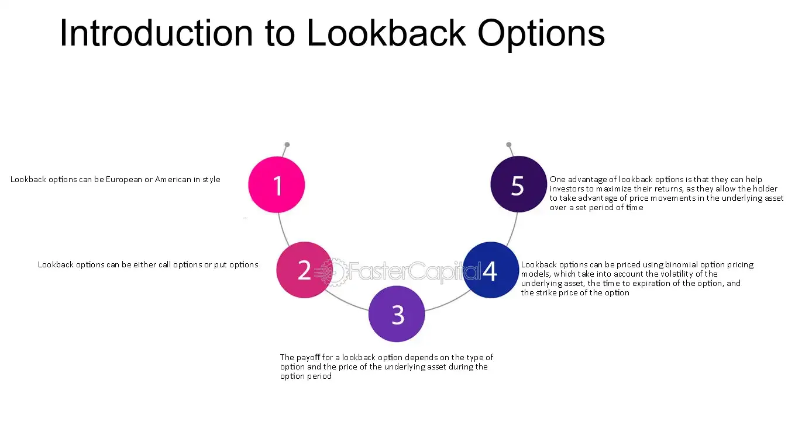

## Table of Contents

## What is a lookback option?

A lookback option is a type of financial contract that gives the buyer the right, but not the obligation, to buy or sell an asset at the best price it reached during the life of the option. This means that if you have a lookback option, you can choose to buy or sell the asset at the lowest or highest price it had, even if the current price is different.

Lookback options can be useful because they protect the buyer from missing out on the best possible price. However, they are usually more expensive than regular options because they offer this extra benefit. They are often used by investors who want to maximize their potential gains without worrying about timing the market perfectly.

## How does a lookback option differ from a standard option?

A lookback option is different from a standard option in a big way. With a standard option, you can buy or sell an asset at a set price, called the strike price, on or before the option expires. If the market price is better than the strike price, you make money. But if it's worse, you might not use the option at all. With a lookback option, you get to choose the best price the asset reached during the whole time you had the option. So, you always get the best deal possible, no matter what the price is when the option ends.

This difference makes lookback options more valuable and usually more expensive than standard options. Because you can always pick the best price, you don't have to worry about timing the market perfectly. This can be really helpful if the price of the asset goes up and down a lot. But because they are more valuable, lookback options cost more to buy. So, while they offer more protection and potential profit, they also require a bigger upfront investment.

## What are the main types of lookback options?

Lookback options come in two main types: fixed strike and floating strike. A fixed strike lookback option works a lot like a regular option, where you have a set price to buy or sell the asset. But instead of using the price at the end of the option, you get to use the best price the asset reached during the whole time you had the option. So, if it's a call option, you buy at the strike price but sell at the highest price the asset hit. If it's a put option, you sell at the strike price but buy at the lowest price.

A floating strike lookback option is different. Here, the strike price changes based on the asset's price during the option's life. For a call option, you buy the asset at the lowest price it reached and then sell it at the market price when the option ends. For a put option, you sell at the highest price the asset hit and then buy it back at the market price at the end. Both types of lookback options let you take advantage of the best price the asset reached, but they do it in different ways.

## Can you explain the concept of a floating strike lookback option?

A floating strike lookback option is a special kind of option where the price you use to buy or sell the asset changes based on what the asset's price did while you had the option. For a call option, which lets you buy the asset, the price you pay is the lowest price the asset reached during the option's life. When the option ends, you can then sell the asset at whatever the market price is at that time. So, you buy low and sell at the current price, which could be higher.

For a put option, which lets you sell the asset, the price you use to sell is the highest price the asset hit while you had the option. When the option ends, you buy the asset back at the current market price, which could be lower. This means you sell high and then buy back at a lower price. Both types of floating strike lookback options let you take advantage of the best price the asset reached, making it easier to make a profit.

## What is a fixed strike lookback option and how does it work?

A fixed strike lookback option is a type of option where you have a set price, called the strike price, to buy or sell an asset. But instead of using the price of the asset when the option ends, you get to use the best price the asset reached during the whole time you had the option. For a call option, which lets you buy the asset, you buy it at the strike price but then you can sell it at the highest price the asset reached. For a put option, which lets you sell the asset, you sell it at the strike price but then you can buy it back at the lowest price the asset hit.

This kind of option is great because it lets you take advantage of the best price the asset got to during the option's life. It's like having a safety net that makes sure you get the best deal possible. But because it offers this extra benefit, a fixed strike lookback option is usually more expensive than a regular option. Still, it can be worth it if you want to make sure you don't miss out on the best price, even if the market changes a lot.

## How is the payoff calculated for a lookback option?

The payoff for a lookback option depends on whether it's a fixed strike or a floating strike option. For a fixed strike lookback call option, you buy the asset at the set strike price and then sell it at the highest price it reached during the option's life. So, the payoff is the highest price minus the strike price. For a fixed strike lookback put option, you sell the asset at the strike price and buy it back at the lowest price it reached. The payoff here is the strike price minus the lowest price.

For a floating strike lookback call option, you buy the asset at the lowest price it reached during the option's life and sell it at the market price when the option ends. So, the payoff is the market price at expiration minus the lowest price during the option's life. For a floating strike lookback put option, you sell the asset at the highest price it reached and buy it back at the market price at expiration. The payoff is the highest price minus the market price at expiration. In both cases, the lookback option lets you use the best price the asset got to, making it easier to make a profit.

## What are the advantages of using lookback options for investors?

Lookback options can be really helpful for investors because they let you use the best price the asset reached while you had the option. This means you don't have to worry about missing the best time to buy or sell. If you have a lookback option, you can always choose the lowest or highest price the asset got to, no matter what the price is when the option ends. This can be especially useful if the price of the asset goes up and down a lot, because it gives you a safety net that helps you make more money.

But lookback options also have some downsides. They are usually more expensive than regular options because they offer this extra benefit. So, you need to think about whether the higher cost is worth it for you. Also, because lookback options let you use the best price, they can be harder to understand and use than regular options. But if you're okay with the higher cost and you understand how they work, lookback options can be a powerful tool to help you make the most money possible from your investments.

## What are the potential risks and drawbacks of lookback options?

Lookback options can be more expensive than regular options. This is because they let you use the best price the asset reached while you had the option, which is a big benefit. But because they are more valuable, you have to pay more for them. So, you need to think about whether the extra cost is worth it for you. If the price of the asset doesn't change much, you might end up paying more for the lookback option without getting much benefit from it.

Another risk is that lookback options can be harder to understand and use than regular options. Because they let you use the best price, you need to keep track of the asset's price over the whole time you have the option. This can be confusing, especially if you're new to investing. Also, because lookback options are more complex, they might not be as easy to buy and sell as regular options. So, you need to make sure you really understand how they work before you use them.

## How are lookback options priced, and what models are typically used?

Lookback options are priced using special math models that take into account the fact that you can use the best price the asset reached during the option's life. These models are usually more complicated than the ones used for regular options because they need to think about all the possible prices the asset could hit. The most common model for pricing lookback options is the Black-Scholes model, but it's changed a bit to fit lookback options. This model looks at things like how much the asset's price can change, how long you have the option, and the interest rates. It uses these things to figure out how much the lookback option should cost.

Because lookback options let you use the best price, they are usually more expensive than regular options. The price of a lookback option depends on whether it's a fixed strike or a floating strike option. For a fixed strike lookback option, the model looks at the difference between the strike price and the best price the asset reached. For a floating strike lookback option, it looks at the difference between the best price and the price at the end of the option. Both types need to think about all the possible prices the asset could hit, which makes the pricing more complex but also more accurate.

## Can you describe the mathematical formula used in pricing lookback options?

Pricing lookback options involves using a special version of the Black-Scholes model, which is a math formula used to figure out the price of options. For a fixed strike lookback option, the formula looks at the difference between the set strike price and the best price the asset reached during the option's life. If it's a call option, the price is the highest price the asset hit minus the strike price. If it's a put option, the price is the strike price minus the lowest price the asset reached. The formula also considers things like how much the asset's price can change, how long you have the option, and the interest rates. All these things help figure out how much the lookback option should cost.

For a floating strike lookback option, the formula is a bit different. Here, the strike price changes based on the asset's price during the option's life. If it's a call option, the price is the market price at the end of the option minus the lowest price the asset reached. If it's a put option, the price is the highest price the asset hit minus the market price at the end. Again, the formula takes into account the asset's price changes, the time you have the option, and the interest rates. Because lookback options let you use the best price, they are usually more expensive than regular options, and the formula needs to think about all the possible prices the asset could hit to make the pricing more accurate.

## What are some real-world applications of lookback options?

Lookback options can be really useful in the real world, especially for investors who want to make the most money without worrying about timing the market perfectly. For example, a company might use a lookback option when they want to buy a lot of materials at the best price possible. If they have a lookback option, they can wait until the end of the option's life and then choose to buy the materials at the lowest price they reached during that time. This can save the company a lot of money, especially if the price of the materials goes up and down a lot.

Another real-world use of lookback options is in managing risk. Investors who are worried about missing out on the best price for a stock or other asset can use a lookback option to make sure they get the best deal possible. For instance, an investor might buy a lookback option on a stock they think will go up in value. If the stock does go up, they can use the lookback option to buy it at the lowest price it hit and then sell it at a higher price, making a bigger profit. This can be especially helpful in markets that are very unpredictable, because the lookback option gives the investor a safety net.

## How do regulatory considerations affect the use of lookback options?

Regulatory considerations can have a big impact on how lookback options are used. Different countries and financial markets have rules about who can buy and sell these options, and how they can be used. Some places might have strict rules that make it harder to use lookback options, while others might have more relaxed rules that make it easier. For example, some regulators might require that only certain types of investors, like big institutions, can use lookback options because they are more complex and expensive than regular options. This is to protect smaller investors from taking on too much risk.

Also, the rules about how lookback options are priced and reported can affect their use. Regulators might want to make sure that the prices of lookback options are fair and that people can't use them to do things that are not allowed. They might also want to make sure that the use of lookback options is reported correctly so that everyone can see what's going on in the market. This can make lookback options more transparent but can also make them more complicated to use. So, when thinking about using lookback options, it's important to know the rules in your area and how they might affect your plans.

## References & Further Reading

[1]: Amin, K. I., & Khanna, A. (1994). ["Convergence of American option values from discrete- to continuous-time financial models."](https://deepblue.lib.umich.edu/bitstream/handle/2027.42/75553/j.1467-9965.1994.tb00059.x.pdf?sequence=1) Journal of Financial Economics, 35(2), 141-171.

[2]: Clewlow, L., & Strickland, C. (1998). ["Exotic Options: The State of the Art."](https://www.lacimagroup.com/books/exotic-options-the-state-of-the-art/) International Thomson Business Press.

[3]: Fisher, T. J., & Hall, P. (2003). ["Some Generalized Lookback Options."](https://pubmed.ncbi.nlm.nih.gov/14703257/) Journal of Financial Engineering, 12, 603–616.

[4]: Hull, J. C. (2009). ["Options, Futures, and Other Derivatives."](https://www.amazon.com/Options-Futures-Other-Derivatives-9th/dp/0133456315) Eighth Edition. Pearson.

[5]: Wilmott, P. (2007). ["Paul Wilmott Introduces Quantitative Finance."](https://www.amazon.com/Paul-Wilmott-Introduces-Quantitative-Finance/dp/0470319585) Wiley.