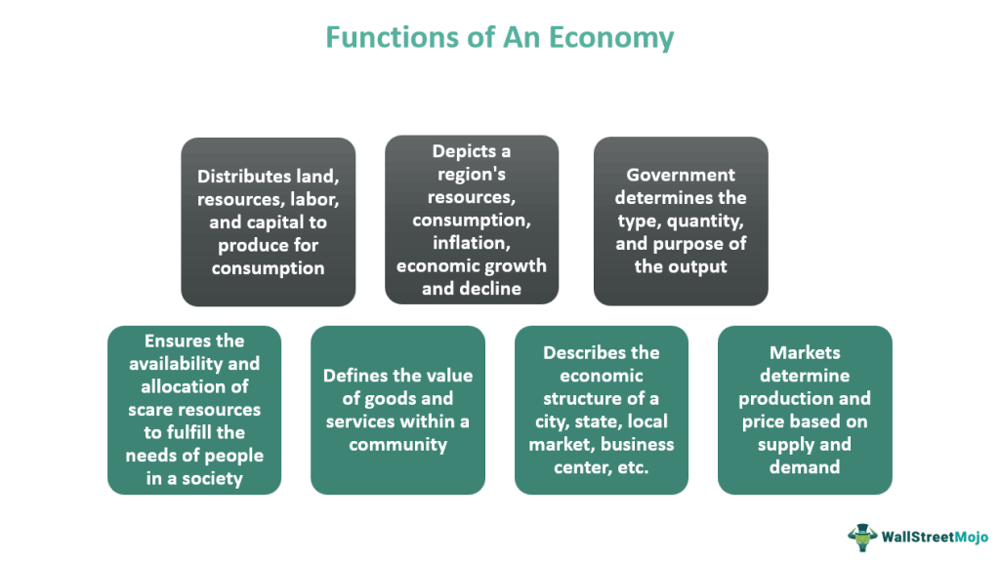

The Canadian dollar, affectionately known as 'the loonie,' plays a pivotal role in Canada's economy. Named after the distinctive bird depicted on its one-dollar coin, the loonie not only symbolizes Canadian identity but also influences the country's financial landscape. Issued by the Bank of Canada, the loonie serves as the backbone for financial transactions within Canada and as a significant currency in global trading. As the fifth most held reserve currency worldwide, its strength and stability are closely tied to Canada’s economic prosperity and its vast array of natural resources, particularly oil and minerals.

Algorithmic trading, often termed algo trading, is an increasingly pivotal component of today's financial markets. Utilizing computer algorithms, these trading systems execute orders at speeds and frequencies that are impractical for human traders. Key to the forex markets, algorithmic trading facilitates trading in currencies, including the Canadian dollar, by leveraging complex computations and rapid execution to optimize trades. Such systems analyze vast swathes of market data, employing strategies based on timing, price, and quantity to maximize trading efficiency and minimize costs.



Understanding how the loonie's value is influenced by such trading algorithms is essential. Algorithmic trading impacts market liquidity, price discovery, and volatility of the Canadian dollar, enabling traders to react swiftly to market changes and economic indicators. Additionally, these algorithms can factor in geopolitical events and economic forecasts, adjusting strategies in real-time to capitalize on opportunities or mitigate risks. The interaction between the loonie and algorithmic trading exemplifies the dynamic nature of modern financial markets, where economic indicators, technological advancements, and currency values interconnect. This interplay not only shapes Canada's economic stature but also reflects broader trends in global finance.

## Table of Contents

## Understanding the Loonie

The Canadian dollar, colloquially known as the "loonie," derives its name from the image of a common loon, a distinctive bird, featured on one side of the coin. This name has not only become embedded in Canadian culture but also symbolizes national pride and economic resilience. Introduced in 1987, the loonie was created to replace the one-dollar paper banknote and was part of the government's efforts to reduce costs associated with currency production and handling. Its introduction marked a significant milestone by introducing Canadians to a durable coin that would withstand the test of time far better than paper currency.

The transition to the loonie was also a strategic fiscal move, as coins tend to have a longer circulation life than paper notes, leading to long-term cost savings for the government. This shift represented a blend of practicality and cultural evolution, demonstrating Canada's ability to adapt its currency system while embedding symbols of the nation's identity into everyday economic transactions.

Following the loonie's success, the Canadian government introduced the "toonie," a two-dollar coin, in 1996. The toonie features a polar bear, another iconic Canadian symbol, and complements the loonie while further reducing reliance on paper currency. These coins have been widely accepted by the public and have become commonplace in Canadian commerce, underscoring their role as integral components of the country's monetary system.

The loonie and toonie have facilitated cash transactions and change-making processes across the country, positioning Canada's approach to small denomination currency as both efficient and culturally significant.

## The Loonie’s Role in the Global Economy

The Canadian dollar, commonly known as the loonie, holds a significant position in the global economy as one of the top ten most traded currencies. This status is largely due to Canada's stable economy, political stability, and its significant role in international trade, particularly in exporting natural resources and commodities. According to the Bank for International Settlements, the Canadian dollar accounted for approximately 2% of the global foreign exchange market turnover in recent years[^1^]. This makes the loonie a key currency in global [forex](/wiki/forex-system) trading.

### Impact of Canada's Exports on the Canadian Dollar

Canada's economy is heavily reliant on its natural resources, making the Canadian dollar particularly sensitive to changes in commodity prices. Key exports include oil, natural gas, minerals, lumber, and agricultural products. As a major exporter of these resources, fluctuations in global commodity prices can significantly influence the value of the loonie.

For example, the price of [crude oil](/wiki/crude-oil), which is one of Canada's largest exports, has a direct impact on the Canadian dollar. When oil prices rise, there is typically an increase in revenue from exports, leading to a stronger Canadian dollar. Conversely, when oil prices decline, there can be downward pressure on the currency. This correlation is due to the importance of oil exports in Canada’s trade balance and overall economy[^2^].

### Correlation with Global Events and Oil Prices

The 2008 financial crisis highlighted the sensitivity of the Canadian dollar to global economic conditions. During the crisis, there was a significant drop in commodity prices, including oil, which weakened the Canadian dollar. The loonie’s strong correlation with oil prices is often used by investors as a proxy for global economic health due to Canada’s status as a major oil exporter. For instance, as the global economy recovered post-crisis and oil prices increased, the loonie appreciated.

In the period between 2008 and 2014, the Canadian dollar experienced significant fluctuations, often aligning with changes in the price of crude oil. This relationship makes the Canadian dollar attractive to forex traders who actively monitor commodity markets, allowing them to use the loonie as a hedge or speculative instrument based on oil price movements.

Moreover, Canada’s open economy and trade agreements with the United States, which is its largest trading partner, also contribute to fluctuations in the loonie in response to economic activity and policy changes in the U.S. The USD/CAD currency pair is one of the most traded in the world, and its movements are closely watched by investors and policymakers alike.

In conclusion, the Canadian dollar plays a crucial role in the global economy due to Canada’s robust natural resource exports and its trade relationships. The loonie’s value is intricately linked to the prices of key commodities, particularly oil, making it susceptible to global market trends and economic events. This interconnection underscores the importance of understanding both economic indicators and global events when analyzing the Canadian dollar's movements.

[^1^]: Bank for International Settlements. (2022). Triennial Central Bank Survey: Foreign exchange turnover in April 2022. Retrieved from [https://www.bis.org/statistics/rpfx22.pdf](https://www.bis.org/statistics/rpfx22.pdf)
[^2^]: OANDA Corporation. Effects of Oil Prices on the Canadian Dollar. Retrieved from [https://www.oanda.com](https://www.oanda.com)

## Factors Affecting the Canadian Dollar

The Canadian dollar, also known as the loonie, is influenced by various economic factors, each playing a critical role in its valuation on the foreign exchange market.

### Interest Rates

The [interest rate](/wiki/interest-rate-trading-strategies) policy set by the Bank of Canada is a significant determinant of the Canadian dollar's value. Interest rates influence the flow of capital into and out of the country. Higher interest rates offer investors higher returns on investments denominated in Canadian dollars, thereby increasing demand for the currency and appreciating its value. Conversely, lower interest rates tend to reduce the currency's attractiveness, leading to depreciation. Recent market trends have demonstrated variability in interest rates due to inflationary pressures and economic recovery efforts from the COVID-19 pandemic, which have impacted the loonie's strength relative to other currencies such as the U.S. dollar.

### Economic Outlook

Canada's economic outlook is pivotal in determining the performance of its currency. Factors such as GDP growth rates, employment [statistics](/wiki/bayesian-statistics), and consumer spending are indicators that investors monitor closely. A robust economic outlook generally strengthens the Canadian dollar as it signifies financial stability and growth potential. On the other hand, economic uncertainties or downturns can lead to depreciation, as seen during recession periods or when domestic challenges like housing market strain arise. Current trends show that Canada's economy is navigating challenges such as inflation and global supply chain issues, impacting market expectations and the currency's trajectory.

### Oil Prices

As a leading exporter of commodities, particularly crude oil, the Canadian dollar is heavily correlated with oil prices. Historically, there has been a positive correlation between the value of the loonie and oil prices because energy exports significantly contribute to Canada's GDP. When oil prices rise, export revenues increase, boosting the demand for the Canadian dollar. Conversely, a drop in oil prices can lead to a weaker currency. The [volatility](/wiki/volatility-trading-strategies) in global oil prices due to geopolitical tensions, such as sanctions on major oil-producing countries, and shifts in global energy demand have directly affected the loonie's value.

### Recent Market Events and Predictions

Recent events have further illustrated the interplay of these factors on the Canadian dollar. The ongoing global economic recovery has seen fluctuating trends in commodity prices and interest rates, creating a dynamic trading environment for the loonie. Predictions about the Canadian dollar's future value commonly compare it against the U.S. dollar due to the close trade and economic ties between the two countries. Economists have noted that continued economic recovery, coupled with persistent oil price variability, could see the Canadian dollar experiencing moderate appreciation against the U.S dollar in the medium term. However, this is contingent upon external factors such as U.S. monetary policy adjustments and international trade agreements.

Understanding these various elements provides insight into the forces shaping the loonie's valuation and helps traders and policymakers anticipate and respond to changes in the foreign exchange market.

 to Algorithmic Trading

Algorithmic trading, commonly referred to as algo trading, involves the use of complex algorithms to automate trading decisions in financial markets, including the foreign exchange (forex) market. This form of trading has gained significant prominence due to advancements in technology and increased market sophistication. Algorithmic trading utilizes mathematical models and computational algorithms to execute trades at speeds and frequencies impossible for a human trader. 

The primary advantage of [algorithmic trading](/wiki/algorithmic-trading) is its ability to process large volumes of data with precision and speed. Algorithms can analyze multiple market variables simultaneously to make informed trading decisions, enhancing efficiency and reliability. Moreover, these algorithms operate on predefined rules and strategies, minimizing emotional and psychological biases that often affect human traders.

In currency trading, algorithms facilitate the rapid execution of buy and sell orders, taking advantage of minute price movements to generate profits. For example, an algorithm might be programmed to trigger trades when specific market indicators align with predefined thresholds, such as crossing moving averages or [breakout](/wiki/breakout-trading) patterns. This type of trading is especially beneficial in the forex market due to its 24-hour operation and high [liquidity](/wiki/liquidity-risk-premium). 

Additionally, algorithmic trading offers increased accuracy. Algorithms can be backtested using historical data to validate their performance and refine their strategies thereby ensuring more reliable outcomes when applied to live markets. Automated trading systems can also capitalize on market opportunities that arise within fractions of seconds, opportunities that human traders might miss due to slower reaction times. 

Another benefit is scalability. An algorithm can manage a large number of trading instruments simultaneously and adapt to numerous market conditions, allowing traders to broaden their portfolios without incurring significant additional resource costs. 

Overall, algorithmic trading reshapes the forex market by providing a means to execute high-frequency trades with reduced transaction costs and improved efficiency. Its continued adoption is driven by its demonstrated ability to optimize trading processes and enhance the profitability of market operations.

## Algo Trading Strategies for the Loonie

Algorithmic trading, or algo trading, involves the use of computer algorithms to automatically execute trades in the financial markets. In the context of the Canadian dollar, commonly referred to as the loonie, algo trading strategies employ a range of techniques to capitalize on the currency's unique characteristics. These strategies are built around technical indicators, market data, and historical price patterns to identify profitable trading opportunities.

One common strategy is the use of moving averages, a technical indicator that helps traders smooth out price data by creating a constantly updated average price. The Exponential Moving Average (EMA) is particularly popular because it gives more weight to recent prices, making it more responsive to new information. A common technique is the Moving Average Crossover, where a short-term EMA crosses above or below a long-term EMA to signal a buy or sell opportunity.

For example, a Python implementation of a moving average crossover strategy could look like this:

```python
import pandas as pd
import numpy as np

# Assume 'data' is a pandas DataFrame with historical price data
# Example columns: 'Date', 'Close'

# Calculate short-term and long-term EMAs
short_ema = data['Close'].ewm(span=12, adjust=False).mean()
long_ema = data['Close'].ewm(span=26, adjust=False).mean()

# Generate signals
data['Signal'] = 0
data['Signal'][12:] = np.where(short_ema[12:] > long_ema[12:], 1, 0)

# Generate trading orders
data['Position'] = data['Signal'].diff()
```

In this strategy, a buy signal is generated when the short-term EMA crosses above the long-term EMA, and a sell signal is generated when the opposite occurs.

Traders also employ mean reversion strategies, which are based on the assumption that the price of a currency will revert to its historical mean over time. This involves identifying and trading on deviations from that mean. The Bollinger Bands indicator, which involves a moving average with upper and lower bands set at a certain number of standard deviations from the average, is used to identify potential buy and sell signals when price touches or crosses these bands.

In addition, algo traders use market data, such as economic indicators and news sentiment, to inform their trading models. Natural Language Processing (NLP) techniques are increasingly used to analyze economic news and social media sentiment regarding the Canadian economy and its currency, converting qualitative data into actionable trading signals.

Successful algorithmic trading models for the loonie often combine multiple strategies to hedge against risk and improve performance. They might integrate technical indicators, statistical models, and [machine learning](/wiki/machine-learning) algorithms to more accurately predict currency movements and optimize trading decisions.

Case studies exemplify the effectiveness of algo trading strategies for the loonie. For example, a [hedge fund](/wiki/hedge-fund-trading-strategies) might employ a strategy that simultaneously monitors technical indicators, such as the Relative Strength Index (RSI) and MACD (Moving Average Convergence Divergence), to predict asset trends and execute automated trades. Additionally, incorporating machine learning models that are trained on historical Canadian dollar data can enhance the predictive accuracy of these strategies, allowing traders to react swiftly to market shifts.

Overall, the application of algorithmic trading to the loonie showcases the union of finance and technology, leveraging computational power to effectively manage the Canadian dollar's trading in various market conditions.

## Risks and Challenges

Algorithmic trading, often hailed for its precision and speed, is not without its risks within the forex market. One of the primary concerns is market volatility, which can cause rapid and unexpected price movements. This volatility can be exacerbated by high-frequency trading algorithms, potentially leading to events such as the "flash crash," wherein prices plummet or spike dramatically within a very short time span. These swift changes can disrupt trading strategies and lead to significant financial losses before human intervention can rectify the situation.

Another significant risk stems from technological errors, including software bugs or misconfigurations, which can result in incorrect trade executions. These errors can be as simple as programming mistakes in the trading algorithms, but their consequences can be severe, especially when high volumes of trades are automated. To mitigate such risks, it is crucial for traders and firms to implement robust testing and oversight of automated systems.

When considering the Canadian dollar, or the loonie, specific challenges further complicate algorithmic trading. The loonie's value is intrinsically linked to Canada’s economy, which is heavily reliant on commodities like oil and natural gas. As such, shifts in global commodity prices directly affect the Canadian dollar. For instance, a significant drop in oil prices usually leads to a depreciation of the loonie due to Canada's status as a major oil exporter. Algo traders, therefore, must incorporate commodity price data into their models to predict these movements accurately.

Moreover, global economic changes, such as trade agreements, tariffs, and geopolitical tensions, can have unpredictable impacts on the Canadian dollar. For example, changes in trade relationships between Canada and its largest trading partner, the United States, might cause fluctuations in the currency’s value. Algorithms that trade the loonie must be designed to adapt quickly to such geopolitical factors, which can be a daunting task given the complexity and dynamism of international politics.

In summary, while algorithmic trading offers numerous advantages, it comes with inherent risks, particularly in a volatile forex market. Traders dealing with the Canadian dollar must be particularly vigilant, given its sensitivity to both commodity prices and global economic developments. Effective risk management strategies, continuous monitoring, and updated algorithms are essential to navigate these challenges successfully.

## Future Outlook

The future of the Canadian dollar, colloquially known as the "loonie," in the global economy is predicated on a mix of current economic policies, emerging market trends, and the evolution of technological advancements such as algorithmic trading. As of recent trends, the loonie remains a critical currency on the global stage due to Canada’s strong economic foundations and vast natural resources.

**Current Economic Policies and Trends**

Economic policies greatly influence the strength and stability of the Canadian dollar. Current trends indicate that Canada's fiscal and monetary policies are centered around controlling inflation while fostering economic growth. The Bank of Canada plays a pivotal role by adjusting interest rates, which influence the currency's valuations. For instance, an increase in interest rates typically strengthens the loonie as higher returns attract foreign capital.

In the context of global trade, Canada's significant exports—such as crude oil, timber, and minerals—affect the Canadian dollar's value. Any fluctuations in oil prices directly impact the loonie since Canada is one of the largest oil exporters. Additionally, shifts in international trade agreements or tariffs could have notable ripple effects on the currency's future standing.

**Impact of Algorithmic Trading on the Loonie**

Developments in algorithmic trading are reshaping the trading landscape for currencies, including the loonie. These automated trading systems enhance efficiency by executing trades at high speeds, minimizing human error, and identifying profitable opportunities through complex algorithms analyzing historical data and real-time market conditions.

Algorithmic trading can lead to more liquidity in the currency market, as these systems are capable of executing a large number of trades with precision and speed. For the Canadian dollar, this means a potential increase in trading [volume](/wiki/volume-trading-strategy) and market participation. However, the volatility introduced by algorithmic trading poses challenges, as rapid price fluctuations could occur if multiple algorithms simultaneously react to market news or data anomalies.

```python
# Example of an algorithm that could be used in forex trading for the loonie
def simple_moving_average(data, window_size):
    """Calculate the Simple Moving Average (SMA) for a given data set."""
    return [sum(data[i:i+window_size]) / window_size for i in range(len(data) - window_size + 1)]

# Simulate trading based on the SMA
def trading_strategy(prices, window_size):
    sma = simple_moving_average(prices, window_size)
    buy_signals, sell_signals = [], []

    for i in range(1, len(sma)):
        if prices[i-1] < sma[i-1] and prices[i] > sma[i]:
            buy_signals.append(i)
        elif prices[i-1] > sma[i-1] and prices[i] < sma[i]:
            sell_signals.append(i)

    return buy_signals, sell_signals

# Assume we have price data for the Canadian dollar
price_data = [1.29, 1.30, 1.28, 1.27, 1.31, 1.33, 1.30]
window_size = 3
buy, sell = trading_strategy(price_data, window_size)
```

**Opportunities and Challenges Ahead**

The road ahead for the loonie presents both potential opportunities and challenges for traders and the Canadian economy. Opportunities lie in increasing participation in global trade, leveraging technological advancements, and maintaining sound economic policies to stabilize the currency. On the other hand, traders must navigate challenges such as market volatility, geopolitical tensions, and shifts in global commodity prices.

In conclusion, the future of the Canadian dollar is intricately tied to both national economic conditions and broader global dynamics. Traders can expect both challenges and opportunities as algorithmic trading continues to evolve, reshaping the ways in which the loonie is traded and valued in the global marketplace. Adapting to these shifts will be crucial for maximizing benefits and mitigating risks associated with trading the Canadian dollar.

## Conclusion

The Canadian dollar, affectionately known as the "loonie," plays a pivotal role on both a national and global scale. Its value is influenced by a variety of economic factors including Canada's robust export market and fluctuating oil prices. These aspects highlight the loonie's significance not just within Canadian borders but in the broader context of international currency markets. As a widely traded currency, its performance is closely monitored by global investors and it maintains a vital place among the top-10 most traded world currencies.

In recent years, the rise of algorithmic trading has transformed the way markets operate, enabling traders to leverage speed, efficiency, and precision. Algorithms allow for the processing of vast amounts of data at speeds unattainable by humans, thereby opening new avenues for trading strategies that can capitalize on even the smallest market fluctuations. The integration of algorithmic trading with currencies like the loonie demonstrates the growing interconnectedness of traditional economic indicators and modern technological advancements.

This relationship between the loonie and algorithmic trading illustrates a complex dynamic where traditional economic factors and cutting-edge technological strategies converge. Through algorithmic trading, market participants can respond to changes in interest rates, economic forecasts, and commodity prices with unprecedented agility.

As global economies continue to evolve, understanding the interaction between the loonie and trading algorithms will be crucial. Both traders and policymakers must remain vigilant, continuously refining their understanding and strategies to adapt to shifting landscapes. This ongoing exploration not only enhances market participants' ability to navigate economic challenges but also ensures they can seize emerging opportunities effectively. The future landscape of the Canadian economy and trading promises to be both challenging and rewarding for those prepared to engage with these dynamic components.

## References & Further Reading

[1]: Bank for International Settlements. (2022). [Triennial Central Bank Survey: Foreign exchange turnover in April 2022](https://www.bis.org/statistics/rpfx22.htm).

[2]: OANDA Corporation. [Effects of Oil Prices on the Canadian Dollar](https://www.oanda.com/us-en/trade-tap-blog/trading-knowledge/canadian-dollar-key-drivers-cad/).

[3]: Marcos Lopez de Prado. ["Advances in Financial Machine Learning"](https://www.amazon.com/Advances-Financial-Machine-Learning-Marcos/dp/1119482089).

[4]: David Aronson. ["Evidence-Based Technical Analysis: Applying the Scientific Method and Statistical Inference to Trading Signals"](https://www.amazon.com/Evidence-Based-Technical-Analysis-Scientific-Statistical/dp/0470008741).

[5]: Stefan Jansen. ["Machine Learning for Algorithmic Trading"](https://github.com/stefan-jansen/machine-learning-for-trading).

[6]: Ernest P. Chan. ["Quantitative Trading: How to Build Your Own Algorithmic Trading Business"](https://www.amazon.com/Quantitative-Trading-Build-Algorithmic-Business/dp/0470284889).