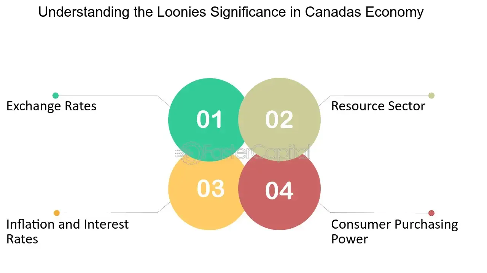

## Table of Contents

## What is the Loonie?

The Loonie is the nickname for the Canadian one-dollar coin. It got its name because it has a picture of a loon, which is a type of bird, on one side. The other side has a picture of Queen Elizabeth II. The Loonie was first used in Canada in 1987, and it replaced the one-dollar bill.

The Loonie is made of a special metal that is mostly nickel, with some bronze on the outside. It is very important in Canada because people use it every day to buy things. The coin helps make buying and selling easier because it lasts longer than paper money.

## Why is the Canadian dollar called the Loonie?

The Canadian dollar coin is called the Loonie because it has a picture of a loon on one side. A loon is a bird that lives in Canada and is very special to the people there. The coin was first used in 1987, and it took the place of the one-dollar bill.

People started calling the coin the Loonie because it was easy to remember and fun to say. The name caught on quickly and now everyone in Canada knows what a Loonie is. It's a big part of everyday life in Canada, and it makes buying things easier because it lasts longer than paper money.

## How does the Loonie affect the Canadian economy?

The Loonie, or the Canadian dollar coin, helps the Canadian economy by making buying and selling easier. When people use coins instead of paper money, the money lasts longer. This saves the government money because they don't have to print new bills as often. Also, when people can use coins easily, it makes shopping faster and more convenient. This helps stores and businesses run more smoothly.

The value of the Loonie can also affect the Canadian economy in big ways. If the Loonie is strong, it means that Canadian money is worth more compared to other countries' money. This can make it cheaper for Canadians to buy things from other countries. But it can also make it harder for Canadian businesses to sell their products to other countries because their products might be more expensive. On the other hand, if the Loonie is weak, it can help Canadian businesses sell more to other countries, but it might make things from other countries more expensive for Canadians to buy.

## What is the role of the Loonie in international trade?

The Loonie plays an important role in international trade because its value can affect how much Canadian goods cost in other countries. If the Loonie is strong, it means that Canadian money is worth more compared to other countries' money. This can make Canadian products more expensive for people in other countries to buy. For example, if a Canadian company wants to sell cars to the United States, a strong Loonie might make those cars too expensive for American buyers.

On the other hand, if the Loonie is weak, it can help Canadian businesses sell more to other countries. A weak Loonie means that Canadian money is worth less compared to other countries' money, so Canadian products become cheaper for people in other countries to buy. This can help Canadian companies sell more of their products abroad, but it might also make things from other countries more expensive for Canadians to buy. So, the value of the Loonie can have a big impact on how well Canadian businesses do in international trade.

## How does the value of the Loonie impact Canadian exports and imports?

When the Loonie is strong, it means Canadian money is worth more compared to other countries' money. This makes Canadian exports, like cars or wheat, more expensive for people in other countries to buy. So, a strong Loonie can make it harder for Canadian businesses to sell their products abroad. But, it's good for Canadians because things from other countries, like electronics or clothes, become cheaper for them to buy. This can help Canadians save money when they shop for things from other places.

On the other hand, when the Loonie is weak, it means Canadian money is worth less compared to other countries' money. This makes Canadian exports cheaper for people in other countries to buy, which can help Canadian businesses sell more of their products abroad. But, a weak Loonie makes imports, like cars or phones from other countries, more expensive for Canadians. So, while it might help Canadian businesses, it can make things from other countries cost more for people living in Canada.

## What factors influence the value of the Loonie?

The value of the Loonie can go up and down because of many things. One big thing is how much other countries want to buy things from Canada. If other countries want to buy a lot of Canadian oil, wood, or cars, the Loonie might go up in value because more people want to use Canadian money. Another thing that can change the value of the Loonie is what the Bank of Canada does with interest rates. If the Bank of Canada makes interest rates higher, it can make the Loonie stronger because people from other countries might want to put their money in Canadian banks to get more interest.

Also, things happening around the world can affect the Loonie. If other countries' money, like the American dollar or the Euro, goes up or down a lot, it can make the Loonie move too. For example, if the American dollar gets weaker, the Loonie might get stronger. Plus, if people all over the world start to feel unsure about the economy, they might want to buy gold or other safe things instead of Canadian dollars, which can make the Loonie weaker. So, the value of the Loonie is always changing because of what's happening in Canada and around the world.

## How does the Bank of Canada manage the Loonie's value?

The Bank of Canada manages the Loonie's value by controlling interest rates. When they think the Loonie needs to be stronger, they can raise interest rates. This makes it more attractive for people from other countries to put their money in Canadian banks because they can earn more interest. When more people want Canadian dollars, the value of the Loonie goes up. On the other hand, if the Bank of Canada thinks the Loonie is too strong, they might lower interest rates. This makes it less attractive for people to keep their money in Canadian banks, so the value of the Loonie might go down.

The Bank of Canada also watches what's happening in the world and in Canada's economy. They look at things like how much other countries want to buy Canadian goods, how strong other countries' money is, and how people feel about the economy. If they see that the Loonie is getting too weak or too strong because of these things, they might decide to do something to help balance it out. But they can't control everything, so sometimes the Loonie's value changes even if the Bank of Canada doesn't do anything.

## What are the historical trends of the Loonie's value?

The Loonie's value has gone up and down over the years. When it first came out in 1987, it was worth about the same as the American dollar. But over time, its value changed a lot. In the late 1990s and early 2000s, the Loonie was often worth less than the American dollar. This meant that Canadian things were cheaper for people in other countries to buy. But it also made things from other countries more expensive for Canadians.

From around 2003 to 2013, the Loonie got a lot stronger. It even became worth more than the American dollar for a little while in 2007 and 2011. This was because Canada was selling a lot of oil and other things to other countries, and because the Bank of Canada was keeping interest rates high. But after 2013, the Loonie started to get weaker again. By 2016, it was worth a lot less than the American dollar. This was because the price of oil went down a lot, and people all over the world were worried about the economy.

So, the Loonie's value has always been changing. Sometimes it's strong, and sometimes it's weak. It depends on a lot of things, like how much other countries want to buy Canadian things, what the Bank of Canada does with interest rates, and what's happening in the world.

## How does the Loonie's value affect inflation and interest rates in Canada?

The value of the Loonie can affect inflation, which is how much prices go up over time. If the Loonie is strong, it means that Canadian money is worth more compared to other countries' money. This can make things from other countries cheaper for Canadians to buy. When things are cheaper, it can help keep inflation low because prices don't go up as fast. But if the Loonie is weak, things from other countries become more expensive. This can make inflation go up because the cost of things that Canadians buy every day, like gas or electronics, might go up too.

The Loonie's value also has a big effect on interest rates. The Bank of Canada, which is like the boss of Canadian money, uses interest rates to help control the Loonie's value. If the Loonie is too weak, the Bank of Canada might raise interest rates to make it more attractive for people from other countries to put their money in Canadian banks. When more people want Canadian dollars, the Loonie gets stronger. On the other hand, if the Loonie is too strong, the Bank of Canada might lower interest rates. This makes it less attractive for people to keep their money in Canadian banks, so the Loonie might get weaker. So, the value of the Loonie and interest rates are always working together to help keep the Canadian economy stable.

## What are the economic implications of a strong versus a weak Loonie?

A strong Loonie means that Canadian money is worth more compared to other countries' money. This can be good for Canadians because things from other countries, like electronics or clothes, become cheaper for them to buy. It can help keep prices from going up too fast, which is called low inflation. But a strong Loonie can make it harder for Canadian businesses to sell their products to other countries because their products might be more expensive. This can hurt Canadian companies that want to sell things like cars or wheat abroad.

On the other hand, a weak Loonie means that Canadian money is worth less compared to other countries' money. This can help Canadian businesses sell more to other countries because their products become cheaper for people in other places to buy. It can make Canadian companies do better in international trade. But a weak Loonie can also make things from other countries more expensive for Canadians. This can make prices go up faster, which is called high inflation. So, a weak Loonie can be good for Canadian businesses but might make life more expensive for people living in Canada.

## How do commodity prices, particularly oil, affect the Loonie?

Commodity prices, especially oil, can have a big effect on the value of the Loonie. Canada sells a lot of oil to other countries, so when the price of oil goes up, it's good for the Canadian economy. More people want to buy Canadian dollars to pay for the oil, which makes the Loonie stronger. For example, if oil prices go up a lot, the Loonie might get stronger because more people want to use Canadian money.

On the other hand, when the price of oil goes down, it can make the Loonie weaker. If oil is cheaper, other countries don't need as many Canadian dollars to buy it. This means fewer people want Canadian money, so the Loonie's value goes down. For example, if oil prices drop a lot, the Loonie might get weaker because fewer people want to use Canadian money. So, the price of oil is a big deal for the Loonie's value.

## What are the future challenges and predictions for the Loonie's economic role?

The Loonie's future might be affected by many things. One big challenge is how much other countries want to buy Canadian oil. If oil prices stay low or go down, it could make the Loonie weaker. Also, if the world starts using less oil because they want to help the environment, it could be hard for Canada. Another challenge is what other countries do with their money. If other countries' money gets stronger or weaker, it can change how strong the Loonie is. Plus, if there are big problems in the world economy, like a big crash or a war, it can make the Loonie go up and down a lot.

Looking ahead, some people think the Loonie might stay pretty weak because of low oil prices and worries about the world economy. But if Canada can sell more things to other countries, like cars or wheat, it could help the Loonie get stronger. The Bank of Canada will keep trying to make the Loonie's value stable by changing interest rates. They will watch what's happening in the world and in Canada's economy to decide what to do. So, the Loonie's future will depend on a lot of things, and it's hard to know for sure what will happen.

## References & Further Reading

[1]: Bank for International Settlements. (2022). [Triennial Central Bank Survey: Foreign exchange turnover in April 2022](https://www.bis.org/statistics/rpfx22.htm).

[2]: OANDA Corporation. [Effects of Oil Prices on the Canadian Dollar](https://www.oanda.com/us-en/trade-tap-blog/trading-knowledge/canadian-dollar-key-drivers-cad/).

[3]: Marcos Lopez de Prado. ["Advances in Financial Machine Learning"](https://www.amazon.com/Advances-Financial-Machine-Learning-Marcos/dp/1119482089).

[4]: David Aronson. ["Evidence-Based Technical Analysis: Applying the Scientific Method and Statistical Inference to Trading Signals"](https://www.amazon.com/Evidence-Based-Technical-Analysis-Scientific-Statistical/dp/0470008741).

[5]: Stefan Jansen. ["Machine Learning for Algorithmic Trading"](https://github.com/stefan-jansen/machine-learning-for-trading).

[6]: Ernest P. Chan. ["Quantitative Trading: How to Build Your Own Algorithmic Trading Business"](https://www.amazon.com/Quantitative-Trading-Build-Algorithmic-Business/dp/0470284889).