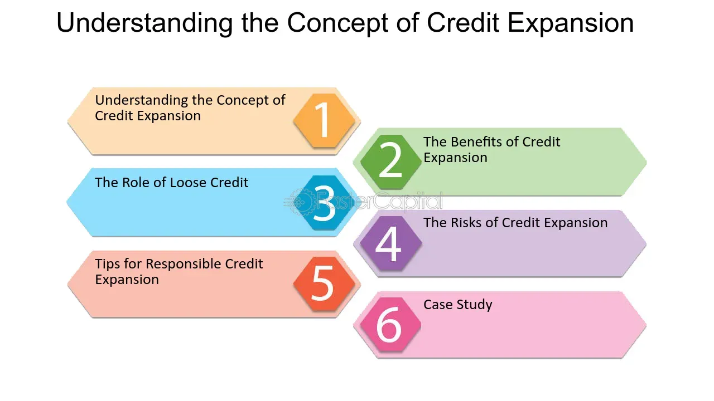

## Table of Contents

## What is the basic definition of loose credit?

Loose credit, also known as easy credit, is when banks and lenders make it easier for people and businesses to borrow money. This happens when interest rates are low, and the rules for getting a loan are not very strict. When credit is loose, more people can get loans because it's cheaper to borrow money and the requirements to qualify are easier to meet.

Having loose credit can help the economy grow because more people can buy things like houses and cars, and businesses can expand. But it can also be risky. If too many people borrow money and can't pay it back, it can lead to problems like a financial crisis. So, while loose credit can boost spending and growth, it needs to be managed carefully to avoid big problems later.

## How does loose credit differ from tight credit?

Loose credit and tight credit are opposite ways banks and lenders manage how easy it is to borrow money. Loose credit means it's easier to get a loan because interest rates are low and the rules to qualify are not strict. This makes it cheaper for people and businesses to borrow money, which can help the economy grow because more people can buy things like homes and cars, and companies can expand.

On the other hand, tight credit means it's harder to get a loan. Interest rates are high, and the rules to qualify are strict. When credit is tight, fewer people and businesses can borrow money because it's more expensive and harder to meet the requirements. This can slow down the economy because people and businesses might not spend as much money.

Both loose and tight credit have their own effects on the economy. Loose credit can lead to more spending and growth, but it can also be risky if too many people can't pay back their loans. Tight credit can help prevent too much risky borrowing, but it can also make it harder for the economy to grow because fewer people can borrow money.

## What are the common indicators of a loose credit environment?

In a loose credit environment, it's easier for people and businesses to borrow money. One big sign of this is when interest rates are low. Low interest rates mean that borrowing money costs less, so more people are willing to take out loans. Another sign is that banks and lenders have relaxed their rules for giving out loans. This means that even if you don't have a perfect credit score or a lot of money, you might still be able to get a loan.

You can also tell credit is loose when there are a lot of new loans being made. Banks are lending more money to more people and businesses. This can lead to more spending in the economy because people can buy things like houses and cars more easily. Also, if you see a lot of ads for loans and credit cards, that's another sign that credit is loose. Companies are trying to get more people to borrow money because it's easier to do so.

Overall, a loose credit environment makes borrowing easier and cheaper, which can help the economy grow. But it's important to be careful because if too many people borrow money and can't pay it back, it can cause problems later on.

## What are the benefits of loose credit for consumers?

Loose credit helps consumers in many ways. When credit is loose, it's easier for people to borrow money because interest rates are low. This means that things like buying a house or a car become more affordable. People can take out loans with lower monthly payments, which makes it easier to manage their money. Also, because the rules for getting a loan are not as strict, more people can qualify, even if they don't have a perfect credit score.

Another benefit is that loose credit can help people start or grow their own businesses. When it's easier to get a loan, someone with a good business idea but not a lot of money can still get the funds they need to get started. This can lead to more jobs and a stronger economy. Overall, loose credit gives consumers more financial freedom and opportunities to improve their lives.

## What are the potential risks associated with loose credit?

Loose credit can be risky because it can lead to people borrowing too much money. When it's easy to get a loan, some people might take out more loans than they can pay back. This can lead to a lot of debt. If too many people can't pay their loans, it can cause problems for banks and the whole economy. This is called a financial crisis, and it can make it hard for everyone to get loans in the future.

Another risk is that loose credit can cause prices to go up. When more people can borrow money, they can spend more on things like houses and cars. This can make prices go up because there are more people trying to buy the same things. If prices go up too fast, it can lead to inflation, which means that money doesn't buy as much as it used to. This can make life harder for people who don't have a lot of money.

Overall, while loose credit can help the economy grow by making it easier for people to borrow money, it needs to be managed carefully. If it's not, the risks can lead to big problems like financial crises and high inflation. It's important for banks and the government to keep an eye on how much credit is being given out to make sure it stays at a healthy level.

## How do central banks influence loose credit policies?

Central banks play a big role in making credit loose or tight. They do this by setting something called the interest rate. When the central bank lowers the interest rate, it makes borrowing money cheaper. This encourages banks to lend more money to people and businesses because they can charge lower interest rates on loans. When credit is loose, more people can borrow money to buy things like houses and cars, which can help the economy grow.

But central banks need to be careful. If they make credit too loose for too long, it can lead to problems. Too many people might borrow money and not be able to pay it back. This can cause a financial crisis, where banks lose a lot of money and the economy suffers. So, central banks have to balance making credit loose enough to help the economy grow, but not so loose that it becomes risky. They watch the economy closely and adjust interest rates to keep credit at a healthy level.

## What role do interest rates play in a loose credit system?

Interest rates are very important in a loose credit system. When interest rates are low, it means that borrowing money costs less. This makes it easier for people and businesses to get loans because they don't have to pay back as much money over time. Banks are more willing to lend money when interest rates are low because they can still make money from the loans, and more people can afford to borrow.

Low interest rates help make the economy grow. When it's cheaper to borrow money, more people can buy things like houses and cars. Businesses can also borrow money to expand and create more jobs. But if interest rates stay too low for too long, it can be risky. Too many people might borrow money and not be able to pay it back, which can cause big problems for the economy. So, while low interest rates can help, they need to be managed carefully.

## How does loose credit impact the overall economy?

Loose credit can help the economy grow. When it's easy to get loans because interest rates are low, more people can borrow money to buy things like houses and cars. This means more spending, which helps businesses sell more and hire more workers. Companies can also borrow money easily to expand and create new jobs. So, loose credit can make the economy stronger by increasing spending and job growth.

But loose credit can also be risky. If too many people borrow money and can't pay it back, it can lead to a financial crisis. This happens when banks lose a lot of money because people can't repay their loans. It can make it hard for everyone to get loans in the future and can hurt the economy. Also, when credit is loose, it can cause prices to go up because more people are trying to buy the same things. If prices go up too fast, it can lead to inflation, which makes life harder for people who don't have a lot of money. So, while loose credit can help the economy, it needs to be managed carefully to avoid big problems.

## Can you explain the mechanism through which loose credit is implemented by financial institutions?

Financial institutions like banks make credit loose by lowering the interest rates they charge on loans. When interest rates are low, it's cheaper for people and businesses to borrow money. Banks also relax their rules for who can get a loan. This means that even if someone doesn't have a perfect credit score or a lot of money, they might still be able to get a loan. Banks do this because they want to lend out more money and make more profit from the interest they charge, even if it's a smaller amount.

When banks make it easier to get loans, more people start borrowing money. This can lead to more spending in the economy because people can buy things like houses and cars more easily. Businesses can also borrow money to expand and hire more workers. But banks have to be careful. If they make credit too loose, too many people might borrow money and not be able to pay it back. This can cause problems for the banks and the whole economy. So, while loose credit can help the economy grow, it needs to be managed carefully to avoid big problems.

## What historical examples illustrate the effects of loose credit?

One big example of loose credit is the time before the Great Recession in 2008. Banks were giving out loans easily, especially for houses. People could get loans even if they didn't have good credit or a lot of money. This made a lot of people buy houses, and house prices went up a lot. But then, many people couldn't pay back their loans. This caused a big problem for the banks and the whole economy. It's called the housing bubble, and when it burst, it led to the Great Recession.

Another example is the Roaring Twenties in the United States. During this time, banks were giving out loans easily, and people were borrowing a lot of money to buy things like stocks. This made the stock market grow a lot, and people felt rich. But then, in 1929, the stock market crashed. Many people had borrowed money to buy stocks and couldn't pay it back. This led to the Great Depression, which was a very hard time for the economy. These examples show how loose credit can help the economy grow, but if it's not managed well, it can lead to big problems.

## How do regulatory frameworks adapt to periods of loose credit?

During times of loose credit, regulatory frameworks often change to keep the economy safe. Regulators, like government agencies, watch the banks and other lenders closely. They make rules to stop banks from giving out too many risky loans. For example, they might tell banks to keep more money in reserve, so they have enough if people can't pay back their loans. They might also make rules about how much money banks can lend to people with bad credit. This helps to make sure that the economy doesn't get into big trouble because of too much loose credit.

Regulators also keep an eye on interest rates and how much people are borrowing. If they see that too many people are borrowing money and not paying it back, they might tell the central bank to raise interest rates. This makes borrowing money more expensive and slows down the loose credit. By doing these things, regulators try to balance the good things about loose credit, like helping the economy grow, with the risks, like causing a financial crisis. It's all about keeping the economy healthy and safe.

## What advanced strategies can financial institutions use to manage risks during periods of loose credit?

Financial institutions can use several advanced strategies to manage risks when credit is loose. One way is to use something called stress testing. This means they test their loans to see what would happen if the economy got worse. They look at things like what would happen if a lot of people couldn't pay back their loans all at once. By doing this, banks can find out if they are taking too many risks and can make changes to be safer. Another strategy is to use better ways to check how likely someone is to pay back a loan. This is called risk assessment. Banks can use new technology and data to figure out if someone is a good risk or not, even when credit is loose.

Another important strategy is to diversify their loans. This means not lending all their money to just one type of loan, like home loans. If they spread out their loans to different kinds of borrowers and different types of loans, it's less risky. If one type of loan gets into trouble, the bank won't lose all its money. Banks can also use something called hedging. This is like buying insurance for their loans. They can use financial tools to protect themselves from big losses if things go wrong. By using these strategies, financial institutions can enjoy the benefits of loose credit while also keeping the risks under control.

## What is the relationship between understanding financial policy and loose credit?

Financial policies, particularly monetary policies, significantly influence credit conditions within an economy. At the core of these policies are the decisions made by central banks to manage money supply and interest rates, which in turn affect lending practices and economic activity.

Loose credit, a term often used interchangeably with accommodative or easy monetary policy, refers to the relaxation of lending practices by financial institutions. This strategy is typically employed to invigorate economic growth by making it cheaper and easier for businesses and consumers to borrow funds. By lowering interest rates, central banks reduce the cost of borrowing, encouraging increased consumer spending and investment. This relationship can be mathematically expressed as:

$$
C = m \times B
$$

where $C$ stands for credit availability, $m$ is the money supply, and $B$ represents the cost of borrowing or interest rates. As interest rates decrease, $B$ reduces, effectively increasing $C$, thereby facilitating greater access to credit.

Central banks implement loose credit conditions using various tools, primarily [interest rate](/wiki/interest-rate-trading-strategies) adjustments and quantitative easing. Lowering the policy interest rate is a direct approach, as it reduces the cost of borrowing across the economy, influencing both short-term and long-term interest rates. This creates a multiplier effect, where easier access to credit leads to higher levels of consumption and investment, stimulating demand and promoting economic growth.

Quantitative easing (QE) is another strategy employed by central banks to influence credit conditions. QE involves the purchase of government securities or other financial assets from the market, increasing the money supply and lowering interest rates further. This influx of [liquidity](/wiki/liquidity-risk-premium) into the banking system is intended to encourage banks to lend more actively, further loosening credit conditions. An example of QE can be seen in the actions taken by the Federal Reserve during the financial crisis of 2008 and more recently during the COVID-19 pandemic.

Governments and central banks must carefully consider the timing and magnitude of these measures to prevent adverse effects such as runaway inflation or financial market distortions. Loose credit conditions, if prolonged, can lead to irrational exuberance where asset bubbles form due to excessive lending and speculation. The challenge lies in balancing these policies to sustain growth without compromising economic stability.

In conclusion, financial policy, through the lenses of monetary interventions like interest rate adjustments and quantitative easing, plays a pivotal role in shaping the availability of credit. These policies not only dictate the ease with which consumers and businesses can access funds but also have far-reaching implications on economic growth, inflation, and the financial ecosystem at large. Understanding these mechanisms is crucial for policymakers and stakeholders in navigating complex economic landscapes.

## References & Further Reading

[1]: Bernanke, B. S. (2020). ["The New Tools of Monetary Policy."](https://www.aeaweb.org/articles?id=10.1257/aer.110.4.943) Journal of Economic Perspectives, 34(1), 3-20.

[2]: Jarrow, R., & Protter, P. (2016). ["A Short History of Stochastic Integration and Mathematical Finance: The Early Years, 1880–1970."](https://www.semanticscholar.org/paper/A-short-history-of-stochastic-integration-and-the-Jarrow-Protter/90c0801a7627fb88f0c3010e745e31795d6f0f5b) Probability Surveys, 13, 1-52.

[3]: Carney, M. (2018). ["The Future of Money."](https://www.bankofengland.co.uk/speech/2018/mark-carney-speech-to-the-inaugural-scottish-economics-conference) Speech at the Scottish Economic Conference.

[4]: Brogaard, J., Hendershott, T., & Riordan, R. (2014). ["High Frequency Trading and Price Discovery."](https://www.jstor.org/stable/24465658) The Review of Financial Studies, 27(8), 2267-2306.

[5]: Gai, P., & Kapadia, S. (2010). ["Contagion in Financial Networks."](https://www.semanticscholar.org/paper/Contagion-in-financial-networks-Gai-Kapadia/0e50ef770c4e1a48c5b18e8c485f66a7670123f5) Journal of Economic Literature, 36(3), 491-503.