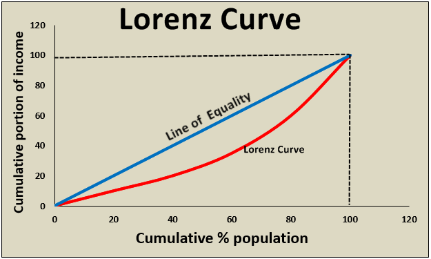

## Table of Contents

## What is a Lorenz Curve?

A Lorenz Curve is a graph that shows how evenly wealth or income is spread out in a group of people. It's like a picture that helps us see if some people have a lot more money than others. The curve starts at the bottom left corner of the graph, where it shows that the poorest people have none of the total wealth. As it moves up and to the right, it shows how much of the total wealth is owned by different percentages of the population. If the wealth was perfectly equal, the curve would be a straight line from the bottom left to the top right.

But usually, the Lorenz Curve is bowed out, showing that wealth is not shared equally. The more the curve bends away from the straight line, the more unequal the distribution of wealth is. For example, if the richest 20% of people own 80% of the wealth, the curve will be far away from the straight line. Economists use this curve to study and talk about inequality in different countries or groups, helping them understand and maybe fix problems with how wealth is shared.

## Who developed the Lorenz Curve and when?

The Lorenz Curve was created by an economist named Max O. Lorenz. He came up with this idea in 1905. Max Lorenz was working at the time and wanted to find a way to show how money was shared among people in a simple picture.

He published his idea in a report called "Methods of Measuring the Concentration of Wealth." This report explained how to draw the curve and use it to see if wealth was spread out evenly or if some people had much more than others. Since then, many people have used the Lorenz Curve to study and talk about how fair or unfair the sharing of money is in different places around the world.

## What does the Lorenz Curve measure?

The Lorenz Curve measures how evenly money or wealth is shared among a group of people. It's a graph that shows if some people have a lot more money than others or if everyone has about the same amount. The curve starts at the bottom left corner, where it shows that the poorest people have none of the total wealth. As it moves up and to the right, it shows how much of the total wealth is owned by different percentages of the population.

If the wealth was perfectly equal, the curve would be a straight line from the bottom left to the top right. But usually, the Lorenz Curve is bowed out, which means that wealth is not shared equally. The more the curve bends away from the straight line, the more unequal the distribution of wealth is. For example, if the richest 20% of people own 80% of the wealth, the curve will be far away from the straight line. This helps us see and understand how fair or unfair the sharing of money is in different places.

## How is the Lorenz Curve constructed?

To make a Lorenz Curve, you start by figuring out how much money or wealth each person in a group has. Then, you line up everyone from the poorest to the richest. Next, you add up the total wealth of the group and see what percentage of that total each person has. You also figure out what percentage of the group each person represents. For example, if you have 100 people, the first person represents 1% of the group, the first two people represent 2%, and so on.

After you have all this information, you can draw the Lorenz Curve on a graph. The bottom left corner of the graph is where you start, showing that the poorest people have 0% of the total wealth. As you move up and to the right, you plot points that show how much of the total wealth is owned by different percentages of the population. If the wealth was perfectly equal, the curve would be a straight line from the bottom left to the top right. But usually, the curve is bowed out, showing that some people have more wealth than others. The more the curve bends away from the straight line, the more unequal the wealth distribution is.

## What does the 45-degree line represent in a Lorenz Curve?

The 45-degree line on a Lorenz Curve is called the line of perfect equality. It's a straight line that goes from the bottom left corner to the top right corner of the graph. This line shows what the distribution of wealth would look like if everyone had exactly the same amount of money. For example, if you have 100 people, the first 1% of the population would have 1% of the total wealth, the first 2% would have 2%, and so on, all the way up to 100%.

In real life, the Lorenz Curve usually doesn't follow this 45-degree line because wealth is rarely shared equally among people. Instead, the actual Lorenz Curve will be a curved line that bows out below the 45-degree line. The more the actual curve bends away from the line of perfect equality, the more unequal the distribution of wealth is. This helps us see and understand how fair or unfair the sharing of money is in different places.

## How can the Lorenz Curve be used to assess income inequality?

The Lorenz Curve is a great tool to see how evenly money is shared among people. It's like a picture that shows if some people have a lot more money than others. To use it, you draw a line called the 45-degree line, which shows what it would look like if everyone had the same amount of money. Then, you draw the actual Lorenz Curve, which usually bows out below this line. The more the curve bends away from the straight line, the more unequal the money sharing is. So, if you want to check how fair or unfair the money distribution is in a place, you can look at where the Lorenz Curve is compared to the 45-degree line.

For example, if the curve is really far away from the straight line, it means that a small group of people have most of the money, while many others have very little. This can help people understand and talk about income inequality in different countries or groups. By comparing the Lorenz Curves of different places, you can see which places have more or less equal sharing of money. This information can be used by leaders and others to make plans and decisions to help make the sharing of money more fair.

## What is the Gini Coefficient and how is it related to the Lorenz Curve?

The Gini Coefficient is a number that tells us how equal or unequal the sharing of money is in a group of people. It's like a score that goes from 0 to 1, where 0 means everyone has the same amount of money and 1 means one person has all the money and everyone else has none. To find the Gini Coefficient, you use the Lorenz Curve. The Lorenz Curve is a graph that shows how evenly money is spread out among people. If you draw a straight line from the bottom left to the top right of the graph, that's the line of perfect equality. The actual Lorenz Curve usually bows out below this line, showing that money isn't shared equally.

To calculate the Gini Coefficient, you look at the space between the line of perfect equality and the actual Lorenz Curve. The bigger the space, the more unequal the money sharing is, and the higher the Gini Coefficient will be. So, the Gini Coefficient is directly connected to the Lorenz Curve because it measures the area between the curve and the straight line. This makes it a useful tool for comparing how fair or unfair the money distribution is in different places. By looking at the Gini Coefficient, people can easily understand and talk about income inequality without having to look at the whole Lorenz Curve.

## Can the Lorenz Curve be applied to other distributions besides income?

Yes, the Lorenz Curve can be used to look at other things besides money. It can show how evenly anything is shared among a group of people. For example, it can be used to see how land is shared among farmers, how education is spread out among students, or how health care is available to different people. If you want to know if some people have a lot more of something than others, you can use the Lorenz Curve to see it clearly.

The way you make a Lorenz Curve for these other things is the same as for money. You line up everyone from the least to the most of whatever you're looking at, and then you draw a graph. The bottom left corner starts at zero, and as you move up and to the right, you show how much of the total is owned or used by different percentages of the group. If the curve is close to a straight line, it means things are shared pretty evenly. But if the curve bows out a lot, it means some people have a lot more than others. This helps us understand and talk about fairness in different areas of life.

## What are the limitations of using the Lorenz Curve for economic analysis?

The Lorenz Curve is a helpful tool, but it has some limits when we use it to study how money is shared. One big problem is that it only looks at how money is spread out, but it doesn't tell us why some people have more money than others. For example, it doesn't show if people have different amounts of money because of their jobs, where they live, or other reasons. Also, the Lorenz Curve doesn't change over time, so it can't show if the way money is shared is getting better or worse. If you want to know how things are changing, you need to look at different Lorenz Curves at different times, which can be hard to do.

Another limit is that the Lorenz Curve can be affected by small changes in data. If there's a mistake or if the numbers change a little bit, the curve can look different. This means that the Lorenz Curve might not always give a clear picture of how money is shared. Also, the Lorenz Curve doesn't show other important things like how much money people need to live well or if they can get things like health care and education. So, while the Lorenz Curve is useful, it's best to use it with other tools to get a full understanding of money sharing and fairness.

## How do different countries' Lorenz Curves compare, and what does this indicate?

When we look at the Lorenz Curves of different countries, we see how money is shared among people in each place. Some countries have Lorenz Curves that are close to the 45-degree line, which means money is shared pretty evenly. For example, countries like Denmark and Sweden often have Lorenz Curves that are not too far from the straight line, showing that most people have about the same amount of money. On the other hand, some countries have Lorenz Curves that bow out a lot, which means a few people have a lot more money than everyone else. Countries like South Africa and Brazil often have Lorenz Curves that are far from the straight line, showing big differences in how much money people have.

These differences in Lorenz Curves tell us a lot about income inequality in different countries. If a country's Lorenz Curve is close to the 45-degree line, it means the country is doing a good job of making sure money is shared fairly among its people. This can be because of good policies, like taxes and help for people who don't have much money. But if a country's Lorenz Curve is far from the straight line, it means there's a big problem with how money is shared. This can be because of things like not enough jobs, or because some people have a lot of power and keep most of the money for themselves. By looking at Lorenz Curves, we can see which countries need to work harder to make sure everyone has a fair chance to have enough money.

## What advanced statistical methods can be used to refine the analysis of Lorenz Curves?

To make the study of Lorenz Curves better, we can use something called kernel density estimation. This is a way to smooth out the curve and make it easier to see the overall shape of how money is shared. Instead of just connecting the dots, kernel density estimation helps us see the big picture by making the curve look smoother and more accurate. This can be really helpful when we're looking at data that might have small mistakes or changes, because it helps us see the main trends instead of getting distracted by little bumps in the data.

Another way to improve the analysis of Lorenz Curves is by using something called bootstrapping. This is a way to check how sure we are about our results. With bootstrapping, we take our data and make many different versions of it by picking samples over and over again. Then, we draw a Lorenz Curve for each of these samples and see how much they all look the same or different. This helps us understand if the curve we see is a good picture of the real world, or if it might change a lot if we had different data. By using these advanced methods, we can get a clearer and more reliable understanding of how money is shared among people.

## How has the interpretation of Lorenz Curves evolved in economic theory over time?

When Max Lorenz first made the Lorenz Curve in 1905, it was a new way to see how money was shared among people. Back then, people used it to look at how much money or wealth different groups had. It was a simple picture that showed if some people had a lot more money than others. Economists found it useful because it helped them talk about fairness and inequality in a clear way. Over time, as more people started using the Lorenz Curve, they began to see it as a basic tool for understanding how money was spread out in different places.

As time went on, the way people used and thought about the Lorenz Curve changed. Economists started to use it not just for money, but for other things too, like how land or education was shared. They also started to use more advanced math and computer tools to make the Lorenz Curve more accurate and helpful. For example, they used something called kernel density estimation to make the curve smoother and easier to read. They also used a method called bootstrapping to check if the curve they saw was a good picture of the real world. These changes helped economists get a better and more detailed understanding of inequality and fairness in different areas of life.

## What is the Lorenz Curve and how can it be understood?

The Lorenz curve, formulated by economist Max Lorenz in 1905, is a fundamental graphical tool used to visualize the distribution of income or wealth within a society. This curve provides insights into the degree of inequality present among a population. 

On a standard Lorenz curve, the horizontal axis corresponds to the cumulative percentage of the population, starting from the poorest to the richest. Meanwhile, the vertical axis shows the cumulative percentage of total income or wealth held by these same segments. In an ideal scenario of perfect income equality, the Lorenz curve would coincide with the line of equality, which is a 45-degree diagonal line representing equal distribution among the population. In real-world scenarios, the Lorenz curve typically appears bowed beneath this line, illustrating the departure from perfect equality.

The extent to which the Lorenz curve deviates from the line of equality is directly related to the Gini coefficient, a summary statistic used to quantify inequality. The Gini coefficient is calculated as the area between the line of equality and the Lorenz curve, divided by the total area under the line of equality. This coefficient ranges from 0 to 1, where 0 signifies perfect equality (all individuals possess equal wealth or income), and 1 indicates maximal inequality (a single individual holds all the income or wealth). 

Mathematically, the Gini coefficient $G$ is represented by:

$$

G = 1 - 2 \int_0^1 L(x) \, dx 
$$

where $L(x)$ denotes the Lorenz curve and $x$ is the share of the population. Moreover, in discrete terms, the Gini coefficient can be estimated using:

$$

G = \frac{\sum_{i=1}^{n} \sum_{j=1}^{n} |x_i - x_j|}{2n^2 \bar{x}} 
$$

where $x_i$ and $x_j$ are income values of individuals, $n$ represents the total number of individuals, and $\bar{x}$ is the mean income.

Understanding the Lorenz curve and the derived Gini coefficient is instrumental for economists and policymakers who strive to assess and address income inequality, a persistent issue influencing economic stability and societal well-being.

## References & Further Reading

[1]: Aldridge, I. (2013). [High-Frequency Trading: A Practical Guide to Algorithmic Strategies and Trading Systems](https://www.wiley.com/en-us/High+Frequency+Trading%3A+A+Practical+Guide+to+Algorithmic+Strategies+and+Trading+Systems-p-9780470579770). Wiley.

[2]: Kirilenko, A., Kyle, A. S., Samadi, M., & Tuzun, T. (2017). ["The Flash Crash: High-Frequency Trading in an Electronic Market."](https://www.jstor.org/stable/26652722) The Journal of Finance, 72(1), 321-352.

[3]: Narang, R. K. (2013). [Inside the Black Box: A Simple Guide to Quantitative and High-Frequency Trading](https://onlinelibrary.wiley.com/doi/book/10.1002/9781118662717). Wiley.

[4]: Hendershott, T., Jones, C. M., & Menkveld, A. J. (2011). ["Does Algorithmic Trading Improve Liquidity?"](https://onlinelibrary.wiley.com/doi/full/10.1111/j.1540-6261.2010.01624.x) The Journal of Finance, 66(1), 1-33.

[5]: Matheson, T. (2011). ["Taxing financial transactions: Issues and evidence."](https://www.imf.org/external/pubs/ft/wp/2011/wp1154.pdf) IMF Working Papers, 2011(54), 1-24. 

[6]: European Securities and Markets Authority. (2020). [MiFID II/MiFIR Review Report on Algorithmic Trading](https://www.esma.europa.eu/sites/default/files/library/esma70-156-4572_mifid_ii_final_report_on_algorithmic_trading.pdf).

[7]: Piketty, T., & Zucman, G. (2014). ["Capital is back: Wealth-income ratios in rich countries, 1700–2010."](http://piketty.pse.ens.fr/files/PikettyZucman2014QJEms.pdf) The Quarterly Journal of Economics, 129(3), 1255-1310.

[8]: Takahashi, K. (2017). ["The impact of high-frequency trading on stock market performance."](https://www.semanticscholar.org/paper/Stochastic-Differential-Game-in-High-Frequency-Saito-Takahashi/c3b5da19f890f7dcac21893c1b0fed2d6f469933) Journal of Financial Markets, 31, 87-105.