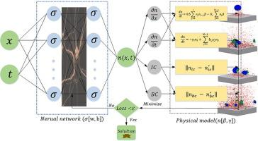

## Table of Contents

## What is a Loss Aggregator in the context of machine learning?

A Loss Aggregator in machine learning is a component used during the training of models to combine individual loss values into a single, overall loss value. When training a model, you often compute a loss for each example in your dataset. The Loss Aggregator takes these individual losses and aggregates them into one value, which the model then uses to adjust its parameters. This aggregation is typically done by taking the average or sum of the individual losses, depending on the specific needs of the model and the task at hand.

For example, if you are training a neural network to recognize images, you might calculate a loss for each image in your training set. The Loss Aggregator would then combine these losses, perhaps by averaging them, to give you a single loss value that represents how well the model is performing across the entire set of images. This aggregated loss is crucial because it guides the optimization process, helping the model to learn from its mistakes and improve its performance over time.

## How does a Loss Aggregator help in training machine learning models?

A Loss Aggregator helps in training machine learning models by combining the individual losses from each training example into a single value. This single value, called the aggregated loss, tells the model how well it is doing overall. When the model makes predictions, it compares them to the actual results and calculates a loss for each example. The Loss Aggregator then takes all these losses and adds them up or averages them. This helps the model understand its total error across all the examples it has seen.

Using the aggregated loss, the model can then adjust its parameters to reduce this error. For example, if the model is trying to predict house prices, it might look at the difference between its predictions and the actual prices for many houses. The Loss Aggregator would combine these differences into one number. The model then uses this number to tweak its internal settings, trying to make better predictions next time. This process repeats many times, with the model getting better and better at its task as it learns from the aggregated loss.

## What are the common types of loss functions used with Loss Aggregators?

Loss Aggregators often work with different types of loss functions, depending on the task at hand. One common loss function is the Mean Squared Error (MSE), which is used for regression tasks. MSE measures the average of the squares of the errors between predicted and actual values. If your model predicts a value $$ \hat{y} $$ and the actual value is $$ y $$, the MSE for one example is $$ (y - \hat{y})^2 $$. When you use a Loss Aggregator with MSE, it adds up all these squared errors and divides by the number of examples to get the overall loss.

Another widely used loss function is the Cross-Entropy Loss, which is often used for classification tasks. Cross-Entropy Loss measures how well the model's predicted probabilities match the actual class labels. If your model predicts a probability $$ \hat{p} $$ for a class and the true label is $$ y $$, the loss for one example can be calculated as $$ -y \log(\hat{p}) - (1-y) \log(1-\hat{p}) $$. The Loss Aggregator then sums these values across all examples and might average them to get the total loss.

For tasks where the order of the predictions matters, such as in ranking problems, the Mean Absolute Error (MAE) can be useful. MAE calculates the average of the absolute differences between predicted and actual values. If your model predicts $$ \hat{y} $$ and the actual value is $$ y $$, the MAE for one example is $$ |y - \hat{y}| $$. The Loss Aggregator then aggregates these absolute errors to provide a measure of how far off the model's predictions are on average.

## Can you explain the difference between a Loss Aggregator and a traditional loss function?

A Loss Aggregator and a traditional loss function serve different roles in [machine learning](/wiki/machine-learning). A traditional loss function is a mathematical formula that measures how wrong a model's prediction is for a single example. For instance, if you're predicting house prices and your model guesses $$ \hat{y} $$ while the true price is $$ y $$, the Mean Squared Error (MSE) loss function would calculate the error as $$ (y - \hat{y})^2 $$. This loss function helps the model understand its mistake on one specific prediction.

A Loss Aggregator, on the other hand, takes all these individual loss values from the traditional loss function and combines them into one overall loss value. This helps the model see its performance across all the examples it has seen. For example, if you're using MSE, the Loss Aggregator would add up all the $$ (y - \hat{y})^2 $$ values and then divide by the number of examples to get the average error. This aggregated loss is what the model uses to adjust its parameters and improve over time.

## How do Loss Aggregators handle multiple loss functions in multi-task learning?

In multi-task learning, a model tries to learn several tasks at the same time. Each task might have its own loss function. For example, if you're training a model to predict house prices and also classify the type of house, you might use Mean Squared Error (MSE) for the price prediction and Cross-Entropy Loss for the classification. A Loss Aggregator helps by taking these different loss values and combining them into one overall loss that the model can use to improve. The Loss Aggregator can do this in different ways, like adding up the losses or finding a weighted average based on how important each task is.

One common way to combine multiple losses is by using a weighted sum. If you have two losses, $$ L_1 $$ for task 1 and $$ L_2 $$ for task 2, you might decide that task 1 is twice as important as task 2. The Loss Aggregator would then calculate the total loss as $$ L_{\text{total}} = w_1 \cdot L_1 + w_2 \cdot L_2 $$, where $$ w_1 = 2 $$ and $$ w_2 = 1 $$. By adjusting these weights, you can tell the model which task to focus on more. This helps the model balance its efforts across all tasks, improving its performance on each one.

## What are the advantages of using a Loss Aggregator over individual loss functions?

Using a Loss Aggregator helps a machine learning model understand how well it's doing overall, not just for one example. When you train a model, you look at many examples and calculate a loss for each one. The Loss Aggregator takes all these losses and combines them into one number. This makes it easier for the model to see its total error and adjust its settings to get better at predicting. Without a Loss Aggregator, the model would have to deal with many different loss values, which can be confusing and hard to use for learning.

In multi-task learning, where a model tries to learn several things at once, a Loss Aggregator is even more useful. Each task might have its own way of measuring error, like using $$ (y - \hat{y})^2 $$ for predicting numbers and another formula for classifying things. The Loss Aggregator can take all these different errors and combine them into one total loss. This way, the model can focus on improving all tasks together, not just one at a time. It makes the training process smoother and helps the model balance its efforts across all the tasks it's learning.

## How can Loss Aggregators be implemented in popular machine learning frameworks like TensorFlow or PyTorch?

In TensorFlow, you can implement a Loss Aggregator by calculating individual losses and then combining them into a single value. For example, if you're training a model to predict house prices and classify house types, you might use Mean Squared Error (MSE) for the price prediction and Cross-Entropy Loss for the classification. You can calculate these losses separately and then use TensorFlow's `tf.reduce_mean` or `tf.add_n` to combine them into one overall loss. Here's a simple example of how you might do this:

```python
import tensorflow as tf

# Assume y_true_price, y_pred_price, y_true_class, y_pred_class are tensors
mse_loss = tf.reduce_mean(tf.square(y_true_price - y_pred_price))
cross_entropy_loss = tf.reduce_mean(tf.nn.softmax_cross_entropy_with_logits(labels=y_true_class, logits=y_pred_class))

# Combine the losses with weights
total_loss = 0.5 * mse_loss + 0.5 * cross_entropy_loss

# Use total_loss for optimization
optimizer = tf.keras.optimizers.Adam()
train_op = optimizer.minimize(total_loss)
```

In PyTorch, implementing a Loss Aggregator follows a similar approach. You calculate the individual losses for each task and then aggregate them into a single loss value. PyTorch provides functions like `torch.mean` and `torch.sum` to help combine losses. If you're working on multi-task learning, you might use Mean Squared Error (MSE) for regression tasks and Cross-Entropy Loss for classification tasks. Here's how you might implement this in PyTorch:

```python
import torch
import torch.nn as nn

# Assume y_true_price, y_pred_price, y_true_class, y_pred_class are tensors
mse_loss = nn.MSELoss()(y_pred_price, y_true_price)
cross_entropy_loss = nn.CrossEntropyLoss()(y_pred_class, y_true_class)

# Combine the losses with weights
total_loss = 0.5 * mse_loss + 0.5 * cross_entropy_loss

# Use total_loss for optimization
optimizer = torch.optim.Adam(model.parameters())
optimizer.zero_grad()
total_loss.backward()
optimizer.step()
```

Both examples show how you can use a Loss Aggregator to combine different types of losses into one overall loss, making it easier for your model to learn from multiple tasks at the same time.

## What are some challenges or limitations when using Loss Aggregators in machine learning?

One challenge when using Loss Aggregators is figuring out the right way to combine different losses. If you're working on multi-task learning, where your model tries to do several things at once, you need to decide how important each task is. This means choosing weights for each loss, like $$ w_1 $$ for one task and $$ w_2 $$ for another. If you pick the wrong weights, your model might focus too much on one task and not do well on the others. It can be hard to find the perfect balance, and you might need to try different weights to see what works best.

Another limitation is that Loss Aggregators can hide problems with your model. If one part of your model is doing really badly, the overall loss might still look okay because other parts are doing well. This can make it tricky to spot and fix issues. For example, if you're using a Loss Aggregator to combine Mean Squared Error (MSE) and Cross-Entropy Loss, a high MSE might be balanced out by a low Cross-Entropy Loss, so you might not realize that your model's predictions for one task are way off. You need to keep an eye on the individual losses as well as the total loss to make sure your model is learning the right things.

## How does the choice of Loss Aggregator affect model performance and convergence?

The choice of Loss Aggregator can really change how well a model works and how quickly it learns. If you're using a Loss Aggregator to combine different losses, like Mean Squared Error (MSE) for one task and Cross-Entropy Loss for another, the way you combine these losses matters a lot. For example, if you use a weighted sum to combine losses, the weights you choose tell the model which task to focus on more. If you pick weights that don't match how important each task is, your model might spend too much time trying to get better at one thing and not enough on the others. This can slow down how fast the model learns and might even make it worse at some tasks.

Another way the Loss Aggregator affects model performance is by how it shows the model's overall error. If the Loss Aggregator just adds up all the losses without considering their importance, it might hide big problems in one part of the model. For instance, if the MSE for one task is very high but the Cross-Entropy Loss for another task is low, the total loss might look okay. But this can trick you into thinking the model is doing better than it really is. You need to watch the individual losses as well as the total loss to make sure the model is learning correctly. By choosing the right Loss Aggregator and setting it up well, you can help your model learn faster and perform better on all its tasks.

## Can you discuss any advanced techniques for optimizing Loss Aggregators in complex models?

One advanced technique for optimizing Loss Aggregators in complex models is using adaptive weighting. This means the model can change how important each task is as it learns. For example, if you're training a model to do several things at once, you might start with equal weights for each task's loss. But as the model learns, some tasks might need more attention than others. You can use a method called uncertainty weighting, where the model looks at how sure it is about each task and adjusts the weights accordingly. If the model is doing well on one task but not on another, it can focus more on the task it's struggling with. This helps the model learn faster and perform better overall.

Another technique is using dynamic loss scaling. In this approach, the Loss Aggregator changes how it combines the losses over time. For instance, if one task's loss is much bigger than the others, it might overwhelm the total loss and make it hard for the model to learn from the other tasks. By scaling the losses so they're all on the same level, you can make sure the model pays attention to all tasks equally. This can be done by using a scaling [factor](/wiki/factor-investing) that changes based on the current losses. For example, you might use a formula like $$ L_{\text{total}} = \sum_{i} \alpha_i \cdot L_i $$, where $$ \alpha_i $$ is a scaling factor that adjusts to keep all losses balanced. This way, the model can learn from all tasks without any one task dominating the training process.

## What role do Loss Aggregators play in federated learning scenarios?

In federated learning, Loss Aggregators help combine the losses from different devices or clients into one overall loss. This is important because in federated learning, the model is trained on data that stays on each device, like your phone or computer. Each device calculates its own loss based on its local data. The Loss Aggregator then takes all these individual losses and adds them up or averages them to give the model a single number that shows how well it's doing across all the devices. This helps the model learn from all the data without needing to move it to a central place.

Using a Loss Aggregator in federated learning can be tricky because the data on each device might be different. For example, if one device has a lot of data about cats and another has data about dogs, the losses might be very different. The Loss Aggregator needs to handle this by maybe using weights to balance the importance of each device's loss. This way, the model can learn from all the devices fairly and improve its performance on all types of data. By doing this, Loss Aggregators help make federated learning work well, even when the data is spread out across many places.

## How have Loss Aggregators evolved with the advent of deep learning and neural networks?

Loss Aggregators have become more important with the rise of [deep learning](/wiki/deep-learning) and neural networks. In the past, when models were simpler, you might have just used one kind of loss for one task. But now, with deep learning, models often do many things at once, like predicting numbers and classifying things. This means we need to combine different losses into one big loss that the model can use to learn. Loss Aggregators help by taking all these different losses, like Mean Squared Error (MSE) for predicting numbers and Cross-Entropy Loss for classifying things, and turning them into one number. This makes it easier for the model to see how well it's doing overall and adjust to get better.

With neural networks getting more complex, Loss Aggregators have also gotten smarter. Now, we use things like adaptive weighting, where the model can change how important each task is as it learns. For example, if the model is doing well on one task but not on another, it can focus more on the task it's struggling with. This helps the model learn faster and perform better. Another way Loss Aggregators have evolved is through dynamic loss scaling. This means the Loss Aggregator can change how it combines the losses over time to make sure the model pays attention to all tasks equally. By using these advanced techniques, Loss Aggregators help deep learning models work better and learn from many tasks at the same time.

## References & Further Reading

[1]: Goodfellow, I., Bengio, Y., & Courville, A. (2016). ["Deep Learning."](https://link.springer.com/article/10.1007/s10710-017-9314-z) MIT Press.

[2]: Bishop, C. M. (2006). ["Pattern Recognition and Machine Learning."](https://www.cs.uoi.gr/~arly/courses/ml/tmp/Bishop_book.pdf) Springer.

[3]: Sutton, R. S., & Barto, A. G. (2018). ["Reinforcement Learning: An Introduction."](https://web.stanford.edu/class/psych209/Readings/SuttonBartoIPRLBook2ndEd.pdf) MIT Press.

[4]: Bottou, L., Curtis, F. E., & Nocedal, J. (2018). ["Optimization Methods for Large-Scale Machine Learning."](https://arxiv.org/abs/1606.04838) Annual Review of Control, Robotics, and Autonomous Systems.

[5]: Hinton, G. (2012). ["A Practical Guide to Training Restricted Boltzmann Machines."](https://link.springer.com/chapter/10.1007/978-3-642-35289-8_32) Department of Computer Science, University of Toronto.

[6]: LeCun, Y., Bengio, Y., & Hinton, G. (2015). ["Deep Learning."](https://www.nature.com/articles/nature14539) Nature, 521(7553), 436-444.

[7]: Ruder, S. (2017). ["An Overview of Gradient Descent Optimization Algorithms."](https://arxiv.org/abs/1609.04747) arXiv:1609.04747.

[8]: Srivastava, N., Hinton, G., Krizhevsky, A., Sutskever, I., & Salakhutdinov, R. (2014). ["Dropout: A Simple Way to Prevent Neural Networks from Overfitting."](https://dl.acm.org/doi/abs/10.5555/2627435.2670313) Journal of Machine Learning Research, 15(1), 1929-1958.