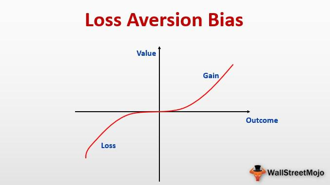

In the rapidly evolving world of trading, a comprehensive understanding of the various risks involved is essential for achieving success. Among the myriad factors that can influence trading decisions, loss aversion stands out as a particularly pervasive psychological bias. This phenomenon, where individuals tend to prioritize avoiding losses over acquiring gains, can significantly alter traders' strategies and outcomes. As trading environments become increasingly sophisticated, recognizing such cognitive biases is more important than ever.

Moreover, the advent of algorithmic trading has added layers of complexity to risk management in financial markets. Algorithms can process vast datasets and execute trades at speeds beyond human capability, introducing both opportunities and new challenges. These automated systems necessitate rigorous risk management frameworks to stave off technological and market-related threats that may arise from their use.

This article aims to provide a detailed exploration of loss aversion, effective risk management strategies, and the pivotal role of algorithmic trading in contemporary financial markets. Understanding these elements is crucial for traders aiming to enhance their decision-making processes and achieve sustained success in an increasingly competitive landscape.

## Table of Contents

## Understanding Loss Aversion

Loss aversion is a well-documented phenomenon in behavioral economics, describing how individuals disproportionately weigh potential losses more heavily than equivalent gains. This cognitive bias suggests that the pain of losing is psychologically more impactful than the pleasure of gaining, often leading to irrational decision-making. 

The concept of loss aversion is grounded in both psychological theory and evolutionary biology. From a psychological standpoint, it emanates from the prospect theory proposed by Daniel Kahneman and Amos Tversky in 1979, which challenges the expected utility theory by suggesting that people evaluate potential losses and gains using a subjective value function. This function is generally concave for gains and convex for losses, indicating that individuals experience diminishing sensitivity to increasing monetary amounts. Furthermore, the function is steeper for losses than gains, symbolizing the heightened sensitivity to losses (Kahneman & Tversky, 1979).

Evolutionarily, loss aversion can be attributed to the survival instincts inherited from human ancestors who were more likely to avoid situations that could threaten their survival. This ancient risk-averse behavior manifests in modern financial decision-making, where traders might irrationally avoid losses even if it means forgoing potential profits.

In the context of trading, loss aversion can significantly distort rational decision-making processes. Traders often hold onto losing positions longer than advisable, hoping to recoup losses as markets fluctuate. This behavior, commonly referred to as "holding onto losers," can exacerbate losses if markets do not rebound as anticipated. Conversely, traders may also prematurely sell profitable positions due to fear of a potential downturn, thereby missing out on further gains. This dichotomy between action on losses versus gains can skew a trader's overall performance, impacting long-term profitability.

Addressing loss aversion requires a strategic approach to trading. Awareness and acknowledgment of this bias are the first steps towards mitigating its effects. Traders can benefit from setting pre-defined trading rules and adhering strictly to these parameters, thereby reducing emotional influences. Cognitive training, such as behavioral finance education, offers additional methods to recognize and counteract personal biases. Ultimately, mastering loss aversion as part of a broader risk management strategy is critical for making informed trading decisions and achieving sustained success in financial markets.

## The Impact of Loss Aversion on Trading Decisions

Loss aversion significantly impacts trading decisions by influencing how traders perceive and react to gains and losses. This cognitive bias, first documented by psychologists Daniel Kahneman and Amos Tversky, suggests that the pain of losing is psychologically about twice as powerful as the pleasure of gaining. Consequently, traders often exhibit a pronounced reluctance to sell losing investments, driven by the hope that these will eventually recover. This behavior can lead to holding onto such investments for too long, potentially increasing losses. Conversely, the same bias can prompt traders to prematurely sell winning positions to lock in sure gains, forfeiting the full profit potential. 

The imbalance caused by loss aversion can also exacerbate risks and limit long-term profitability. By prioritizing loss avoidance over rational evaluation of potential outcomes, traders may fail to rebalance or diversify their portfolios effectively. This imbalance can lead to a suboptimal asset allocation, increasing exposure to specific risks and limiting overall return potential.

Traders under the influence of loss aversion often exhibit heightened reactions to market fluctuations, driven primarily by fear. When markets decline, fear of incurring losses can lead to panic selling, which not only locks in losses but also contributes to market [volatility](/wiki/volatility-trading-strategies). During market rallies, the fear of losing anticipated gains may compel traders to [exit](/wiki/exit-strategy) positions early, sacrificing possible returns. These reactions are often amplified during periods of market uncertainty, where the psychological pressure is intensified.

Overall, loss aversion can severely impact the decision-making processes in trading by clouding judgment and leading to emotional reactions rather than strategic planning. Overcoming this bias necessitates a keen understanding of its mechanisms and implementing disciplined risk management practices to enhance trading outcomes.

## Risk Management Strategies in Trading

Effective risk management is crucial for success in trading, as it involves the systematic process of identifying, assessing, and mitigating potential risks. Traders face various uncertainties, such as market volatility and unexpected economic events, necessitating robust strategies to safeguard investments and maximize returns.

One fundamental technique in risk management is diversification. By spreading investments across different asset classes, sectors, or geographic regions, traders can reduce the impact of adverse movements in any single asset. This strategy is grounded in the principle that different assets often respond differently to the same economic events, thus reducing overall portfolio risk. For example, a portfolio combining equities, bonds, and commodities might withstand fluctuations more effectively than a portfolio concentrated solely in equities.

Stop-loss and take-profit orders are essential tools for managing specific trades. A stop-loss order establishes a predetermined price at which a position is automatically sold, limiting potential losses in declining markets. Conversely, take-profit orders lock in gains by selling a position once it reaches a specified price. These mechanisms ensure that trades are executed with predefined risk-reward profiles, removing emotional decision-making and ensuring more disciplined trading practices.

Hedging techniques are utilized to offset potential losses in existing positions. This can be accomplished through derivatives such as options and futures. For instance, a trader holding a significant stock position might purchase put options to protect against a downside move. This strategy provides financial protection at the cost of option premiums, balancing the trade-off between risk and expense.

Adapting to market conditions is another vital aspect of risk management. Markets are inherently dynamic, and traders must continuously assess and adjust their strategies in response to changes. This adaptability involves reassessing risk tolerance, modifying positions, and staying informed about economic indicators and geopolitical events that may influence markets.

Discipline is also a central tenet in effective risk management. Traders must adhere to their strategic plans and not be swayed by emotions such as greed or fear. Developing a trading plan with clear entry and exit rules, as well as risk limits, is essential. Regularly reviewing performance and strategies helps ensure adherence to these rules and facilitates continuous improvement.

In summary, effective risk management is characterized by diversification, the use of stop-loss and take-profit orders, and strategies for hedging. Maintaining discipline and continually adapting to market conditions can significantly enhance the stability and success of trading activities. These strategies help mitigate risks, ensuring that traders can navigate market uncertainties with greater confidence.

## Algorithmic Trading and Risk Management

Algorithmic trading involves the use of advanced computer algorithms to execute trading orders at high speeds and with precision, significantly enhancing the efficiency of trade executions compared to manual trading methods. These algorithms are capable of processing vast amounts of data and can execute complex strategies that [factor](/wiki/factor-investing) in price, timing, and [volume](/wiki/volume-trading-strategy). This computational power allows traders to capitalize on market opportunities faster than human traders.

Despite the advantages, [algorithmic trading](/wiki/algorithmic-trading) introduces several risks that need careful management. One of the primary concerns is technological failure. Algorithmic trading systems are dependent on hardware and software that must function flawlessly to execute trades as intended. Any malfunction, such as a software bug or hardware breakdown, can lead to substantial financial losses. Additionally, network latency and failures in communication systems represent significant hazards that could jeopardize trading efficacy.

Market risks are another critical consideration. Algorithms often operate in highly fluid and volatile market environments. Sudden market movements triggered by unforeseen events can lead to scenarios where the trades executed by algorithms amplify rather than mitigate exposure to risk. This necessitates a robust risk management framework that can quickly adapt to changing market conditions.

To manage these risks effectively, traders rely on a combination of technological and strategic solutions. Implementing redundant systems, comprehensive testing, and regular maintenance schedules can mitigate the risks associated with technological failures. Furthermore, deploying algorithms with built-in risk management features—such as stop-loss and limit orders—can help control exposure and protect against significant losses.

Regulatory compliance forms another layer of risk management. Given the complex nature and potential systemic impact of algorithmic trading, financial regulators across the globe have established frameworks to oversee these activities. Ensuring compliance with these regulations—including maintaining comprehensive records of trade data and system activities—helps mitigate regulatory risk and promotes market stability.

The integration of algorithmic trading with sophisticated risk management systems enables traders to harness the advantages of speed and precision while maintaining a vigilant approach to the risks involved. Adapting to both technological advancements and the regulatory landscape is essential for success in this dynamic facet of financial markets.

## Behavioral Aspects and Cognitive Bias in Trading

Cognitive biases significantly influence trading decisions, and understanding these biases is central to improving trading performance. Loss aversion is one such bias, where individuals prioritize avoiding losses over acquiring equivalent gains. However, this is not the only psychological factor affecting traders. Other biases, such as regret aversion, confirmation bias, and anchoring, can further complicate decision-making processes and amplify the impacts of loss aversion.

Regret aversion refers to the tendency to avoid making decisions that could lead to remorse. In trading, this can result in hesitation or avoidance of taking risks, even when potential returns justify them. Traders may hold onto losing positions to avoid the regret of closing a trade only for the price to rebound later, mirroring the effects of loss aversion and potentially leading to greater financial detriment.

Confirmation bias involves favoring information that confirms preexisting beliefs or hypotheses, often leading traders to overlook contradictory evidence. A trader might seek only data and analysis that support their initial market outlook, disregarding counterarguments or negative indicators. By doing so, they become susceptible to holding biased positions that do not account for full market realities, which may increase the potential for significant losses.

Anchoring bias occurs when individuals rely too heavily on the first piece of information encountered (the "anchor") when making decisions. Traders may base their actions on initial market entry prices or specific data points, even if subsequent information suggests a different strategy would be more profitable. Anchoring can lock traders into particular viewpoints, affecting their ability to adapt to new market conditions and rendering them vulnerable to sudden market shifts.

To mitigate these and other psychological influences, traders can employ techniques that promote mindfulness and emotional discipline. Mindfulness involves maintaining an awareness of the present moment without becoming overly reactive or opinionated. For traders, mindfulness practices can help maintain focus and reduce the emotional responses that contribute to cognitive biases.

Emotional discipline complements mindfulness by fostering a more objective and detached approach to trading. Methods such as setting predefined trading rules and engaging in consistent self-reflection allow traders to respect data and analysis over emotional impulses. Regularly reviewing trading performance can also aid in identifying biased patterns and refining strategies to enhance future decision-making.

In conclusion, achieving success in trading requires an awareness of and strategies to combat cognitive biases. By understanding and addressing these psychological factors, traders can make more informed decisions, thus improving their long-term profitability and risk management capabilities.

## Tools for Overcoming Loss Aversion

Automated trading systems are a pivotal tool in overcoming loss aversion, largely due to their ability to execute pre-defined trading strategies without the interference of emotional biases. By adhering to a set of programmed instructions, these systems ensure that trading decisions are made based on logic and statistical models rather than psychological impulse. For instance, a trader might pre-set conditions for executing trades based on technical indicators such as moving averages, which serve to eliminate the emotional responses that often lead to suboptimal trading decisions.

Behavioral finance education plays a crucial role in heightening traders' awareness of cognitive biases, including loss aversion. Understanding the psychological underpinnings that drive market behavior allows traders to recognize and counteract their biases. Educational resources, seminars, and workshops provide insights into how subconscious influences affect decision-making processes. These educational efforts underscore the importance of a structured trading plan and reinforce the concept of following evidence-based strategies rather than succumbing to momentary emotional pressures.

Regular performance reviews are instrumental in providing traders with insights into their trading patterns and behaviors. By systematically evaluating past trades, traders can identify recurring mistakes linked to psychological biases, including loss aversion. Performance metrics such as win/loss ratios, average holding periods, and the risk/reward ratio offer quantifiable measures of trading efficiency and effectiveness. Through meticulous analysis of these metrics, traders can pinpoint areas for improvement and refine their strategies to minimize the impact of emotional decision-making.

Together, automated trading systems, behavioral finance education, and performance reviews form a comprehensive approach to addressing and overcoming loss aversion in trading. Implementing these tools fosters a more disciplined and analytical trading environment, conducive to achieving sustained success in the financial markets.

## Conclusion

Navigating trading risks requires an understanding of psychological influences, such as loss aversion and cognitive biases, alongside solid risk management practices. Traders must be aware of how emotional responses, driven by biases like regret aversion and anchoring, can skew decision-making and hinder performance. Developing strategies to counteract these tendencies is vital for maintaining a disciplined approach to trading.

Integrating algorithmic solutions has proven to be an effective method for managing emotional biases. Automated trading systems, by adhering strictly to pre-set rules and executing trades with precision and speed, help eliminate the impulsive decisions often triggered by psychological factors. This mechanized approach to trading therefore assists in mitigating the effects of loss aversion, allowing traders to focus on data-driven strategies rather than emotional reactions to market movements.

Maintaining emotional discipline is as crucial as employing algorithmic tools. Traders are encouraged to practice mindfulness, engage in behavioral finance education, and regularly review their performance to gain insights into their trading behavior. By doing so, they can remain observant of personal biases and continuously refine their strategies.

Continuous learning and adaptation are key to sustained success in trading. The financial markets are dynamic, with evolving challenges and opportunities; therefore, traders must keep updating their knowledge base and skills. This involves staying abreast of market trends, technological advancements, and regulatory developments. By committing to lifelong learning and adaptable trading practices, traders enhance their ability to navigate market uncertainties and build resilient financial strategies.

## References & Further Reading

[1]: Kahneman, D., & Tversky, A. (1979). ["Prospect Theory: An Analysis of Decision under Risk."](http://web.mit.edu/curhan/www/docs/Articles/15341_Readings/Behavioral_Decision_Theory/Kahneman_Tversky_1979_Prospect_theory.pdf) Econometrica, 47(2), 263-291.

[2]: Thaler, R. H. (1980). ["Toward a Positive Theory of Consumer Choice."](https://www.sciencedirect.com/science/article/pii/0167268180900517) Journal of Economic Behavior & Organization.

[3]: Barberis, N., & Huang, M. (2001). ["Mental Accounting, Loss Aversion, and Individual Stock Returns."](https://onlinelibrary.wiley.com/doi/full/10.1111/0022-1082.00367) The Review of Financial Studies, 15(4), 1203-1230.

[4]: Odean, T. (1998). ["Are Investors Reluctant to Realize Their Losses?"](https://onlinelibrary.wiley.com/doi/full/10.1111/0022-1082.00072) The Journal of Finance, 53(5), 1775-1798.

[5]: Lo, A. W., & MacKinlay, A. C. (1997). ["The Econometrics of Financial Markets."](https://www.researchgate.net/publication/23775223_The_Econometrics_of_Financial_Market) Princeton University Press.

[6]: Tetlock, P. C. (2007). ["Giving Content to Investor Sentiment: The Role of Media in the Stock Market."](https://onlinelibrary.wiley.com/doi/abs/10.1111/j.1540-6261.2007.01232.x) The Journal of Finance, 62(3), 1139-1168.

[7]: Kissell, R. (2014). ["The Science of Algorithmic Trading and Portfolio Management."](https://www.sciencedirect.com/book/9780124016897/the-science-of-algorithmic-trading-and-portfolio-management) Academic Press.

[8]: Montier, J. (2007). ["Behavioral Investing: A Practitioner's Guide to Applying Behavioral Finance."](https://onlinelibrary.wiley.com/doi/book/10.1002/9781118673430) John Wiley & Sons.

