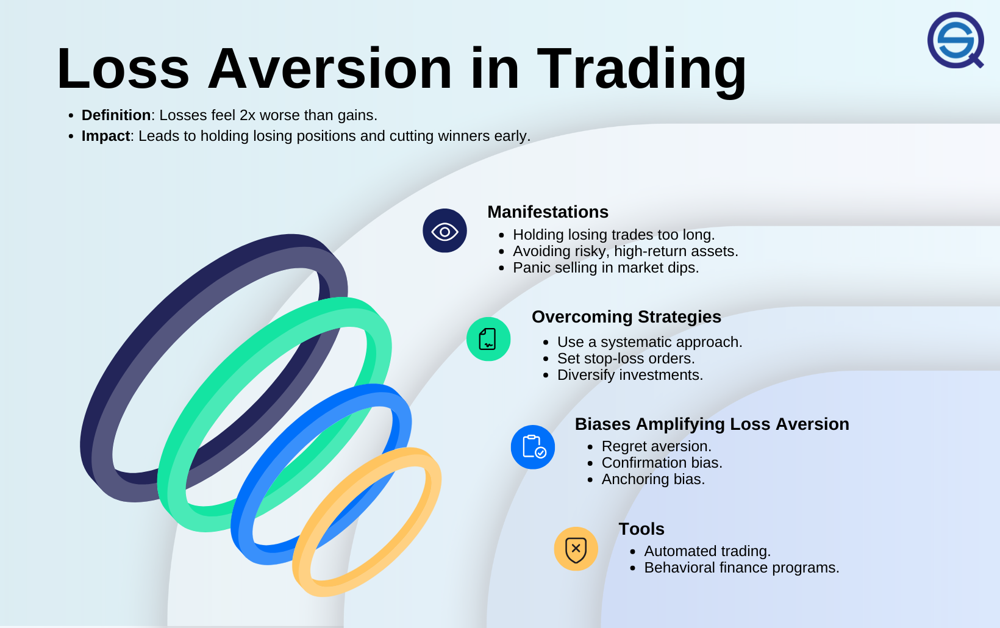

## Table of Contents

## What is loss aversion in the context of trading?

Loss aversion in trading is when people feel the pain of losing money more than the joy of gaining it. Imagine you find a $20 bill on the street. You'd be happy, right? But if you lost $20, you'd probably feel a lot worse. Traders often feel this way too. They might hold onto a losing investment, hoping it will bounce back, instead of selling it and accepting the loss. This is because the fear of losing money can be stronger than the hope of making more.

This behavior can lead to big problems in trading. For example, a trader might keep a stock that's going down, thinking it will go back up. But while they wait, the stock might keep falling, and they could lose even more money. On the other hand, they might sell a winning stock too soon, just to lock in a small profit and avoid any risk of loss. Understanding loss aversion can help traders make better decisions, like setting clear rules for when to sell a losing investment, rather than letting emotions take over.

## How does loss aversion affect trading decisions?

Loss aversion makes traders scared of losing money more than they want to make money. This fear can make them do things that aren't smart. For example, if a trader has a stock that's losing value, they might not sell it because they hope it will go back up. They don't want to accept the loss, even if selling might be the better choice. This can lead to bigger losses if the stock keeps going down.

On the other hand, loss aversion can also make traders sell their winning stocks too soon. They might see a small profit and decide to sell, just to avoid the risk of losing that profit later. This means they might miss out on bigger gains if the stock keeps going up. So, loss aversion can make traders hold onto losing investments too long and sell winning investments too early, which can hurt their overall success in trading.

## Can you explain the psychological impact of loss aversion on traders?

Loss aversion can make traders feel really stressed and anxious. When they see their investments losing money, they might feel a lot of fear and worry. This fear can be so strong that it stops them from making good decisions. Instead of thinking clearly about what to do next, they might just freeze or make choices based on emotion rather than logic. This can lead to them holding onto losing investments for too long, hoping things will get better, even when they might not.

On the flip side, when traders have investments that are doing well, loss aversion can make them too scared to enjoy their wins. They might sell their winning investments too soon, just to lock in a small profit and avoid the risk of losing it later. This fear of loss can stop them from enjoying bigger gains that could come if they held onto their winning investments longer. Overall, loss aversion can create a lot of emotional ups and downs for traders, making it hard for them to stay calm and make smart choices.

## What are some common mistakes traders make due to loss aversion?

One common mistake traders make because of loss aversion is holding onto losing investments for too long. They see the price of a stock going down and hope it will go back up. Instead of selling and accepting a small loss, they wait and wait, hoping things will get better. But often, the stock keeps going down, and their loss gets bigger and bigger. This is because the fear of locking in a loss feels worse than the hope of making it back.

Another mistake is selling winning investments too soon. When a trader sees their stock making a profit, they might get scared of losing that profit. So, they sell the stock early, just to lock in a small gain and avoid any risk. But if they had waited a bit longer, the stock might have gone up even more, and they could have made a bigger profit. Loss aversion makes them too afraid to enjoy their wins fully.

These mistakes show how loss aversion can mess up a trader's decisions. It's all about feeling the pain of loss more than the joy of gain. This fear can lead to holding onto losers and selling winners too soon, which can hurt a trader's overall success in the market.

## How can beginners identify loss aversion in their trading behavior?

Beginners can identify loss aversion in their trading behavior by paying attention to how they feel about their investments. If they find themselves feeling really upset or scared when a stock starts losing money, that's a sign of loss aversion. They might notice that they're holding onto a losing stock longer than they should, hoping it will go back up, instead of selling it and accepting a small loss. This fear of locking in a loss can make them avoid selling, even when it's the smarter choice.

Another way beginners can spot loss aversion is by watching how they handle winning investments. If they sell a stock that's making a profit too quickly, just to avoid the risk of losing that profit later, that's also a sign of loss aversion. They might feel more relief from locking in a small gain than excitement about the potential for bigger gains if they held onto the stock longer. By noticing these patterns in their feelings and actions, beginners can start to see how loss aversion is affecting their trading decisions.

## What are the potential risks of loss aversion in trading?

Loss aversion can make traders hold onto losing investments too long. They might see a stock going down and hope it will go back up. But instead of selling and accepting a small loss, they wait, hoping things will get better. This can lead to bigger losses if the stock keeps falling. The fear of locking in a loss can make them avoid selling, even when it's the smarter choice. This can hurt their overall success in trading because they might lose more money than they need to.

On the other hand, loss aversion can also make traders sell winning investments too soon. When they see a stock making a profit, they might get scared of losing that profit. So, they sell the stock early, just to lock in a small gain and avoid any risk. But if they had waited a bit longer, the stock might have gone up even more, and they could have made a bigger profit. This fear of loss can stop them from enjoying bigger gains that could come if they held onto their winning investments longer. Overall, loss aversion can lead to missed opportunities and bigger losses, which can really hurt a trader's performance in the market.

## What strategies can traders use to mitigate the effects of loss aversion?

One way traders can fight loss aversion is by setting clear rules for when to sell a stock, no matter if it's making money or losing it. They can decide on a specific price where they will sell a stock if it starts losing too much value. This is called a stop-loss order. By setting this rule ahead of time, traders can avoid the fear of locking in a loss and make sure they don't hold onto a losing stock for too long. It's like having a plan that helps them stay calm and not let emotions take over.

Another strategy is to focus on the long term and not get too upset about small losses or gains. Traders can remind themselves that the market goes up and down all the time, and it's normal to have some losses. By looking at the bigger picture, they can see that one bad trade doesn't mean they're bad at trading. This can help them feel less scared about losing money and more willing to take smart risks that could lead to bigger gains over time.

## How can setting stop-loss orders help manage loss aversion?

Setting stop-loss orders can really help traders deal with loss aversion by taking the emotion out of selling a losing stock. When traders set a stop-loss order, they decide on a specific price at which they will sell a stock if it starts losing too much value. This means they don't have to make a tough decision in the heat of the moment when they're feeling scared about losing money. The stop-loss order does the work for them, selling the stock automatically when it hits that price. This can stop traders from holding onto a losing stock for too long, hoping it will go back up, which is a common mistake caused by loss aversion.

By using stop-loss orders, traders can stick to a plan and not let fear control their decisions. This can help them feel more in control and less stressed about their investments. When traders know they have a safety net in place, they might feel more confident to take smart risks and not get too upset about small losses. This way, they can focus on the bigger picture and not let one bad trade mess up their overall success in trading.

## What role does diversification play in combating loss aversion?

Diversification can help traders fight loss aversion by spreading their money across different investments. Instead of putting all their money into one stock, traders can invest in many different stocks or other types of investments like bonds or real estate. This way, if one investment starts losing money, it won't hurt their whole portfolio as much. By having a mix of investments, traders can feel less scared about losing everything on one bad trade. This can help them make better decisions and not hold onto losing investments for too long just because they're afraid of locking in a loss.

When traders diversify, they also give themselves more chances to win. If one stock goes down, another might go up. This balance can make traders feel more comfortable taking smart risks and not selling their winning investments too soon just to avoid any loss. By spreading out their investments, traders can see the bigger picture and not get too upset about small losses. Diversification can help them stay calm and focused on their long-term goals, which is really important for beating loss aversion.

## How can advanced traders use behavioral finance techniques to overcome loss aversion?

Advanced traders can use behavioral finance techniques to overcome loss aversion by understanding and managing their emotions better. One way is by keeping a trading journal where they write down their feelings and decisions. This helps them see patterns in how they react to wins and losses. When they notice they're holding onto losing stocks too long or selling winning stocks too soon, they can start to change these behaviors. By being aware of their emotions, traders can make more rational decisions and stick to their trading plans, even when they feel scared about losing money.

Another technique is using mental accounting, where traders separate their money into different mental "buckets" for different purposes. For example, they might set aside some money just for taking risks, knowing that it's okay if they lose it. This can help them feel less attached to each trade and less afraid of losses. By treating their trading money differently from their savings or daily expenses, traders can reduce the emotional impact of losses and focus on making smart trading decisions based on logic, not fear.

## Can you discuss any case studies or real-world examples where loss aversion significantly impacted trading outcomes?

One famous example of loss aversion affecting trading outcomes is the story of Long-Term Capital Management (LTCM). In the late 1990s, LTCM was a [hedge fund](/wiki/hedge-fund-trading-strategies) run by some very smart people, including Nobel Prize winners. They used complex math to make trades, but when things started going wrong, loss aversion kicked in. Instead of cutting their losses, they kept holding onto their losing positions, hoping the market would turn around. This made their losses even bigger, and in 1998, LTCM nearly collapsed. It was a big lesson on how even the smartest traders can make bad decisions because of the fear of losing money.

Another example is the dot-com bubble of the late 1990s and early 2000s. Many investors got caught up in the excitement of internet companies and bought stocks at very high prices. When the bubble started to burst, loss aversion made many of them hold onto their stocks, hoping they would go back up. Instead of selling and accepting a loss, they watched their investments lose more and more value. This led to huge losses for many people. It shows how loss aversion can make traders stick with losing investments too long, hoping for a turnaround that might never come.

## What are the latest research findings on loss aversion and how they can be applied to trading strategies?

Recent research on loss aversion has shown that people feel the pain of losing money about twice as much as the joy of gaining it. This means that traders often make decisions based on fear rather than logic. A study from 2021 by researchers at the University of Chicago found that when traders are aware of their loss aversion, they can use tools like stop-loss orders more effectively. This helps them sell losing investments before they get worse, instead of holding onto them out of hope. By understanding how strong their fear of loss is, traders can set clearer rules for themselves and stick to their trading plans better.

Another important finding from recent research is that loss aversion can be reduced by framing decisions differently. A 2022 study from Stanford University showed that when traders think about their investments in terms of long-term goals rather than short-term gains or losses, they are less likely to let loss aversion affect their decisions. For example, instead of focusing on the immediate loss from selling a stock, traders can think about how selling it fits into their overall investment strategy. This can help them feel less scared about locking in a loss and more focused on making smart moves that will help them succeed in the long run. By applying these findings, traders can create strategies that help them manage their emotions and make better trading decisions.

## References & Further Reading

[1]: Kahneman, D., & Tversky, A. (1979). ["Prospect Theory: An Analysis of Decision under Risk."](http://web.mit.edu/curhan/www/docs/Articles/15341_Readings/Behavioral_Decision_Theory/Kahneman_Tversky_1979_Prospect_theory.pdf) Econometrica, 47(2), 263-291.

[2]: Thaler, R. H. (1980). ["Toward a Positive Theory of Consumer Choice."](https://www.sciencedirect.com/science/article/pii/0167268180900517) Journal of Economic Behavior & Organization.

[3]: Barberis, N., & Huang, M. (2001). ["Mental Accounting, Loss Aversion, and Individual Stock Returns."](https://onlinelibrary.wiley.com/doi/full/10.1111/0022-1082.00367) The Review of Financial Studies, 15(4), 1203-1230.

[4]: Odean, T. (1998). ["Are Investors Reluctant to Realize Their Losses?"](https://onlinelibrary.wiley.com/doi/full/10.1111/0022-1082.00072) The Journal of Finance, 53(5), 1775-1798.

[5]: Lo, A. W., & MacKinlay, A. C. (1997). ["The Econometrics of Financial Markets."](https://www.researchgate.net/publication/23775223_The_Econometrics_of_Financial_Market) Princeton University Press.

[6]: Tetlock, P. C. (2007). ["Giving Content to Investor Sentiment: The Role of Media in the Stock Market."](https://onlinelibrary.wiley.com/doi/abs/10.1111/j.1540-6261.2007.01232.x) The Journal of Finance, 62(3), 1139-1168.

[7]: Kissell, R. (2014). ["The Science of Algorithmic Trading and Portfolio Management."](https://www.sciencedirect.com/book/9780124016897/the-science-of-algorithmic-trading-and-portfolio-management) Academic Press.

[8]: Montier, J. (2007). ["Behavioral Investing: A Practitioner's Guide to Applying Behavioral Finance."](https://onlinelibrary.wiley.com/doi/book/10.1002/9781118673430) John Wiley & Sons.

