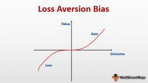

In the fast-paced world of algorithmic trading, understanding psychological biases is crucial. Algorithmic trading relies heavily on the precision and objectivity of mathematical models and computational algorithms to execute trades at speeds and frequencies that are beyond human capability. Despite the seemingly emotionless nature of algorithms, the initial programming and ongoing management of these systems are subject to human influences, particularly psychological biases. One such bias that significantly impacts trading decisions is loss aversion. Loss aversion refers to the tendency of traders to fear potential losses more intensely than they appreciate equivalent gains, a concept extensively explored by psychologists Amos Tversky and Daniel Kahneman. This bias can lead traders to make decisions that prioritize minimizing losses over maximizing gains, often to their detriment.

Loss aversion manifests itself in various ways in algorithmic trading. Traders and developers might program algorithms in a way that overly prioritizes risk avoidance, potentially missing out on significant profit opportunities. This fear of loss may also result in premature exits from profitable trades or adherence to losing positions in the hope of a market turnaround, both of which can negatively affect overall trading performance.

This article will explore how loss aversion affects algorithmic trading, discuss its impacts, and suggest ways for traders to effectively manage and overcome it. By understanding the influence of loss aversion and employing strategic approaches to mitigate its effects, traders can enhance both their decision-making processes and financial outcomes. We will also highlight practical strategies and tools that can help mitigate the negative effects of this bias, ensuring a more disciplined and objective trading strategy.

## Table of Contents

## Understanding Loss Aversion in Trading

Loss aversion is a psychological concept first introduced by psychologists Amos Tversky and Daniel Kahneman as part of their seminal work on prospect theory. It describes an inherent bias where individuals experience the pain of losses more intensely than the pleasure of equivalent gains. This cognitive bias can significantly impact decision-making processes, especially in trading environments where emotions and psychological factors play crucial roles.

In trading, loss aversion manifests itself in several ways, primarily by influencing traders to hold onto losing positions longer than is rational, in the hope of an eventual rebound. This behavior often leads to increased losses as traders resist realizing a loss, instead choosing to endure potential further declines in value. Conversely, the same bias causes traders to prematurely close out winning positions to secure gains swiftly, even when market conditions suggest that further profits could be realized. This results from the disproportionately higher emotional impact of potential losses compared to gains, prompting a cautious or overly defensive trading strategy.

The behavior driven by loss aversion can conflict with optimal trading strategies, often leading to decisions that fail to maximize returns. The psychological weight of potential losses may prompt reactions that are contrary to a well-reasoned strategy, as the aversion to loss overshadows logical assessment of risk and reward. Understanding these dynamics can be crucial for traders aiming to enhance their decision-making processes and optimize their trading performance. Addressing this bias involves recognizing its existence and implementing strategies to minimize its impact, such as adopting more disciplined decision-making frameworks and mitigating emotional influences on trading actions.

## Impact of Loss Aversion on Algorithmic Trading

Loss aversion significantly impacts [algorithmic trading](/wiki/algorithmic-trading) by prompting decisions that prioritize avoiding losses over securing potential profits, leading to suboptimal performance. This bias causes traders and algorithm developers to excessively focus on loss prevention. In practice, this means algorithms are often adjusted to trigger protective measures prematurely. Consequently, these algorithms may [exit](/wiki/exit-strategy) potentially profitable trades too early or fail to capitalize on favorable market conditions, thus impairing the overall profitability of trading strategies.

Furthermore, loss aversion exacerbates market [volatility](/wiki/volatility-trading-strategies) during uncertain periods. Traders may panic sell upon encountering initial losses, intensifying market downturns due to the collective behavior of multiple traders and algorithms acting simultaneously. Conversely, there may be a reluctance to liquidate loss-making positions in the hope that the market will rebound, resulting in increased exposure to financial risk.

For example, consider an algorithm designed to trade based on quantitative signals like moving averages. Due to loss aversion, developers may modify the algorithm to incorporate tighter stop-loss thresholds than necessary, potentially leading to premature trade exits. These adjustments reflect an attempt to avoid losses at the expense of missing out on future gains. This practice is particularly detrimental during periods of market volatility when prices fluctuate significantly before settling into a trend, as overly conservative algorithms may fail to capitalize on these trends completely. 

Mathematically, this aversion can be expressed in the application of utility functions. A common representation is:

$$
U(x) = \begin{cases} 
  x^\alpha, & x \geq 0 \\
  -\lambda (-x)^\beta, & x < 0 
\end{cases}
$$

where $\lambda > 1$ indicates loss aversion, and $\alpha$ and $\beta$ are parameters defining the sensitivity to gains and losses, respectively. In this context, $\lambda$ quantifies the disproportional impact of losses versus gains, affecting how algorithms are tuned for trading decisions.

In summary, loss aversion compels algorithmic traders to adopt excessively cautious strategies, negatively affecting potential profitability and contributing to market volatility through aggregated trading actions. This highlights the importance of recognizing and mitigating loss aversion's impact in the design and operation of trading algorithms.

## Examples of Loss Aversion in Algo Trading

Loss aversion is a significant psychological bias that influences trading behavior, even in algorithmic trading. It often manifests as holding onto losing positions due to the hope that the market will turn around. This behavior can be detrimental in algorithmic systems where the speed and objectivity of decision-making are essential. The tendency to hold losing positions stems from an emotional resistance to realizing losses, a key feature of loss aversion, which posits that losses are felt more intensely than equivalent gains. This results in traders or their algorithms taking unnecessary risks by waiting for a turnaround rather than cutting losses and reallocating resources more efficiently.

Another example of loss aversion in algo trading is the avoidance of high-risk, high-reward strategies, even when the data suggests favorable outcomes. This cautious approach leads to missed opportunities for potential profits. Algorithms, influenced by human bias in their development, may be programmed to prioritize loss avoidance over profit maximization. This conservative stance can result in suboptimal performance, as the algorithms may eschew opportunities that [carry](/wiki/carry-trading) perceived risks but also hold the potential for significant gains.

Furthermore, excessive adjustments to algorithms to make them overly conservative is another manifestation of loss aversion. Traders might continuously tweak their algorithms to avoid potential losses, thereby restricting their ability to capitalize on positive market movements. By focusing primarily on avoiding losses, traders limit the algorithm's capacity to learn and adapt to different market conditions, which can hinder long-term profitability.

The conservative adjustment of algorithms can be understood through a simple example: consider an algorithm designed to enter a market position when certain favorable conditions are met. If loss aversion causes developers to adjust the algorithm's parameters excessively, it may result in a much narrower entry point, missing out on potentially profitable trades. This is akin to increasing the width of a roadblock on a trading path, where the increased security may hamper the system's efficacy in capturing favorable market movements.

Addressing these tendencies requires a balance between analytical rigor and acknowledgment of psychological influence on trading strategies. Recognizing and mitigating loss aversion can lead to better-aligned algorithmic systems that evaluate risk and reward objectively rather than emotionally.

## Overcoming Loss Aversion in Algo Trading

To mitigate the impact of loss aversion in algorithmic trading, implementing a systematic, rule-based trading strategy is essential. Such a framework reduces emotional biases, fostering more rational decision-making processes. A structured approach involves defining precise entry and exit rules based on quantitative data rather than subjective judgment. This prevents traders from making impulsive decisions influenced by fear of loss.

Automated stop-loss orders are a crucial tool in managing loss aversion. These orders automatically sell a security when it reaches a predefined price, limiting potential losses without requiring human intervention. By predetermining loss thresholds, traders can prevent their strategies from being swayed by emotions during market fluctuations. The automated nature of stop-loss orders ensures that decision-making remains consistent and grounded in pre-established rules, rather than being reactive to temporary market emotions.

Regular performance reviews are another vital aspect of overcoming loss aversion. These reviews involve systematically analyzing trading outcomes to identify patterns that may indicate emotional interference. By using statistical tools and metrics, traders can objectively assess whether their strategies are being adversely affected by biases such as loss aversion. For instance, evaluating metrics like the Sharpe ratio or maximum drawdown can highlight the efficiency and risk profiles of trading strategies. If data reveals suboptimal performance, it may signal the need for strategy adjustments or a reevaluation of trading rules.

Incorporating strategies that counteract emotional biases in algorithmic trading ensures more balanced decision-making, leading to improved trading outcomes. By systematically implementing rule-based strategies, employing automated stop-loss orders, and regularly reviewing performance, traders can effectively address and mitigate the adverse effects of loss aversion.

## Role of Cognitive Biases in Loss Aversion

Loss aversion, a fundamental concept in behavioral finance, is intrinsically linked to various cognitive biases that further complicate trading decisions. Two of the most significant biases that exacerbate loss aversion are confirmation bias and anchoring.

Confirmation bias refers to the tendency of traders to favor information that confirms their pre-existing beliefs while disregarding contradictory evidence. This can lead to reinforcing loss-averse behaviors such as sticking with losing positions because the trader selectively acknowledges information that suggests a potential turnaround, ignoring more reliable data indicating further declines. For example, if a trader holds a biased belief that a particular stock will recover despite negative indicators, they may overlook crucial data that suggests selling would be the best option.

Anchoring bias, another cognitive pitfall, occurs when traders fixate on specific reference points, such as initial stock prices or a particular index value, to their detriment. This fixation can result in irrational trading decisions driven by the initial anchor rather than objective market conditions. In algorithmic trading, anchoring can manifest in a reluctance to adjust parameters or strategies because of a psychological attachment to historically set values. This resistance to change can prevent traders from seizing opportunities or minimizing losses in an evolving market landscape.

Recognizing and understanding these biases can substantially aid traders in refining their strategies. Awareness of how confirmation bias and anchoring bias compound loss aversion allows traders to actively counter these tendencies. For instance, using a systematic review process to assess all relevant information objectively can mitigate the effects of confirmation bias. Similarly, regularly updating trading algorithms and benchmarks based on current data rather than historical anchors can reduce the impact of anchoring.

Additionally, traders can benefit from behavioral finance insights that highlight patterns of irrational decision-making. By leveraging these insights, traders can identify when their decisions are swayed by cognitive biases instead of rational analysis. Techniques such as scenario analysis, where varied potential outcomes are considered without reliance on preconceived notions, can provide a balanced perspective.

In conclusion, while loss aversion poses challenges to traders, understanding the role of cognitive biases in its manifestation presents opportunities for improvement. Through vigilant recognition and strategic adjustments, traders can mitigate these biases, enhancing their decision-making processes and contributing to more rational and potentially profitable trading outcomes.

## Tools and Techniques for Mitigating Loss Aversion

Automated trading systems play a crucial role in mitigating loss aversion by minimizing emotional interference and ensuring consistency in trading decisions. These systems operate on pre-defined rules and algorithms, allowing trades to be executed without the influence of psychological biases like fear or greed. By automatically entering and exiting trades based on specific criteria, they help traders adhere to their strategies, regardless of market conditions. For instance, stop-loss and take-profit orders can be predefined, ensuring that trades are closed at predetermined points, thus limiting losses and securing profits without human intervention.

Behavioral finance programs are instrumental in equipping traders with strategies to understand and counteract psychological biases. These programs focus on the underlying psychological and emotional factors that influence decision-making in financial markets. By providing insights into common cognitive biases, such as confirmation bias and anchoring, these programs help traders recognize and adjust for the impact of loss aversion in their trading practices. Tools such as simulations and bias detection software can also provide practical assistance in learning how to navigate these biases effectively.

Regular performance evaluations are vital to ensure trading decisions remain objective and are not clouded by emotions like loss aversion. Through consistent and structured reviews of trading performance, traders can assess the effectiveness of their strategies, identify patterns of bias, and make necessary adjustments. The process typically involves analyzing trade outcomes relative to the original trading plan and benchmarking results against historical performance data. Regular evaluations can identify deviations from strategy due to psychological factors and facilitate data-driven adjustments to trading protocols. By maintaining a disciplined approach to performance monitoring, traders can develop a more robust understanding of their tendencies toward loss aversion, ultimately leading to more rational and effective trading decisions.

## The Importance of Emotional Discipline in Trading

Emotional discipline is a critical attribute for traders aiming to sustain objectivity and make rational decisions under the pressure of dynamic market conditions. This trait allows traders to control their emotional responses, which can often lead to irrational actions like panic selling or holding onto losing positions with the hope of a rebound.

Building emotional resilience is crucial for navigating the inherent psychological challenges in trading. Resilience enables traders to recover swiftly from setbacks and maintain a balanced perspective, reducing the influence of stress-induced errors. To cultivate this resilience, traders should focus on continuous learning, adaptability, and maintaining a positive outlook, despite the uncertainty and volatility that characterize financial markets.

Mindfulness practices can significantly enhance a trader's focus and performance. Mindfulness involves being fully present and aware of one's thoughts, emotions, and sensations, which helps in reducing emotional reactivity. Techniques such as meditation and deep breathing exercises can ground traders, enabling them to approach trading decisions with greater clarity and calmness. 

Stress management techniques are equally vital in promoting emotional discipline. Regular physical exercise, adequate rest, and a healthy work-life balance are foundational in managing stress levels. By incorporating these strategies into their routines, traders can improve their mental resilience, thereby enhancing their decision-making capabilities and overall trading performance.

## Conclusion

Loss aversion represents a significant psychological challenge in trading, skewing decision-making processes toward a preference for avoiding losses rather than achieving gains. This ingrained bias can distort trading performance, leading to suboptimal decisions that jeopardize profitability. However, awareness and strategic intervention can mitigate its impact.

Implementing systematic strategies is essential to counteract loss aversion. Developing rule-based trading plans, which include predefined entry and exit points, can uphold discipline and minimize emotional decision-making. Acknowledging the presence of cognitive biases allows traders to remain vigilant, identifying when these biases might be influencing their actions and adjusting their strategies accordingly. Through regular performance reviews, traders can ensure their trading strategies remain aligned with their objectives, untarnished by emotional biases.

In the algorithmic trading sphere, blending human insight with algorithmic precision is paramount. Algorithms can efficiently process vast amounts of data and execute trades devoid of emotional interference. Yet, the human element is crucial in refining these algorithms, recognizing market nuances, and adapting strategies to evolving market conditions. This balance ensures that trading decisions not only leverage computational efficiency but also incorporate the adaptability and foresight that human insight provides.

Ultimately, successful trading involves a harmonious integration of disciplined strategy application and an acute awareness of cognitive biases. By managing loss aversion effectively, traders can enhance their decision-making processes, leading to more consistent and profitable trading outcomes.

## Frequently Asked Questions

**What is loss aversion in trading?**

Loss aversion in trading refers to the tendency for traders to place more weight on the fear of losses than on the potential for equivalent gains. This cognitive bias means that the pain associated with losing a sum of money is generally more intense than the pleasure derived from gaining the same amount. This can lead to irrational decision-making, where traders might hold losing positions longer hoping for a reversal, or sell winning trades prematurely to lock in gains, essentially curbing potential profitability.

**How can one differentiate between risk aversion and loss aversion?**

Risk aversion and loss aversion are related but distinct concepts in trading psychology. Risk aversion is the inclination to prefer certain outcomes over uncertain ones, typically favoring safer bets even if they offer lower returns. Loss aversion, on the other hand, specifically refers to the preference for avoiding losses rather than acquiring gains of the same magnitude. While a risk-averse trader may avoid high-risk trades altogether, a loss-averse trader reacts emotionally to losses, often leading to suboptimal trading decisions.

**What behaviors signify loss aversion in trading?**

Several behaviors are indicative of loss aversion in trading:

1. **Holding onto losing positions:** Traders may hold their losing stocks too long, expecting the market to rebound, thus leading to larger losses.

2. **Premature selling of winning positions:** Traders frequently sell winning assets early to lock in profits, adversely impacting potential gains.

3. **Avoidance of high-risk potential gains:** Despite supporting data, traders shy away from strategies that could potentially result in high returns due to fear of probable losses.

4. **Over-adjusting algorithms:** Traders might modify algorithms to be overly conservative, prioritizing avoidance of losses over optimizing potential gains.

**How do automated trading systems help in managing loss aversion?**

Automated trading systems can mitigate loss aversion by minimizing emotional involvement in trading decisions. These systems operate based on predefined criteria and data analytics, executing trades without the influence of psychological biases. Through features like automated stop-loss orders, they limit potential losses objectively, ensuring that trading strategies remain consistent with planned risk management approaches. Moreover, these systems can be programmed to stick to systematic, rule-based strategies that help counter emotional biases, maintaining a focus on long-term profit objectives rather than short-term emotional relief.

**Can mindfulness improve trading outcomes?**

Yes, mindfulness can indeed improve trading outcomes. Mindfulness practices enhance emotional discipline, allowing traders to remain focused and resilient when faced with the psychological pressures of trading. By fostering a state of awareness and presence, mindfulness helps reduce the reactive nature of emotional biases like loss aversion. This improved mental clarity can lead to more objective and rational decision-making processes. Furthermore, incorporating stress management techniques and mindfulness into trading routines could improve concentration and performance, thereby positively affecting overall trading success.

## References & Further Reading

[1]: Kahneman, D., & Tversky, A. (1979). ["Prospect Theory: An Analysis of Decision under Risk."](http://web.mit.edu/curhan/www/docs/Articles/15341_Readings/Behavioral_Decision_Theory/Kahneman_Tversky_1979_Prospect_theory.pdf) Econometrica, 47(2), 263–291.

[2]: Barberis, N., & Thaler, R. (2003). ["A Survey of Behavioral Finance."](https://www.nber.org/papers/w9222) In Handbook of the Economics of Finance.

[3]: Thaler, R. H. (1999). ["Mental Accounting Matters."](https://onlinelibrary.wiley.com/doi/abs/10.1002/%28SICI%291099-0771%28199909%2912%3A3%3C183%3A%3AAID-BDM318%3E3.0.CO%3B2-F) Journal of Behavioral Decision Making, 12(3), 183-206.

[4]: Odean, T. (1998). ["Are Investors Reluctant to Realize Their Losses?"](https://onlinelibrary.wiley.com/doi/full/10.1111/0022-1082.00072) Journal of Finance, 53(5), 1775-1798.

[5]: Prelec, D., & Loewenstein, G. (1998). ["The Red and the Black: Mental Accounting of Savings and Debt."](https://psycnet.apa.org/record/2012-29016-001) Marketing Science, 17(1), 4-28.