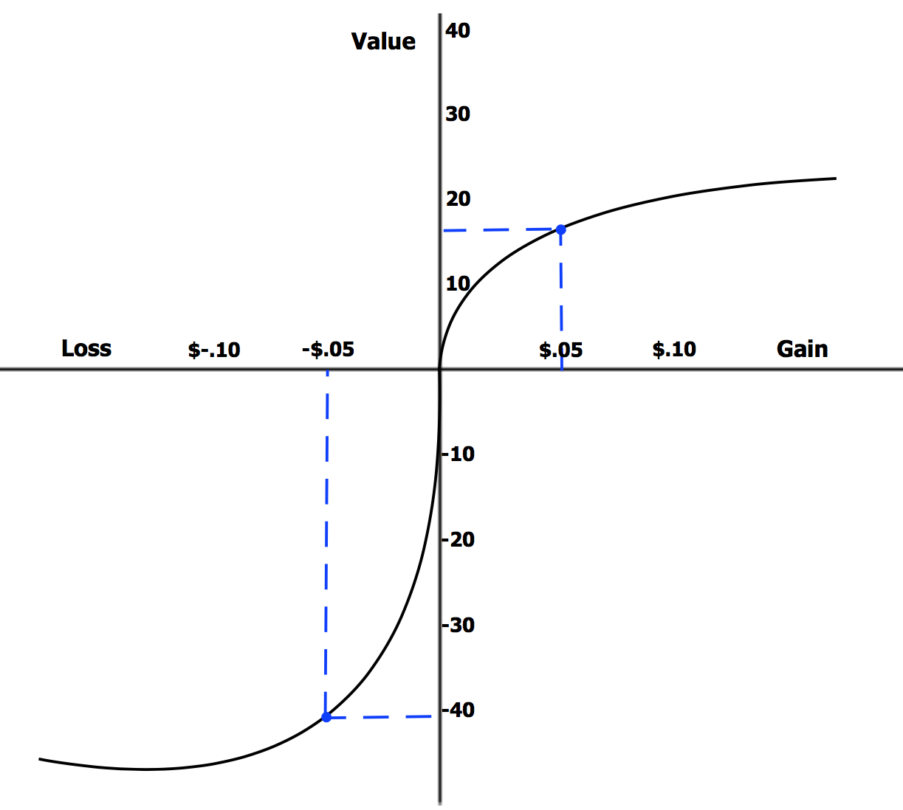

## Table of Contents

## What is loss aversion?

Loss aversion is a concept in psychology and economics that explains why people feel the pain of losing something more strongly than the pleasure of gaining something of equal value. For example, losing $10 feels worse than the happiness of finding $10. This tendency can influence the decisions people make, often leading them to avoid risks even if there's a chance for a big reward.

This behavior is seen in many everyday situations. For instance, someone might stick with a job they don't like because they fear losing their steady income, even if there's a chance to get a better job. Understanding loss aversion can help people make better choices by recognizing when fear of loss is holding them back from potentially beneficial opportunities.

## How does loss aversion affect decision-making?

Loss aversion can make people scared to take risks. When they think about losing something, it feels much worse than the happiness of gaining something new. This fear can stop people from trying new things or making changes. For example, someone might not switch to a new job even if it could be better, because they're scared of losing their current job.

This fear of loss can also make people keep things they don't need. They might hold onto old clothes or keep money in a savings account with low interest, just because they're afraid of losing what they have. Understanding loss aversion can help people see when they're being too cautious and maybe take a chance on something good.

## Can you provide examples of loss aversion in everyday life?

Loss aversion can show up when people shop. Imagine someone sees a shirt on sale for $20, but they don't buy it because they're worried they might find it cheaper later. They might end up not buying the shirt at all, even if the $20 price was a good deal. This happens because the fear of losing money by paying more than necessary feels worse than the joy of getting a new shirt.

It also affects how people invest money. Someone might keep their money in a savings account with low interest because they're scared of losing money in the stock market. Even if the stock market could give them more money over time, the fear of losing any money at all makes them choose the safe option. This is loss aversion at work, making people miss out on potential gains because they're too focused on avoiding losses.

## What is the psychological basis for loss aversion?

Loss aversion comes from how our brains work. It's like a safety system that makes us feel bad when we lose something. This feeling is stronger than the good feeling we get when we gain something. Scientists think this happens because, long ago, losing things like food or shelter could be dangerous. So, our brains learned to be really careful about losing stuff to keep us safe.

This strong feeling of loss makes us act in certain ways. For example, we might not want to sell a stock that's losing value because we hope it will go back up. We're more scared of losing the money we already put in than we are excited about making more money. This is why understanding loss aversion can help us see when we're being too careful and maybe take a chance on something good.

## How is loss aversion measured?

Loss aversion is measured by looking at how much more people hate losing compared to how much they like winning. Scientists use experiments where they ask people to choose between taking a risk or playing it safe. For example, they might ask if someone would rather take a chance to win $100 or definitely get $50. By seeing how often people choose the safe option, researchers can figure out how strong their loss aversion is.

In these experiments, they often use something called the "loss aversion coefficient." This number shows how many times bigger the feeling of loss is compared to the feeling of gain. If someone feels losing $10 is as bad as not gaining $20, their loss aversion coefficient would be 2. This helps scientists understand how loss aversion affects different people and situations.

## What are the evolutionary reasons behind loss aversion?

Loss aversion comes from how humans evolved. A long time ago, losing something important like food or a safe place to live could mean big trouble. It could even mean not surviving. So, our brains learned to really hate losing things. This strong feeling helped our ancestors stay safe and make sure they had what they needed to live.

Today, even though we don't face the same dangers, our brains still work the same way. We feel the pain of losing something much more than the joy of gaining something new. This can make us act carefully, sometimes too carefully, because our brains are still trying to protect us from losing important things.

## How does loss aversion impact economic behavior?

Loss aversion makes people careful with money. They might not want to invest in the stock market because they're scared of losing money. Even if the stock market could help them earn more money over time, the fear of losing what they already have is stronger. This can make people keep their money in safe places like savings accounts, even if those places don't give them much money back.

This fear also affects how people shop. Someone might not buy something on sale because they worry they'll find it cheaper later. They might miss out on a good deal because the fear of losing money by paying too much feels worse than the happiness of getting something new. Understanding loss aversion can help people see when they're being too careful and maybe take a chance on something good.

## What are the implications of loss aversion in marketing strategies?

Loss aversion can change how companies sell things. They might use special deals like "buy one, get one free" or "money-back guarantees" to make people feel less scared about losing money. These deals make people think they won't lose anything if they try the product. This can make more people want to buy it because they feel safer.

Companies also use loss aversion to make people act fast. They might say things like "limited time offer" or "while supplies last" to make people worry about missing out. This fear of losing the chance to get a good deal can make people buy things quicker than they normally would. By understanding how loss aversion works, companies can make their marketing better and sell more products.

## How can loss aversion be mitigated or managed in personal finance?

To manage loss aversion in personal finance, people can start by understanding how it affects their choices. They should think about why they're scared to invest or try something new. It's helpful to remember that while losing money feels bad, not trying something could mean missing out on good chances to make more money. Setting clear financial goals can also help. For example, if someone wants to buy a house, they might be more willing to take a little risk in the stock market to reach that goal faster.

Another way to handle loss aversion is to slowly get used to taking small risks. Someone could start by putting a little bit of money into different investments and see what happens. This can help them feel less scared over time. It's also good to talk to a financial advisor who can give advice based on what the person wants to achieve. By taking these steps, people can make better choices and not let the fear of losing money stop them from growing their savings.

## What role does loss aversion play in investment decisions?

Loss aversion makes people scared to invest their money. They might keep their money in a savings account even if it doesn't grow much because they're afraid of losing money in the stock market. This fear can make them miss out on chances to earn more money over time. For example, someone might not buy stocks because they're worried about losing the money they put in, even if those stocks could go up in value and help them reach their financial goals faster.

Understanding loss aversion can help people make better investment choices. They can start by thinking about their long-term goals, like saving for a house or retirement. By setting clear goals, people might feel more comfortable taking some risks. They can also try investing small amounts at first to get used to the idea. Talking to a financial advisor can also help them make smarter decisions and not let the fear of losing money hold them back from growing their savings.

## How does loss aversion influence public policy and government decisions?

Loss aversion can change how governments make rules and plans. Leaders might be scared to try new ideas because they worry about losing votes or money. For example, a government might not want to start a new health program because they're afraid it won't work and they'll lose money. This fear can make them stick with old ways of doing things, even if new ideas could help people more.

This fear also affects how governments talk to people. They might use warnings about what could be lost if people don't follow certain rules. For instance, a government might tell people to save energy by saying they'll lose money if they don't. By understanding loss aversion, governments can make better choices and help people see the good things that could happen if they try something new.

## What are the latest research findings on loss aversion and its variations across cultures?

Recent research shows that loss aversion can be different in different cultures. For example, studies have found that people in some Asian cultures might feel loss aversion more strongly than people in Western cultures. This could be because of how these cultures teach their people to think about risk and money. In collectivist cultures, where people think more about the group than themselves, the fear of losing something might be bigger because it could affect the whole group, not just one person.

Scientists have also learned that the way loss aversion works can change depending on what people are used to. In places where people often face big changes or risks, like in some developing countries, they might be less scared of losing things. This is because they're used to dealing with uncertainty. On the other hand, in places where life is more stable, people might feel loss aversion more strongly because they're not used to big changes. Understanding these differences can help make better plans and rules that fit different cultures.

## What is the impact of loss aversion on algorithmic trading?

Loss aversion significantly impacts [algorithmic trading](/wiki/algorithmic-trading) by prompting decisions that prioritize avoiding losses over securing potential profits, leading to suboptimal performance. This bias causes traders and algorithm developers to excessively focus on loss prevention. In practice, this means algorithms are often adjusted to trigger protective measures prematurely. Consequently, these algorithms may [exit](/wiki/exit-strategy) potentially profitable trades too early or fail to capitalize on favorable market conditions, thus impairing the overall profitability of trading strategies.

Furthermore, loss aversion exacerbates market [volatility](/wiki/volatility-trading-strategies) during uncertain periods. Traders may panic sell upon encountering initial losses, intensifying market downturns due to the collective behavior of multiple traders and algorithms acting simultaneously. Conversely, there may be a reluctance to liquidate loss-making positions in the hope that the market will rebound, resulting in increased exposure to financial risk.

For example, consider an algorithm designed to trade based on quantitative signals like moving averages. Due to loss aversion, developers may modify the algorithm to incorporate tighter stop-loss thresholds than necessary, potentially leading to premature trade exits. These adjustments reflect an attempt to avoid losses at the expense of missing out on future gains. This practice is particularly detrimental during periods of market volatility when prices fluctuate significantly before settling into a trend, as overly conservative algorithms may fail to capitalize on these trends completely. 

Mathematically, this aversion can be expressed in the application of utility functions. A common representation is:

$$
U(x) = \begin{cases} 
  x^\alpha, & x \geq 0 \\
  -\lambda (-x)^\beta, & x < 0 
\end{cases}
$$

where $\lambda > 1$ indicates loss aversion, and $\alpha$ and $\beta$ are parameters defining the sensitivity to gains and losses, respectively. In this context, $\lambda$ quantifies the disproportional impact of losses versus gains, affecting how algorithms are tuned for trading decisions.

In summary, loss aversion compels algorithmic traders to adopt excessively cautious strategies, negatively affecting potential profitability and contributing to market volatility through aggregated trading actions. This highlights the importance of recognizing and mitigating loss aversion's impact in the design and operation of trading algorithms.

## References & Further Reading

[1]: Kahneman, D., & Tversky, A. (1979). ["Prospect Theory: An Analysis of Decision under Risk."](http://web.mit.edu/curhan/www/docs/Articles/15341_Readings/Behavioral_Decision_Theory/Kahneman_Tversky_1979_Prospect_theory.pdf) Econometrica, 47(2), 263–291.

[2]: Barberis, N., & Thaler, R. (2003). ["A Survey of Behavioral Finance."](https://www.nber.org/papers/w9222) In Handbook of the Economics of Finance.

[3]: Thaler, R. H. (1999). ["Mental Accounting Matters."](https://onlinelibrary.wiley.com/doi/abs/10.1002/%28SICI%291099-0771%28199909%2912%3A3%3C183%3A%3AAID-BDM318%3E3.0.CO%3B2-F) Journal of Behavioral Decision Making, 12(3), 183-206.

[4]: Odean, T. (1998). ["Are Investors Reluctant to Realize Their Losses?"](https://onlinelibrary.wiley.com/doi/full/10.1111/0022-1082.00072) Journal of Finance, 53(5), 1775-1798.

[5]: Prelec, D., & Loewenstein, G. (1998). ["The Red and the Black: Mental Accounting of Savings and Debt."](https://psycnet.apa.org/record/2012-29016-001) Marketing Science, 17(1), 4-28.