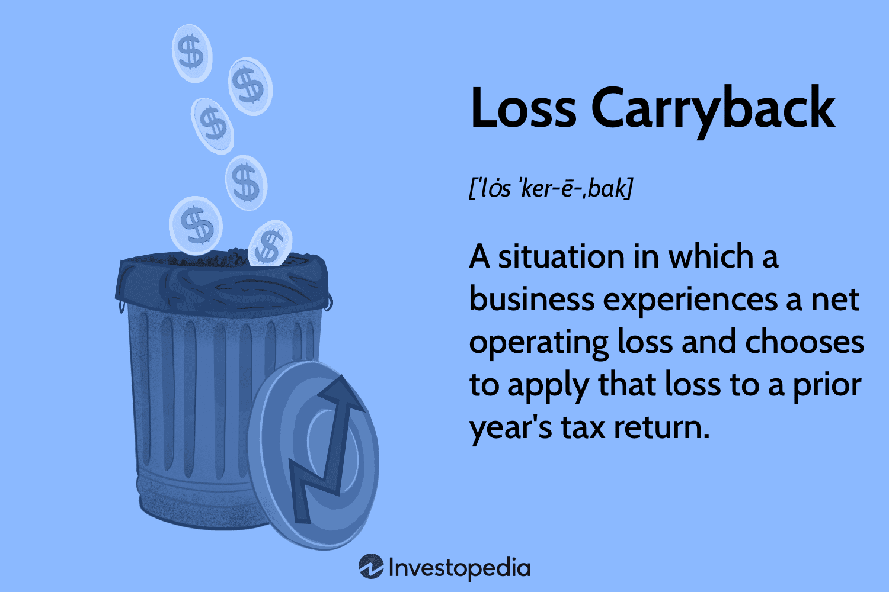

In finance, strategies that optimize tax efficiency and trading results are highly sought after. The convergence of loss carryback strategies, financial history analysis, tax planning, and algorithmic trading presents a comprehensive approach to maximize financial gains. This article explores the synergy between these financial strategies and technologies, providing insights into achieving optimal financial performance.

Loss carryback strategies, historically rooted in tax codes, allow businesses to apply current net operating losses to previous fiscal years, offering immediate tax relief and liquidity. This tax strategy, dating back to the Revenue Act of 1918, was initially devised to aid businesses impacted by unpredictable economic environments, such as those caused by war. Today, its relevance is amplified when analyzed alongside modern algorithmic trading, which automates trading decisions based on rigorous data analytics and pre-set rules.



Financial history analysis provides the necessary historical context and statistical evidence to support these strategic decisions. By examining past market behaviors and the effectiveness of various financial maneuvers, businesses can better predict future trends and align their strategies accordingly. This historical perspective is especially crucial when integrating traditional tax strategies, like loss carrybacks, with innovative approaches in trading and investment.

Algorithmic trading, leveraging advanced computing power and sophisticated algorithms, enhances these financial strategies by ensuring precise and timely execution. The role of algorithm-driven models in maximizing returns is increasingly pivotal, as these systems can process vast amounts of data much faster than a human trader. They can implement complex financial strategies, including tax loss harvesting and other tax-optimized trading methods, efficiently.

In conclusion, these integrated strategies represent the evolution of financial management, where historical tax tactics meet advanced technological solutions, forming a robust framework for maximizing financial performance. By understanding and applying these convergent strategies, businesses and investors can navigate the complexities of modern finance with greater confidence and effectiveness.

## Table of Contents

## Understanding Loss Carryback and Its Historical Significance

Loss carryback is a financial concept that permits businesses to apply a net operating loss (NOL) retrospectively to past tax years, allowing them to receive tax refunds for taxes previously paid. This strategy serves as an important fiscal tool, especially during challenging economic periods, by providing companies with immediate liquidity.

The inception of loss carryback traces back to the Revenue Act of 1918 in the United States. This legislative measure was aimed at aiding businesses that experienced fluctuating incomes due to war-related economic shifts. By allowing companies to offset current losses against profits from previous years, the Revenue Act sought to stabilize businesses adversely affected by abrupt economic changes post-World War I. It was especially beneficial for industries facing sudden demand reductions due to the cessation of wartime production.

Over the decades, the provisions surrounding loss carryback have evolved significantly, shaped by various factors such as economic needs, fiscal policies, and legislative amendments. Initially, the carryback period was limited, with provisions allowing a carryback of losses to the preceding one or two years. However, during periods of economic downturn or crisis, such as the Great Depression and subsequent recessions, carryback periods were temporarily extended to provide broader relief to struggling businesses. For instance, during the 2008 financial crisis, the American Recovery and Reinvestment Act of 2009 temporarily extended the carryback period from two to five years for eligible small businesses, offering greater flexibility in managing their financial setbacks.

Understanding the historical significance of loss carryback offers valuable insights into leveraging this strategy under current financial maneuvers. By comprehending the rationale for its introduction and subsequent adaptations, businesses can effectively incorporate loss carryback into their overall tax planning strategy, potentially reducing tax liabilities and enhancing cash flow. This understanding allows enterprises to strategically align their financial operations with legislative opportunities, optimizing financial stability in uncertain times and fostering a resilient fiscal environment.

## The Role of Tax Strategies in Financial Planning

Tax strategies are integral components of financial planning, crucially impacting a company's long-term viability and profitability. One fundamental strategy is the use of loss carrybacks, which allow businesses to apply a net operating loss to previous tax years, thereby obtaining immediate tax refunds. This injection of capital can be pivotal in ensuring financial stability, particularly during challenging fiscal periods.

Loss carrybacks enable companies to smooth income over different fiscal years, assisting in stabilizing financial performance. By offsetting past profits with current losses, companies can recover taxes paid in profitable years, enhancing [liquidity](/wiki/liquidity-risk-premium) when it is most needed. This strategy is particularly beneficial for organizations facing temporary setbacks or downturns, as it allows them to recover liquidity without the need for external funding sources, thus reducing the costs associated with debt or equity financing.

The principle of the time value of money is central to the application of tax strategies. This concept asserts that money available today is more valuable than the same amount in the future due to its potential [earning](/wiki/earning-announcement) capacity. By utilizing tax strategies such as loss carrybacks, companies can maximize present-day tax savings, reinvesting these funds into operations and growth initiatives or using them to fortify their financial position. This prioritization of immediate financial gains underscores the strategic importance of proactive tax planning.

For instance, when a company recognizes a net operating loss in the current fiscal year, it can [carry](/wiki/carry-trading) this loss back to offset taxable income from the preceding years. This process can lead to a refund of taxes previously paid, injecting cash flow into the business. Mathematically, if $T$ represents the tax paid in a profitable year, and $L$ is the current year's loss, the potential refund $R$ can be calculated as:

$$
R = \text{min}(L, \text{taxable income from previous years}) \times \text{tax rate}
$$

This formula emphasizes how immediate tax refunds can be leveraged through retrospective financial adjustments, underscoring the strategic manipulation of timing for financial gain.

By strategically employing tax carryback provisions, companies can align their tax obligations with their cyclical performance patterns, minimizing overall tax liabilities and maximizing cash reserves. These advantages not only enhance immediate financial outcomes but also foster a more resilient and adaptable financial strategy capable of weathering economic fluctuations.

In summary, tax strategies like loss carrybacks are vital tools in optimizing financial health, ensuring immediate returns, and emphasizing the significance of the time value of money in strategic financial planning. These approaches are indispensable for businesses looking to maintain financial flexibility and ensure sustainable growth.

## Algorithmic Trading: Enhancing Financial Strategies

Algorithmic trading has revolutionized the financial industry by utilizing computer algorithms to automatically execute trades at optimal prices. The automation process relies on pre-set rules and comprehensive data analysis, enabling traders to achieve high levels of efficiency and precision. By removing human error and psychological influences, [algorithmic trading](/wiki/algorithmic-trading) ensures consistent adherence to strategic objectives, thereby enhancing financial outcomes.

Integrating algorithmic trading with financial strategies such as loss carryback optimizes both the timing and impact of these strategies. Algorithmic systems are adept at quickly processing vast amounts of historical and real-time data, allowing traders to execute tax-efficient trades with minimal latency. For instance, algorithms can be programmed to recognize opportunities to offset gains with losses, thus maximizing the potential tax benefits of a carryback within defined periods.

Real-time analysis and execution capabilities further elevate the effectiveness of tax-centric financial maneuvers. Algorithms can continuously monitor the market for fluctuations, assessing multiple scenarios in milliseconds to determine the best [course](/wiki/best-algorithmic-trading-courses) of action. For example, a trading algorithm can be set to trigger purchases or sales when specific financial conditions are met, thus capturing tax advantages such as those offered by loss carrybacks in a timely manner.

Python, with its extensive libraries such as NumPy and pandas, provides a popular platform for developing these algorithms due to its versatility and robust data processing capabilities. A simple Python script to conduct a basic trade based on moving average crossover might look like this:

```python
import pandas as pd
import numpy as np

def moving_average_crossover_strategy(data, short_window, long_window):
    signals = pd.DataFrame(index=data.index)
    signals['signal'] = 0.0

    # Create short simple moving average column
    signals['short_mavg'] = data['price'].rolling(window=short_window, min_periods=1, center=False).mean()

    # Create long simple moving average column
    signals['long_mavg'] = data['price'].rolling(window=long_window, min_periods=1, center=False).mean()

    # Create signals when short moving average crosses long moving average
    signals['signal'][short_window:] = np.where(signals['short_mavg'][short_window:] > signals['long_mavg'][short_window:], 1.0, 0.0)   

    # Generate trading orders
    signals['positions'] = signals['signal'].diff()

    return signals

# Example usage
historical_prices = pd.read_csv('historical_data.csv')  # Assuming a CSV with a 'price' column
signals = moving_average_crossover_strategy(historical_prices, short_window=40, long_window=100)
```

Incorporating such algorithmic models into financial planning facilitates complex calculations and strategic trade execution that account for potential tax implications, particularly with tax maneuvers like loss carrybacks. This synergetic integration enhances the precision and speed of financial operations, providing companies with a strong competitive edge in tax optimization and overall market performance.

## The Integration of Tax Strategies in Algorithmic Trading Systems

Advanced trading platforms have increasingly integrated tax strategy modules to accommodate the complexities of modern financial operations. These modules facilitate the seamless integration of tax provisions, such as loss carrybacks, directly into trading strategies. By doing so, they allow traders and financial planners to automate and optimize the execution of tax-based strategies, which can significantly enhance both the speed and accuracy of these financial maneuvers.

Automation plays a crucial role in this integration. By leveraging sophisticated software systems, traders can programmatically apply loss carrybacks to maximize financial outcomes. These systems utilize defined algorithms that can automatically process large datasets, analyze historical financial performance, and determine the optimal time and circumstances for implementing such tax strategies.

For instance, suppose a company experiences a net operating loss (NOL) in a current fiscal year. An algorithm within a trading platform can be coded to assess past years' performances and tax filings to determine if a loss carryback application would yield a beneficial tax refund. The algorithm might follow this pseudocode logic:

```python
def calculate_carryback_refund(current_nol, past_earnings, tax_rate):
    carryback_amount = 0
    for year, earnings in past_earnings.items():
        if current_nol > 0:
            carryback = min(earnings, current_nol)
            carryback_amount += carryback * tax_rate
            current_nol -= carryback
    return carryback_amount
```

This automation process has several benefits. First, it minimizes human error by consistently applying the same rules and criteria, which is particularly important in complex tax calculations. Second, it greatly speeds up the decision-making process, which is crucial in fast-paced trading environments where timing can significantly impact financial outcomes.

Moreover, these advanced systems aid in predictive analysis. By simulating various scenarios and outcomes, traders and financial planners can better understand how different tax strategies, like loss carrybacks, will impact overall financial performance. Predictive algorithms analyze both historical data and current fiscal conditions to forecast potential outcomes, providing a strategic advantage in making informed financial decisions.

In conclusion, the integration of tax strategies within algorithmic trading systems represents a sophisticated evolution in financial technology. By automating complex tax-related tasks, enhancing the speed and accuracy of executing strategies, and offering predictive insights into financial outcomes, these platforms empower traders and financial professionals to make better-informed decisions and optimize financial performance.

## Case Studies and Real-World Applications

While the full extent of President Trump's tax strategies, particularly around loss carrybacks, remains a subject of political and public discourse, it is a well-documented case demonstrating the potential of such maneuvers. Trump's use of tax-loss carrybacks underscores their efficiency in recouping prior tax payments by applying current losses to past income. This approach is not isolated to political figures; companies globally employ similar strategies to optimize fiscal performance.

A prominent example comes from the technology sector, where major corporations have leveraged the combination of algorithmic trading and tax strategies to maximize financial efficiency. Firms such as IBM and Apple integrate these methodologies to enhance shareholder value. By utilizing sophisticated algorithms, these companies predict financial downturns and potential losses, positioning themselves to benefit from carryback provisions when inevitable financial dips occur. This proactive strategy ensures the companies are well-prepared to file effective loss carryback claims, securing refunds that can be reinvested for growth.

Financial institutions, another key sector, capitalize on advanced trading systems to incorporate tax strategies. Leading banks have developed in-house platforms combining real-time market analysis with tax planning algorithms. These platforms allow institutions to simulate various market conditions and forecast tax liabilities. Through such simulations, institutions can strategically plan for scenarios that would enable them to apply loss carrybacks, thus optimizing post-tax profitability.

In the manufacturing sector, an innovative case is that of aerospace companies facing cyclical market conditions. Firms like Boeing have installed algorithmic trading systems that also track tax positions. This integration helps manage their substantial operational costs and navigate periods of financial loss due to market downturns. By efficiently managing these systems, these companies align their trading strategies with loss carryback opportunities, securing financial stability during less profitable periods.

While these strategies prove to be beneficial, there are potential pitfalls. The complexity of integrating trading systems with tax strategies demands a high level of technical expertise and comprehensive understanding of both financial markets and tax regulations. Mismatches in timing or inaccurate predictions can lead to suboptimal tax outcomes. Additionally, regulatory changes in loss carryback rules can swiftly alter their viability, requiring companies to remain agile and informed.

Overall, real-world applications of integrating loss carrybacks with algorithmic trading showcase the tangible benefits of such strategies. By carefully calibrating these systems, companies across various sectors successfully enhance their financial resilience and adaptability.

## Conclusion

The integration of loss carryback strategies with modern algorithmic trading underscores a significant evolution in financial strategies, offering businesses an avenue to enhance both financial performance and resilience. By utilizing loss carryback provisions, companies can strategically manage taxable income, obtaining refunds from previous profitable years and thereby improving liquidity. Algorithmic trading, characterized by its efficiency and precision, allows these tax strategies to be executed with advanced timing and market insight.

Embracing both historical methodologies and contemporary technologies enables companies to maximize the advantages of each. Loss carryback strategies, rooted in legislative frameworks established over a century ago, provide a time-tested method of enhancing financial stability. When these are harmonized with algorithmic trading — a crucial development in financial technology — businesses achieve a nuanced approach to financial management that is both adaptive and forward-thinking.

The potential of this integration is vast, offering the ability to forecast the impacts of tax strategies on financial outcomes more accurately. Algorithmic platforms equipped with tax strategy modules can model various scenarios, optimize tax positions, and execute trades that align with overall fiscal strategies. These capabilities exemplify the benefits of a harmonious approach, blending traditional financial wisdom with cutting-edge technological tools.

Looking ahead, the future of finance is poised to further exploit these synergies. As technology continues to advance, it becomes increasingly essential for financial managers to adopt integrated systems that leverage both historical insights and modern innovations. This fusion not only optimizes current operations but also ensures that companies remain resilient and competitive in an ever-evolving financial landscape. The efficacy of harmonizing these strategies suggests a promising path forward, where businesses can achieve sustained financial growth and stability through strategic innovation.

## References & Further Reading

[1]: Blum, L. A., & Kalven, H. Jr. (1953). ["The Revenue Act of 1918."](https://edisciplinas.usp.br/pluginfile.php/5769401/mod_resource/content/1/The%20Uneasy%20Case%20for%20Progressive%20Taxation%20-%20BLUM%2C%20W%20et.%20KALVEN%2C%20H..pdf) University of Illinois Law Review.

[2]: Carr, D.J., Koh, K., & Labro, E. (2021). ["Tax Loss Carrybacks: Pathways to Taxable Income Recovery."](https://publications.aaahq.org/accounting-review/article/96/6/153/4391/Tax-Loss-Carrybacks-as-Firm-Fiscal-Stimulus-A-Tale) NBER Working Paper Series.

[3]: Kuleff, C. (2020). ["Algorithmic Trading: Overview, Strategies, Pros and Cons."](https://www.researchgate.net/publication/378548435_Algorithmic_Trading_and_AI_A_Review_of_Strategies_and_Market_Impact) Corporate Finance Institute.

[4]: ["The Intelligent Investor"](https://www.amazon.com/Intelligent-Investor-Third-Definitive-Investing/dp/0063423537) by Benjamin Graham

[5]: Bass, B.M., & Merhout, J.W. (2012). ["Historical Analysis of NOL Carryback Provisions."](https://www.taylorfrancis.com/books/mono/10.4324/9781410617095/transformational-leadership-bernard-bass-ronald-riggio) Journal of Strategic Management.

[6]: Narang, R. K. (2013). ["Inside the Black Box: A Simple Guide to Quantitative and High-Frequency Trading."](https://onlinelibrary.wiley.com/doi/book/10.1002/9781118662717) Wiley Finance Series.