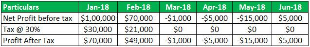

In the world of finance and trading, tax rules play a crucial role in shaping strategies as they directly impact profitability and long-term success. Among these tax strategies, understanding how loss carryforward works is essential. Loss carryforward allows traders to apply losses incurred during a specific financial period to offset gains in future periods, thereby reducing taxable income. This can be particularly advantageous in volatile markets, where losses in one year might be recuperated in subsequent periods. 

Algorithmic trading, or algo trading, introduces a unique set of challenges and opportunities due to its rapid and high-volume nature. With transactions occurring at breakneck speeds, algo traders face distinct tax implications. The rapid execution of trades can lead to a mixture of short-term and long-term capital gains, necessitating careful tax planning to manage liabilities effectively.



This article aims to provide a comprehensive overview of tax examples, rules, and the concept of loss carryforward specifically tailored for algo trading. By understanding these elements, traders can develop strategies that not only optimize financial outcomes but ensure adherence to regulatory requirements. Ultimately, navigating the complexities of tax rules can lead to enhanced financial strategies and reduced tax burdens, crucial for maintaining competitive advantage in the fast-paced world of algo trading.

## Table of Contents

## Understanding Tax Rules in Trading

Tax rules play a pivotal role in determining the profitability of trading activities, particularly when distinguishing between individual and institutional traders. Institutional traders are typically subject to more complex regulatory requirements due to the larger scale and impact of their trading operations, while individual traders face differing tax obligations depending on the frequency and type of their trades.

**General Tax Regulations for Traders**

In most jurisdictions, the primary distinction in tax regulations for traders revolves around how income from trading is categorized. For taxable purposes, trading income can be classified as either ordinary income or capital gains. Ordinary income is derived from regular business or trading activities and is taxed at the individual’s or company’s standard income tax rate. Capital gains, on the other hand, are profits from the sale of assets or investments and can be subject to differing tax rates based on the asset's holding period.

**Short-Term vs Long-Term Capital Gains**

A critical aspect of capital gains taxation is the differentiation between short-term and long-term capital gains. Short-term capital gains are realized from the sale of assets held for one year or less and are typically taxed at the ordinary income tax rate. Conversely, long-term capital gains are applicable to assets held for more than one year and benefit from reduced tax rates, which can significantly enhance the net profitability of trading strategies that accommodate longer holding periods.

**Algo Trading and Transaction Volume**

Algo trading, known for executing high-frequency transactions, introduces unique tax considerations primarily due to its significant transaction [volume](/wiki/volume-trading-strategy). Each transaction within the algorithmic strategy can generate taxable events, leading to potentially [high frequency](/wiki/high-frequency-trading) in realized gains or losses. This transaction volume, while advantageous for capturing minor market inefficiencies, may increase the tax complexity and reporting requirements for traders and institutions engaged in algorithmic strategies. Tax compliance in such contexts demands meticulous record-keeping and sophisticated tax reporting mechanisms to manage potential liabilities accurately.

**Impact of Tax Obligations on Algo Trading**

The substantial volume inherent in [algorithmic trading](/wiki/algorithmic-trading) can accelerate the realization of capital gains, thereby affecting the timing and magnitude of tax obligations. High-frequency traders must manage their trades with consideration for tax efficiency, often necessitating strategic measures such as loss harvesting to offset gains and optimize overall tax outcomes. In this context, traders often utilize advanced tax software solutions to compute liabilities and ensure compliance with pertinent regulations.

In summary, understanding the tax implications in trading, particularly within the algorithmic domain, requires careful attention to regulatory details, the treatment of gains, and the strategic management of high transaction volumes. Accurate classification and reporting practices are essential to maintaining tax efficiency and compliance in trading activities.

## Loss Carryforward Explained

Loss carryforward is an advantageous tax provision that permits traders to apply a net capital loss in one tax year to offset capital gains in subsequent years. This mechanism helps mitigate the impact of poor trading periods by reducing taxable income in future profitable years, effectively lowering tax liabilities and supporting cash flow management.

### Mechanics of Loss Carryforward

The process of loss carryforward involves calculating the net capital loss for a given tax year and applying this amount to offset capital gains in future years. Tax authorities typically have regulations on the duration and extent to which losses can be carried forward, often limited to a specific number of years. For instance, under U.S. tax law, individuals can [carry](/wiki/carry-trading) forward capital losses indefinitely until they are entirely utilized, although they can only offset up to $3,000 against ordinary income each year.

### Temporal Nature of Carryforward

Loss carryforward is intrinsically temporal, as it spans multiple tax periods. The unutilized capital losses are stored as a tax attribute that can be applied to future capital gains. For algo traders, this is particularly beneficial because trading algorithms often execute numerous transactions in a short period, leading to fluctuating gains and losses that may not align perfectly with the tax year.

#### Example Python Snippet for Loss Carryforward Calculation:

```python
def calculate_tax_liability(gains, losses, carryover):
    net_gain = gains - (losses + carryover)
    if net_gain > 0:
        taxable_income = net_gain
        carryover = 0
    else:
        taxable_income = 0
        carryover += abs(net_gain)
    return taxable_income, carryover

# Example values
current_year_gains = 15000
current_year_losses = 20000
previous_carryover = 5000

taxable_income, updated_carryover = calculate_tax_liability(current_year_gains, current_year_losses, previous_carryover)
```

### Benefits for Algo Traders

For algorithmic traders, the ability to carry forward losses is particularly advantageous because of the nature of their trading activities. High-frequency trading strategies might incur substantial losses in a short time due to market [volatility](/wiki/volatility-trading-strategies), making it vital to utilize loss carryforward provisions effectively. This practice ensures that traders can use past losses to counterbalance future gains, optimizing their effective tax rate.

### Case Study: Real-world Application

Consider a trading firm that experienced a significant loss in 2022 due to unexpected market swings but managed to achieve substantial gains in 2023. By applying the loss carryforward provision, the firm could offset its 2023 tax liabilities by using the 2022 losses. Suppose the firm had a capital loss of $100,000 in 2022 and capital gains of $200,000 in 2023. The carried-forward loss would reduce the taxable gain in 2023 to $100,000, significantly cutting down the firm's tax bill.

In conclusion, understanding and applying loss carryforward provisions can substantially benefit algo traders by reducing tax burdens and enhancing financial stability across volatile trading periods.

## Taxation Challenges in Algo Trading

Algo trading, characterized by high-frequency and automation, presents distinct taxation challenges that traders must navigate. The categorization of income for algorithmic traders is a fundamental aspect that requires careful consideration. Income from algo trading is often considered as ordinary income rather than capital gains due to the frequency and pattern of transactions, thereby affecting taxation rates and obligations. This classification differs from long-term investment strategies where profits may qualify for long-term capital gains tax, which is generally lower.

Another significant consideration is the wash sale rule, a tax provision that prevents traders from claiming a tax deduction for a security sold at a loss if the same or a substantially identical security is repurchased within 30 days before or after the sale. Algo trading, with its rapid buying and selling, is prone to triggering this rule inadvertently. For instance, if an algorithm sells a stock at a loss and buys back the same stock within the wash sale timeframe, the loss deduction can be disallowed, impacting potential tax benefits.

Recent legislative changes reflect attempts to adapt tax regulations to the evolving landscape of algo trading. Legislators have been keen to address potential loopholes and ensure fair taxation across different trading practices. For instance, some jurisdictions have considered implementing financial transaction taxes specifically targeting high-frequency trading to curb excessive market speculation and ensure that these transactions contribute an equitable share to tax revenues. Staying updated with such legislative shifts is crucial for traders to maintain compliance and optimize tax positions.

Proper record-keeping and reporting are vital for compliance in algo trading tax matters. Given the high volume of trades executed by algorithms, traders must maintain meticulous records of all transactions. This includes timestamps, quantities, prices, and any relevant details that support tax filings. Effective use of trading software capable of generating detailed reports and integrating with tax software can facilitate accurate and efficient reporting. Moreover, algorithmic traders should ensure their record-keeping practices adhere to legal requirements, reducing the risk of audit complications and penalties. 

Overall, navigating the taxation landscape in algo trading requires a comprehensive understanding of income classification, awareness of tax rules such as the wash sale provision, adaptability to legislative changes, and robust record-keeping practices. By addressing these challenges, algo traders can enhance compliance and financial outcomes.

## Examples of Tax Scenarios in Algo Trading

Algorithmic trading, by nature, involves large volumes and frequent transactions, leading to intricate tax scenarios. These complexities often arise from different tax treatments of gains and losses, compounded by the use of advanced trading strategies. This section outlines typical tax scenarios faced by algo traders, providing insights into managing these challenges effectively.

### Detailed Examples of Common Tax Scenarios

1. **Loss Carryforward Application**:
   Loss carryforward is a strategic tool allowing traders to utilize capital losses from poor trading years to offset future gains. For example, suppose an algorithmic trader incurs $50,000 in net capital losses in 2022 due to unfavorable market conditions. Using loss carryforward provisions, this trader can apply the $50,000 loss to lower taxable income in profitable years, say 2023 or beyond, until the losses are fully utilized, subject to the specific jurisdiction's regulations.

2. **Hypothetical Algo Trading Tax Calculation**:
   Consider a trader with the following annual trading results:
   - Total gains: $120,000
   - Total losses: $100,000
   - Short-term gains: $70,000
   - Long-term gains: $50,000

   The short-term gains, taxed at ordinary income rates, are offset by the same year's losses first. Assuming a 2022 standard capital gains tax rate of 15% for long-term gains, here's a simplified calculation:

   ```plaintext
   Net Short-Term Gain = Short-Term Gains - Losses
                       = $70,000 - $70,000 = $0

   Long-Term Gain Tax = Long-Term Gains * Long-Term Capital Gains Tax Rate
                      = $50,000 * 0.15
                      = $7,500
   ```

   The presence of losses significantly reduces taxable income, demonstrating the practical utility of timely loss offsetting.

3. **Strategies to Mitigate Tax Liabilities**:
   - **Tax-Loss Harvesting**: This involves selling underperforming assets to realize losses, which can offset taxable gains. Utilizing sophisticated algorithms, traders can identify optimal assets to sell while maintaining the desired portfolio risk-reward profile.
   - **Deferring Gains**: Traders may choose to let certain profitable trades roll over to the next fiscal year to defer taxation, taking advantage of strategic timing in recognition of income.
   - **Utilizing tax-advantaged accounts**: Depending on jurisdiction, using vehicles like retirement accounts for certain investments can offer tax shields.

4. **Use of Tax Software and Professional Advice**:
   Given the complexity of tax obligations in algo trading, specialized software can streamline record-keeping and computations. Popular solutions like TurboTax or specialized trading tax software can automatically integrate trade data and calculate potential liabilities. For complex scenarios involving multi-layered strategies and international transactions, consulting with tax professionals can ensure compliance and optimize tax efficiency. Professional advice tailored to individual trading styles and personal income details often proves invaluable for both compliance and efficiency.

In conclusion, navigating the intricacies of algorithmic trading taxation requires a comprehensive understanding of both strategies and regulations. Proper use of loss carryforward provisions, astute tax planning, and leveraging professional advice are essential elements for optimizing tax liabilities and maximizing trading returns.

## Conclusion

Navigating tax rules and effectively utilizing loss carryforward are crucial for algorithmic traders aiming to optimize their financial strategies. Understanding the intricacies of tax regulations and leveraging available provisions can significantly enhance traders' profitability and compliance. By adopting a proactive approach to tax planning, traders can mitigate potential liabilities and capitalize on opportunities to minimize their tax burdens.

Continuous education on evolving tax laws and strategies is essential for staying ahead in the competitive world of algo trading. Tax codes are subject to change, and staying informed about new regulations and interpretations helps traders adjust their strategies accordingly. The dynamics of tax law, particularly those affecting high-frequency trading activities, demand an ongoing commitment to learning and adaptation.

Consulting with tax professionals who specialize in trading can offer valuable insights tailored to an individual's or firm's unique circumstances. These professionals can provide guidance on navigating complex tax situations, ensuring compliance, and identifying opportunities for tax optimization. Their expertise can aid in accurately applying provisions such as the loss carryforward, thereby influencing a trader's overall tax strategy and financial outcomes.

Equipped with the right knowledge and tools, algo traders can turn tax rules to their advantage. By strategically planning transactions and harnessing tax efficiencies, traders can enhance their net returns. The use of advanced algorithms should be complemented by sophisticated tax planning to ensure that financial gains remain robust after accounting for tax obligations. Through diligent planning and strategic foresight, traders can position themselves for sustainable success in the market.

## Resources and Further Reading

### Recommended Books on Trading and Taxation

1. **"The New Trading for a Living" by Dr. Alexander Elder** - This book offers comprehensive insights into trading strategies and their implications, including a focus on taxation for traders.
2. **"Tax-Free Wealth: How to Build Massive Wealth by Permanently Lowering Your Taxes" by Tom Wheelwright** - Although not exclusively about trading, this book gives actionable advice on tax planning that can be applied to trading portfolios.
3. **"Algorithmic and High-Frequency Trading" by Álvaro Cartea, Sebastian Jaimungal, and José Penalva** - A deep dive into the mechanics of algo trading, with sections discussing tax strategies pertinent to high-frequency trading.

### Links to Online Courses and Webinars About Algo Trading Tax Strategies

- **Coursera's "Algorithmic Trading and Finance Models with Python, R, and Stata Essential Training"** - While primarily focused on trading strategies, this course includes discussions on the tax implications of algorithmic trading.
- **Khan Academy’s Finance and Capital Markets series** - Though broader in scope, these free resources include sections on financial market taxation.
- **Udemy's "Tax Strategies for Stock Market Investors"** - A specialized course that addresses the tax concerns of traders, including those utilizing algorithmic methods.

### Contact Information for Reputable Tax Advisors Specializing in Trading

1. **GreenTraderTax** - Known for its specialization in taxation for traders, offering services including tax preparation and advice specifically for algorithmic traders. Website: [greentradertax.com](https://www.greentradertax.com)
2. **Robert A. Green, CPA** - Provides a wealth of knowledge in trading taxation, available for consultations and tax filings. Contact through their firm's website or call directly for appointments.

### Articles and Whitepapers Providing Deeper Insights Into Trade-Specific Tax Rules

- **"Algorithmic Trading: The FINE Initiative and Tax Reporting"** - A whitepaper discussing the intricacies of tax compliance for algo traders, including potential pitfalls and best practices.
- **"Wash Sales for Algorithmic Traders: Challenges and Solutions"** - An article that investigates into the application of wash sale rules in high-frequency trading environments.

### Government Resources for the Latest Tax Regulations and Guidelines

- **Internal Revenue Service (IRS) – Tax Topic No. 429: Traders in Securities (Information for Form 1040 Filers)** - Provides thorough guidance on tax rules applicable to securities traders. Access the latest guidelines through the IRS's [official website](https://www.irs.gov).
- **Securities and Exchange Commission (SEC) Trading and Markets Division** - Offers frequent updates and releases on trading regulations, including tax implications for algorithmic trading. Visit the SEC [website](https://www.sec.gov) for more information. 

These resources collectively equip algo traders with comprehensive knowledge and tools to navigate tax intricacies, optimize strategies, and remain compliant with current regulations.

## References & Further Reading

[1]: ["The New Trading for a Living"](https://www.amazon.com/New-Trading-Living-Psychology-Discipline/dp/1118443926) by Dr. Alexander Elder

[2]: ["Tax-Free Wealth: How to Build Massive Wealth by Permanently Lowering Your Taxes"](https://www.amazon.com/Tax-Free-Wealth-Permanently-Lowering-Advisors/dp/1947588052) by Tom Wheelwright

[3]: Cartea, Álvaro, Jaimungal, Sebastian, & Penalva, José. ["Algorithmic and High-Frequency Trading."](https://assets.cambridge.org/97811070/91146/frontmatter/9781107091146_frontmatter.pdf) Cambridge University Press, 2015.

[4]: ["Algorithmic Trading and Finance Models with Python, R, and Stata Essential Training"](https://www.linkedin.com/learning/algorithmic-trading-and-finance-models-with-python-r-and-stata-essential-training) on Coursera

[5]: ["Traders in Securities - Topic No. 429"](https://www.irs.gov/taxtopics/tc429) from the IRS

[6]: ["Wash Sales for Stock Traders"](https://www.kiplinger.com/taxes/604947/stocks-and-wash-sale-rule) by the U.S. Securities and Exchange Commission (SEC)

[7]: Robert A. Green, CPA and GreenTraderTax: [greentradertax.com](https://greentradertax.com/about-us/professionals/robert-a-green-cpa/)