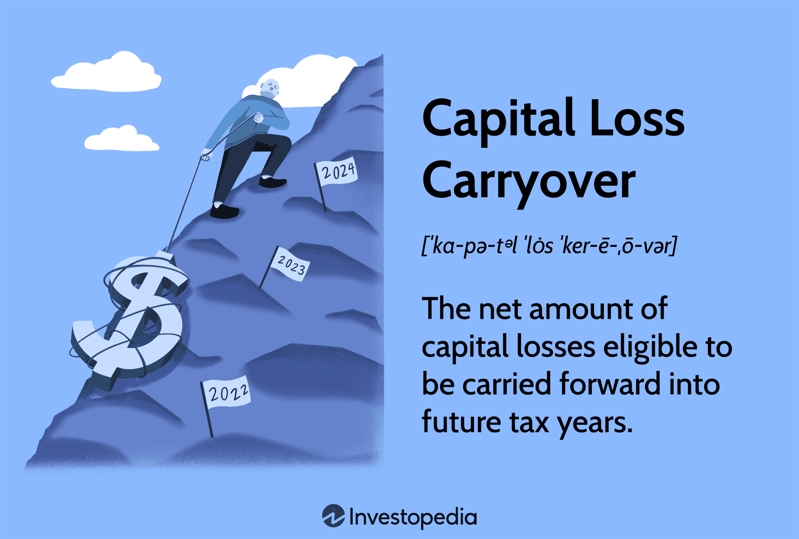

## Table of Contents

## What is loss carryforward in taxation?

Loss carryforward is a tax rule that lets businesses use their financial losses to reduce their taxes in future years. If a business loses money one year, they can't use that loss to lower their taxes right away. Instead, they can "carry forward" that loss to future years. This means they can subtract the loss from their profits in those future years, which can lower the amount of tax they have to pay.

This rule helps businesses that might have a bad year but expect to do better in the future. It gives them a way to smooth out their taxes over time. For example, if a business loses $50,000 one year, they can use that $50,000 loss to reduce their taxable income in the next year. If they make a profit of $100,000 the next year, they can subtract the $50,000 loss, so they only pay taxes on $50,000 of profit. This can make a big difference in their tax bill and help them recover from a tough year.

## How does loss carryforward work?

Loss carryforward lets a business use its losses from one year to lower its taxes in future years. If a business loses money, it can't use that loss to reduce its taxes right away. Instead, it can save that loss and use it later. This means if the business makes a profit in the future, it can subtract the old loss from the new profit. This reduces the amount of profit that gets taxed, which can save the business money on taxes.

For example, imagine a business loses $30,000 in one year. The next year, it makes a profit of $50,000. With loss carryforward, the business can take the $30,000 loss and subtract it from the $50,000 profit. So, it only pays taxes on $20,000 of profit instead of the full $50,000. This helps the business recover from a bad year and makes its taxes more fair over time.

## What types of losses can be carried forward?

Loss carryforward can be used for different kinds of losses. The most common type is a net operating loss (NOL). This happens when a business's expenses are more than its income for the year. Businesses can [carry](/wiki/carry-trading) forward these NOLs to reduce their taxes in future years when they make a profit.

Another type of loss that can be carried forward is a capital loss. This is when a business loses money from selling assets like stocks or property. If the loss is more than the gains from other sales, the business can carry forward the extra loss. They can use it to lower taxes on future capital gains.

Some countries also allow businesses to carry forward losses from other sources, like foreign income losses or losses from certain types of investments. The rules can be different in each country, so businesses need to check their local tax laws to see what types of losses they can carry forward and how long they can do it.

## What are the time limits for carrying forward losses?

The time limits for carrying forward losses can be different depending on where you are and what kind of loss it is. In the United States, businesses can usually carry forward net operating losses (NOLs) forever, but there are some rules. For example, losses from before 2018 can only be used to reduce up to 80% of taxable income each year. Losses from 2018 and later can be carried forward without this limit, but they can't be carried back to earlier years.

For capital losses, the rules are a bit different. In the U.S., businesses can carry forward capital losses to offset future capital gains, but they can only use up to $3,000 of these losses each year against regular income. Any unused capital losses can be carried forward to future years. Other countries might have different rules, so it's important to check the local tax laws to know how long you can carry forward different types of losses.

## Can loss carryforward be used to offset future income?

Loss carryforward can be used to offset future income. This means if a business loses money one year, it can save that loss and use it to lower its taxes in future years when it makes a profit. For example, if a business loses $20,000 one year and then makes $50,000 the next year, it can subtract the $20,000 loss from the $50,000 profit. This way, the business only pays taxes on $30,000 of profit instead of the full $50,000.

The rules for using loss carryforward can be different depending on where you are and what kind of loss it is. In the United States, businesses can usually carry forward losses forever, but there are limits on how much they can use each year. For example, losses from before 2018 can only reduce up to 80% of taxable income each year. It's important for businesses to check their local tax laws to know how long they can carry forward losses and how they can use them to lower their taxes.

## Are there any limitations on the amount of loss that can be carried forward?

There are some limits on how much loss a business can carry forward to lower its taxes in future years. In the United States, if a business has a net operating loss before 2018, it can only use that loss to reduce up to 80% of its taxable income each year. This means the business can't use the full amount of the loss to make its taxes zero. For losses from 2018 and later, there's no limit on how much of the loss can be used each year, but the business can't use the loss to go back and change its taxes from earlier years.

For capital losses, there are also limits. A business can carry forward capital losses to lower its taxes on future capital gains, but it can only use up to $3,000 of these losses each year against its regular income. Any extra loss can be saved and used in future years. Different countries might have different rules, so businesses need to check their local tax laws to know how much loss they can carry forward and how they can use it.

## How do different countries handle loss carryforward?

Different countries have their own rules for loss carryforward. In the United States, businesses can carry forward net operating losses forever, but there are limits. Losses before 2018 can only reduce up to 80% of taxable income each year. Losses from 2018 and later don't have this limit, but they can't be used to change taxes from earlier years. For capital losses, businesses can carry them forward to lower future capital gains, but they can only use up to $3,000 of these losses each year against regular income.

In the United Kingdom, companies can carry forward trading losses to offset future profits. They can use these losses to reduce up to 50% of their taxable profits each year. In Canada, businesses can carry forward net capital losses indefinitely, but they can only use them to offset future capital gains. In Australia, companies can carry forward losses to offset future income, but they must meet certain rules about ownership and control to use these losses.

Each country's rules can be different, so businesses need to check their local tax laws to understand how loss carryforward works where they are. This helps them plan their taxes better and use their losses in the best way possible.

## What are the differences between loss carryforward and loss carryback?

Loss carryforward and loss carryback are two ways businesses can use their losses to lower their taxes. With loss carryforward, a business can save its losses from one year and use them to reduce its taxes in future years. This is helpful if the business expects to make a profit in the future. For example, if a business loses money this year, it can carry that loss forward and use it to lower its taxes next year when it makes a profit.

Loss carryback, on the other hand, lets a business use its losses to change its taxes from past years. If a business loses money this year, it can "carry back" that loss and use it to get a refund on taxes it paid in earlier years. This can give the business some money back right away, which can be helpful if it's having a tough time. Not all countries allow loss carryback, and the rules can be different from one place to another.

## How does loss carryforward affect a company's tax planning?

Loss carryforward can help a company plan its taxes better. If a company loses money one year, it can save that loss and use it to lower its taxes in the future when it makes a profit. This means the company can pay less tax in good years because it can subtract the old loss from the new profit. This can make a big difference in the company's tax bill and help it save money over time. Knowing how to use loss carryforward can help a company plan for the future and make smart decisions about when to spend money and when to save it.

Different countries have different rules about how long a company can carry forward losses and how much it can use each year. For example, in the United States, a company can carry forward losses forever, but there are limits on how much it can use each year. This means a company needs to think about these rules when it's planning its taxes. By understanding the local tax laws, a company can use loss carryforward to its advantage and lower its taxes as much as possible. This can help the company stay strong even if it has a bad year.

## What are the accounting treatments for loss carryforward?

When a company has a loss, it can use loss carryforward to lower its taxes in future years. In accounting, the company records this loss as a deferred tax asset on its balance sheet. A deferred tax asset means the company expects to get a tax benefit in the future. The company needs to show how much of the loss it can use to lower its taxes and how long it can carry the loss forward. This helps everyone see the company's future tax savings.

The company also needs to check if it's likely to make enough profit in the future to use the loss carryforward. If it's not likely, the company might need to lower the value of the deferred tax asset or even get rid of it. This is called a valuation allowance. The company looks at its past profits, future plans, and the tax rules in its country to decide if it needs a valuation allowance. By doing this, the company makes sure its financial statements are accurate and show the real value of its tax benefits.

## How do changes in tax laws impact loss carryforward strategies?

Changes in tax laws can make a big difference in how businesses use loss carryforward. If the rules change, a business might be able to carry forward losses for a different amount of time or use them to lower its taxes in new ways. For example, if a country decides to let businesses carry forward losses for more years, the business can save more of its losses and use them to lower its taxes later. On the other hand, if the rules get stricter and businesses can only carry forward losses for a shorter time, they might need to use their losses faster or lose them.

Businesses need to keep an eye on tax law changes to plan their taxes well. If the rules change, a business might need to change its plans for using loss carryforward. For instance, if a new law says businesses can only use a certain amount of their losses each year, they might need to spread out their losses over more years. This can affect how much tax they pay each year and how they plan their money. By staying up to date with tax laws, businesses can make smart choices about when to use their losses and how to save money on taxes.

## What are the advanced strategies for maximizing the benefits of loss carryforward?

One advanced strategy for maximizing the benefits of loss carryforward is to carefully time when to use the losses. Businesses can choose to use their losses in years when they expect to have high profits. This way, they can lower their taxes more in those years. Another strategy is to use loss carryforward to offset income from different sources. For example, if a business has losses from one part of its operations, it can use those losses to lower taxes on profits from another part. This can help the business save more money on taxes overall.

Another strategy is to take advantage of tax law changes. If a country changes its rules to allow businesses to carry forward losses for more years or use more of their losses each year, a business can plan to use its losses in the best way possible under the new rules. Businesses can also look at their financial plans and see if they can shift some profits to years when they can use their losses. By doing this, they can lower their taxes and keep more money for their business.

## References & Further Reading

[1]: ["The New Trading for a Living"](https://www.amazon.com/New-Trading-Living-Psychology-Discipline/dp/1118443926) by Dr. Alexander Elder

[2]: ["Tax-Free Wealth: How to Build Massive Wealth by Permanently Lowering Your Taxes"](https://www.amazon.com/Tax-Free-Wealth-Permanently-Lowering-Advisors/dp/1947588052) by Tom Wheelwright

[3]: Cartea, Álvaro, Jaimungal, Sebastian, & Penalva, José. ["Algorithmic and High-Frequency Trading."](https://assets.cambridge.org/97811070/91146/frontmatter/9781107091146_frontmatter.pdf) Cambridge University Press, 2015.

[4]: ["Algorithmic Trading and Finance Models with Python, R, and Stata Essential Training"](https://www.linkedin.com/learning/algorithmic-trading-and-finance-models-with-python-r-and-stata-essential-training) on Coursera

[5]: ["Traders in Securities - Topic No. 429"](https://www.irs.gov/taxtopics/tc429) from the IRS

[6]: ["Wash Sales for Stock Traders"](https://www.kiplinger.com/taxes/604947/stocks-and-wash-sale-rule) by the U.S. Securities and Exchange Commission (SEC)

[7]: Robert A. Green, CPA and GreenTraderTax: [greentradertax.com](https://greentradertax.com/about-us/professionals/robert-a-green-cpa/)