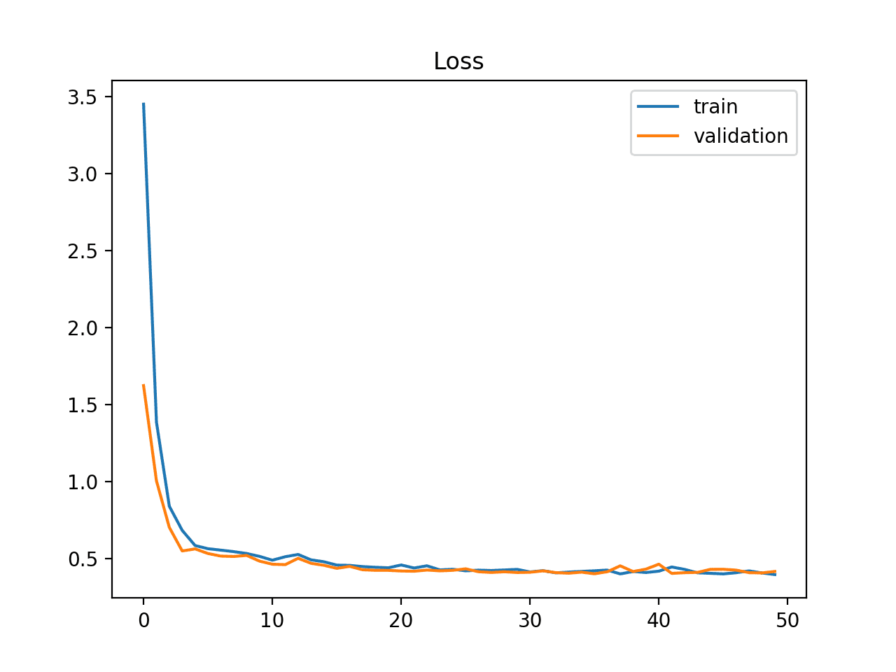

## Table of Contents

## What is a loss curve in machine learning?

A loss curve in machine learning is a graph that shows how the loss, or error, of a model changes over time as it learns from the data. Imagine you're trying to teach a robot to throw a basketball into a hoop. At first, the robot might miss a lot, but as it practices more, it gets better. The loss curve would show this improvement by starting high (when the robot misses a lot) and gradually going down as the robot learns to make more shots.

The loss curve is important because it helps us see if our model is learning well or if it's stuck. If the curve keeps going down, it means the model is getting better at its job. But if the curve stops moving or starts going up, it might mean the model isn't learning anything new or is starting to make more mistakes. By looking at the loss curve, we can decide if we need to change something about how the model is learning, like giving it different data or adjusting its settings.

## Why is the loss curve important in training machine learning models?

The loss curve is important in training machine learning models because it shows us how well the model is learning over time. When we train a model, we want it to get better at making predictions or decisions. The loss curve helps us see if the model is actually improving. If the curve goes down over time, it means the model is getting better because the error, or loss, is decreasing. This is like watching a student's grades improve as they study more. If we see the loss curve going down, we know our training is working.

On the other hand, if the loss curve stays the same or starts to go up, it tells us there might be a problem. A flat loss curve means the model isn't learning anything new, and it's stuck. A curve that goes up means the model is starting to make more mistakes, which is bad. By looking at the loss curve, we can decide if we need to change something about how the model is learning. Maybe we need to give it different data or adjust its settings. The loss curve is like a report card for the model, helping us make it smarter and more accurate.

## How does the loss curve help in identifying overfitting or underfitting?

The loss curve helps us spot overfitting and underfitting by showing how the model performs on both the training data and a separate set of test data. Overfitting happens when a model learns the training data too well, including its noise and random errors, and then performs poorly on new, unseen data. If we see the loss curve for the training data going down a lot but the loss curve for the test data starting to go up, it's a sign of overfitting. The model is doing great on the data it knows but not so well on new data. It's like memorizing answers for a test instead of understanding the material.

Underfitting, on the other hand, is when the model is too simple to capture the patterns in the data. If both the training and test loss curves stay high and don't go down much, it means the model isn't learning enough. The model is like a student who didn't study enough and can't answer questions well, whether they're from the textbook or a new set of problems. By looking at the loss curves, we can decide if we need to make the model more complex to avoid underfitting or simpler to prevent overfitting, helping us find the right balance for the best performance.

## What are the common types of loss functions used in machine learning?

In [machine learning](/wiki/machine-learning), different types of problems need different ways to measure how well a model is doing. Some common loss functions include mean squared error (MSE), mean absolute error (MAE), and binary cross-entropy. MSE is often used for regression problems, where you're trying to predict a number. It calculates the average of the squared differences between the predicted and actual values. The formula for MSE is $$ \text{MSE} = \frac{1}{n} \sum_{i=1}^{n} (y_i - \hat{y}_i)^2 $$, where $y_i$ is the actual value, $\hat{y}_i$ is the predicted value, and $n$ is the number of observations. MAE is another way to measure error in regression, but it uses the absolute value of the differences instead of squaring them. Its formula is $$ \text{MAE} = \frac{1}{n} \sum_{i=1}^{n} |y_i - \hat{y}_i| $$. Both MSE and MAE help us see how far off our predictions are from the real values.

For classification problems, where you're trying to put things into categories, binary cross-entropy is often used. It's especially good for problems where you're deciding between two options, like yes or no. The formula for binary cross-entropy is $$ \text{Binary Cross-Entropy} = -\frac{1}{n} \sum_{i=1}^{n} [y_i \log(\hat{y}_i) + (1 - y_i) \log(1 - \hat{y}_i)] $$. This loss function measures how well the model's predictions match the actual categories. If the model is very sure about its prediction and gets it right, the loss will be low. But if it's unsure or wrong, the loss will be high. By using these different loss functions, we can choose the best way to train our model depending on the type of problem we're trying to solve.

## How do you plot a loss curve?

To plot a loss curve, you first need to collect the loss values from your machine learning model as it trains. This means saving the loss at each step or epoch of training. You can do this by storing the loss in a list or array. Once you have all the loss values, you can use a plotting library like matplotlib in Python to create the graph. You'll set up your plot, plot the loss values against the training steps or epochs, and then show the graph. Here's a simple example of how you might do this in Python:

```python
import matplotlib.pyplot as plt

# Assume 'losses' is a list of loss values collected during training
epochs = range(1, len(losses) + 1)
plt.plot(epochs, losses, 'b', label='Training Loss')
plt.title('Training Loss Curve')
plt.xlabel('Epochs')
plt.ylabel('Loss')
plt.legend()
plt.show()
```

The resulting plot will show how the loss changes over time, helping you see if your model is learning well. The x-axis will represent the epochs or steps of training, and the y-axis will show the loss values. If the loss goes down over time, it means your model is improving. If it stays the same or goes up, you might need to adjust your training process. By looking at this curve, you can make decisions about how to improve your model's performance.

## What does a typical loss curve look like during model training?

A typical loss curve during model training starts off high and then gradually goes down over time. Imagine you're learning to ride a bike. At first, you might fall a lot, but as you practice more, you fall less. The loss curve shows this improvement. It starts with a high loss because the model doesn't know much yet, but as it learns from the data, the loss decreases, showing the model is getting better at making predictions.

Sometimes, the loss curve might not always go down smoothly. It can have ups and downs, like a bumpy road. This can happen if the model is trying different things to learn better. If the curve keeps going down overall, that's good. But if it stops going down or starts going up, it might mean the model is not learning anymore or is starting to make more mistakes. By looking at the loss curve, you can see if your model is learning well and decide if you need to change anything to help it learn better.

## How can you interpret fluctuations in a loss curve?

Fluctuations in a loss curve are like bumps on a road as your model learns. These ups and downs can happen because the model is trying different ways to get better. Sometimes, it might make a big jump in learning, and the loss goes down a lot. Other times, it might try something that doesn't work as well, and the loss goes up a bit. These small changes are normal and show that the model is still learning and adjusting. If the overall trend of the loss curve is going down, even with some ups and downs, it means the model is getting better at making predictions.

Bigger fluctuations can be a sign that something else is happening. If the loss goes up a lot suddenly, it might mean the model is starting to overfit, which means it's learning the training data too well and might not work as well on new data. On the other hand, if the loss stays high with lots of ups and downs, it could mean the model is underfitting and not learning the important patterns in the data. By watching these fluctuations, you can decide if you need to change how the model is learning, like giving it different data or adjusting its settings, to help it learn better.

## What strategies can be used to improve a model based on its loss curve?

If the loss curve starts high and goes down slowly, it means your model is learning but might need more time or data to get better. You can try training the model for more epochs to see if the loss keeps going down. Another way to help is by giving the model more data to learn from. If the loss curve is going down but then stops moving, it might mean the model is stuck. You can try changing the model's settings, like the learning rate, to help it keep learning. The learning rate is like how fast the model learns, and sometimes making it smaller can help the model take smaller steps and find a better way to learn.

If the loss curve goes down a lot on the training data but starts going up on the test data, it's a sign that the model is overfitting. Overfitting happens when the model learns the training data too well, including its mistakes, and doesn't work as well on new data. To fix this, you can try making the model simpler by reducing the number of layers or neurons. You can also use a technique called regularization, which adds a penalty to the model's complexity to keep it from overfitting. Regularization helps the model focus on the important patterns in the data instead of the noise. If the loss curve stays high and doesn't go down much, it means the model might be underfitting. Underfitting happens when the model is too simple to learn the data well. To fix this, you can try making the model more complex by adding more layers or neurons, or by using a different type of model that can learn better.

By looking at the loss curve, you can see if your model is learning well and decide what to do next. If the loss is going down, but not as fast as you want, you can try training longer or giving it more data. If the loss is going up on the test data, you can make the model simpler or use regularization. If the loss stays high, you can make the model more complex. Watching the loss curve helps you make the model smarter and better at its job.

## How does the choice of optimizer affect the shape of the loss curve?

The choice of optimizer can change how the loss curve looks during training. An optimizer is like a coach that helps the model learn better. Some optimizers, like Stochastic Gradient Descent (SGD), might make the loss curve go down slowly and have more ups and downs. This is because SGD takes small steps to learn, and sometimes it might take a wrong turn before finding the right way. Other optimizers, like Adam or RMSprop, can make the loss curve go down faster and smoother. These optimizers are smarter and can adjust how they learn based on what they see, so the model can improve more quickly and with fewer bumps along the way.

If you use SGD, the loss curve might look like a bumpy road because it takes small steps and can get stuck in places that aren't the best. The formula for SGD is $$ \theta = \theta - \eta \cdot \nabla J(\theta) $$, where $$ \theta $$ is the model's parameters, $$ \eta $$ is the learning rate, and $$ \nabla J(\theta) $$ is the gradient of the loss function. On the other hand, if you use Adam, the loss curve might look smoother because Adam can change its learning rate to find the best way to learn. Adam uses a more complex formula to update the parameters, which helps it learn faster and more smoothly. By choosing the right optimizer, you can help your model learn better and make the loss curve look the way you want it to.

## Can you explain the concept of learning rate and its impact on the loss curve?

The learning rate is like the speed at which a model learns. Imagine you're teaching a kid to ride a bike. If you push them too fast, they might fall off a lot. But if you go too slow, they might not learn quickly enough. The learning rate in a model works the same way. It controls how big the steps are that the model takes to learn from the data. If the learning rate is too high, the model might jump around a lot and miss the best way to learn, making the loss curve go up and down a lot. If it's too low, the model might take tiny steps and take a long time to get better, making the loss curve go down very slowly.

The learning rate can really change how the loss curve looks. If you use a high learning rate, the loss curve might have big ups and downs because the model is taking big steps. The formula for updating the model's parameters with a learning rate $$ \eta $$ is $$ \theta = \theta - \eta \cdot \nabla J(\theta) $$, where $$ \theta $$ is the model's parameters and $$ \nabla J(\theta) $$ is the gradient of the loss function. A high $$ \eta $$ can make the model overshoot the best solution, causing the loss to increase at times. On the other hand, a low learning rate can make the loss curve go down smoothly but very slowly. The model takes small steps and might take longer to find the best way to learn. By choosing the right learning rate, you can help the model learn better and make the loss curve look smoother and go down faster.

## How do batch size and data normalization influence the loss curve?

Batch size is like how many examples you show the model at once while it's learning. If you use a big batch size, the model can learn faster because it sees more data at once. This can make the loss curve go down faster, but it might also make it jump around a bit more because the model is taking bigger steps. On the other hand, if you use a small batch size, the model learns more slowly because it sees less data at once. This can make the loss curve go down more smoothly but also more slowly. The formula for updating the model's parameters with a learning rate $$ \eta $$ and gradient $$ \nabla J(\theta) $$ is $$ \theta = \theta - \eta \cdot \nabla J(\theta) $$. The batch size affects how the gradient is calculated, which in turn affects how the loss curve looks.

Data normalization is like making sure all the data the model sees is on the same scale. Imagine you're trying to compare the heights of people and the weights of elephants. If you don't change the numbers to be on the same scale, it's hard to make sense of them. Data normalization helps by making all the numbers the model sees be between 0 and 1, or have a mean of 0 and a standard deviation of 1. When the data is normalized, the model can learn better and faster. This makes the loss curve go down more smoothly and quickly because the model isn't confused by different scales. By normalizing the data, you help the model learn better and make the loss curve look smoother and go down faster.

## What advanced techniques can be used to analyze and optimize the loss curve in deep learning models?

One advanced technique to analyze and optimize the loss curve in [deep learning](/wiki/deep-learning) models is using learning rate scheduling. This means changing the learning rate during training to help the model learn better. At the start, you might use a high learning rate to make the loss go down quickly. But as the model learns more, you can lower the learning rate to make the loss go down more smoothly and help the model find the best way to learn. A common way to do this is with a technique called "learning rate decay," where the learning rate gets smaller over time. The formula for learning rate decay can be $$ \eta_t = \eta_0 \cdot \frac{1}{1 + \frac{t}{s}} $$, where $$ \eta_t $$ is the learning rate at time $$ t $$, $$ \eta_0 $$ is the initial learning rate, and $$ s $$ is a decay step. By using learning rate scheduling, you can make the loss curve go down faster and smoother, helping your model learn better.

Another technique is using early stopping to prevent overfitting. Overfitting happens when the model learns the training data too well and doesn't work as well on new data. With early stopping, you watch the loss on a separate set of test data while the model trains. If the test loss starts going up, even if the training loss is still going down, you stop training. This helps the model stop learning before it starts to overfit. You can also use techniques like gradient clipping to keep the model from taking too big of steps. Gradient clipping means if the gradient gets too big, you make it smaller. This can help make the loss curve go down more smoothly. By using these advanced techniques, you can help your model learn better and make the loss curve look the way you want it to.

## References & Further Reading

[1]: Goodfellow, I., Bengio, Y., & Courville, A. (2016). ["Deep Learning"](https://link.springer.com/article/10.1007/s10710-017-9314-z). MIT Press.

[2]: Chollet, F. (2017). ["Deep Learning with Python"](https://www.manning.com/books/deep-learning-with-python). Manning Publications.

[3]: Murphy, K. P. (2012). ["Machine Learning: A Probabilistic Perspective"](https://www.cs.ubc.ca/~murphyk/MLbook/pml-toc-1may12.pdf). MIT Press.

[4]: Bishop, C. M. (2006). ["Pattern Recognition and Machine Learning"](https://link.springer.com/book/9780387310732). Springer.

[5]: Geron, A. (2019). ["Hands-On Machine Learning with Scikit-Learn, Keras, and TensorFlow"](https://www.academia.edu/43840124/Hands_On_Machine_Learning_with_Scikit_Learn_Keras_and_TensorFlow_SECOND_EDITION_Concepts_Tools_and_Techniques_to_Build_Intelligent_Systems). O'Reilly Media.

[6]: Kingma, D. P., & Ba, J. (2014). ["Adam: A Method for Stochastic Optimization."](https://arxiv.org/abs/1412.6980) arXiv:1412.6980.

[7]: Zeiler, M. D. (2012). ["ADADELTA: An Adaptive Learning Rate Method."](https://arxiv.org/abs/1212.5701) arXiv:1212.5701.