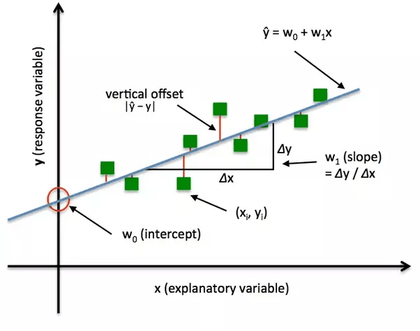

## Table of Contents

## What is a loss function in machine learning?

A loss function in machine learning is a way to measure how well a model is doing its job. Think of it like a score that tells the model how far off its predictions are from the actual results. When training a model, the goal is to make this score as small as possible. By using the loss function, the model can adjust its parameters to improve its predictions over time.

For example, if you're trying to predict house prices, the loss function could measure the difference between the predicted price and the actual price. If the model predicts a house will cost $200,000 but it actually costs $220,000, the loss function will show a high score. The model then uses this information to tweak its predictions, aiming to get closer to the actual price in future attempts. This process of minimizing the loss helps the model learn and improve.

## Why are loss functions important in training machine learning models?

Loss functions are crucial in training machine learning models because they provide a way to measure how well the model is performing. By calculating the difference between the model's predictions and the actual outcomes, the loss function gives a clear score of the model's accuracy. This score helps the model understand where it's going wrong and how it can improve. Without a loss function, the model wouldn't know if its predictions are good or bad, making it impossible to learn and improve over time.

When training a model, the goal is to minimize the loss function. This means adjusting the model's parameters to make the predictions as close as possible to the actual results. For example, if a model is predicting house prices, the loss function might be something like the mean squared error, which calculates the average of the squared differences between predicted and actual prices. By minimizing this loss, the model can fine-tune its predictions, leading to better performance. In essence, the loss function guides the model's learning process, ensuring it gets better with each iteration.

## Can you explain the difference between a loss function and a cost function?

In [machine learning](/wiki/machine-learning), the terms "loss function" and "cost function" are often used interchangeably, but there's a subtle difference between them. A loss function measures the error for a single training example. It tells you how badly the model is doing for just one piece of data. For instance, if you're predicting house prices, the loss function might tell you how far off your prediction is for one specific house.

On the other hand, a cost function (or objective function) measures the average loss over the entire training dataset. It gives you a broader view of the model's performance across all the data it's been trained on. The cost function is what you're trying to minimize when training the model. For example, if you have a dataset of many houses, the cost function would average the errors from predicting the price of each house.

To sum it up, while the loss function focuses on individual errors, the cost function aggregates these errors to give an overall measure of the model's performance. Both are crucial for training a model, but they serve slightly different purposes in the learning process.

## What are some common types of loss functions used in regression problems?

In regression problems, where the goal is to predict a continuous value, several common types of loss functions are used. One popular loss function is the Mean Squared Error (MSE). The MSE calculates the average of the squared differences between the predicted and actual values. This means it penalizes larger errors more than smaller ones, which can be useful for many applications. The formula for MSE is $$ \text{MSE} = \frac{1}{n} \sum_{i=1}^{n} (y_i - \hat{y}_i)^2 $$, where $y_i$ is the actual value, $\hat{y}_i$ is the predicted value, and $n$ is the number of observations.

Another common loss function is the Mean Absolute Error (MAE). Unlike MSE, MAE calculates the average of the absolute differences between the predicted and actual values. This makes MAE less sensitive to outliers because it doesn't square the errors. The formula for MAE is $$ \text{MAE} = \frac{1}{n} \sum_{i=1}^{n} |y_i - \hat{y}_i| $$. MAE can be a good choice when you want to give all errors equal weight, regardless of their size.

A third type of loss function used in regression is the Huber Loss. This function is a combination of MSE and MAE and is designed to be less sensitive to outliers than MSE but more sensitive than MAE. The Huber Loss uses a parameter $\delta$ to decide when to switch between squared loss for smaller errors and absolute loss for larger errors. The formula for Huber Loss is $$ L_{\delta}(y, \hat{y}) = 
\begin{cases} 
\frac{1}{2}(y - \hat{y})^2 & \text{if } |y - \hat{y}| \leq \delta \\
\delta (|y - \hat{y}| - \frac{1}{2}\delta) & \text{if } |y - \hat{y}| > \delta 
\end{cases} $$. This makes it a versatile choice for many regression tasks.

## How do loss functions work in classification tasks?

In classification tasks, loss functions measure how well a model can correctly categorize data into different classes. Unlike regression, where the goal is to predict a number, classification aims to assign an item to one of several categories. Common loss functions for classification include the Binary Cross-Entropy Loss for binary classification problems and the Categorical Cross-Entropy Loss for multi-class problems. These functions calculate the difference between the model's predicted probabilities and the true labels, helping the model learn to make better predictions.

For example, in a binary classification task like spam detection, the Binary Cross-Entropy Loss, also known as Log Loss, is used. This function calculates the loss as $$ \text{Loss} = -\frac{1}{N} \sum_{i=1}^{N} [y_i \log(\hat{y}_i) + (1 - y_i) \log(1 - \hat{y}_i)] $$, where $y_i$ is the true label (0 or 1), $\hat{y}_i$ is the predicted probability, and $N$ is the number of samples. If the model predicts a high probability for spam when the email is actually not spam, the loss will be high, encouraging the model to adjust its predictions. 

In multi-class classification, like identifying different types of animals from images, the Categorical Cross-Entropy Loss is used. This function extends the binary version to handle multiple classes and is calculated as $$ \text{Loss} = -\frac{1}{N} \sum_{i=1}^{N} \sum_{c=1}^{C} y_{i,c} \log(\hat{y}_{i,c}) $$, where $y_{i,c}$ is 1 if the sample $i$ belongs to class $c$ and 0 otherwise, $\hat{y}_{i,c}$ is the predicted probability for class $c$, $N$ is the number of samples, and $C$ is the number of classes. The model aims to minimize this loss, improving its ability to correctly classify new data.

## What is the role of a loss function in optimizing a neural network?

The loss function plays a crucial role in optimizing a [neural network](/wiki/neural-network) by providing a way to measure how well the network is performing. When you train a neural network, you want it to make the best predictions possible. The loss function calculates the error between the network's predictions and the actual outcomes. By minimizing this error, the network can adjust its weights and biases to improve its performance over time. For example, if a neural network is trying to recognize handwritten digits, the loss function will tell it how far off its guesses are from the correct numbers, guiding the network to make better predictions.

During the training process, the neural network uses an optimization algorithm like gradient descent to minimize the loss function. The algorithm calculates the gradient of the loss with respect to the network's parameters, which shows the direction in which the loss is increasing. By moving the parameters in the opposite direction of the gradient, the network can reduce the loss. This process is repeated many times, with the network getting better at its task with each iteration. The choice of loss function is important because it directly affects how the network learns and what kind of errors it focuses on reducing.

## How does the choice of loss function affect model performance?

The choice of loss function can have a big impact on how well a model performs. Different loss functions measure errors in different ways, and this can change what the model pays attention to when it's learning. For example, if you use Mean Squared Error (MSE) for a regression problem, the model will try to make its predictions as close as possible to the actual values because MSE penalizes bigger mistakes more. But if you use Mean Absolute Error (MAE), the model will focus on getting all predictions close to the actual values, no matter how big the mistakes are, because MAE treats all errors the same.

In classification tasks, the choice of loss function can also make a big difference. Binary Cross-Entropy Loss, for instance, works well for problems where you're trying to tell if something is one thing or another, like spam or not spam. It encourages the model to be very sure about its predictions. On the other hand, if you're trying to sort things into more than two groups, like different types of animals, Categorical Cross-Entropy Loss would be better. It helps the model figure out which group each thing belongs to by looking at the probabilities for all groups. So, [picking](/wiki/asset-class-picking) the right loss function can really help your model learn better and make more accurate predictions.

## What is the difference between L1 and L2 loss functions?

L1 and L2 loss functions are two common ways to measure how well a model is doing, especially in regression problems. L1 loss, also known as Mean Absolute Error (MAE), calculates the average of the absolute differences between the model's predictions and the actual values. The formula for L1 loss is $$ \text{L1 Loss} = \frac{1}{n} \sum_{i=1}^{n} |y_i - \hat{y}_i| $$, where $y_i$ is the actual value, $\hat{y}_i$ is the predicted value, and $n$ is the number of observations. Because L1 loss treats all errors the same, it's less sensitive to outliers, making it a good choice when you want to give equal importance to all errors, regardless of their size.

L2 loss, also known as Mean Squared Error (MSE), calculates the average of the squared differences between the model's predictions and the actual values. The formula for L2 loss is $$ \text{L2 Loss} = \frac{1}{n} \sum_{i=1}^{n} (y_i - \hat{y}_i)^2 $$. Since L2 loss squares the errors, it penalizes larger errors more than smaller ones, which can be helpful for many applications where bigger mistakes are more important to fix. However, this also means L2 loss can be more sensitive to outliers compared to L1 loss. Choosing between L1 and L2 loss depends on what kind of errors you want your model to focus on reducing.

## Can you describe the concept of cross-entropy loss and where it is typically used?

Cross-entropy loss is a way to measure how well a model is doing at guessing which group something belongs to. Imagine you're trying to figure out if an email is spam or not. Cross-entropy loss looks at the model's guess (like a percentage chance that it's spam) and compares it to what's actually true. If the model says there's a 90% chance an email is spam but it's actually not, the cross-entropy loss will be high. This tells the model it needs to adjust its guesses to be more accurate.

In simple terms, cross-entropy loss is used a lot in tasks where you need to put things into different groups, like telling cats from dogs in pictures or sorting emails into spam and not spam. For a problem with just two groups, you use what's called binary cross-entropy loss. The formula for this is $$ \text{Loss} = -\frac{1}{N} \sum_{i=1}^{N} [y_i \log(\hat{y}_i) + (1 - y_i) \log(1 - \hat{y}_i)] $$, where $y_i$ is the real answer (0 or 1), $\hat{y}_i$ is the model's guess, and $N$ is how many things you're looking at. If you have more than two groups, like sorting animals into cats, dogs, and birds, you use categorical cross-entropy loss. This helps the model get better at picking the right group by making the loss smaller as it learns.

## How do you handle imbalanced datasets with respect to loss functions?

When dealing with imbalanced datasets, where one class has a lot more examples than others, regular loss functions can cause problems. They might make the model focus too much on the bigger class and ignore the smaller ones. To fix this, you can use special techniques with your loss function. One common way is to use class weights. This means you give more importance to the examples from the smaller classes when calculating the loss. For example, if you're using binary cross-entropy loss, you can adjust it to $$ \text{Loss} = -\frac{1}{N} \sum_{i=1}^{N} w_i [y_i \log(\hat{y}_i) + (1 - y_i) \log(1 - \hat{y}_i)] $$, where $w_i$ is a weight that's bigger for the smaller class.

Another way to handle imbalanced datasets is to use a different loss function, like focal loss. Focal loss is designed to focus more on the hard-to-classify examples, which often come from the smaller classes. It does this by adding a [factor](/wiki/factor-investing) that reduces the loss for well-classified examples. The formula for focal loss is $$ \text{Loss} = -\frac{1}{N} \sum_{i=1}^{N} (1 - \hat{y}_i)^\gamma \log(\hat{y}_i) $$, where $\gamma$ is a parameter that controls how much to focus on the hard examples. By using these techniques, you can help your model learn better from all classes, even when the data is imbalanced.

## What advanced techniques can be used to design custom loss functions for specific problems?

When you need to design a custom loss function for a specific problem, you can start by thinking about what the problem really needs. For example, if you're trying to predict how long someone will stay at a website, you might want a loss function that cares more about being off by a lot than being off by a little. You can create a custom loss function by combining different parts of other loss functions. For instance, you might mix the Mean Squared Error (MSE) for big mistakes with the Mean Absolute Error (MAE) for smaller ones. This way, you can make a loss function that fits your problem better. You can also add weights to different parts of your data to make sure your model pays attention to what's important.

Another technique is to use something called "regularization" in your loss function. Regularization helps stop your model from getting too complicated and just memorizing the data instead of learning from it. You can add terms to your loss function that penalize the model for having too many big weights. For example, you might add L1 regularization, which is just the sum of the absolute values of the weights, or L2 regularization, which is the sum of the squared values of the weights. The formula for L1 regularization is $$ \text{Loss} = \text{Original Loss} + \lambda \sum_{i=1}^{n} |w_i| $$, and for L2 regularization, it's $$ \text{Loss} = \text{Original Loss} + \lambda \sum_{i=1}^{n} w_i^2 $$, where $\lambda$ is how much you want to penalize big weights. By tweaking these parts, you can make a loss function that helps your model learn just right for your specific problem.

## How do loss functions relate to gradient descent and backpropagation in deep learning?

Loss functions are super important in [deep learning](/wiki/deep-learning) because they help the model figure out how to get better. When you train a neural network, you want it to make the best guesses it can. The loss function tells the model how far off its guesses are from the right answers. This is where gradient descent comes in. Gradient descent is like a way for the model to find the path to the lowest loss. It does this by looking at the slope of the loss function, which is called the gradient. By moving in the opposite direction of the gradient, the model can make its loss smaller and its guesses better. The formula for updating weights in gradient descent is $$ w = w - \alpha \frac{\partial \text{Loss}}{\partial w} $$, where $w$ is a weight, $\alpha$ is the learning rate, and $\frac{\partial \text{Loss}}{\partial w}$ is the gradient of the loss with respect to the weight.

Backpropagation is the magic that makes it possible to use gradient descent in deep neural networks. It's a way to figure out how much each part of the network contributed to the final loss. When the model makes a guess, backpropagation starts at the end and works backward through all the layers. It calculates how much each weight and bias affected the loss. This information is used to update the weights and biases to make the loss smaller next time. Backpropagation and gradient descent work together to help the model learn from its mistakes and get better at making guesses. By using the right loss function, gradient descent, and backpropagation, the neural network can keep improving until it's really good at its job.

## References & Further Reading

[1]: Goodfellow, I., Bengio, Y., & Courville, A. (2016). [Deep Learning](https://link.springer.com/article/10.1007/s10710-017-9314-z). MIT Press. This book provides an in-depth understanding of machine learning and neural networks, including loss functions and optimization techniques.

[2]: Murphy, K. P. (2012). [Machine Learning: A Probabilistic Perspective](https://www.cs.ubc.ca/~murphyk/MLbook/pml-toc-1may12.pdf). MIT Press. This book offers a comprehensive introduction to the field of machine learning and covers various loss functions and their applications.

[3]: Bishop, C. M. (2006). [Pattern Recognition and Machine Learning](https://www.cs.uoi.gr/~arly/courses/ml/tmp/Bishop_book.pdf). Springer. This reference provides detailed insights into machine learning models, including the use of loss functions.

[4]: ["An Overview of Gradient Descent Optimization Algorithms"](https://arxiv.org/abs/1609.04747) by Ruder, S. (2016). This paper reviews gradient descent optimization algorithms, which are core to updating model parameters using loss functions.

[5]: Ng, A. (2011). [Machine Learning and AI specialization](https://www.deeplearning.ai/courses/machine-learning-specialization/) on Coursera. This series of courses by Andrew Ng includes lectures and insights on loss functions in various machine learning contexts.