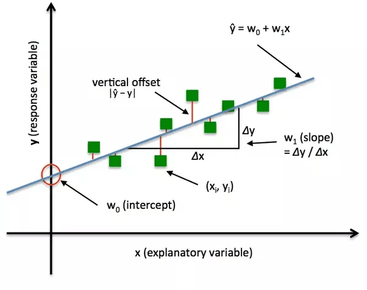

## Table of Contents

## What is a loss function in the context of machine learning?

A loss function in machine learning is like a guide that helps the computer learn from its mistakes. It measures how wrong the model's predictions are compared to the actual results. Think of it as a score that tells the model how well it's doing. The lower the score, the better the model is at predicting the right answers. The model tries to adjust itself to make this score as low as possible.

There are different types of loss functions depending on what kind of problem you're solving. For example, in a problem where you're trying to predict a number, like the price of a house, you might use a loss function called Mean Squared Error (MSE). This function calculates the average of the squares of the errors between the predicted and actual values. It's written as $$ \text{MSE} = \frac{1}{n} \sum_{i=1}^{n} (y_i - \hat{y}_i)^2 $$, where $y_i$ is the actual value, $\hat{y}_i$ is the predicted value, and $n$ is the number of observations. By using this loss function, the model can figure out how to make better predictions over time.

## Why are loss functions important in training machine learning models?

Loss functions are crucial in training machine learning models because they tell the model how far off its predictions are from the actual results. Imagine you're trying to hit a target with a dart. The loss function is like the distance between where your dart lands and the bullseye. By knowing this distance, the model can figure out how to adjust its aim, or in other words, how to change its parameters to make better predictions next time. Without a loss function, the model wouldn't know if it's getting better or worse at its job.

The process of using the loss function to improve the model is called optimization. The model tries different ways of adjusting its parameters to minimize the loss function. For example, if you're using a loss function like Mean Squared Error (MSE), which is calculated as $$ \text{MSE} = \frac{1}{n} \sum_{i=1}^{n} (y_i - \hat{y}_i)^2 $$, the model will tweak its parameters to make this value as small as possible. This iterative process of minimizing the loss helps the model learn from its mistakes and get better at making accurate predictions over time.

## What are the basic types of loss functions and their applications?

Loss functions come in different types, each suited for different kinds of problems. One common type is the Mean Squared Error (MSE), which is used for regression problems where you're trying to predict a number, like the price of a house. MSE calculates the average of the squares of the errors between the predicted and actual values. It's written as $$ \text{MSE} = \frac{1}{n} \sum_{i=1}^{n} (y_i - \hat{y}_i)^2 $$, where $y_i$ is the actual value, $\hat{y}_i$ is the predicted value, and $n$ is the number of observations. MSE is great for problems where larger errors are more important to penalize.

Another type is the Binary Cross-Entropy loss, which is used for binary classification problems, where you're trying to predict one of two outcomes, like whether an email is spam or not. This loss function measures the difference between the predicted probabilities and the actual class labels. It's calculated as $$ \text{Binary Cross-Entropy} = -\frac{1}{n} \sum_{i=1}^{n} [y_i \log(\hat{y}_i) + (1 - y_i) \log(1 - \hat{y}_i)] $$, where $y_i$ is the actual label (0 or 1), and $\hat{y}_i$ is the predicted probability. This loss function helps the model learn to assign higher probabilities to the correct class.

Lastly, there's the Categorical Cross-Entropy loss, used for multi-class classification problems, where you're trying to predict one out of several possible outcomes, like classifying different types of animals. It's similar to Binary Cross-Entropy but extended to multiple classes. It's calculated as $$ \text{Categorical Cross-Entropy} = -\frac{1}{n} \sum_{i=1}^{n} \sum_{j=1}^{k} y_{ij} \log(\hat{y}_{ij}) $$, where $y_{ij}$ is the actual label for class $j$ of sample $i$, $\hat{y}_{ij}$ is the predicted probability for class $j$, $n$ is the number of samples, and $k$ is the number of classes. This loss function helps the model learn to distribute probabilities correctly across all classes.

## How does the Huber loss function differ from the Mean Squared Error?

The Huber loss function and the Mean Squared Error (MSE) are both used to measure the error in regression problems, but they handle errors differently. MSE treats all errors the same way, no matter how big or small they are. It squares the difference between the predicted and actual values, so larger errors are penalized more heavily. The formula for MSE is $$ \text{MSE} = \frac{1}{n} \sum_{i=1}^{n} (y_i - \hat{y}_i)^2 $$. This can be useful when you want to focus on getting the big errors right, but it can be sensitive to outliers because the squared term makes them much bigger.

On the other hand, the Huber loss function is less sensitive to outliers. It uses a different approach to penalize errors. For small errors, it works like MSE and squares the errors. But for bigger errors, it switches to using the absolute value of the error instead of squaring it. This makes the Huber loss less affected by very large errors. The formula for the Huber loss is $$ \text{Huber}(y_i, \hat{y}_i) = \begin{cases} \frac{1}{2}(y_i - \hat{y}_i)^2 & \text{if } |y_i - \hat{y}_i| \leq \delta \\ \delta(|y_i - \hat{y}_i| - \frac{1}{2}\delta) & \text{otherwise} \end{cases} $$, where $\delta$ is a parameter that decides when to switch from squaring to using the absolute value. This makes the Huber loss a good choice when your data might have some outliers that you don't want to affect your model too much.

## What is Focal Loss and how does it address class imbalance?

Focal Loss is a special kind of loss function that helps when you have a lot more examples of one class than another, which is called class imbalance. In normal situations, a model might focus too much on the common class and not learn well about the rare class. Focal Loss changes this by making the model pay more attention to the examples it gets wrong, especially the hard ones from the rare class. It does this by adding a [factor](/wiki/factor-investing) that reduces the loss for the examples the model is already good at predicting correctly. This way, the model can learn better from the examples it struggles with.

The formula for Focal Loss is $$ \text{FL}(p_t) = -\alpha_t (1 - p_t)^\gamma \log(p_t) $$. Here, $p_t$ is the model's estimated probability for the correct class. The term $\alpha_t$ is a weighting factor that helps balance the importance of different classes, and $\gamma$ is a focusing parameter that makes the model focus more on hard, misclassified examples. By adjusting these parameters, you can make the model learn better from the rare class examples, which helps solve the class imbalance problem.

## Can you explain the concept of Cycle Consistency Loss and its use in GANs?

Cycle Consistency Loss is a special kind of loss used in a type of [machine learning](/wiki/machine-learning) called Generative Adversarial Networks (GANs), especially in tasks like image translation. Imagine you have two images, one of a horse and one of a zebra. You want to use a GAN to turn the horse into a zebra and then back into a horse. Cycle Consistency Loss makes sure that after you turn the horse into a zebra and then back, it looks like the original horse again. It helps the GAN learn to make changes that can be reversed, which is important for keeping the original information intact.

In GANs, Cycle Consistency Loss is calculated by comparing the original image to the image that has been transformed and then transformed back. The formula for Cycle Consistency Loss is $$ \mathcal{L}_{\text{cyc}}(G, F) = \mathbb{E}_{x \sim p_{\text{data}}(x)}[\|F(G(x)) - x\|_1] + \mathbb{E}_{y \sim p_{\text{data}}(y)}[\|G(F(y)) - y\|_1] $$. Here, $G$ and $F$ are the two generators in the GAN, $x$ and $y$ are the original images from two different domains, and $\| \cdot \|_1$ is the L1 norm, which measures the difference between the images. By minimizing this loss, the GAN learns to make transformations that preserve the essential features of the original images, making it useful for tasks where maintaining the original content is crucial.

## What is Triplet Loss and how is it used in metric learning?

Triplet Loss is a special way to train a machine learning model to understand how similar or different things are. It's used in something called metric learning, which is all about teaching a model to measure distances between things. Imagine you want a computer to recognize different people's faces. Triplet Loss helps by showing the model three pictures at a time: one picture of a person (the anchor), another picture of the same person (the positive example), and a picture of a different person (the negative example). The goal is to make the model see the anchor and positive example as very similar, and the anchor and negative example as very different.

The way Triplet Loss works is by calculating a special kind of loss that pushes the model to make the distance between the anchor and the positive example smaller than the distance between the anchor and the negative example. The formula for Triplet Loss is $$ \mathcal{L} = \max(d(a, p) - d(a, n) + \text{margin}, 0) $$. Here, $d(a, p)$ is the distance between the anchor and the positive example, $d(a, n)$ is the distance between the anchor and the negative example, and "margin" is a number that sets how much more different the anchor and negative example should be compared to the anchor and positive example. By using this loss, the model learns to group similar things together and keep different things apart, which is really useful for tasks like face recognition or finding similar products in a store.

## How does the GAN Least Squares Loss function improve upon traditional GAN losses?

The GAN Least Squares Loss function, also known as LSGAN, helps make Generative Adversarial Networks (GANs) work better than they do with traditional losses like the Binary Cross-Entropy loss. In regular GANs, the generator and discriminator play a game where the generator tries to make fake images that look real, and the discriminator tries to tell them apart from real images. But sometimes, this can lead to problems like the generator making images that are too blurry or the training not being stable. LSGAN fixes this by using a different way to measure how good the generator and discriminator are doing. Instead of trying to fool the discriminator completely, LSGAN makes the generator aim for making images that are as close as possible to real ones, which makes the training smoother and the results better.

The main idea behind LSGAN is to use a least squares approach instead of the usual binary classification. In traditional GANs, the loss function for the discriminator is something like $$ \mathcal{L}_D = -\frac{1}{2}\mathbb{E}_{x \sim p_{\text{data}}(x)}[\log D(x)] - \frac{1}{2}\mathbb{E}_{z \sim p_z(z)}[\log(1 - D(G(z)))] $$, and for the generator, it's $$ \mathcal{L}_G = -\frac{1}{2}\mathbb{E}_{z \sim p_z(z)}[\log D(G(z))] $$. But in LSGAN, the loss functions are changed to least squares versions. For the discriminator, it becomes $$ \mathcal{L}_D = \frac{1}{2}\mathbb{E}_{x \sim p_{\text{data}}(x)}[(D(x) - 1)^2] + \frac{1}{2}\mathbb{E}_{z \sim p_z(z)}[(D(G(z)))^2] $$, and for the generator, it's $$ \mathcal{L}_G = \frac{1}{2}\mathbb{E}_{z \sim p_z(z)}[(D(G(z)) - 1)^2] $$. This change makes the training more stable and helps the generator produce higher quality images because it's trying to minimize the squared difference between its outputs and the real data, rather than just trying to fool the discriminator.

## What is InfoNCE and how is it used in contrastive learning?

InfoNCE is a type of loss function used in a machine learning technique called contrastive learning. Contrastive learning is all about teaching a model to tell the difference between similar and different things. Imagine you're showing the model two pictures: one of a cat and another of the same cat from a different angle. You want the model to understand that these two pictures are similar. At the same time, if you show a picture of a dog, the model should see it as different from the cat pictures. InfoNCE helps the model learn this by comparing a "positive pair" (like the two cat pictures) with many "negative pairs" (like the cat and dog pictures). It does this by trying to make the model's score for the positive pair higher than the scores for all the negative pairs.

The formula for InfoNCE loss is $$ \mathcal{L}_{\text{InfoNCE}} = -\mathbb{E}_{(x, x^+) \sim p_{\text{pos}}, \{x_i^-\}_{i=1}^K \sim p_{\text{neg}}} \left[ \log \frac{\exp(\text{sim}(f(x), f(x^+)) / \tau)}{\exp(\text{sim}(f(x), f(x^+)) / \tau) + \sum_{i=1}^K \exp(\text{sim}(f(x), f(x_i^-)) / \tau)} \right] $$. In this formula, $x$ is the anchor, $x^+$ is the positive example, and $\{x_i^-\}$ are the negative examples. The function $f$ turns these examples into something the model can compare, and $\text{sim}$ measures how similar two things are. The term $\tau$ is a temperature parameter that adjusts how much the model focuses on the differences. By using this loss, the model learns to group similar things together and keep different things apart, which is really helpful for tasks like finding similar images or understanding different kinds of data.

## What are the differences between NT-Xent and InfoNCE loss functions?

NT-Xent and InfoNCE are both loss functions used in contrastive learning, which helps models learn to tell the difference between similar and different things. The main difference between them is how they handle the positive and negative examples. NT-Xent, or Normalized Temperature-scaled Cross Entropy Loss, is a specific version of InfoNCE where the representations of the data are normalized to have a length of 1. This normalization helps make the learning process more stable and can lead to better results. NT-Xent focuses on making sure the model pays attention to all the negative examples equally, which can be good when you have a lot of them.

The formula for NT-Xent is similar to InfoNCE but with an extra step of normalizing the representations. It looks like this: $$ \mathcal{L}_{\text{NT-Xent}} = -\mathbb{E}_{(x_i, x_j) \sim p_{\text{pos}}} \left[ \log \frac{\exp(\text{sim}(f(x_i), f(x_j)) / \tau)}{\sum_{k=1}^{2N} \mathbb{1}_{[k \neq i]} \exp(\text{sim}(f(x_i), f(x_k)) / \tau)} \right] $$. Here, $x_i$ and $x_j$ are a positive pair, and $f$ turns these examples into normalized vectors. The term $\mathbb{1}_{[k \neq i]}$ makes sure the model doesn't compare an example to itself. The temperature $\tau$ is used to control how much the model focuses on the differences. By normalizing the vectors, NT-Xent makes sure the model's scores for different examples are on the same scale, which can make the training smoother and more effective.

## How does ArcFace improve upon traditional softmax loss in face recognition?

ArcFace improves upon traditional softmax loss in face recognition by making the model better at telling different faces apart. In traditional softmax loss, the model tries to match a face to a specific person by figuring out which category the face belongs to. But sometimes, the model can get confused between similar faces because it's not paying attention to the exact differences. ArcFace fixes this by adding a special angle to the model's calculations, which makes it focus more on the unique features of each face. This helps the model create a bigger gap between different faces, making it easier to tell them apart.

The way ArcFace works is by using a formula that includes an angle called the "additive angular margin." The formula for ArcFace loss is $$ \mathcal{L} = -\frac{1}{N} \sum_{i=1}^N \log \frac{e^{s(\cos(\theta_{y_i} + m))}}{e^{s(\cos(\theta_{y_i} + m))} + \sum_{j \neq y_i} e^{s \cos \theta_j}} $$. Here, $\theta_{y_i}$ is the angle between the feature of the face and the weight of the correct class, $m$ is the margin that makes the angle bigger, and $s$ is a scale factor. By adding this margin, ArcFace makes sure the model learns to recognize faces more accurately, even when the faces are very similar. This improvement makes ArcFace a popular choice for face recognition systems where telling people apart is really important.

## What is the Supervised Contrastive Loss and how does it enhance model performance in supervised settings?

Supervised Contrastive Loss is a way to train machine learning models that helps them understand the differences between different things better, even when you tell the model exactly what each thing is. Imagine you're teaching a model to recognize different kinds of fruits. With regular methods, the model might just focus on grouping all apples together and all oranges together. But with Supervised Contrastive Loss, you show the model not just the fruits it needs to recognize, but also many other fruits at the same time. This helps the model learn that apples are more like each other than they are like oranges, and so on. It does this by making the model pull similar fruits closer together and push different fruits further apart in its understanding.

The way Supervised Contrastive Loss works is by using a special formula that compares how the model sees different examples. The formula is $$ \mathcal{L}_{\text{SupCon}} = \sum_{i \in I} \frac{-1}{|P(i)|} \sum_{p \in P(i)} \log \frac{\exp(\text{sim}(z_i, z_p) / \tau)}{\sum_{a \in A(i)} \exp(\text.sim(z_i, z_a) / \tau)} $$. Here, $z_i$ is the model's understanding of one example, $z_p$ is the understanding of another example from the same class, and $z_a$ is the understanding of any other example. The term $\text.sim$ measures how similar two examples are, and $\tau$ is a number that helps the model focus on the right things. By using this loss, the model can learn better from the examples you show it, which makes it perform better at recognizing different things in supervised settings.

## References & Further Reading

[1]: Goodfellow, I., Bengio, Y., & Courville, A. (2016). [Deep Learning.](https://link.springer.com/article/10.1007/s10710-017-9314-z) MIT Press.

[2]: Murphy, K. P. (2012). [Machine Learning: A Probabilistic Perspective.](https://www.cs.ubc.ca/~murphyk/MLbook/pml-toc-1may12.pdf) MIT Press.

[3]: Chollet, F. (2018). [Deep Learning with Python.](https://www.amazon.com/Deep-Learning-Python-Francois-Chollet/dp/1617294438) Manning Publications.

[4]: Paszke, A., Gross, S., Massa, F., Lerer, A., Bradbury, J., Chanan, G., ... & Chintala, S. (2019). [PyTorch: An Imperative Style, High-Performance Deep Learning Library.](https://arxiv.org/abs/1912.01703) Advances in Neural Information Processing Systems 32.

[5]: He, K., Zhang, X., Ren, S., & Sun, J. (2016). [Deep Residual Learning for Image Recognition.](https://ieeexplore.ieee.org/document/7780459) In Proceedings of the IEEE Conference on Computer Vision and Pattern Recognition (CVPR).

[6]: Kingma, D.P., & Ba, J. (2014). [Adam: A Method for Stochastic Optimization.](https://arxiv.org/abs/1412.6980). arXiv preprint arXiv:1412.6980.

[7]: Lin, T. Y., Goyal, P., Girshick, R., He, K., & Dollár, P. (2017). [Focal Loss for Dense Object Detection.](https://ieeexplore.ieee.org/document/8237586) IEEE Transactions on Pattern Analysis and Machine Intelligence.

[8]: Schroff, F., Kalenichenko, D., & Philbin, J. (2015). [FaceNet: A Unified Embedding for Face Recognition and Clustering.](https://ieeexplore.ieee.org/document/7298682) In Proceedings of the IEEE Conference on Computer Vision and Pattern Recognition (CVPR).

[9]: Wang, Y., & Isola, P. (2020). [Understanding Contrastive Representation Learning through Alignment and Uniformity on the Hypersphere.](https://arxiv.org/abs/2005.10242) arXiv preprint arXiv:2005.10242.

[10]: Yu, F., Koltun, V., & Funkhouser, T. (2019). [Cycle-Consistent Adversarial Networks for Unpaired Image-to-Image Translation.](https://arxiv.org/abs/1703.10593) In Proceedings of the IEEE Conference on Computer Vision and Pattern Recognition (CVPR).