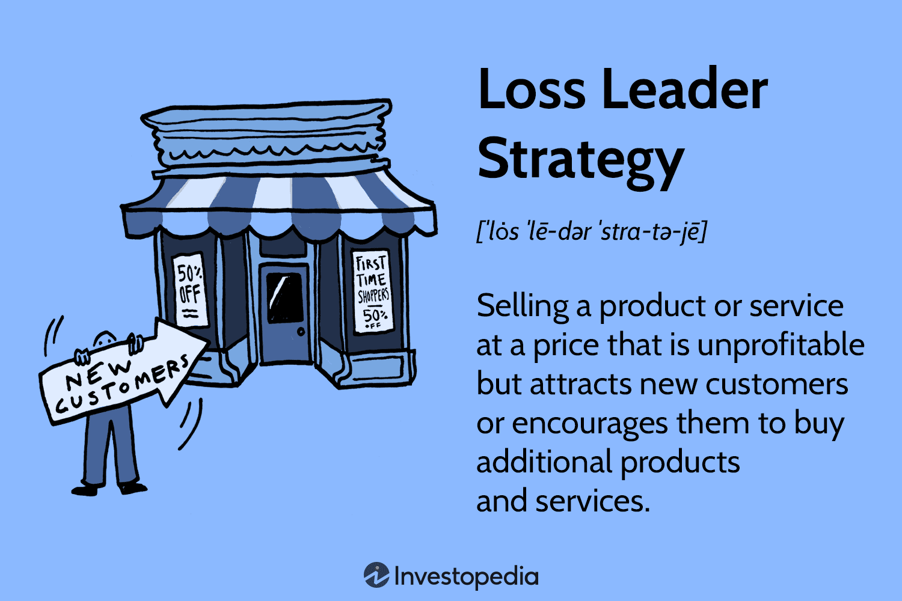

## Table of Contents

## What is a loss leader strategy in retail?

A loss leader strategy in retail is when a store sells a product at a lower price than it costs them to buy or make it. The idea is to attract more customers into the store with this cheap product. Once customers are in the store, they might buy other things that make more profit for the store. For example, a supermarket might sell milk at a very low price to get people in the door, hoping they will also buy more expensive items like cheese or snacks.

This strategy can be risky because the store loses money on the loss leader product. But if it brings in enough extra customers and they buy enough other things, the store can still make a profit overall. It's like a balancing act. The store needs to be careful that the loss on the leader item doesn't outweigh the gains from other sales. If done right, a loss leader can help a store stand out and attract more business.

## How does a loss leader strategy work?

A loss leader strategy is when a store sells a product for less than it costs them to get it. They do this to bring more people into their store. The idea is that once people are inside, they will buy other things that the store sells at a higher price. This way, the store can make up for the money they lost on the cheap product. For example, a store might sell a popular toy at a very low price during the holidays to get parents to come in, hoping they will also buy clothes or other toys that cost more.

This strategy can be tricky because the store loses money on the product they sell cheap. They need to make sure that enough people come in and buy enough other things to cover that loss. If they can do that, then the loss leader works well. But if not enough people come in or they don't buy enough other stuff, the store could end up losing money overall. It's like a game of balancing the loss on the leader item with the gains from other sales. When done right, it can help a store attract more customers and stand out from other stores.

## What are the benefits of using a loss leader strategy?

Using a loss leader strategy can help a store attract more customers. By selling a popular item at a very low price, the store can get people to come in who might not have visited otherwise. This can be especially useful during slow times or when the store wants to get more people to know about it. Once these new customers are inside, they might explore the store and find other things they want to buy.

Another benefit is that it can help the store sell more of its other products. When people come in for the cheap item, they often end up buying other things too. This can increase the overall sales of the store. If the store can make enough money from these extra sales, it can cover the loss on the leader item and still make a profit. This strategy can also help the store stand out from its competitors by offering great deals that draw people in.

## What are the potential risks and drawbacks of a loss leader strategy?

Using a loss leader strategy can be risky because the store loses money on the product they sell at a low price. If not enough people come into the store or if they don't buy enough other things, the store might not make up for the loss. This could lead to the store losing money overall. It's like trying to balance on a tightrope; if the store doesn't get the balance right, they could fall and lose money.

Another drawback is that other stores might start doing the same thing, which could start a price war. If everyone starts selling their products at very low prices, no one might make a profit. Also, customers might start expecting everything to be cheap, which could hurt the store's profits in the long run. They might only come in for the deals and not buy anything else, making it hard for the store to make money on other items.

## Can you provide examples of successful loss leader strategies in retail?

A well-known example of a successful loss leader strategy is how supermarkets often sell milk at very low prices. They know that almost everyone needs milk, so by selling it cheap, they can get lots of people to come into their store. Once people are there, they might also buy other things like bread, eggs, or snacks that the store makes more money on. This way, the store can make up for the money they lose on the milk and still make a profit.

Another example is how electronics stores like Best Buy sometimes sell video game consoles at a loss. They sell the consoles for less than they cost to get people interested and bring them into the store. Once people are there, they often buy games, accessories, and other electronics that the store sells at a higher price. This helps the store make money overall, even though they lose money on the consoles themselves.

## How do retailers select products to use as loss leaders?

Retailers pick products to be loss leaders based on how popular they are and how much they can attract customers. They look for items that a lot of people want and will come to the store just to buy. For example, a store might choose milk or eggs because almost everyone needs them. By selling these items at a very low price, the store can bring in lots of people who might also buy other things while they are there.

Another thing retailers think about is how the loss leader product fits with the rest of what they sell. They want to pick an item that will make people want to buy other things in the store. For example, if a store sells a video game console at a low price, they hope people will also buy games and accessories that go with it. The goal is to use the loss leader to get people in the door and then make money on the other products they sell.

## What is the impact of a loss leader strategy on overall store profitability?

A loss leader strategy can help a store make more money overall if it works well. By selling a popular item at a very low price, the store can bring in lots of new customers. These customers might buy other things that the store sells at a higher price. If enough people come in and buy enough other stuff, the store can make up for the money they lost on the cheap item and still make a profit. This can be really helpful during slow times or when the store wants to get more people to know about it.

But there are also risks. If not enough people come in or they don't buy enough other things, the store might lose money overall. It's like trying to balance on a tightrope. The store needs to make sure the extra sales cover the loss on the leader item. Also, if other stores start doing the same thing, it could lead to a price war where no one makes a profit. Customers might start expecting everything to be cheap, which could hurt the store's profits in the long run. So, while a loss leader can help attract more customers and boost sales, it needs to be used carefully to make sure it really helps the store's overall profitability.

## How does a loss leader strategy affect customer behavior and loyalty?

A loss leader strategy can change how customers act and feel about a store. When a store sells a popular item at a very low price, it gets people to come in who might not have visited otherwise. People like getting good deals, so they might start coming to the store more often to see what other deals they can find. This can make them more loyal to the store because they know they can find good prices there.

But there are also risks. If customers only come for the cheap items and don't buy anything else, the store might not make enough money. Also, if customers start expecting everything to be cheap, they might get upset if they don't see more deals. This could make them less loyal to the store over time. So, while a loss leader can bring in more customers and make them more loyal at first, the store needs to be careful to keep them happy and coming back.

## What are the legal and ethical considerations when implementing a loss leader strategy?

When using a loss leader strategy, stores need to be careful about the rules and what's fair. In some places, there are laws about how low a store can sell things. These laws are there to stop stores from selling things so cheap that it hurts other stores or makes it hard for them to stay open. Stores need to know these rules and make sure they follow them. If they don't, they could get in trouble.

Also, stores need to think about what's right and fair. Selling things at a loss can seem unfair to other stores, especially small ones that can't do the same thing. It's important for stores to be honest with their customers about why they are selling things so cheap. They shouldn't trick people into thinking everything in the store is always that cheap. Being fair and honest helps keep customers happy and coming back.

## How can a loss leader strategy be integrated into a broader pricing strategy?

A loss leader strategy can be part of a bigger plan for how a store sets its prices. The store might use the loss leader to get people in the door, but they also need to think about how to make money on other things. They can do this by setting higher prices on other products that people often buy together with the loss leader. For example, if a store sells milk at a low price, they might set higher prices on cereal or snacks that people often buy at the same time. This way, the store can make up for the money they lose on the milk and still make a profit overall.

Another part of the bigger plan is to use the loss leader to help the store stand out from others. The store can use the low prices to get more people to come in and try their other products. If customers like what they see, they might come back and buy more things at regular prices. The store needs to make sure they have other products that are good and priced right so that customers keep coming back. By mixing the loss leader with a smart overall pricing plan, the store can attract more customers and make more money in the long run.

## What metrics should retailers monitor to assess the effectiveness of a loss leader strategy?

Retailers should keep an eye on a few key numbers to see if their loss leader strategy is working. One important thing to watch is how many more people come into the store because of the cheap item. They can count how many customers come in during the time they are selling the loss leader and compare it to other times. Another thing to look at is how much more money they make from selling other things. If the loss leader brings in more people and they buy a lot of other stuff, then the strategy is working well.

It's also important to check if the store is making enough money overall. Retailers need to see if the extra money they make from other sales is more than the money they lose on the loss leader. They can do this by looking at their total profits before and after using the loss leader. If the store's profits go up, then the strategy is helping. But if the profits stay the same or go down, the store might need to change their plan. By keeping an eye on these numbers, retailers can tell if their loss leader strategy is a good idea or if they need to try something different.

## How have digital and online retail environments influenced the use of loss leader strategies?

Digital and online retail environments have changed how stores use loss leader strategies. Now, stores can reach a lot more people with their deals because they can advertise them online. This means more people can see the low prices and come to the store's website. Also, online stores can use things like special sales or flash deals to make their loss leaders even more attractive. They can change prices quickly and easily, which helps them test different loss leaders and see what works best.

But there are also new challenges with loss leaders in the online world. Since it's easy for customers to compare prices online, stores have to be careful not to start price wars with other stores. Also, online customers might just buy the loss leader item and nothing else, which can make it harder for the store to make money. Stores need to make sure they have a good plan to get customers to buy other things too. By using smart ways to show related products and offering good deals on other items, online stores can still make loss leaders work well.

## What is the Intersection of Loss Leader and Algo Trading?

Algorithmic trading, often referred to as algo trading, utilizes advanced computational techniques to enhance trading decisions by analyzing market data at speeds impossible for humans. These techniques often incorporate statistical models, [machine learning](/wiki/machine-learning) algorithms, and complex mathematical frameworks to identify profitable trading opportunities. Integrating a loss leader pricing strategy into this framework can provide significant insights into pricing dynamics and consumer behavior, subsequently refining trading strategies in market environments.

One primary method by which loss leader strategies can influence algo trading is through the analysis of market reactions to price changes. When a product is intentionally underpriced to function as a loss leader, it may trigger specific behavioral patterns among consumers, such as increased purchasing of complementary products. Algo trading systems, by being sensitive to these patterns, can detect anomalies or trends that may arise from such pricing strategies, allowing traders to capitalize on these shifts.

For instance, consider a scenario in which a leading e-commerce platform uses a prominent electronic gadget as a loss leader. The [algorithmic trading](/wiki/algorithmic-trading) system can monitor the surge in accompanying accessory sales. By analyzing the correlation between the price reduction of the gadget and the uptick in related products, trading algorithms can be adjusted to predict future sales spikes, not only on the same platform but across competitors and related markets.

Moreover, integrating loss leader strategies within algo trading frameworks can facilitate a deeper understanding of cross-price elasticity. This metric measures how the demand for a product is affected by the price change of another product. By using a loss leader, algo trading systems can evaluate cross-price correlations, thereby optimizing the selection of additional products to trade or invest in. The mathematical relation can be expressed as:

$$
E_{xy} = \frac{\% \Delta Q_x}{\% \Delta P_y}
$$

where $E_{xy}$ is the cross-price elasticity of demand, $\% \Delta Q_x$ represents the percentage change in the quantity demanded of product $x$, and $\% \Delta P_y$ denotes the percentage change in the price of product $y$.

In practice, Python can be leveraged for this purpose through libraries such as NumPy and Pandas. For instance, calculating cross-price elasticity can be done by analyzing sales data before and after the application of a loss leader strategy:

```python
import pandas as pd

# Sample data
data = {'Product': ['Gadget', 'Accessory'],
        'Before_Sales': [1000, 200],
        'After_Sales': [1500, 350],
        'Before_Price': [200, 20],
        'After_Price': [150, 20]}

df = pd.DataFrame(data)

# Calculate percentage changes
df['%_Change_Sales'] = (df['After_Sales'] - df['Before_Sales']) / df['Before_Sales'] * 100
df['%_Change_Price'] = (df['After_Price'] - df['Before_Price']) / df['Before_Price'] * 100

# Cross-price elasticity between Gadget price and Accessory sales
cross_price_elasticity = df.at[1, '%_Change_Sales'] / df.at[0, '%_Change_Price']
cross_price_elasticity
```

This example measures the elasticity of sales for accessories in response to the price change of a gadget, identifying valuable market insights.

In conclusion, by integrating the principles of loss leader strategies with algo trading, businesses are afforded a nuanced lens through which they can interpret market data, refine pricing models, and enhance customer acquisition strategies. This synergy not only optimizes immediate trade efficiencies but also fosters long-term strategic advantages in the competitive retail environment.

## What are the benefits and risks of using a Loss Leader Strategy?

The loss leader pricing strategy offers various benefits and risks that need careful consideration for successful implementation. 

### Benefits

One of the primary benefits of the loss leader strategy is increased customer traffic. By offering products at significantly reduced prices, businesses can attract a substantial number of customers to their stores or online platforms. This influx of potential buyers creates an opportunity for cross-selling and upselling higher-margin products. For instance, a retailer might sell a popular electronic gadget at a loss to draw customers, who may then proceed to purchase accessories or additional warranties at full price, thereby compensating for the initial loss.

Customer acquisition is another advantage of this strategy. By lowering the entry price barrier, businesses can convert first-time visitors into repeat customers, fostering brand loyalty over time. This is particularly effective in environments where customer retention plays a crucial role in long-term profitability. Moreover, the initial financial sacrifice can be offset by the Customer Lifetime Value (CLTV), which measures the total net profit attributed to a customer over the entire duration of their relationship with the business.

### Risks

Despite its advantages, the loss leader strategy carries significant risks. A prominent concern is the potential for financial strain. Selling products below cost without a strategy to recapture the lost revenue can severely impact the bottom line. Retailers must ensure that the increase in [volume](/wiki/volume-trading-strategy) or subsequent sales offsets these initial losses. The break-even point, calculated as:

$$
\text{Break-Even Quantity} = \frac{\text{Fixed Costs}}{\text{Revenue per Unit} - \text{Variable Cost per Unit}}
$$

is a critical metric to determine how feasible this strategy is for a given product.

Another risk is the initiation of price wars. Competitors may retaliate by lowering their prices, which can lead to a downward spiral, negatively affecting profit margins across the sector. This risk is particularly acute in industries with low differentiation where price plays a significant role in consumer decision-making.

### Case Studies

Amazon and Costco provide illustrative examples of the diverse outcomes of using loss leader tactics. Amazon famously uses this strategy through its Kindle devices, sold at or below manufacturing costs. The goal is to drive sales of digital content, such as e-[books](/wiki/algo-trading-books), which have high-profit margins and encourage user retention within Amazon's ecosystem. This approach has largely been successful, contributing to Amazon's dominance in the digital content market.

In contrast, Costco uses a loss leader approach with certain staple items to drive membership sales. Its model relies on offering limited products with significant discounts, luring customers to purchase memberships and buy in bulk. While Costco has achieved substantial success, it illustrates the importance of maintaining control over costs and ensuring that the membership model offsets the lower margins of discounted products.

Ultimately, the success of the loss leader strategy is contingent upon careful planning and execution, taking into account both the financial implications and competitive dynamics of the market.

## What are the Analytical Tools and Techniques for Implementation?

Analytical tools and techniques are crucial in effectively implementing a loss leader pricing strategy. These tools allow retailers to optimize their approach, ensuring both customer acquisition and profitability. Key methods include Customer Lifetime Value (CLTV) analysis, Break-Even Analysis, data mining, basket analysis, and A/B testing.

Customer Lifetime Value (CLTV) analysis is essential for understanding the total worth of a customer over their entire relationship with a business. By estimating the net profit attributed to the entire future relationship with a customer, retailers can justify the initial loss from a loss leader strategy. CLTV is calculated using:

$$

CLTV = \frac{{\text{Average Purchase Value} \times \text{Purchase Frequency} \times \text{Customer Lifespan}}}{\text{Customer Acquisition Cost}} 
$$

This formula helps identify the long-term value generated by attracting customers with a loss leader product, allowing businesses to determine whether the initial losses are offset by subsequent purchases of higher-margin items.

Break-Even Analysis is another vital tool, used to determine the point at which total revenue equals total costs, indicating no net loss or gain. This analysis helps retailers set the appropriate pricing for loss leader items, ensuring that while initial offerings might be sold at a loss, the overall sales strategy remains profitable. The break-even point (BEP) can be calculated using:

$$

BEP = \frac{\text{Fixed Costs}}{\text{Price per Unit} - \text{Variable Cost per Unit}} 
$$

Data mining and basket analysis enable retailers to understand customer purchasing behaviors and optimize product placements. By analyzing transaction data, retailers can identify patterns and correlations between purchased items, enhancing cross-selling strategies. For instance, if customers frequently purchase a specific pair of items together, placing them in proximity or offering bundled discounts can drive additional sales.

A/B testing is a method of experimentation wherein two versions (A and B) are compared to determine which performs better. In the context of a loss leader strategy, A/B testing allows retailers to experiment with different pricing, marketing messages, or product placements to evaluate their impact on customer behavior and sales. For example, by testing two different promotional approaches to a loss leader product, a retailer can identify which strategy results in better customer acquisition or higher sales of complementary products.

Implementing these analytical tools and techniques ensures that the loss leader strategy is not just an exercise in reducing prices but a data-driven approach to boosting overall profitability. By leveraging these methods, retailers can make informed decisions, optimizing their strategy to enhance both customer experience and financial outcomes.

## References & Further Reading

[1]: ["Advances in Financial Machine Learning"](https://www.amazon.com/Advances-Financial-Machine-Learning-Marcos/dp/1119482089) by Marcos Lopez de Prado

[2]: ["Evidence-Based Technical Analysis: Applying the Scientific Method and Statistical Inference to Trading Signals"](https://www.amazon.com/Evidence-Based-Technical-Analysis-Scientific-Statistical/dp/0470008741) by David Aronson

[3]: ["Machine Learning for Algorithmic Trading"](https://github.com/stefan-jansen/machine-learning-for-trading) by Stefan Jansen

[4]: ["Quantitative Trading: How to Build Your Own Algorithmic Trading Business"](https://www.amazon.com/Quantitative-Trading-Build-Algorithmic-Business/dp/1119800064) by Ernest P. Chan