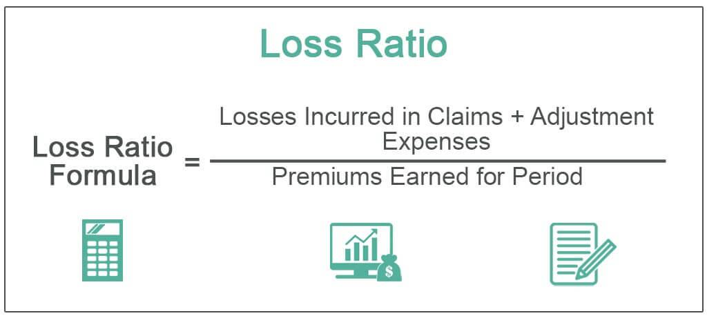

In the dynamic landscapes of insurance and financial markets, understanding key metrics is crucial for navigating complex decision-making processes. This article explores the intersection of insurance metrics, specifically the loss ratio, with algorithmic trading strategies in the financial market. Recognizing the critical role that loss ratios play in insurance, these metrics offer insights into the financial health of companies by evaluating the proportion of incurred losses and expenses against total earned premiums.

Algorithmic trading, on the other hand, represents a transformative force in financial markets, utilizing automated systems to enhance the speed and efficiency of trading activities. The synergy between these trading strategies and insurance metrics like loss ratios has the potential to revolutionize capital allocation and risk management for insurers and investors. By integrating these methodologies, stakeholders can harness data-driven insights to refine their financial strategies and ensure better resource deployment.



Understanding concepts such as loss ratio calculations and algorithmic trading not only demystifies complex financial strategies but also equips insurers and investors with vital tools for informed decision-making. This knowledge is indispensable for optimizing profitability and addressing the evolving challenges within insurance and financial domains, reflecting a consistent drive towards innovative practices in risk management.

## Table of Contents

## Understanding Insurance Loss Ratios

Loss ratio is a critical performance metric in the insurance industry. It represents the proportion of incurred losses and related expenses compared to the total premiums an insurance company earns over a specific period. Its primary purpose is to assess how effectively an insurer is managing and pricing its products.

The formula for calculating loss ratio is straightforward:

$$
\text{Loss Ratio} = \frac{\text{Incurred Losses} + \text{Adjustment Expenses}}{\text{Total Earned Premiums}}
$$

In this equation, "Incurred Losses" refers to the payouts an insurer has made for claims, while "Adjustment Expenses" encompass the costs related to processing those claims. "Total Earned Premiums" indicates the revenue generated from the insurance policies sold.

A lower loss ratio signifies that a company has effectively priced its policies and controlled claims expenses, while a high loss ratio may indicate issues with product pricing or claims management. For insurers, maintaining an optimal balance is critical to ensure profitability and competitive pricing strategies.

Understanding and calculating the loss ratio aids insurance companies in evaluating their financial health and operational efficiency. It provides essential insights for insurers to strategize improvements in their claims management processes and refine pricing models to mitigate risks while maximizing profitability.

## Types of Loss Ratios

Different types of loss ratios exist within the insurance industry, each catering to various aspects of insurance policies. Two primary types are the medical loss ratio and the commercial insurance loss ratio. 

The medical loss ratio (MLR) is particularly significant in the health insurance sector. It represents the percentage of premium income that an insurer spends on clinical services and healthcare quality improvements. This ratio is crucial for ensuring that a substantial portion of premium dollars is utilized for the benefit of policyholders. Regulatory frameworks, such as the Affordable Care Act in the United States, impose standards on the MLR to protect consumers. Typically, the MLR is calculated as:

$$
\text{MLR} = \left( \frac{\text{Claims Paid} + \text{Quality Improvement Expenditures}}{\text{Total Premiums Collected}} \right) \times 100
$$

For individual and small group markets, insurers are generally required to maintain an MLR of at least 80%, while in the large group market, the required MLR is typically higher, around 85%. Failure to meet these thresholds often requires insurers to provide rebates to policyholders.

On the other hand, the commercial insurance loss ratio pertains to other types of insurance products such as property, casualty, or liability insurance. Unlike the medical loss ratio, the commercial insurance loss ratio does not typically involve regulatory mandates. Instead, it serves as a critical metric for insurers to evaluate their underwriting effectiveness and pricing strategies. This ratio is calculated by:

$$
\text{Commercial Loss Ratio} = \left( \frac{\text{Incurred Losses} + \text{Loss Adjustment Expenses}}{\text{Earned Premiums}} \right) \times 100
$$

Understanding these specific ratios is essential for tailoring effective risk management strategies. A high loss ratio might indicate that premiums are not adequately covering claims, pointing towards potential issues in pricing or risk selection. Conversely, a low loss ratio could suggest overpricing, which may impact competitiveness. Different insurance sectors rely on these tailored metrics to ensure financial stability and to refine their product offerings in response to market demands and regulatory changes.

## Algorithmic Trading in Financial Markets

Algorithmic trading refers to the use of computer algorithms to automate trading decisions in financial markets. These algorithms are designed to follow pre-set rules and statistical models to execute trades at optimal prices and speeds, drastically improving the efficiency of financial transactions. The process minimizes human intervention, thereby reducing errors and enabling a faster reaction to market changes.

This approach leverages computational power to analyze vast datasets, identifying patterns and trends that may not be discernible through manual analysis. The rapid processing capabilities of [algorithmic trading](/wiki/algorithmic-trading) allow for the deployment of trading strategies in real-time, adjusting positions based on dynamic market conditions. This real-time adaptability is achieved through continuous environment assessment, where the algorithms are programmed to react to events like price fluctuations, [volume](/wiki/volume-trading-strategy) changes, or news releases.

One significant advantage of algorithmic trading is its ability to execute large orders across different markets while managing impacts like slippage and market [volatility](/wiki/volatility-trading-strategies). The algorithms can break down a significant order into smaller parts, executing them over time or at particular price levels, thus maximizing the trading effectiveness and minimizing market impact.

In recent years, algorithmic trading has increasingly intersected with the insurance industry, particularly in the area of investment management. Insurance companies manage massive investment portfolios, and the integration of algorithmic trading offers a sophisticated tool for optimizing these investments. By applying data-driven insights, insurers can enhance their investment choices, aligning them with specific risk-return profiles determined by the quantitative strategies of these algorithms.

The use of algorithmic trading within the insurance sector introduces the potential for creating models that can simulate various risk scenarios and predict their financial implications. This capability aids in informed decision-making, enabling insurers to adjust their investment strategies proactively. Furthermore, the use of algorithms facilitates the exploration of novel investment opportunities and the diversification of investment portfolios by automating asset selection and allocation processes.

Despite its advantages, algorithmic trading also poses certain challenges, including the complexity of the algorithms and the requirement for continuous monitoring and updating. Moreover, the reliance on high-speed connectivity and robust computational infrastructure is paramount for maintaining the efficiency and effectiveness of these systems.

Overall, algorithmic trading is transforming the landscape of financial markets and providing a powerful tool for improving decision-making processes in investment activities. Its integration with insurance investments stands to enhance the strategic capabilities of insurers, offering them the agility and precision required to navigate the uncertainties of the financial markets.

## Integration of Loss Ratios with Algo Trading

Combining loss ratios with algorithmic trading principles offers a sophisticated approach for insurers aiming to enhance their risk assessment and adjust premium pricing more accurately. By leveraging advanced algorithms, insurers have the potential to incorporate loss ratio data into their trading models to uncover trends and patterns that offer deeper insights into investment strategies.

The use of algorithmic trading allows for real-time analysis and execution of trades, which is pivotal in integrating insurance metrics such as loss ratios. These algorithms are designed to process vast amounts of data at high speeds, detecting subtle market signals that might elude manual analysis. For example, a Python-based algorithm could be constructed to automatically assess loss ratios alongside other economic indicators, adapting investment strategies on-the-fly to optimize returns. A simplified Python snippet illustrating this concept might look like:

```python
import numpy as np

# Hypothetical function to calculate loss ratio
def calculate_loss_ratio(insurance_claims, premiums_earned):
    return np.divide(insurance_claims, premiums_earned)

# Sample data
claims = np.array([100000, 150000, 200000])
premiums = np.array([120000, 180000, 220000])

# Calculate loss ratio
loss_ratios = calculate_loss_ratio(claims, premiums)

# Algorithmic trading logic
def trading_strategy(loss_ratios):
    for lr in loss_ratios:
        if lr > 0.9:  # Example threshold
            print("Sell to manage risk.")
        else:
            print("Buy to maximize return.")

# Execute trading strategy based on calculated loss ratios
trading_strategy(loss_ratios)
```

This integration enables insurers and investors to respond swiftly to market fluctuations, maximizing returns while simultaneously managing risks effectively. By translating loss ratio data into actionable trading insights, algorithms can provide insurers with an analytical edge in adapting to changes in both the insurance and financial markets.

The ability to dynamically adjust investment strategies based on real-time loss ratio data ensures that insurers not only maintain profitability but also bolster their pricing models and risk management strategies. This symbiotic relationship between insurance metrics and financial market analysis could significantly reshape how insurers approach capital allocation and growth strategies in the ever-evolving financial landscape.

## Challenges and Future Directions

The integration of algorithmic trading with insurance metrics such as loss ratios presents several challenges, largely due to the dynamic nature of financial markets and the complexity of AI technologies. One primary concern is the increased market volatility. Algorithmic trading systems, by executing large volumes of transactions in milliseconds, can potentially exacerbate market swings. This can lead to significant risks for insurance companies, which rely heavily on stable investment returns to meet their claims obligations.

Ethical concerns regarding AI algorithms also play a significant role. Algorithms operate on predefined parameters and historical data, which can inadvertently incorporate biases. This raises questions on fairness and transparency, especially in contexts like premium pricing and risk assessment where biased decisions can have real-world, adverse impacts on policyholders.

Maintaining regulatory compliance and ethical standards is crucial as AI becomes more integrated into decision-making processes. Regulatory bodies continuously evolve their frameworks to address these new technological capabilities. Insurers and financial organizations must ensure that their algorithms not only comply with current regulations but are also adaptable to future changes in the regulatory landscape. Transparency in algorithmic decision-making, therefore, is not only an ethical imperative but also a regulatory necessity.

Looking forward, we can expect future advancements in AI and algorithmic trading to address some of these challenges. The development of more sophisticated algorithms may provide improved precision in risk assessment and decision-making processes. Advances in [machine learning](/wiki/machine-learning) and data analytics can enhance algorithms to better predict market trends and tailor insurance products to individual needs. This personalization of insurance products can lead to more accurate premium pricing and tailored risk management strategies.

Furthermore, as computational power grows and data becomes increasingly available, predictive models may evolve to process new types of data, potentially revolutionizing the insurance sector's ability to respond to changing market conditions. With these advancements, an ongoing dialogue between stakeholders, regulators, and technologists is essential to balance innovation with responsible risk management and ethical compliance.

## Conclusion

The integration of insurance metrics like loss ratios with algorithmic trading offers considerable potential for advancing financial analysis and investment strategies within the insurance sector. The precise understanding and application of these tools enable stakeholders to make informed and strategic decisions, ultimately enhancing both profitability and operational efficiency. 

Algorithmic trading leverages data-driven insights to optimize investment decisions quickly and effectively. By incorporating insurance loss ratios into algorithmic trading frameworks, companies can improve their risk assessment capabilities and adjust premium pricing with notable accuracy. These systems can detect trends and signals that might otherwise be overlooked, providing insurers with a competitive edge in identifying profitable opportunities and threats early.

As technology continues to evolve, maintaining a balance between innovative approaches and effective risk management becomes increasingly critical. The deployment of advanced data analytics and AI-driven algorithms necessitates stringent ethical standards and regulatory compliance. Stakeholders must remain vigilant against technological overreach that may inadvertently increase market volatility or result in ethically questionable decisions. The development of increasingly sophisticated algorithms, along with personalized insurance products, is anticipated to enhance precision in risk assessment, thereby improving decision-making processes.

Ultimately, the fusion of insurance metrics with cutting-edge trading technologies signifies a transformative phase for the insurance and finance industries. Navigating this dynamic landscape requires astute strategic planning and a commitment to innovation balanced by a strong emphasis on ethical standards and risk management.

## References & Further Reading

Explore sources such as "The Mathematics of Insurance" by Annamaria Olivia, which provides comprehensive insights into insurance metrics, including loss ratios, and their applications in financial contexts. This text is essential for understanding the mathematical foundations that underpin insurance-related performance indicators, giving readers a structured framework to assess and apply these metrics effectively.

"Algorithmic Trading: Winning Strategies and Their Rationale" by Ernest P. Chan offers a detailed examination of algorithmic trading methodologies, focusing on the strategies and rationales behind their success. This book is an invaluable resource for those seeking to understand how algorithmic trading can optimize investment strategies and manage risks efficiently.

For up-to-date information and best practices on integrating insurance metrics with algorithmic trading, consider consulting industry-specific journals such as The Journal of Risk and Insurance and The Journal of Trading. These publications frequently feature cutting-edge research and case studies, showcasing the latest advancements and practical applications in blending financial metrics with technology-driven trading solutions.

Additionally, engaging with trading strategy guides that discuss the technical and practical aspects of algorithmic trading can deepen one's understanding of how to leverage advanced analytics in insurance and finance. Such guides offer a blend of theoretical knowledge and practical insights, making them useful for both newcomers and seasoned professionals aiming to enhance their strategic decision-making capabilities.

