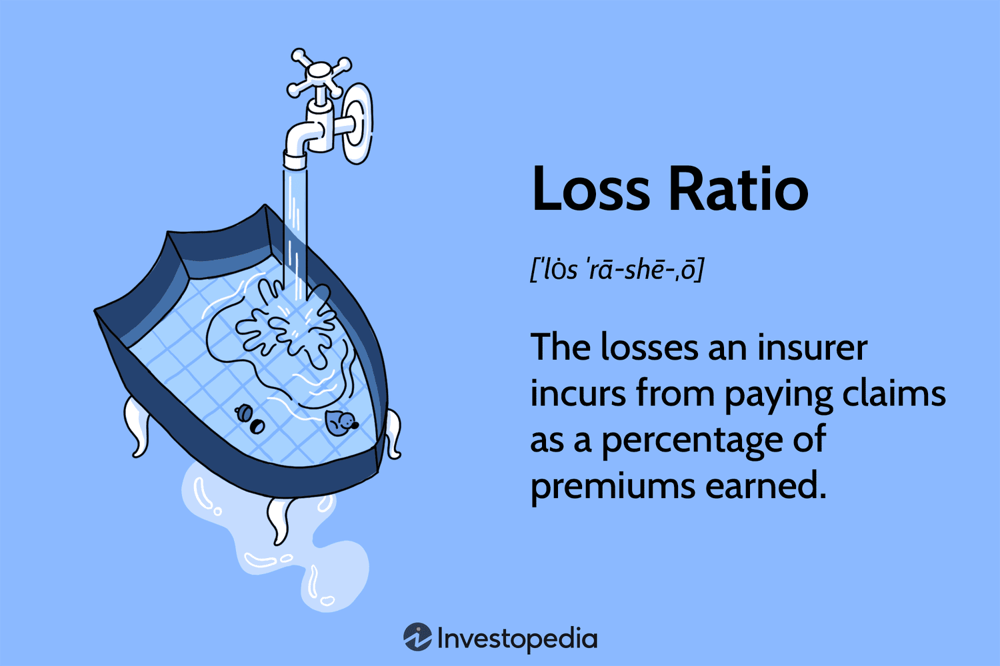

## Table of Contents

## What is a loss ratio?

A loss ratio is a simple way to see how much money an insurance company pays out in claims compared to how much money it gets from premiums. Imagine you have a jar where you put in money from premiums and take out money for claims. The loss ratio is like looking at how much money you took out versus how much you put in.

If an insurance company has a high loss ratio, it means they are paying out a lot of money in claims. This might not be good for the company because it could mean they are not making enough money to cover their costs. On the other hand, a low loss ratio means they are paying out less in claims, which is usually better for the company's profits.

## Why is the loss ratio important in insurance?

The loss ratio is important in insurance because it shows how well an insurance company is doing financially. It tells us if the company is paying out too much money in claims compared to the money it gets from premiums. If the loss ratio is high, it means the company might be losing money because it's paying out more than it's taking in. This can be a warning sign that the company needs to adjust its premiums or find ways to reduce claims.

On the other hand, a low loss ratio means the company is doing well because it's paying out less in claims than it's collecting in premiums. This is good for the company's profits and shows that it's managing its risks effectively. Insurance companies use the loss ratio to make decisions about pricing their policies and to see if they need to change their business strategies to stay profitable.

## How do you calculate the loss ratio?

Calculating the loss ratio is pretty simple. You just need to know two things: the total amount of money the insurance company paid out in claims, and the total amount of money it collected in premiums. The loss ratio is then found by dividing the total claims paid by the total premiums collected. If you want it as a percentage, you multiply that number by 100.

For example, if an insurance company paid out $80,000 in claims and collected $100,000 in premiums, the loss ratio would be $80,000 divided by $100,000, which equals 0.8. When you turn that into a percentage, it's 80%. This means the company paid out 80 cents in claims for every dollar it collected in premiums.

## What is considered a good loss ratio in the insurance industry?

In the insurance world, what counts as a good loss ratio can change depending on the type of insurance and the company's goals. Generally, a loss ratio between 60% and 80% is seen as pretty good. This means that for every dollar the insurance company gets in premiums, they pay out between 60 and 80 cents in claims. This range is considered healthy because it leaves enough money for the company to cover other costs like running the business and making a profit.

But, the ideal loss ratio can be different for different types of insurance. For example, health insurance might have a higher acceptable loss ratio because it's more expensive to cover medical claims. On the other hand, property and casualty insurance might aim for a lower loss ratio to make sure they can handle big claims from things like car accidents or house fires. So, what's considered a good loss ratio really depends on the specific insurance product and the company's financial strategy.

## Can you explain the difference between a high and low loss ratio?

A high loss ratio means that an insurance company is paying out a lot of money in claims compared to the money it gets from premiums. For example, if the loss ratio is 90%, it means the company is paying out 90 cents for every dollar it collects. This can be bad for the company because it might not have enough money left to cover other costs like salaries, office rent, and making a profit. If the loss ratio stays high for a long time, the company might need to raise its premiums or find ways to reduce the number of claims it has to pay.

On the other hand, a low loss ratio means the company is paying out less money in claims. If the loss ratio is 50%, it means the company is only paying out 50 cents for every dollar it collects. This is usually good for the company because it leaves more money to cover other costs and to make a profit. A low loss ratio can show that the company is good at managing risks and pricing its policies correctly. However, if the loss ratio is too low, it might mean the company is charging too much for its premiums, which could make customers unhappy.

## What factors can affect the loss ratio of an insurance company?

Many things can change the loss ratio of an insurance company. One big thing is how much people use their insurance. If a lot of people are making claims, the loss ratio goes up. This can happen if there's a big storm, a lot of car accidents, or if people are getting sick more often. Another thing that can affect the loss ratio is how much the company charges for its insurance. If the premiums are too low, the company might not get enough money to cover all the claims, which makes the loss ratio higher.

Also, the kinds of insurance the company sells can make a difference. Some types of insurance, like health insurance, usually have higher loss ratios because medical bills can be very expensive. Other types, like life insurance, might have lower loss ratios because people don't make claims as often. The company's rules about who can get insurance and how much they have to pay can also change the loss ratio. If the company is very careful about who it insures, it might have fewer claims and a lower loss ratio.

## How does the loss ratio impact insurance premiums?

The loss ratio can have a big impact on how much insurance companies charge for their premiums. If the loss ratio is high, it means the company is paying out a lot of money in claims. To make sure they don't lose money, the company might need to raise the premiums they charge. This way, they can collect more money to cover the high costs of claims. So, if you see your insurance premiums going up, it might be because the company's loss ratio is high and they need more money to stay in business.

On the other hand, if the loss ratio is low, it means the company is paying out less in claims. This is good for the company because it means they have more money left over after paying claims. Sometimes, if the loss ratio stays low for a while, the company might decide to lower their premiums to attract more customers. But they have to be careful not to lower them too much, or they might not have enough money to cover future claims. So, the loss ratio is a big part of how insurance companies decide what to charge for their policies.

## What are the different types of loss ratios?

There are a few different types of loss ratios that insurance companies use to look at their business. The most common one is the incurred loss ratio. This looks at the money the company has to pay for claims that have happened, even if they haven't paid them yet. It helps the company see how much money they might need in the future. Another type is the paid loss ratio, which only looks at the money the company has already paid out for claims. This is simpler because it's based on what has already happened, not what might happen.

Another important type is the ultimate loss ratio. This one tries to guess the total amount of money the company will have to pay for all the claims from a certain time, even if some claims haven't been reported yet. It's a way to plan for the future and make sure the company has enough money. Each of these loss ratios gives the insurance company a different view of their financial health and helps them make smart decisions about their business.

## How can an insurance company improve its loss ratio?

An insurance company can improve its loss ratio by being more careful about who they give insurance to. This means they might say no to people who are more likely to make a lot of claims. For example, if someone has a bad driving record, the company might not want to give them car insurance. By choosing customers who are less likely to need to make claims, the company can lower the amount of money it pays out, which makes the loss ratio better.

Another way to improve the loss ratio is by raising the premiums they charge. If the company gets more money from premiums, it can pay for more claims without the loss ratio going up. But they have to be careful not to raise premiums too much, or people might go to another insurance company. Also, the company can try to lower the costs of claims by working with doctors and repair shops to get better prices. This way, they pay less for each claim, which helps keep the loss ratio down.

## What are the limitations of using the loss ratio as a performance metric?

The loss ratio can be a helpful way to see how an insurance company is doing, but it has some problems. One big problem is that it only looks at claims and premiums, but there are other costs that the company has to pay, like salaries and office rent. These other costs can be a lot of money, and the loss ratio doesn't show them. So, even if the loss ratio looks good, the company might still be losing money overall.

Another problem with the loss ratio is that it doesn't show what might happen in the future. For example, if there's a big storm coming, the company might have to pay out a lot of money for claims, but the loss ratio won't show that until after it happens. Also, the loss ratio can be different for different types of insurance, so it's hard to compare one company to another if they sell different kinds of insurance. Because of these problems, the loss ratio is just one piece of information that insurance companies use to see how they're doing.

## How do regulatory bodies use loss ratios to monitor insurance companies?

Regulatory bodies use loss ratios to keep an eye on insurance companies and make sure they are treating their customers fairly. They look at the loss ratio to see if the company is charging too much or too little for their insurance. If the loss ratio is too high, it might mean the company is not charging enough for their premiums, which could make them go out of business. If it's too low, it might mean they are charging too much, which isn't fair to the people who buy insurance from them. By checking the loss ratio, regulators can make sure insurance companies are staying healthy and treating their customers right.

Sometimes, regulatory bodies set rules about what the loss ratio should be for certain types of insurance. For example, in health insurance, there might be a rule that says the company has to spend at least 80% of the premiums on medical care and quality improvement. If a company doesn't follow these rules, the regulators can make them change their prices or even punish them. This helps make sure that insurance companies are doing what they're supposed to do and that people who need insurance can get it at a fair price.

## Can you discuss advanced statistical methods used to predict future loss ratios?

Insurance companies use some smart math tricks to guess what their loss ratio might be in the future. One way they do this is by using something called regression analysis. This is where they look at a lot of past data, like how many claims they got and how much money they paid out, to find patterns. They can then use these patterns to predict what might happen next. For example, if they see that the number of car accidents goes up in the winter, they might expect a higher loss ratio during those months.

Another cool method is called time series analysis. This is where they look at how the loss ratio changes over time and use that information to make predictions. They might notice that the loss ratio goes up and down in a certain way every year, and they can use that pattern to guess what will happen in the future. By using these advanced math methods, insurance companies can be better prepared for what might come and make smarter decisions about their business.

## What are Insurance Loss Ratios and How Can They Be Understood?

Loss ratio is a critical performance metric in the insurance industry. It represents the proportion of incurred losses and related expenses compared to the total premiums an insurance company earns over a specific period. Its primary purpose is to assess how effectively an insurer is managing and pricing its products.

The formula for calculating loss ratio is straightforward:

$$
\text{Loss Ratio} = \frac{\text{Incurred Losses} + \text{Adjustment Expenses}}{\text{Total Earned Premiums}}
$$

In this equation, "Incurred Losses" refers to the payouts an insurer has made for claims, while "Adjustment Expenses" encompass the costs related to processing those claims. "Total Earned Premiums" indicates the revenue generated from the insurance policies sold.

A lower loss ratio signifies that a company has effectively priced its policies and controlled claims expenses, while a high loss ratio may indicate issues with product pricing or claims management. For insurers, maintaining an optimal balance is critical to ensure profitability and competitive pricing strategies.

Understanding and calculating the loss ratio aids insurance companies in evaluating their financial health and operational efficiency. It provides essential insights for insurers to strategize improvements in their claims management processes and refine pricing models to mitigate risks while maximizing profitability.

## What are the types of loss ratios?

Different types of loss ratios exist within the insurance industry, each catering to various aspects of insurance policies. Two primary types are the medical loss ratio and the commercial insurance loss ratio. 

The medical loss ratio (MLR) is particularly significant in the health insurance sector. It represents the percentage of premium income that an insurer spends on clinical services and healthcare quality improvements. This ratio is crucial for ensuring that a substantial portion of premium dollars is utilized for the benefit of policyholders. Regulatory frameworks, such as the Affordable Care Act in the United States, impose standards on the MLR to protect consumers. Typically, the MLR is calculated as:

$$
\text{MLR} = \left( \frac{\text{Claims Paid} + \text{Quality Improvement Expenditures}}{\text{Total Premiums Collected}} \right) \times 100
$$

For individual and small group markets, insurers are generally required to maintain an MLR of at least 80%, while in the large group market, the required MLR is typically higher, around 85%. Failure to meet these thresholds often requires insurers to provide rebates to policyholders.

On the other hand, the commercial insurance loss ratio pertains to other types of insurance products such as property, casualty, or liability insurance. Unlike the medical loss ratio, the commercial insurance loss ratio does not typically involve regulatory mandates. Instead, it serves as a critical metric for insurers to evaluate their underwriting effectiveness and pricing strategies. This ratio is calculated by:

$$
\text{Commercial Loss Ratio} = \left( \frac{\text{Incurred Losses} + \text{Loss Adjustment Expenses}}{\text{Earned Premiums}} \right) \times 100
$$

Understanding these specific ratios is essential for tailoring effective risk management strategies. A high loss ratio might indicate that premiums are not adequately covering claims, pointing towards potential issues in pricing or risk selection. Conversely, a low loss ratio could suggest overpricing, which may impact competitiveness. Different insurance sectors rely on these tailored metrics to ensure financial stability and to refine their product offerings in response to market demands and regulatory changes.

## References & Further Reading

Explore sources such as "The Mathematics of Insurance" by Annamaria Olivia, which provides comprehensive insights into insurance metrics, including loss ratios, and their applications in financial contexts. This text is essential for understanding the mathematical foundations that underpin insurance-related performance indicators, giving readers a structured framework to assess and apply these metrics effectively.

"Algorithmic Trading: Winning Strategies and Their Rationale" by Ernest P. Chan offers a detailed examination of algorithmic trading methodologies, focusing on the strategies and rationales behind their success. This book is an invaluable resource for those seeking to understand how algorithmic trading can optimize investment strategies and manage risks efficiently.

For up-to-date information and best practices on integrating insurance metrics with [algorithmic trading](/wiki/algorithmic-trading), consider consulting industry-specific journals such as The Journal of Risk and Insurance and The Journal of Trading. These publications frequently feature cutting-edge research and case studies, showcasing the latest advancements and practical applications in blending financial metrics with technology-driven trading solutions.

Additionally, engaging with trading strategy guides that discuss the technical and practical aspects of algorithmic trading can deepen one's understanding of how to leverage advanced analytics in insurance and finance. Such guides offer a blend of theoretical knowledge and practical insights, making them useful for both newcomers and seasoned professionals aiming to enhance their strategic decision-making capabilities.

